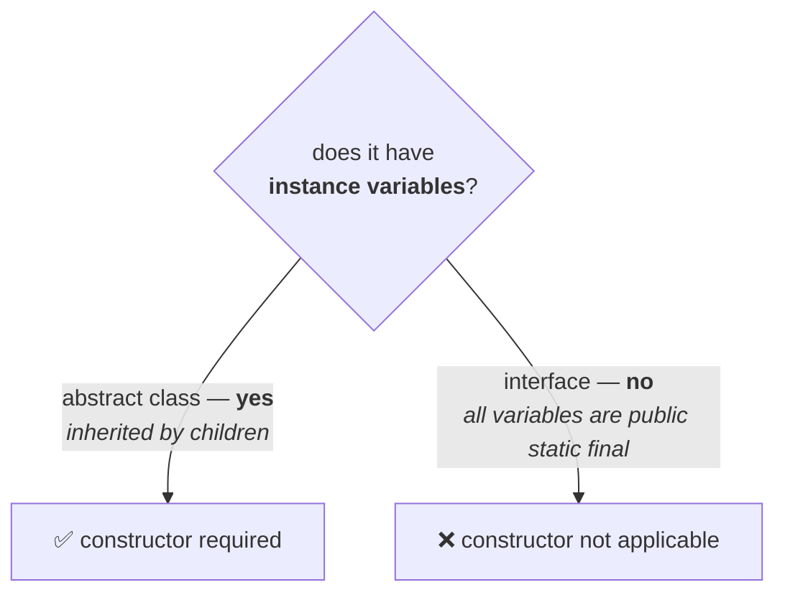

# The question

We cannot create an object for an **abstract class**, and we cannot create one for an **interface** either. Yet:

| | Constructor? |
|---|---|
| abstract class | ✅ **yes** |
| interface | ❌ **no** |

> **If neither can be instantiated, why does one get a constructor and the other does not?**

---

# The answer, in three steps

**Step 1 — what a constructor is for.** From note `15`:

> **The main purpose of a constructor is to perform initialization of an object — that is, to perform initialization for INSTANCE VARIABLES.**

**Step 2 — an abstract class has instance variables.**

```java
abstract class Person {
    String name;      // instance variable
    int age;          // instance variable

    Person(String name, int age) { … }
}
```

Those variables are inherited by every child, and something has to initialise them — which is exactly what note `18` showed. **Instance variables exist ⇒ a constructor is needed.**

**Step 3 — an interface has none.**

> **Every variable present inside an interface is always `public static final`, whether we declare it or not** (note `12`). **`static` means it belongs to the class, not to an object.**
>
> **Hence there is no chance of an instance variable existing inside an interface.**

**No instance variables ⇒ nothing to initialise ⇒ no constructor.**



## Measured

```java
interface IC { IC() { } }
```

Measured on JDK 25:

```
error: <identifier> expected
```

> [!info] **Read that message carefully — it is not constructors are not allowed.** The compiler does not even parse `IC()` as a constructor. Inside an interface, a name followed by parentheses can only be a **method**, and a method needs a return type — so it reports a missing identifier. **The concept does not exist there at all**, which is a stronger statement than being forbidden.

---

# The chain, end to end

This question is the last link in a chain that runs through the whole series:

| Note | Established |
|---|---|
| `15` | a constructor **initialises**; `new` **creates** |
| `16` | the parent constructor initialises the **inherited** instance variables |
| `17` | only **one object** exists — no parent object is created |
| `18` | that is **why** an abstract class has a constructor, despite being uninstantiable |
| **`19`** | **an interface has no instance variables, so it needs none** |

Every step depends on the first. Get a constructor creates an object wrong and none of the rest can be reasoned about.

---

# What this part established

| | |
|---|---|
| A constructor's purpose | initialise **instance variables** |
| Abstract class | **has** instance variables, inherited by children |
| Therefore | it **needs** a constructor |
| Interface variables | always **`public static final`** |
| Therefore | **no instance variables can exist** in an interface |
| Therefore | a constructor is **not applicable** |
| The error | `<identifier> expected` — the concept does not exist, rather than being banned |
