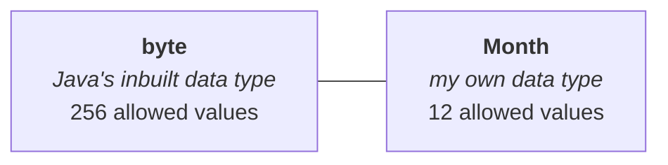
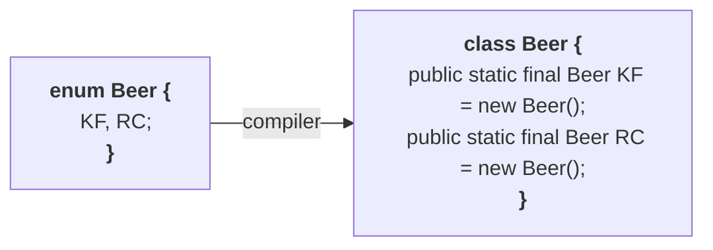

> If you want to represent a **group of named constants**, then we should go for **enum**.

## The example that makes it concrete

Take month names. `JAN`, `FEB`, `MAR`, and so on down to `DEC` — twelve of them. What you want is to represent all twelve **under a single name**, `Month`. 

```java
enum Month {
    JAN, FEB, MAR, APR, MAY, JUN, JUL, AUG, SEP, OCT, NOV, DEC;
}
```

`Month` holds twelve values. And the running example for the rest of the chapter — the one he says
is most people's favourite:

```java
enum Beer {
    KF, KO, RC, FO;
}
```

Four constants: **KF** for Kingfisher, **KO** for Knockout, **RC**, and **FO** for Foster.

## The semicolon at the end of the list

Look at the end of that list of values — there is a `;` after the last constant. **That semicolon is
optional.** Both of these compile:

```java
enum Beer { KF, KO, RC, FO; }     // ✅
enum Beer { KF, KO, RC, FO }      // ✅
```

> [!important] **Remember this as "optional *for now*".** It stays optional only while the enum
> contains nothing but constants. The moment you add a method or a variable it becomes **mandatory**,
> and there are further rules about where the constant list has to sit. That is note `06` — this is
> the first half of a rule you will meet again.

---

# The main objective — defining your own data type

Java has eight **primitive data types** built into it. Take `byte`:

| | |
|---|---|
| `byte` — Java's inbuilt data type | range **−128 to 127**, so **256** allowed values |

Now compare:

| | |
|---|---|
| `Month` — **my own** data type | **12** allowed values |
| `Beer` — **my own** data type | **4** allowed values |

> The main purpose of enum is **to define our own data types**, which are also known as
> **enumerated data types**.



That is the pair of sentences to have ready:

- **What is enum?** A group of named constants.
- **What is the purpose of enum?** To define our own data types — *enumerated data types*.

---

# The history behind enum

This is worth keeping, because it is also the answer to *why is Java enum different from C's enum*.

When Java **1.0** was released it came with an enormous amount of hype: *once our Java arrives, all
the remaining languages are going to be packed* — that simple, that robust, that platform
independent. Programming experts worldwide then sat down and analysed Java's features. They were
very happy with it. But they identified small concepts that were **missing**.

One such missing concept was **enum**.

Enum was everywhere already. It is in **C**. It is in **C++**. Almost every older language has it.
And if you look at your own academic syllabus — the paper called **PL** or **PPL**, *Principles of
Programming Languages* — there is a compulsory important question in that theory paper:

> *Explain about EDTs. Explain about ADTs.*

**Enumerated data types** and **abstract data types**. EDT is nothing but our enum. It is part of
every programming language. **So why should Java be the disliked one?**

So the experts approached Sun: *Java is too good, several excellent features are there, but small
things are missing. Why don't you introduce the enum concept in Java?*

Sun asked back: **what is enum?** — *A group of named constants.*

And Sun's response was:

> *What is the purpose of the `final` keyword in Java? To define constants. Then we don't want to
> introduce a dummy duplicate concept. `final` is already there — wherever named constants are
> required, use `final`.*

The experts came back, because Java is free and open source, so they could not demand.

Then suddenly, **in the 1.5 version, Sun introduced enum**. The experts were half pleased — a new
feature had arrived — and half **furious**: *at the 1.0 version only we requested this, and you told
us it was a duplicate dummy concept. Why have you introduced it now?*

Sun's answer is the actual point of the story:

> *What is enum?* — *A group of named constants.*
>
> ***Who told you it is a group of named constants in Java?***
>
> Inside a Java enum, **in addition to constants**, you can take normal **variables**, you can take
> **constructors**, you can take normal **methods**. Do not compare Java's enum with the old
> languages' enum. In Java's enum several extra things are possible — and **to add this extra
> masala, we took this much time.**

The experts came back once again.

> [!important] **Two facts fall out of that story, and both get asked.**
> **1.** The enum concept came in the **1.5** version.
> **2.** Compared with old languages' enum, **Java's enum is far more powerful** — in old languages
> an enum can hold only constants, whereas a Java enum can hold constants *plus* variables, methods
> and constructors.

Note `06` and note `07` are that second point being cashed out in code.

---

# Internal implementation

The question now is: internally, how is this concept implemented? The answer is three lines, and
everything else in the chapter follows from them.

Take the enum with two constants:

```java
enum Beer {
    KF, RC;
}
```

> **1.** Every enum is internally implemented by using the **class** concept.
> **2.** Every enum constant is always **`public static final`**.
> **3.** Every enum constant represents an **object of the type enum**.

So `enum Beer` becomes `class Beer`. `KF` is one `Beer` object, `RC` is another `Beer` object — two
`Beer` objects. Written out as ordinary Java, the equivalent code is:

```java
class Beer {
    public static final Beer KF = new Beer();
    public static final Beer RC = new Beer();
}
```



Now hold that against a twelve-constant enum like `Month`. If the enum concept did not exist, that
is twelve `public static final` declarations written by hand.

> **The enum concept simplifies the programmer's life and reduces the length of the code like
> anything.** Wherever a group of predefined values or predefined objects is required — `enum
> Status`, `enum Account` — happily we can go for enum.

> [!example]- **Proof — `javap` on a compiled enum, showing all three claims at once.** Worth opening
> once; it is the shortest evidence in the chapter and it also previews two methods from note `05`.
> Compile the four-constant `Beer` and disassemble the class file. Measured on JDK 25:
> ```
> $ javap Beer.class
> final class Beer extends java.lang.Enum<Beer> {
>   public static final Beer KF;
>   public static final Beer KO;
>   public static final Beer RC;
>   public static final Beer FO;
>   public static Beer[] values();
>   public static Beer valueOf(java.lang.String);
>   static {};
> }
> ```
> Every claim is visible in that output:
> - **`class Beer`** — an enum really is a class.
> - **`public static final Beer KF;`** — every constant really is `public static final`, and its
>   type really is `Beer`, so it really is an object of the enum type.
> - **`final class`** — this is where note `04`'s "every enum is implicitly final" comes from. You
>   never wrote `final`; the compiler did.
> - **`extends java.lang.Enum<Beer>`** — note `04` again: every enum is a direct child of
>   `java.lang.Enum`, and you never wrote that either.
> - **`static {}`** — a static initialiser block. This is where the four objects are actually
>   constructed, which is why note `07`'s constructor fires at **class loading** time.
> - **`values()`** and **`valueOf()`** — two methods you did not write, added by the compiler.
>   Note `05` is about the first of them.

---

# What this part established

| | |
|---|---|
| `enum` is short for | **enumeration** |
| It arrived in | the **1.5** version |
| When to use it | to represent a **group of named constants** |
| Its main purpose | to define **our own data types** — *enumerated data types* |
| The semicolon after the constant list | **optional** — while the enum holds nothing but constants |
| Old languages' enum holds | **constants only** |
| Java's enum holds | constants **plus** variables, methods and constructors |
| Every enum is internally | a **class** |
| Every enum constant is | **`public static final`** |
| Every enum constant is | an **object of the type enum** |
