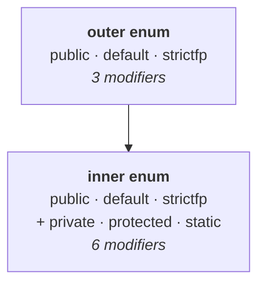

# Declaring an enum and using its constants

Declaration uses the `enum` keyword:

```java
enum Beer {
    KF, KO, RC, FO;
}
```

Four constants. Now, from inside some other class, how do you get at one of them?

Note `01` established that **every enum constant is `public static final`**. And a static variable is accessed **by using the class name**. Here the class is `Beer`, so:

```java
Beer b = Beer.KF;
```

The type on the left is `Beer`, because `KF` **is an object of type `Beer`**, and a `Beer` object can only be held by a `Beer`-type reference variable.

## The complete program

```java
enum Beer {
    KF, KO, RC, FO;
}

class Test {
    public static void main(String[] args) {
        Beer b = Beer.KF;
        System.out.println(b);
    }
}
```

Measured on JDK 25:

```
KF
```

## Why the output is the constant's name

`System.out.println(b)` is printing an **object reference**. Whenever you try to print any object reference, the `toString()` method is called internally — not just for this `b`, for **any** object reference. So `System.out.println(b)` becomes `System.out.println(b.toString())`.

> Inside enum, the **`toString()` method is internally implemented to return the name of the constant directly.**

`b` holds `Beer.KF`, the name of that constant is `KF`, so `KF` is what prints. Change the line to `Beer b = Beer.RC;` and the output becomes `RC`.

And the semicolon from note `01` — remove it and the code still compiles and runs identically, because so far the enum contains nothing but constants.

> [!important] **Three things to carry out of this section.**
> **1.** Declare with the **`enum`** keyword.
> **2.** Access a constant using the **enum name**, because every constant is **static**. **3.** Printing a constant gives its **name**, because `toString()` is implemented to return it.

---

# Where an enum may be declared

He asks the question in the order the answers arrive.

**Outside a class** — which is what every example so far has done:

```java
enum Beer { KF, KO, RC, FO; }

class Test { … }
```

**Inside a class** — and the reason you would want this is a real one. If this group of constants is required **only** by `Test`, why declare it out in the open? Just as a class can sit inside another class as an inner class, an enum can sit inside a class:

```java
class Test {
    enum Beer { KF, RC; }

    public static void main(String[] args) {
        System.out.println(Beer.KF);
    }
}
```

Measured on JDK 25 — prints `KF`, and produces two class files: `Test.class` and `Test$Beer.class`.

**Inside a method** — this works too. A **class** declared inside a method is allowed, and such inner classes have a name: **method local inner classes**. An enum inside a method is the same idea, and it is legal:

```java
class A {
    public static void main(String[] args) {
        enum Fish { STAR, GUPPY }
        System.out.println(Fish.STAR);
    }
}
```

Measured on JDK 25 — compiles and prints `STAR`.

> [!important] **Older material says this is an error, and that is worth recognising.** Local enums and local interfaces were forbidden until **Java 16** lifted the restriction (JEP 395, the records JEP, carried it). Pre-16 the compiler said **`enum types must not be local`**, and exam papers written against those releases still expect that answer.

## The four combinations

| Code | Valid? | Why |
|---|---|---|
| `enum X {}` then `class Y {}` | ✅ | enum declared **outside** a class |
| `class X { enum Y {} }` | ✅ | enum declared **inside** a class |
| `class X { public void m1() { enum Y {} } }` | ✅ | enum inside a **method** — a local enum |
| `enum X { … }` alone at top level | ✅ | the ordinary case |

---

# Which modifiers an enum may carry

To answer this you first need the modifier lists for ordinary classes, which he recaps.

For a **normal top-level class**, the applicable modifiers are:

`public`, **default**, `final`, `abstract`, `strictfp` — **five**.

For an **inner class**, those five **plus** `private`, `protected` and `static` — **eight**.

Now apply that to enums.

## A top-level enum — three modifiers

| Modifier | Allowed? | Reason |
|---|---|---|
| `public` | ✅ | no problem |
| **default** | ✅ | no problem |
| `strictfp` | ✅ | no problem |
| `final` | ❌ | **every enum is already final implicitly** — you cannot declare it explicitly |
| `abstract` | ❌ | it is already final, and **`final` + `abstract` is an illegal combination** |
| `private` | ❌ | not applicable to a top-level type |
| `protected` | ❌ | not applicable to a top-level type |
| `static` | ❌ | not applicable to a top-level type |

Measured on JDK 25 — `final`, `abstract`, `private`, `protected` and `static` each fail with `modifier <name> not allowed here`.

## A nested enum — six modifiers

The same three, **plus** `private`, `protected` and `static`:

| Modifier | Top-level enum | Nested enum |
|---|---|---|
| `public` | ✅ | ✅ |
| **default** | ✅ | ✅ |
| `strictfp` | ✅ | ✅ |
| `private` | ❌ | ✅ |
| `protected` | ❌ | ✅ |
| `static` | ❌ | ✅ |
| `final` | ❌ | ❌ |
| `abstract` | ❌ | ❌ |
| **Total** | **3** | **6** |



> [!important] **`final` and `abstract` fail for one shared reason.** Every enum is **implicitly final** — the compiler writes it for you (note `01`'s `javap` output shows `final class Beer`). `final` is therefore redundant **and** rejected, and `abstract` is rejected because nothing can be final and abstract at once. Note `04` is this same fact used to explain why you cannot subclass an enum.

> [!info] **`strictfp` is accepted but does nothing.** All floating-point expressions are evaluated strictly by default, so the keyword is a no-op and `javac` warns that it is not required — see `DECLARATIONS-AND-ACCESS-MODIFIERS/07`. It still **counts as an applicable modifier**, so the totals of 3 and 6 are what to give.

---

# What this part established

| | |
|---|---|
| Declare with | the **`enum`** keyword |
| Access a constant with | the **enum name** — every constant is `static` |
| Printing a constant gives | its **name** — `toString()` returns it |
| An enum may be declared | **outside** a class, **inside** a class, or **inside a method** |
| Local enums | ✅ legal — forbidden before Java 16, so older papers say otherwise |
| Modifiers for an **outer** enum | `public`, **default**, `strictfp` — **3** |
| Modifiers for an **inner** enum | those **plus** `private`, `protected`, `static` — **6** |
| `final` on an enum | ❌ — it is already **implicitly final** |
| `abstract` on an enum | ❌ — `final` + `abstract` is illegal |
