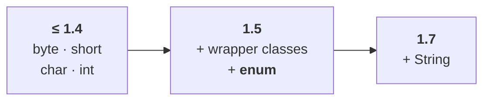

# What a switch statement will accept as its argument

Before enum can be discussed against `switch`, the argument-type rules have to be on the table. He warns that although this looks like basics, **there are several important loopholes here.**

**Until the 1.4 version**, the only allowed argument types for `switch` were:

`byte`, `short`, `char`, `int`

`long`, `float`, `double` and `boolean` all give a compile-time error.

**From the 1.5 version**, two things were added. The first came for free with **autoboxing and auto unboxing** — because a primitive and its wrapper object now convert to each other automatically, the corresponding wrapper classes became legal too:

`Byte`, `Short`, `Character`, `Integer`

And the second addition is the reason this note exists:

> **From 1.5 onwards we can pass an enum type as argument to a switch statement.**

**From the 1.7 version**, `String` was added as well.

| Version | Allowed argument types for `switch` |
|---|---|
| **until 1.4** | `byte`, `short`, `char`, `int` |
| **1.5 onwards** | + `Byte`, `Short`, `Character`, `Integer` — and **`enum`** |
| **1.7 onwards** | + `String` |



> [!info] **The full argument for why only these types is a flow-control topic**, not an enum one — he defers it to the `switch` discussion under flow control. Here the only thing that matters is the row that says **enum**.

---

# Passing an enum to a switch

```java
enum Beer {
    KF, KO, RC, FO;
}

class Test {
    public static void main(String[] args) {
        Beer b = Beer.KF;
        switch (b) {
            case KF: System.out.println("it is a children's brand");     break;
            case KO: System.out.println("it is too light");              break;
            case RC: System.out.println("it is not that much kick");     break;
            case FO: System.out.println("buy one get one free");         break;
            default: System.out.println("other brands are not recommended");
        }
    }
}
```

`b` is of type `Beer`, which is an **enum type**, so from 1.5 onwards it may be passed to `switch`. Its value is `KF`, so the `KF` case matches. Measured on JDK 25:

```
it is a children's brand
```

Change the first line to `Beer b = Beer.RC;` and the `RC` case matches instead. Measured:

```
it is not that much kick
```

> [!info] **Do not spend attention on the comments themselves** — whether a beer is really a children's brand or too light or has that much kick. Give the attention to the thing being demonstrated: **an enum type can be passed as an argument to a switch statement.** That is what gets asked, and it is asked as **can you explain it with an example** — so be ready to write this program.

---

# The loophole — every case label must be a valid enum constant

This is the conclusion the whole note is built around.

Look at the case labels above: `KF`, `KO`, `RC`, `FO`. Every one of them is a genuine constant of `Beer`. Now suppose you add a local brand that is **not** in the enum — `KALYANI`:

```java
enum Beer {
    KF, KO, RC, FO;
}

…
    case KALYANI: System.out.println("buy one get one free"); break;
```

> If we pass an enum type as argument to a switch statement, **every case label must name a constant of that enum.** Otherwise we get a compile-time error.

Measured on JDK 25:

```
error: cannot find symbol
            case KALYANI: …
                 ^
  symbol:   variable KALYANI
```

There are exactly **two ways** to fix it:

1. Replace `KALYANI` with a valid enum constant, or
2. **Add `KALYANI` to the enum** as a constant — then every case label is valid again and the code compiles.

## The label may be qualified or unqualified

Both forms work. Measured on JDK 25, this compiles and runs, printing `it is a children's brand`:

```java
switch (b) {
    case Beer.KF: System.out.println("it is a children's brand"); break;
    …
}
```

> [!important] **Older material insists the name must be unqualified — bare `KF`, never `Beer.KF`.** That was the rule through Java 20, and its error message said so:
> ```
> error: an enum switch case label must be the unqualified name of an enumeration constant
> ```
> **Java 21 lifted it**, as part of the pattern-matching work that required `case` labels to name types and constants generally. Compile the same file with `javac --release 8` and you can still see the old rejection, so recognise both forms and know which release each belongs to.

---

# What this part established

| | |
|---|---|
| `switch` argument types until **1.4** | `byte`, `short`, `char`, `int` |
| Added in **1.5** | the wrapper classes — and **enum** |
| Added in **1.7** | `String` |
| Passing an enum to `switch` | ✅ from **1.5** onwards |
| Every case label must be | a **valid enum constant** of that enum |
| Otherwise | compile-time error — `cannot find symbol` |
| Two fixes | replace the label, or **add that constant to the enum** |
| Qualified labels — `case Beer.KF:` | ✅ legal — ❌ through Java 20 |
