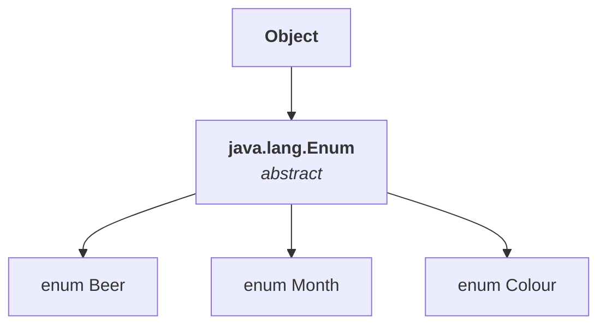
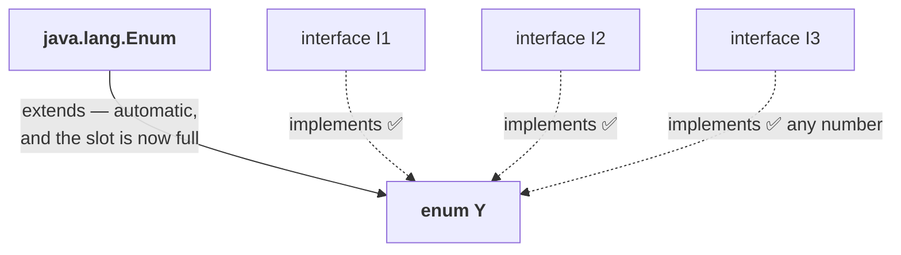

# Every enum is a direct child of java.lang.Enum

The question this note answers is: with respect to inheritance, how does an enum behave? Can I use `extends` on it? Can I use `implements`?

Start with the fact everything else follows from:

> **All enums in Java are direct child classes of `java.lang.Enum`.**

`enum Month`, `enum Beer`, `enum Colour`, `enum Fish` — every one of them, without exception.

## `Direct` is doing real work in that sentence

Compare it with the familiar rule about `Object`:

| | |
|---|---|
| Every class in Java is a child of **`Object`** | **directly or indirectly** |
| Every enum in Java is a child of **`java.lang.Enum`** | **directly only** |

With `Object` there is an indirect route: `A` may extend `B`, and `B` extends `Object`, so `A` is still a child of `Object` — indirectly. With enums **there is no indirect case at all.** Every enum extends `java.lang.Enum` and nothing else.



---

# Why `extends` is banned

Two independent reasons, and each one alone would be enough.

**Reason 1 — the extends slot is already taken.** Every enum is **already** extending `java.lang.Enum`. Java does not support multiple inheritance for classes, so an enum cannot extend anything else.

**Reason 2 — every enum is implicitly final.** Note `02` established this from the modifier table, and note `01`'s `javap` output shows it directly: the compiler emits `final class Beer`. A final class cannot be subclassed, so **no enum can ever have a child.**

> Because of these two reasons, the **inheritance concept is not applicable to enums.** The `extends` keyword and that whole terminology cannot be used explicitly with an enum.

## The four cases, measured

**Case 1 — one enum extending another:**

```java
enum X {}
enum Y extends X {}      // ✗
```

Measured on JDK 25 — it fails at the **parser**, before any type checking:

```
error: '{' expected
enum Y extends X {}
      ^
error: enum constant expected here
```

**Case 2 — writing the inheritance that is already happening, explicitly:**

```java
enum Y extends java.lang.Enum {}     // ✗
```

This is the case worth understanding, and he stages it as an argument with the compiler. Every enum already extends `java.lang.Enum` — I have just written down what is true anyway. What is the problem? Measured on JDK 25, the same parser errors:

```
error: '{' expected
enum Y extends java.lang.Enum {}
       ^
error: enum constant expected here
```

> The compiler's answer: **first remove that `extends` keyword, then I can compile.** What comes **after** `extends` is not the issue at all — the keyword itself is not permitted in an enum declaration.

**Case 3 — an enum inside a class, still extending:**

```java
class X {
    enum Y extends X {}      // ✗ — same reason
}
```

**Case 4 — a class extending an enum.** Here the `extends` keyword is being used on a **class**, which is ordinarily fine, so the error has to come from somewhere else:

```java
enum X { A }
class Y extends X {}     // ✗
```

Measured on JDK 25:

```
error: cannot inherit from final X
class Y extends X {}
                ^
error: enum classes are not extensible
```

> [!important] **Case 4 is the practical proof of implicitly final.** Nowhere in that source does the word `final` appear — yet the compiler says **`cannot inherit from final X`**. It could only have got `final` from the enum declaration itself. The second line, `enum classes are not extensible`, states the rule outright.

> [!info] **The wording drifted slightly.** He quotes the second message as `enum types are not extensible`; JDK 25 says `enum classes are not extensible`. Same error. Verified on JDK 25.

---

# Why `implements` is allowed

`extends` is banned because the slot is occupied. But in ordinary Java, **while a class is extending something, can it also implement an interface?** Yes — `class A extends B implements C` is perfectly normal. The restriction was only ever about `extends`.

> **An enum can implement any number of interfaces simultaneously.** There is no problem at all.

```java
interface I { void m(); }

enum Y implements I {
    A, B;
    public void m() { System.out.println("ok " + this); }
}

class Test {
    public static void main(String[] args) {
        for (Y y : Y.values()) y.m();
    }
}
```

Measured on JDK 25:

```
ok A
ok B
```



---

# The `java.lang.Enum` class itself

He treats this as its own interview answer — can you please talk about `java.lang.Enum` for a few minutes — so it is worth having all five points ready.

> **1.** It acts as the **base class for all Java enums**, since every enum is its direct child. **2.** It is an **abstract class**, so we cannot create an object of it. Its purpose is only to provide the base functionality for our enums.
> **3.** It is a **direct child class of `Object`**.
> **4.** It implements **`Serializable`**.
> **5.** It implements **`Comparable`**.

And points 4 and 5 have a consequence worth stating: because the parent implements them, **every enum you write is automatically serializable and comparable.** You get the ability to compare two enum constants for free.

Checked with `javap java.lang.Enum`. Measured on JDK 25:

```
public abstract class java.lang.Enum<E extends java.lang.Enum<E>>
        implements java.lang.constant.Constable, java.lang.Comparable<E>, java.io.Serializable {
  public final java.lang.String name();
  public final int ordinal();
  protected java.lang.Enum(java.lang.String, int);
  public java.lang.String toString();
  public final boolean equals(java.lang.Object);
  public final int hashCode();
  protected final java.lang.Object clone() throws java.lang.CloneNotSupportedException;
  public final int compareTo(E);
  public final java.lang.Class<E> getDeclaringClass();
  public static <T extends java.lang.Enum<T>> T valueOf(java.lang.Class<T>, java.lang.String);
  protected final void finalize();
}
```

All five points hold. Two things in that signature are worth reading carefully:

> [!info] **`Constable` is a third interface, and it is not one you need to name.**
> `java.lang.constant.Constable` supports the constant-folding machinery behind `invokedynamic`. It affects nothing taught here — **`Serializable` and `Comparable` is still the complete answer for the interview** — so just do not be surprised by the third name in the listing.
>
> **`extends java.lang.Object` does not appear** in the output. `javap` omits the implicit superclass; `Enum` is still a direct child of `Object`, so point 3 stands.

> [!question]- **Deep dive — why `equals`, `hashCode` and `compareTo` are all declared `final` here.** Open this if you want the reason enum identity is trustworthy in a way ordinary objects' is not. Look at the modifiers in that listing: `name()`, `ordinal()`, `equals()`, `hashCode()`, `compareTo()` and `clone()` are all **`final`**. You cannot override any of them in your enum.
>
> That is deliberate. The JVM guarantees exactly one object per enum constant per class loader — which is what makes note `08`'s `Beer.KF == Beer.RC` a meaningful comparison rather than a bug. If you could override `equals()`, two distinct constants could be made to claim they were equal while `==` disagreed, and every `switch`, every `EnumMap`, every `EnumSet` built on identity would become unreliable. `Enum.equals()` is therefore hard-wired to `this == other`.
>
> `clone()` being `final` and throwing `CloneNotSupportedException` closes the other door — you cannot manufacture a second copy of a constant. Together with `enum classes may not be instantiated` from note `07`, that is three separate locks on the same guarantee: **one constant, one object, forever.**

---

# What this part established

| | |
|---|---|
| Every enum is a | **direct** child of `java.lang.Enum` |
| Compared with `Object` | `Object` allows indirect children; `Enum` has **only direct** ones |
| `extends` on an enum | ❌ **never** — even `extends java.lang.Enum` written explicitly |
| Reason 1 | the enum is **already** extending `java.lang.Enum` |
| Reason 2 | every enum is **implicitly final** |
| A class extending an enum | ❌ — `cannot inherit from final X` |
| `implements` on an enum | ✅ — **any number** of interfaces |
| `java.lang.Enum` is | an **abstract** class |
| Its parent is | **`Object`**, directly |
| It implements | **`Serializable`** and **`Comparable`** |
| So every enum is | automatically serializable and comparable |
