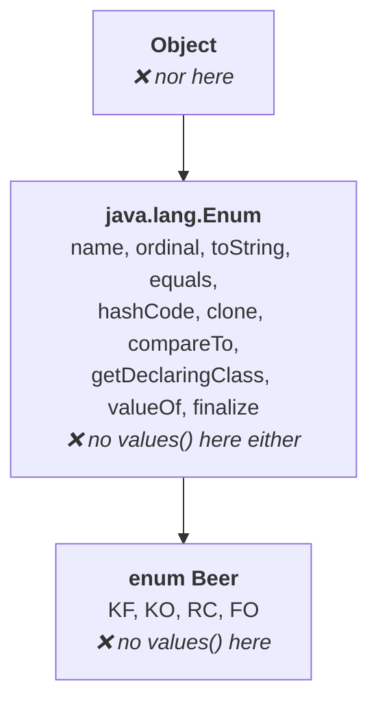

# The `values()` method

There are two API methods to know for enum. This is the first.

The situation it solves: **I have an enum. I know its name. I do not know how many constants are
inside it.** Maybe the declaration is available somewhere, maybe not. Can you please list out all
the values present inside it?

> **The purpose of `values()` is to list out all values present inside an enum.**

## Using it

```java
enum Beer {
    KF, KO, RC, FO;
}

class Test {
    public static void main(String[] args) {
        Beer[] b = Beer.values();
        for (Beer b1 : b) {
            System.out.println(b1);
        }
    }
}
```

The return type is **`Beer[]` — an array**. That follows from what the method does: it returns a
*group* of values, and every one of those values is a `Beer` object, so to hold them you compulsorily
need a `Beer` array.

Measured on JDK 25:

```
KF
KO
RC
FO
```

The names print rather than anything else, for the reason established in note `02` — printing an enum
constant calls `toString()`, which is implemented to return the constant's name.

## The specialty — where does `values()` actually live?

This is the part he flags as the specialty, and it is the examinable bit.

`values()` is called as `Beer.values()` — **by using the class name** — so it is a **static method**.
Fine. But *where is it declared?*

**Inside `Beer`?** No. `Beer` contains only constants. You wrote `KF, KO, RC, FO;` and nothing else.

**Then it must be inherited from the parent, `java.lang.Enum`?** That is the reasonable guess — if
the child does not contain a method, it must come from the parent. So he runs `javap java.lang.Enum`
and reads down the list: `name()`, `ordinal()`, a constructor, `toString()`, `equals()`, `hashCode()`,
`clone()`, `compareTo()`, `getDeclaringClass()`, `valueOf()`, `finalize()`…

**`valueOf` is there. `values` is not.**

**Then `Object`?** Not there either.



So where is it coming from?

> **The `enum` keyword implicitly provides this method** for every enum. That is why you cannot find
> it anywhere in the Java API.

`values()` is not an API method at all. It does not come from `Enum` and it does not come from
`Object` — the compiler generates it into every enum class it compiles.

> [!important] **This is the whole reason the question gets asked.** *Show me where `values()` is
> declared* has no answer in the API docs. The right response is that the `enum` keyword supplies it
> implicitly. Contrast it with `ordinal()`, which **is** a genuine API method in `java.lang.Enum`.

> [!example]- **Proof — the same `javap` run on both classes.** Open this to see the method appear in
> one place and not the other.
> `java.lang.Enum` — no `values()` anywhere in it:
> ```
> $ javap java.lang.Enum
> public abstract class java.lang.Enum<E extends java.lang.Enum<E>> … {
>   public final java.lang.String name();
>   public final int ordinal();
>   …
>   public static <T extends java.lang.Enum<T>> T valueOf(java.lang.Class<T>, java.lang.String);
> }
> ```
> The compiled `Beer` class — where it does appear, alongside a second synthesised method:
> ```
> $ javap Beer.class
> final class Beer extends java.lang.Enum<Beer> {
>   public static final Beer KF;
>   public static final Beer KO;
>   public static final Beer RC;
>   public static final Beer FO;
>   public static Beer[] values();
>   public static Beer valueOf(java.lang.String);
>   static {};
> }
> ```
> Neither `values()` nor that one-argument `valueOf(String)` was written by you. Both were injected
> by the compiler into this specific enum — which is exactly why they cannot be found in the API,
> and why their return types are `Beer` and `Beer[]` rather than something generic. Measured on
> JDK 25.

---

# The `ordinal()` method

The second method, and the idea comes from arrays.

Inside an array, **the order of elements matters**: first element at index 0, second at index 1,
third at index 2. Exactly the same is true inside an enum — **the order of constants is important**,
and the number representing that order is called the **ordinal value**.

```java
enum Beer {
    KF, KO, RC, FO;
}
```

| Constant | Ordinal value |
|---|---|
| `KF` | **0** |
| `KO` | **1** |
| `RC` | **2** |
| `FO` | **3** |

> **Ordinal values are zero-based, just like an array index.**

> If you have an enum constant and you want to find its ordinal value, then we should go for the
> **`ordinal()`** method.

## Both methods in one program

```java
enum Beer {
    KF, KO, RC, FO;
}

class Test {
    public static void main(String[] args) {
        Beer[] b = Beer.values();
        for (Beer b1 : b) {
            System.out.println(b1 + "...." + b1.ordinal());
        }
    }
}
```

Measured on JDK 25:

```
KF....0
KO....1
RC....2
FO....3
```

`values()` supplies the list, `ordinal()` supplies each constant's position in it.

## Where `ordinal()` lives — and the contrast that matters

Unlike `values()`, this one is a real API method. From `javap java.lang.Enum`:

```
public final int ordinal();
```

It is present in **`java.lang.Enum`**, and your enum inherits it as a direct child. The return type
is `int`.

> [!important] **The contrast is the answer to the exam question.**
>
> | | `values()` | `ordinal()` |
> |---|---|---|
> | Purpose | list **all** constants of the enum | find **one** constant's position |
> | Returns | an **array** of the enum type | an **`int`** |
> | Static or instance | **static** — called on the enum name | **instance** — called on a constant |
> | Comes from | the **`enum` keyword**, implicitly | **`java.lang.Enum`**, a real API method |
> | Findable in the API docs | ❌ **no** | ✅ yes |

---

# What this part established

| | |
|---|---|
| `values()` purpose | list out **all values** present inside the enum |
| `values()` return type | an **array** of that enum type |
| `values()` is provided by | the **`enum` keyword implicitly** — not by the API |
| `ordinal()` purpose | find the **ordinal value** of an enum constant |
| Ordinal values are | **zero-based**, like an array index |
| `ordinal()` return type | **`int`** |
| `ordinal()` is provided by | **`java.lang.Enum`** — a genuine API method |
| Why the order matters | inside an enum, as inside an array, **the order of constants is important** |
