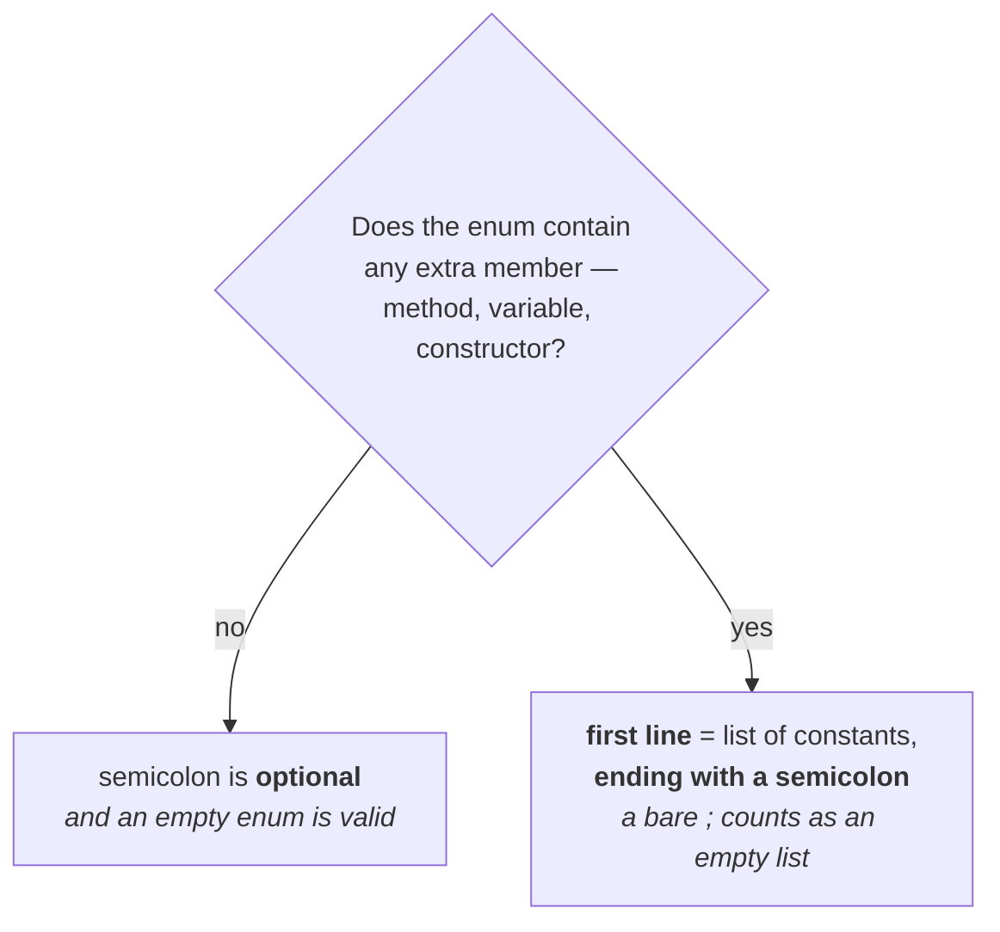

# What makes Java's enum special

Note `01` closed the history story with a claim; this note is that claim demonstrated.

> In **old languages' enum** we can take **only constants**. In **Java's enum**, in addition to
> constants, we can take normal **variables**, **methods** and **constructors**.

In fact: whatever you can take inside a normal Java class, you can happily take inside a Java enum.
**That is why Java's enum is more powerful than the old languages' enum.**

And it goes one step further than you would expect:

> Inside a Java enum you can declare a **`main` method**, and you can run the enum class **directly
> from the command prompt**.

## The proof

```java
enum Fish {
    STAR, GUPPY, GOLD;

    public static void main(String[] args) {
        System.out.println("enum main method");
    }
}
```

`STAR` for starfish, `GUPPY` for guppy fish, `GOLD` for goldfish — three of the several hundred
categories. And the `main` method is declared **inside the enum**, not inside any class.

Measured on JDK 25:

```
$ javac Fish.java
$ java Fish
enum main method
```

You are not running a Java *class* here — you are running an **enum**, directly from the command
prompt.

> [!important] **This is the single strongest one-line demonstration of the chapter's claim.** An old
> language's enum is a list of names. A Java enum is a class that happens to be written with the
> `enum` keyword — which is why it can carry a `main` method and be executed.

---

# The semicolon rules

Here is where the loopholes are, and they all concern that semicolon at the end of the constant list.

Note `01` established the semicolon is **optional**. That was true because the enum contained nothing
but constants. Now add a `main` method to `Fish` and remove the semicolon:

```java
enum Fish {
    STAR, GUPPY, GOLD          // ← semicolon removed

    public static void main(String[] args) { … }
}
```

Measured on JDK 25 — the code no longer compiles:

```
error: ',', '}', or ';' expected
```

Put the semicolon back and it compiles and runs again. So in *this* example the semicolon is
**mandatory**. What changed?

> **Rule 1.** If, in addition to constants, we are taking any extra member — a method, a variable,
> anything — then the **list of constants compulsorily has to end with a semicolon**.
>
> If we are taking only constants and nothing else, the semicolon is **optional**.

## Rule 2 — the constant list has to come first

Constants are static variables, and inside an ordinary class a static variable can be declared
anywhere. So can the list be moved below the method?

```java
enum Fish {
    public void m1() {}
    STAR, GUPPY;              // ✗
}
```

Measured on JDK 25:

```
error: enum constant expected here
```

> **Rule 2.** If we are taking any extra member, the **first line** must be the list of constants,
> ending with a semicolon. Put the list on the second or third line and you get a compile-time error.

## Rule 3 — you cannot have an extra member with no constants at all

```java
enum Fish {
    public void m1() {}       // ✗ — no constants anywhere
}
```

Measured on JDK 25:

```
error: enum constant expected here
```

> If you want to take only a method, **why are you coming to an enum?** Better to go for a Java class.
> You are misusing the syntax, so a compile-time error is what you get.

## The escape hatch — a bare semicolon counts as an empty list

And this is the part that catches people:

```java
enum Fish {
    ;                          // an empty list of constants
    public void m1() {}
}
```

Measured on JDK 25 — **valid**. The compiler sees the semicolon and concludes *yes, that is the list
of constants, and now here is the method* — syntactically acceptable. So the requirement is really
*first line = the constant list, or at minimum the semicolon that terminates it.*

## And the empty enum

Now delete the method too, leaving only that semicolon — still valid. Delete the semicolon as well:

```java
enum Fish { }
```

> **An empty enum is perfectly valid Java syntax.** But do not ask what the purpose of it is — there
> is no use for it.

## All nine cases, measured

Measured on JDK 25:

| Declaration | Result |
|---|---|
| `enum Z { STAR, GUPPY, GOLD; }` | ✅ valid |
| `enum Z { STAR, GUPPY, GOLD }` | ✅ valid — semicolon optional, constants only |
| `enum Z { STAR, GUPPY; public void m1(){} }` | ✅ valid |
| `enum Z { STAR, GUPPY public void m1(){} }` | ❌ `',', '}', or ';' expected` |
| `enum Z { public void m1(){} STAR, GUPPY; }` | ❌ `enum constant expected here` |
| `enum Z { public void m1(){} }` | ❌ `enum constant expected here` |
| `enum Z { ; public void m1(){} }` | ✅ valid — the bare `;` is an empty constant list |
| `enum Z { }` | ✅ valid — an empty enum |
| `enum Z { ; }` | ✅ valid |



> [!info] **He notes the error text is version-dependent** — as-per-1.6 he reads out `semicolon
> expected` and three errors at once. JDK 25 reports `',', '}', or ';' expected`. The rules
> themselves are unchanged, and all nine rows above behave exactly as taught. Verified on JDK 25.

---

# What this part established

| | |
|---|---|
| Old languages' enum can hold | **constants only** |
| Java's enum can hold | constants **plus** variables, methods, constructors — anything a class can |
| A `main` method inside an enum | ✅ — and the enum runs directly from the command prompt |
| Semicolon when the enum has **only constants** | **optional** |
| Semicolon when the enum has **any extra member** | **mandatory** |
| Where the constant list must sit | the **first line** |
| An extra member with **no** constant list | ❌ compile-time error |
| A bare `;` as the first line | ✅ counts as an **empty constant list** |
| An **empty enum** | ✅ **perfectly valid Java syntax** — with no use whatsoever |
