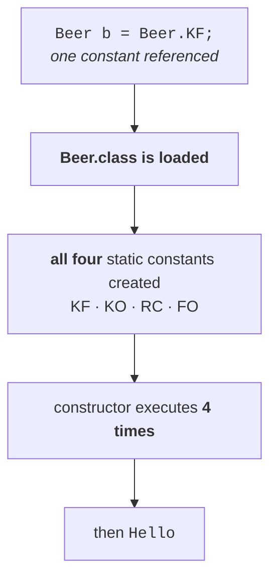

# An enum can contain a constructor

The reasoning takes one step. What is an enum? A group of constants. And note `01` established that
**every constant is an object of the type enum**. The moment you say *object*, the **constructor**
concept comes into the picture automatically.

> **An enum can contain a constructor**, because every constant is an object — and whenever that
> constant is created, the constructor is executed.

```java
enum Beer {
    KF, KO, RC, FO;

    Beer() {
        System.out.println("Constructor");
    }
}

class Test {
    public static void main(String[] args) {
        Beer b = Beer.KF;
        System.out.println("Hello");
    }
}
```

Four constants, therefore four `Beer` objects, therefore the constructor runs **four times**.

## When does it run?

Every enum constant is `public static final` — so the question becomes *when are static variables
created?* **At the time of class loading.** So:

> At the time of **enum class loading**, all the constants are created, and for every constant the
> constructor is executed **separately**. Four constants, four executions. Five constants, five.

## The class loading twist

Compile that file and two `.class` files are produced, because an enum is also a class:

```
Beer.class
Test.class
```

Now, running `java Test` loads `Test.class`. Does it load `Beer.class`? **Only if `Test` actually
uses `Beer` functionality.**

Measured on JDK 25, with `Beer b = Beer.KF;` present:

```
Constructor
Constructor
Constructor
Constructor
Hello
```

Comment that one line out, so nothing in `Test` touches `Beer`:

```java
class Test {
    public static void main(String[] args) {
        // Beer b = Beer.KF;
        System.out.println("Hello");
    }
}
```

Measured on JDK 25:

```
Hello
```

`Beer.class` was never loaded, so the constants were never created, so the constructor never ran.

## The conclusion that gets asked

Look again at the version that does print four times. **How many constants does `Test` actually
use?** One — `Beer.KF`. Yet the constructor ran four times.

> Whether you are using **one** constant or **two** constants, once the enum class file is loaded,
> **all** the constants are created — because all of them are static variables, and every static
> variable is created at class loading.



---

# You cannot create an enum object yourself

An enum contains a constructor. So why not call it directly?

```java
Beer b = new Beer();     // ✗
```

Measured on JDK 25:

```
error: enum classes may not be instantiated
```

> If you want a `Beer` object, **just add another constant to the list** — the syntax itself creates
> the object for you. What is the need to create it explicitly? And if you genuinely want to create
> objects with `new`, then go for a class; by coming to an enum you are throwing away the advantage
> the enum concept gives you.

So two things follow, and the second is a consequence of the first:

> **We cannot create an enum object explicitly**, and therefore **we cannot invoke an enum
> constructor directly.** The constructor is executed automatically at enum class loading, and only
> there.

> [!info] **The wording drifted slightly.** He quotes the error as `enum types may not be
> instantiated`; JDK 25 says `enum classes may not be instantiated`. Same error, same rule. Verified
> on JDK 25.

---

# The full-fledged enum

This is the summary example — the one where the power of Java's enum shows up in a single listing.
It has a group of constants, an instance variable, **two** constructors and a method.

The motivation is realistic. Beer to beer, several properties change: **price**, **taste**,
**colour**, **thickness**. You cannot expect every beer to have the same price. So declare an instance
variable for it:

```java
int price;
```

That property applies to every enum constant. And an instance variable is usually initialised inside
the constructor:

```java
Beer(int price) {
    this.price = price;
}
```

## The problem, and how the syntax solves it

Here is the difficulty. To pass a price you would ordinarily write `new Beer(100)` — but you have
just seen that creating an enum object explicitly is impossible. **So how does the value ever get
in?**

Go back to note `01`'s equivalent code. Writing `KF` inside the enum means:

```java
public static final Beer KF = new Beer();          // no-argument constructor
```

So if you want the argument version, you want the compiler to generate this instead:

```java
public static final Beer KF = new Beer(100);       // int-argument constructor
```

And the way to ask for that is to write the argument **on the constant itself**:

```java
KF(100)
```

> **Declare the constant as `KF(100)`, and the constructor chosen is the one matching those
> arguments.** `KF` alone calls the no-argument constructor; `KF(100)` calls the `int` one.

## The program

```java
enum Beer {
    KF(100), KO(75), RC(90), FO;

    int price;

    Beer(int price) { this.price = price; }
    Beer()          { this.price = 65;    }

    public int getPrice() { return price; }
}

class Test {
    public static void main(String[] args) {
        Beer[] b = Beer.values();
        for (Beer b1 : b) {
            System.out.println(b1 + "...." + b1.getPrice());
        }
    }
}
```

`KF`, `KO` and `RC` pass a value, so the `int` constructor runs for each. `FO` passes nothing, so the
**no-argument constructor** runs and gives it the default price of 65 — which is why that second
constructor is **compulsory**: without it, `FO` would not compile.

`values()` from note `05` supplies the list, and each constant is asked for its own price.

Measured on JDK 25:

```
KF....100
KO....75
RC....90
FO....65
```

> [!important] **That single enum contains a group of constants, an instance variable, two
> constructors and a method.** This is the example to reproduce when somebody asks how Java's enum
> differs from C's. It is a class in everything but the keyword.

---

# Methods inside an enum — the abstract-method rule

Methods are clearly allowed; `getPrice()` above is one and note `06`'s `main` was another.

> As taught: **an enum can contain methods, but they should be concrete methods only. An abstract
> method cannot be declared inside an enum.**

His reasoning is two independent problems:

> **Problem 1.** Every enum is **implicitly final**. But if a class contains even one abstract
> method, that class compulsorily has to be declared **abstract**. `final` + `abstract` is an
> illegal combination.
>
> **Problem 2.** If a method is abstract, where do you provide the implementation? **In the child
> class.** And note `04` established that an enum cannot have a child class. So there is nowhere for
> the implementation to go.

> [!warning] **This is one of the few places where the lecture is simply wrong on modern Java — and
> it was wrong at the time of recording too.** Abstract methods **are** permitted in an enum,
> provided **every constant supplies its own body**. Measured on JDK 25, this compiles and runs:
> ```java
> enum Colour {
>     BLUE { public void info() { System.out.println("Universal colour"); } },
>     RED  { public void info() { System.out.println("Dangerous colour");  } };
>
>     public abstract void info();
> }
> ```
> ```
> Universal colour
> Dangerous colour
> ```
> Remove the bodies and it fails, which is where his instinct was pointing:
> ```java
> enum Colour2 { BLUE, RED; public abstract void info(); }
> ```
> ```
> error: Colour2 is not abstract and does not override abstract method info() in Colour2
> ```
> **So the real rule is:** an abstract method in an enum is legal **if and only if every constant
> overrides it**. Both of his objections are answered by that syntax — the constant bodies *are* the
> implementations, and they live in compiler-generated subclasses rather than in one you write.
> Note `09` is exactly this mechanism, taught there with a concrete method rather than an abstract
> one. Verified on JDK 25.

---

# What this part established

| | |
|---|---|
| An enum can contain | a **constructor** |
| Why | every constant is an **object** |
| When the constructor runs | at **enum class loading** |
| How many times | **once per constant** |
| Using one constant loads | **all** of them — they are all static |
| If the enum class is never loaded | the constructor **never runs** |
| `new Beer()` | ❌ `enum classes may not be instantiated` |
| Calling the constructor directly | ❌ — it runs automatically, or not at all |
| Passing values to the constructor | write the argument on the constant — **`KF(100)`** |
| A constant written bare — `FO` | calls the **no-argument** constructor |
| Methods inside an enum | ✅ allowed |
| Abstract methods inside an enum | ❌ *as taught* — but ✅ if **every constant** supplies a body |
