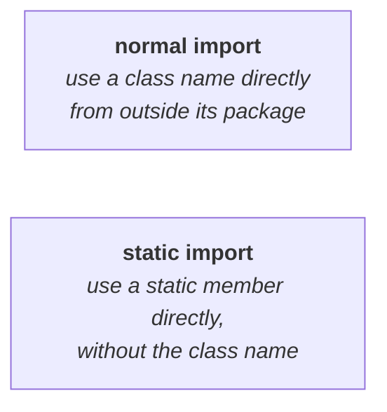

# Case 1 — which expressions on enum constants are legal

Everything from here to the end of the chapter is material he frames specifically for the **SCJP / OCJP certification exam**, where there are three or four recognisable ways to ask about enum. This is the first of them, and the questions take the form which of the following expressions are valid?

The principle is one sentence, and it is already familiar:

> Every enum constant is an **object of the type enum**. Therefore **whatever methods you can call on a normal Java object, you can call on an enum constant** — there is no problem at all.

`Beer.KF` is a `Beer` object, exactly as a `Student` object or a `Customer` object is an object. So `equals()`, `hashCode()`, `toString()` — everything in `Object` — is available on it.

## The expressions, measured

Measured on JDK 25, with `enum Beer { KF, KO, RC, FO; }`:

| Expression | Valid? | Prints |
|---|---|---|
| `Beer.KF.equals(Beer.RC)` | ✅ | `false` |
| `Beer.KF == Beer.RC` | ✅ | `false` |
| `Beer.KF.hashCode()` | ✅ | **an int** |
| `Beer.KF.hashCode() == Beer.RC.hashCode()` | ✅ | `false` |
| `Beer.KF > Beer.RC` | ❌ | `error: bad operand types for binary operator '>'` |
| `Beer.KF.ordinal() > Beer.RC.ordinal()` | ✅ | `false` |

The first four are all fine — an `equals()` call, the `==` operator between two object references, and `hashCode()` calls. Whether the answer is `true` or `false` is beside the point; the question is whether the expression **compiles**.

## Why the relational operator fails

Row five is the one they are actually testing.

> Between two **objects** — forget enum constants for a moment, any two objects — you **cannot** use relational operators.

His example: you have two `Student` objects, `s1` and `s2`. What would `s1 > s2` mean? First student's marks greater than second student's marks? First student's height greater than second student's height? There is no answer. **First customer lesser than second customer** is meaningless. So relational and comparison operators are not applicable between object types — and an enum constant is an object type, so they are not applicable there either.

## Why row six succeeds

Look carefully at what is being compared:

```java
Beer.KF.ordinal() > Beer.RC.ordinal()
```

**Two `Beer` objects are not being compared here.** `ordinal()` returns an `int` (note `05`), so this is `0 > 2` — two integers. Perfectly valid syntactically, and it happens to evaluate to `false`.

> [!important] **The trap is that both rows look alike at a glance.** `Beer.KF > Beer.RC` compares objects and fails; `Beer.KF.ordinal() > Beer.RC.ordinal()` compares ints and passes. Read what is on either side of the operator, not what the line starts with.

> [!info] **A third route exists that he does not mention here.** Because `java.lang.Enum` implements `Comparable` (note `04`), `Beer.KF.compareTo(Beer.RC)` is also valid — measured on JDK 25 it returns `-2`, the difference of the two ordinal values. That is the idiomatic way to order enum constants in real code, and it is what `TreeSet` and `Collections.sort()` use.

---

# Case 2 — enum, normal import and static import

The second exam pattern mixes enum with the two kinds of `import`. To answer it you first need the difference between them, which he recaps from scratch.

## Normal import

```java
class Test {
    public static void main(String[] args) {
        ArrayList l = new ArrayList();      // ✗ without an import
    }
}
```

`ArrayList` lives in the `java.util` package and your class does not. So this fails unless you either import it:

```java
import java.util.ArrayList;
// or
import java.util.*;
```

or write the **fully qualified name** every time:

```java
java.util.ArrayList l = new java.util.ArrayList();
```

> **To use a class or interface name directly from outside its package**, a **normal import** is required.

## Static import

A concept that also arrived in the **1.5 version**.

Static members are normally accessed **by using the class name**. To call the square-root method:

```java
System.out.println(Math.sqrt(4));
```

`Math` is a class, `sqrt` is a static method inside it. That is fine once — but if you are calling it ten times, `Math.sqrt`, `Math.sqrt`, `Math.sqrt` needlessly increases the length of the code and readability goes down. If you want to drop the class name:

```java
import static java.lang.Math.sqrt;

…
System.out.println(sqrt(4));       // no class name
```

> **To access a static member — a method or a variable — directly, without the class name**, a **static import** is required.



> [!important] **Those two sentences are the whole of case 2.** Every question below is answered by deciding, for each line, which of the two situations you are in — and sometimes you are in both at once.

## The setup

One enum, in its own package:

```java
package pack1;

public enum Fish {
    STAR, GUPPY
}
```

`Fish` is a class (note `01`) containing two static variables — `STAR` and `GUPPY`.

## Possibility 1 — class name used, static member qualified

```java
package pack2;

public class Test1 {
    public static void main(String[] args) {
        Fish f = Fish.GUPPY;
        System.out.println(f);
    }
}
```

Work through it line by line:

- **`Fish.GUPPY`** — a static variable accessed **using the class name**. So a static import is **not** required.
- **`Fish`** — a class name used directly from outside its package, without the package name. So a **normal import is required.**

```java
import pack1.Fish;      // or import pack1.*;
```

Measured on JDK 25 — compiles and prints `GUPPY`. Delete the import and it fails with `cannot find symbol`.

## Possibility 2 — static member used bare

```java
package pack3;

public class Test2 {
    public static void main(String[] args) {
        System.out.println(GUPPY);
    }
}
```

`GUPPY` is a static variable of `Fish`, and it is being accessed **without any class name at all**. That is precisely the static-import situation:

```java
import static pack1.Fish.GUPPY;      // or import static pack1.Fish.*;
```

The `*` form says **please make all static members of `Fish` available**. Measured on JDK 25 — compiles and prints `GUPPY`. Delete the static import and it fails with `cannot find symbol`.

Note that no **normal** import is needed here: the class name `Fish` never appears in the source.

## Possibility 3 — both at once

```java
package pack4;

public class Test3 {
    public static void main(String[] args) {
        Fish f = Fish.GUPPY;
        System.out.println(STAR);
    }
}
```

Two different things are happening in two different lines:

- **`Fish.GUPPY`** uses the class name `Fish` directly from outside its package → **normal import**.
- **`STAR`** uses a static variable with no class name → **static import**.

So **both imports are required**:

```java
import pack1.Fish;
import static pack1.Fish.*;
```

Measured on JDK 25 — compiles and prints `STAR`.

## The three possibilities together

| | What the code does | Normal import | Static import |
|---|---|---|---|
| **1** | `Fish f = Fish.GUPPY;` | ✅ required | ❌ not required |
| **2** | `System.out.println(GUPPY);` | ❌ not required | ✅ required |
| **3** | both of the above | ✅ required | ✅ required |

> [!important] **Two questions, asked per line, answer every version of this problem.**
> **1.** Is a **class name** being used directly from outside its package? → normal import. **2.** Is a **static member** being used **without** its class name? → static import.
> Keep those two in mind and this question type answers itself.

---

# What this part established

| | |
|---|---|
| An enum constant is | an **object**, so all `Object` methods apply to it |
| `equals()`, `==`, `hashCode()` on constants | ✅ valid |
| Relational operators between constants | ❌ — meaningless between objects |
| `ordinal() > ordinal()` | ✅ — that compares two **ints**, not two objects |
| **Normal import** is for | using a **class name** directly from outside its package |
| **Static import** is for | using a **static member** directly, **without** the class name |
| Static import arrived in | the **1.5** version |
| `Fish.GUPPY` from another package | needs a **normal** import only |
| bare `GUPPY` from another package | needs a **static** import only |
| Both together | needs **both** imports |
