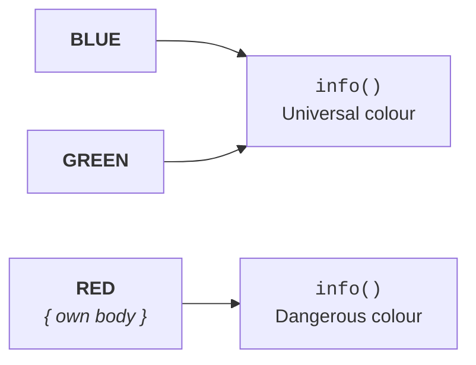
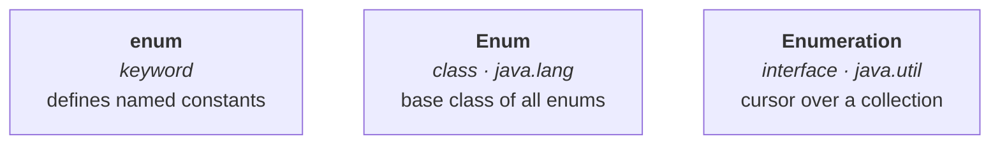

# Case 3 — giving one constant its own version of a method

The third exam pattern mixes enum with **anonymous inner classes**. It looks like new syntax; it is not — it is a shape you have seen before, appearing somewhere unexpected.

## The starting point

```java
enum Colour {
    BLUE, RED, GREEN;

    public void info() {
        System.out.println("Universal colour");
    }
}
```

Blue, red and green — his three favourites, and there is a reason they are the three. If you remember school physics, **RGB**: any colour in the world can be generated by mixing these three, which is why they are called the **universal colours**. That is what the `info()` method describes.

```java
class Test {
    public static void main(String[] args) {
        Colour[] c = Colour.values();
        for (Colour c1 : c) {
            c1.info();
        }
    }
}
```

`values()` from note `05` gives all three constants, and `info()` is called on each. Measured on JDK 25:

```
Universal colour
Universal colour
Universal colour
```

Three times, because there are three constants and each one calls the same method.

## The requirement that changes everything

Now: for **blue** I want that description, and for **green** I want that description — but for **red** I want a **different** `info()`, because red is a dangerous colour.

> **For a particular constant, is it possible to define a method separately?**

Yes — and the syntax is the point of this section. After `RED`, and **before the comma**, open a curly brace and write the method:

```java
enum Colour {
    BLUE,
    RED {
        public void info() {
            System.out.println("Dangerous colour");
        }
    },
    GREEN;

    public void info() {
        System.out.println("Universal colour");
    }
}
```

Read the placement carefully, because that is what the exam tests: `BLUE`, comma, `RED`, then **`{ … }`**, then the comma, then `GREEN`, then the semicolon, then the ordinary `info()`.

So there are three constants: `BLUE` uses the normal `info()`, `RED` has its own **overriding version**, and `GREEN` uses the normal one again.

Measured on JDK 25:

```
Universal colour
Dangerous colour
Universal colour
```



## What the syntax actually is

> **This is the anonymous inner class approach** — overriding a method at the level of one particular object.

That is why it looks unfamiliar: you are used to seeing anonymous inner classes written as `new Runnable() { … }`, and here the `new` is invisible because note `01` established that a constant already **is** `new Colour()`. Writing `RED { … }` is writing `new Colour() { … }` with the boilerplate removed.

> [!example]- **Proof — count the class files.** Open this to see the anonymous class appear on disk. Compile the version where only `RED` has its own body. Measured on JDK 25:
> ```
> $ ls Colour*.class
> Colour$1.class
> Colour.class
> ```
> **`Colour$1`** is the anonymous subclass, generated for `RED` alone — `$1` is exactly the naming the compiler uses for any anonymous inner class. `BLUE` and `GREEN` produce no extra file because they are plain `Colour` instances.
>
> And note what this quietly means: `Colour$1` is a **subclass of `Colour`**. Note `04` said an enum cannot have a child class — which is true of children **you** write. The compiler is allowed to generate them, and this is where note `07`'s abstract-method warning comes from: an abstract method in an enum works precisely because each constant body becomes one of these generated subclasses.

> [!important] **Do not treat this as something exotic.** He is explicit: do not feel it is something new, it is 100% a valid approach. It is the standard way to give per-constant behaviour, and in modern code it is used constantly — an `Operation` enum where `PLUS`, `MINUS`, `TIMES` each implement `apply()` is the canonical example.

---

# Case 4 — `enum` versus `Enum` versus `Enumeration`

The last of the exam cases, and he flags it as useful for interviews as well as for SCJP. Java has three similar-looking names:

- **`enum`** — lowercase
- **`Enum`** — capitalised
- **`Enumeration`** — the full word

The wrong answer is **this one is small, this one is capital, this one is the full form**. **All three are completely different things.**

## `enum` is a keyword

> **`enum` is a keyword in Java**, introduced in the **1.5** version, which can be used to **define a group of named constants**.

That is everything the previous eight notes were about.

> [!info] **This is also why `enum` stopped being a usable identifier.** Before 1.5, `int enum = 10;` was legal code, and adding the keyword broke it. Measured on JDK 25 the compiler still says so explicitly:
> ```
> error: as of release 5, 'enum' is a keyword, and may not be used as an identifier
> ```

## `Enum` is a class

> **`Enum` is a class** present in the **`java.lang`** package.

All enums in Java are direct child classes of it, which is why it **acts as the base class for all Java enums**. Note `04` is entirely about this class.

## `Enumeration` is an interface

> **`Enumeration` is an interface** present in the **`java.util`** package. It is related to **collections**.

Its purpose: you have a collection holding a first object, a second, a third, a fourth. **If you want to get those objects one by one from the collection**, you go for `Enumeration`.

> **`Enumeration` is a cursor** — like `Iterator` and `ListIterator` — used to get objects one by one from a collection.

```java
import java.util.*;

class Test {
    public static void main(String[] args) {
        Vector<String> v = new Vector<String>();
        v.add("first"); v.add("second"); v.add("third");

        Enumeration<String> e = v.elements();
        while (e.hasMoreElements()) {
            System.out.println(e.nextElement());
        }
    }
}
```

Measured on JDK 25:

```
first
second
third
```

And its interface definition, measured on JDK 25:

```
public interface java.util.Enumeration<E> {
  public abstract boolean hasMoreElements();
  public abstract E nextElement();
  public default java.util.Iterator<E> asIterator();
}
```

> [!info] **`asIterator()` is newer than the recording** — a default method added in **Java 9** that adapts an old `Enumeration` to the modern `Iterator` interface. It changes nothing about what `Enumeration` is; the two methods that define it are still `hasMoreElements()` and `nextElement()`. Verified on JDK 25.

## The three, side by side

| | `enum` | `Enum` | `Enumeration` |
|---|---|---|---|
| **What it is** | a **keyword** | a **class** | an **interface** |
| **Where it lives** | the language itself | **`java.lang`** | **`java.util`** |
| **What it is for** | defining a group of **named constants** | the **base class** of every Java enum | a **cursor** over a collection |
| **Related to** | — | enums | **collections** |



> [!important] **This is asked directly**, as what is the difference between `enum`, `Enum` and `Enumeration`? Three words carry the whole answer: **keyword, class, interface.** Everything else can be reconstructed from there.

---

# What this part established

| | |
|---|---|
| Overriding a method for **one constant** | write the body in `{ }` **after that constant** |
| Where the braces go | after the constant, **before the comma** |
| What the syntax is | the **anonymous inner class** approach |
| What it produces | a compiler-generated subclass — `Colour$1.class` |
| Constants without a body | use the enum's ordinary method |
| **`enum`** is | a **keyword** — defines a group of named constants |
| **`Enum`** is | a **class** in `java.lang` — base class of every Java enum |
| **`Enumeration`** is | an **interface** in `java.util` — a **cursor** over a collection |
| `Enumeration`'s two methods | `hasMoreElements()` and `nextElement()` |
