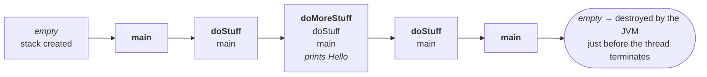
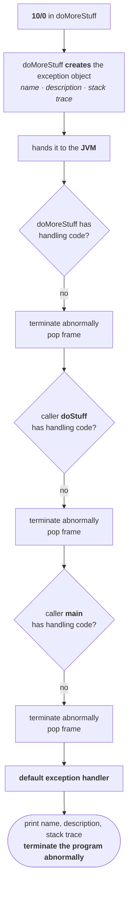
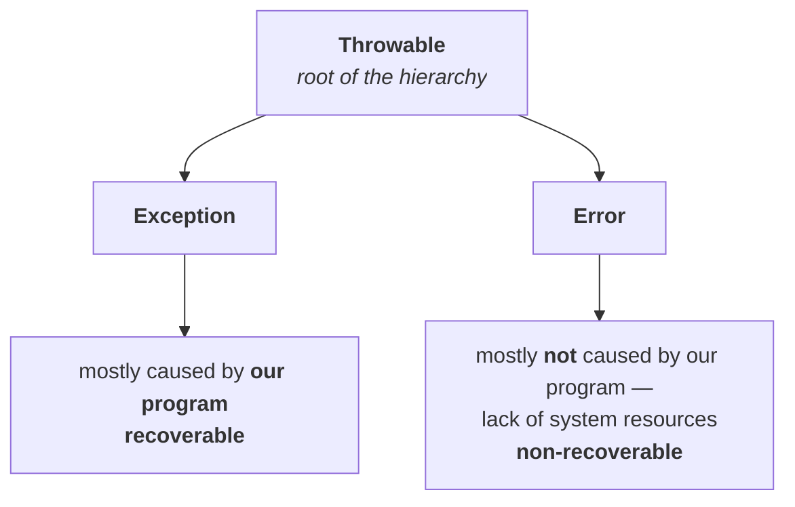

# The runtime stack mechanism

Before anything can go wrong, you need the model of what happens when everything goes right. This is the machinery the whole chapter is built on.

> - For every thread, the JVM creates a **separate stack** at the time of thread creation.
> - All **method calls** performed by that thread are stored in that stack.
> - Each entry in the stack is called an **activation record** or **stack frame**.
> - After completing every method call, the JVM **removes the corresponding entry** from the stack.
> - After completing all method calls, the JVM **destroys the empty stack** and terminates the program normally.

> [!info] **You have met this already, from the other side.** The JVM chapter's [[06-Stack-Memory-PC-Registers-And-Native-Method-Stacks|stack memory note]] covers the same mechanism — the same term *activation record*, one stack per thread, frames pushed and popped — and goes further into what is *inside* a frame. That note also shows what a `try` block compiles to and why an untaken `try` costs nothing at runtime, which is worth returning to once `try`/`catch` arrive in the next parts.

## The program

```java
class Test {
    public static void main(String[] args) {
        doStuff();
    }

    public static void doStuff() {
        doMoreStuff();
    }

    public static void doMoreStuff() {
        System.out.println("Hello");
    }
}
```

Verified on JDK 25:

```
Hello
```

Nothing goes wrong here. That is the point of it.

## The stack, step by step



Read left to right and then back:

1. The main thread starts, and the JVM creates an **empty runtime stack** for it.
2. The thread calls `main`, so **`main`** goes on — the first activation record.
3. `main` calls `doStuff`, which goes on top.
4. `doStuff` calls `doMoreStuff`, which goes on top of that.
5. `doMoreStuff` prints `Hello`. It has nothing further to do, so it **completes normally** and its entry is removed.
6. Control returns to `doStuff`. Is there anything after the call to `doMoreStuff`? No — so `doStuff` completes normally and its entry is removed.
7. Control returns to `main`. Anything after the call to `doStuff`? No — so `main` completes normally and its entry is removed.
8. The stack is now **empty**, and the JVM destroys it immediately before the thread terminates.

> [!important] **Every method here "completed normally", and that phrase is about to matter.** This is the well-behaved case: each frame pops because its method finished, the stack empties in order, and the program terminates normally.
>


```java
class Test {
    public static void main(String[] args) {
        doStuff();
    }

    public static void doStuff() {
        doMoreStuff();
    }

    public static void doMoreStuff() {
        System.out.println(10/0);        // was: "Hello"
    }
}
```

`10/0` is an `ArithmeticException`. The call chain is unchanged — `main` → `doStuff` → `doMoreStuff` — so at the moment it happens, the stack is three frames deep and **the problem is at the top**.

Nobody in this program handles anything. So what happens?

---

# The seven steps

> **1.** If an exception is raised inside any method, then **that method is responsible to create an Exception object** with the following information:
> - **name** of the exception
> - **description** of the exception
> - **location** of the exception (stack trace)

> **2.** After creating that Exception object, the method **hands the object over to the JVM**.

> **3.** The JVM checks whether the method contains any exception handling code. If it does not, the JVM **terminates that method abnormally** and removes the corresponding entry from the stack.

> **4.** The JVM identifies the **caller** method and checks whether the caller contains any handling code. If not, the JVM terminates the caller abnormally too and removes its entry from the stack.

> **5.** This process continues **until `main()`** — and if `main()` also has no handling code, the JVM terminates it as well and removes its entry.

> **6.** The JVM then hands the responsibility over to the **default exception handler**

> **7.** The default exception handler **prints the exception information to the console** in a fixed format and **terminates the program abnormally**.

## Walking it, with the analogy alongside

**Step 1 — the method at the scene files the report.** The exception happened inside `doMoreStuff`, so `doMoreStuff` is responsible for creating the exception object. Name: `ArithmeticException`. Description: `/ by zero`. Location: `doMoreStuff`, which was called by `doStuff`, which was called by `main`. That last part is the whole stack trace, not just one line.

**Step 2 — it hands it to the JVM.** the method hands the object to the JVM. 

**Step 3 — the JVM comes to where it happened.** It arrives at `doMoreStuff` and asks: *an exception was raised in your area — do you have any handling code?* `doMoreStuff` says no. So the JVM **terminates it abnormally**, without executing any remaining lines — a thousand lines could follow and none of them run — and removes its frame.

**Step 4 — the JVM finds the caller.** `doMoreStuff` is a method; somebody called it or it would never have run. Who? `doStuff`. The JVM asks: *ten minutes ago you called `doMoreStuff`. It raised an exception and did not handle it. As the caller, that responsibility is yours. Where is the handling code?* `doStuff` has none. Terminated abnormally, frame removed.

**Step 5 — up to `main`.** `main` has no handling code either, Terminated abnormally, frame removed.

**Step 6 — the stack is empty and nobody handled it.** Who called `main`? The JVM. So the whole thing has come back round to the JVM itself, and the JVM keeps an assistant for exactly this: the **default exception handler**. It hands the exception object over.

**Step 7 — the handler prints and quits.**



---

# The output

The format the default handler uses:

```
Exception in thread xxx: Name of exception: description
        Location of exception (stack trace)
```

And the program, verified on JDK 25:

```
Exception in thread "main" java.lang.ArithmeticException: / by zero
	at Test.doMoreStuff(Test.java:9)
	at Test.doStuff(Test.java:6)
	at Test.main(Test.java:3)

exit code: 1
```

Every element of step 1 is visible in it:

| Part of the output | What it is |
|---|---|
| `Exception in thread "main"` | which thread died |
| `java.lang.ArithmeticException` | the **name** |
| `/ by zero` | the **description** |
| the three `at …` lines | the **location** — the stack trace |

> [!important] **The stack trace is printed deepest-frame-first, and that is not an accident.** `doMoreStuff` is on top because it is where the exception was raised; `main` is at the bottom because it is where execution began. Read the top line to find *where it broke* and read downwards to find *how you got there*.

> [!important] **This is abnormal termination, and the exit code proves it.** The process exits with **1**, not 0. Nothing after the failing line ran, in any of the three methods. That is what "terminated abnormally" means in practice — not merely that an error was printed, but that every remaining statement in every frame was skipped.


# What this part has established

| | |
|---|---|
| Who creates the exception object | **the method in which the exception was raised** |
| What is in it | name, description, location (stack trace) |
| Who receives it | the **JVM** |
| What the JVM does at each frame | asks for handling code; finding none, **terminates abnormally and pops the frame** |
| Where it stops | after `main`, at the **default exception handler** |
| What that handler does | prints the information and **terminates the program abnormally** |

---

# Exception hierarchy

> **`Throwable`** acts as the **root** for the exception hierarchy — the root for all Java exceptions and errors.

> [!info] **`Throwable` is a class, not an interface**, despite how the name reads. Java's `-able` names are usually interfaces — `Serializable`, `Cloneable`, `Runnable`, `Comparable` — so this one catches people out. It is a class.

`Throwable` defines exactly **two child classes**:



## `Exception` versus `Error`

> **Exception:** in most cases exceptions are **caused by our program**, and these are **recoverable**.

> **Error:** in most cases errors are **not caused by our program** — they are due to a **lack of system resources** — and these are **non-recoverable**.

**What "recoverable" means, concretely.** Your requirement is to read data from a remote file in London. Notice first that this exception only exists *because of your code* — if you were not reading a remote file, there would be no `FileNotFoundException` to have. It is your programmatic decision that created the possibility.

And when it happens, you have somewhere to go:

```java
try {
    // read data from the remote file located at London
} catch (FileNotFoundException e) {
    // use a local file and continue the rest of the program normally
}
```

That is recovery — you get control back and the rest of the program runs normally.

**What "non-recoverable" means.** If an `OutOfMemoryError` occurs, being a programmer **you can do nothing about it**. There is no alternative to switch to; the heap is exhausted. Raising the heap is the **system administrator's or server administrator's** job, not something your code can arrange while it is failing.

| | `Exception` | `Error` |
|---|---|---|
| Caused by | mostly **our program** | mostly **not** our program — system resources |
| Recoverable | **yes** | **no** |
| Example | `FileNotFoundException` → use a local file | `OutOfMemoryError` → admin must raise the heap |
| Your move | catch it, continue | nothing |

> [!important] **"What is the difference between `Exception` and `Error`?" is asked directly.** Answer in the two dimensions above — *who caused it* and *whether you can recover* — and give one example of each. Do not say errors cannot be caught: syntactically you can catch an `Error`, and that is exactly why the real distinction is **recoverability**, not catchability. There is nothing useful to do in the `catch`.

---

