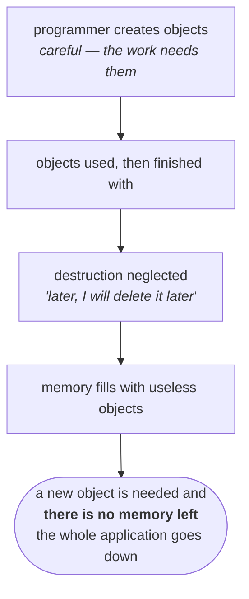
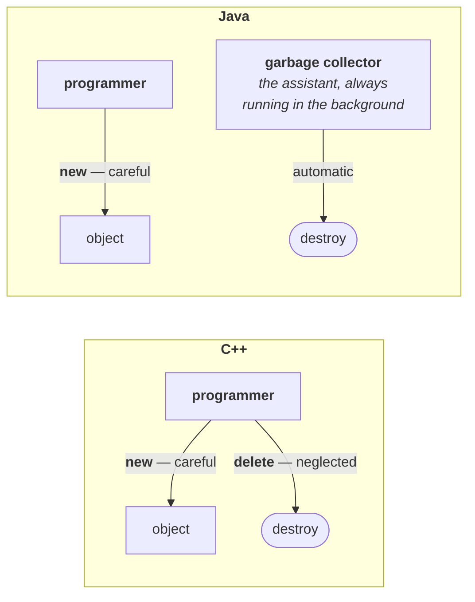

# What the word actually means

Start with the ordinary meaning. Garbage is waste — the useless stuff. On the roads there is garbage, somebody is responsible for collecting it, and that person is the garbage collector. The process itself is garbage collection.

Carry all three words straight across into programming:

| Word | In the street | In Java |
|---|---|---|
| **garbage** | waste, rubbish | **objects we are no longer using** |
| **garbage collector** | the person who collects it | the part of the JVM that destroys those objects |
| **garbage collection** | the process | the process of destroying them |

> [!important] **In one line: the purpose of the garbage collector is to destroy useless objects.**

---

> [!important] **The principle: when we want something, we take enormous care. When we have to give it back, we take none.** He called every fifteen minutes to get the money. When it was his turn to return it, the phone went dead.

You are taking notes and your pen dies. You turn around — *does anyone have a spare pen? Please, can you help?* Very polite, very respectful. Somebody gives you one, you write, the class ends. Now you have to give it back. And this time you toss it at them — *here, take it* — without even handing it over properly.

Same person. Same pen. Completely different level of care in the two directions.

---

# The same psychology, in C++

A programmer is a human being too, and is no exception to any of this. Watch where the care goes and where it does not.

In C++ the programmer owns both ends of an object's life:

> - **create** the object — with the `new` keyword
> - **destroy** the object — with the `delete` keyword

And which of those gets the attention? Creation, obviously. Without the object you cannot go any further, so you create it carefully, because you need it. *I need a `Student` object* — `Student s = new Student();` — done, and on you go.

Then the work with the object finishes and the object is no longer required. You know it is no longer required; you are the programmer, nobody is better placed to know. Destroying it is now your job.

**Later. I will destroy it later.** The code keeps going.

That is the pen being tossed back. And here is where it stops being a story about manners:

Because of that neglect, at some point the memory is full of nothing but useless objects. And then the program needs to create one more object, there is no room for it, and **the entire application crashes with a memory problem**. Running out of memory this way is a very common failure in C++ and the older languages.

> [!warning] **This is C++ as it was, and modern C++ has largely answered it.** RAII plus smart pointers — `std::unique_ptr` and `std::shared_ptr`, standard since C++11 — mean a well-written modern C++ program is rarely calling `delete` by hand at all; ownership is expressed in the type and destruction happens automatically at scope exit. The lecture's picture is accurate for the era Java was designed in, and it is still the right explanation of *why* Java went the way it did — but do not walk into an interview claiming C++ programmers still manage every object manually.

> [!info] **A small precision on the name.** `OutOfMemoryError` is a Java type. A C++ program exhausting the heap gets `std::bad_alloc` from `new`, or a null pointer back from `malloc`. The failure being described is real and identical in effect; the specific name belongs to Java.

---

# What Java changed

Somebody looked at this problem and asked a sharper question than *"how do we make programmers more careful?"* — because the answer to that is *you can't*. The question they asked instead was: **where is the programmer already careful, and where is he not?**

- **Careful at creation.** He needs the object, so he will always create it properly. Leave that responsibility exactly where it is.
- **Careless at destruction.** He neglects it, and his neglect can take the whole application down. So **take that responsibility away from him entirely.**

Which leaves the obvious question — if the programmer is not destroying useless objects, who is?

> Sun people provided one **assistant**, which is always running in the background for the destruction of useless objects.

That assistant is the **garbage collector**.

| | Creates the object | Destroys the object |
|---|---|---|
| **C++** | programmer, with `new` | **programmer**, with `delete` |
| **Java** | programmer, with `new` | **the garbage collector** |

Because of that assistant, the chance of a Java program failing because of memory problems is very, very low.

---

# Four things that follow from it

**1 — The garbage collector is a daemon thread.** It is always running in the background, and background threads are daemon threads. The garbage collector is the standard example of one.

**2 — This is why Java has no `delete` keyword.** There is nothing for it to do. Destruction is not yours to trigger, so the language never gave you the verb. If you are asked *"why is there no `delete` in Java?"*, the answer is this whole chapter in miniature: the responsibility was deliberately removed from the programmer, because the programmer was the part that failed.

**3 — The garbage collector is part of the JVM.** It is not a library, not something you configure into your application. It lives inside the JVM, alongside the execution engine.

**4 — It is one reason Java is called robust.** Robustness is one of the buzzwords in Java's own list, and it means the chance of a Java program failing is very low. The garbage collector is one of the reasons that claim can be made at all.

> [!important] **The interview answer, assembled.** *"The garbage collector is a daemon thread inside the JVM whose job is to destroy useless objects. In C++ the programmer had to both create and destroy, and neglected destruction, which crashed applications with memory problems. Java kept creation with the programmer and moved destruction to the collector — which is also why there is no `delete` keyword in Java."*

---

