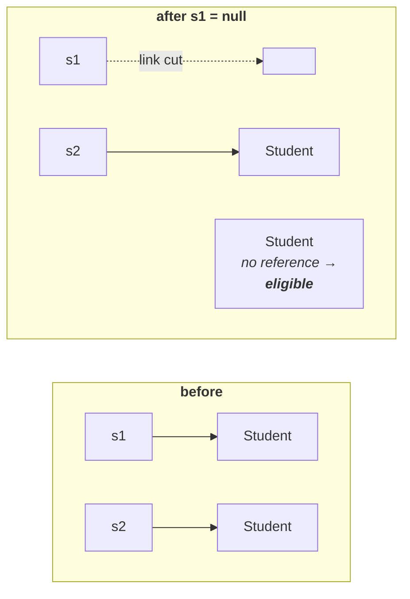
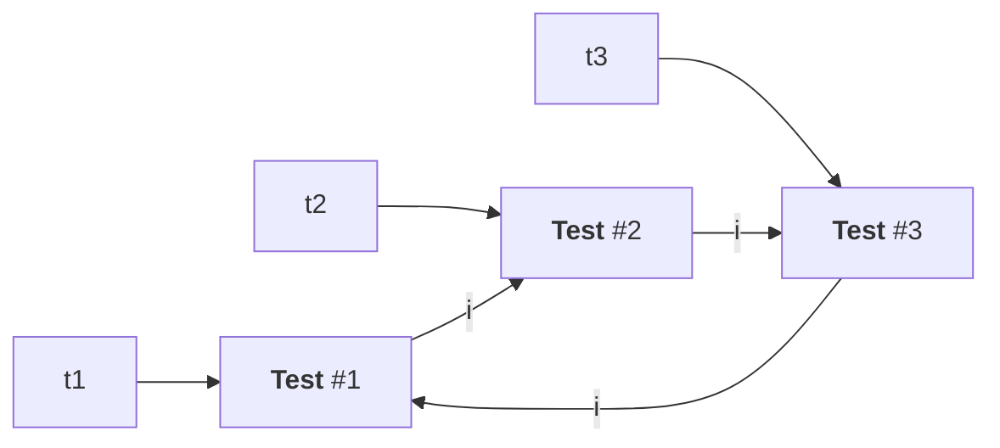
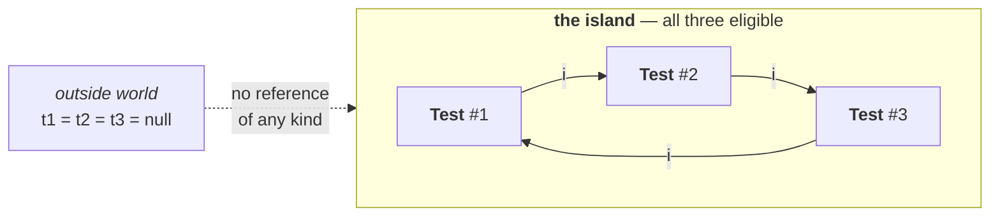

You are not responsible for destroying objects. That was the whole point of the previous part. But there is still a job left for you, and it is the one this part is about:

> Even though the programmer is not responsible for destruction of objects, it is **always a good programming practice to make an object eligible for GC if it is no longer required**.

Being the programmer, you know something the JVM does not — whether the next lines of your code are going to use that object or not. Only you can say **this is finished with**. So say it.

---

# Two analogies for `eligible`, before any code

**Making something eligible for cleanup is not the same as cleaning it up.**

**The paper cup.** You go to a government office, or a relative's house, and they bring you tea in a paper cup. You finish the tea. Now — do you leave the cup on the table, or do you look for a dustbin? Everybody looks for a dustbin. If you cannot see one, you ask where it is. That is simply what people do.

Putting the cup in the dustbin is not you performing the cleaning. The cleaning staff will come later and empty the dustbin — that is their job, not yours. What you did was recognise the cup is useless and **put it somewhere that makes it eligible** for someone else to deal with.

**The shirt.** Working people often do not wash their own clothes. At the end of the day you know this shirt needs washing. So you put it in the laundry bin. When your assistant comes, she takes everything out of the bin and washes it. You did not wash anything. You made the shirt **eligible** for washing.

> [!important] **That is the exact relationship between you and the garbage collector.** You do not destroy the object. You put it in the bin — you cut its last reference — and whenever the JVM decides to run the collector, it gets destroyed. Two separate acts, done by two different parties, at two different times.

---

# When is an object eligible?

Before the four ways, the rule they all serve. Take an object with a reference variable pointing at it:

Is it eligible? **No.** You can still reach it through that variable, so it is a useful object.

Now take an object with no reference variable pointing at it:

Is it eligible? **Yes.** You cannot reach it, you cannot use it, so it is useless.

> An object is eligible for GC **if and only if it does not have any references**.

Everything that follows is four different ways of arriving at that same condition.

---

# 1 — Nullifying the reference variable

Start with two objects and nothing else going on:

```java
Student s1 = new Student();
Student s2 = new Student();
// no object eligible for GC
```

Two objects created, and neither is eligible — you can reach the first through `s1` and the second through `s2`.

Now you finish with the first one. You know it, because you wrote the code that comes next. So cut the link:

```java
s1 = null;
// 1 object eligible for GC
```

`s1` no longer points at anything. That first object now has no reference at all, so it is eligible. Do the same for the second:

```java
s2 = null;
// 2 objects eligible for GC
```



> **Way 1.** If an object is no longer required, **assign `null` to all its reference variables**. That object is then eligible for garbage collection. This approach is called **nullifying the reference variable**.

Note the words **all its reference variables** — one object can have several names pointing at it, and it is only eligible when every one of them is gone.

> [!info] **You have seen this in real code without knowing why.** In large applications you will come across a bare line like `con = null;` after some database work is finished. That is not tidiness or superstition — it is this exact technique. The connection object is no longer required, so its reference is nulled, and the object becomes eligible for collection.

---

# 2 — Reassigning the reference variable

Same starting point, two objects, neither eligible:

```java
Student s1 = new Student();
Student s2 = new Student();
// no object eligible for GC
```

This time you are finished with the first object **but you need a new one**. So rather than nulling the variable, you point it somewhere else:

```java
s1 = new Student();
// 1 object eligible for GC
```

A new `Student` is created and `s1` is reassigned to it. The object `s1` used to point at now has nobody pointing at it, so it is eligible — the same end state as Way 1, reached by a different move.

Then one more line, which is the interesting one:

```java
s2 = s1;
// 2 objects eligible for GC
```

`s2` now points at the same object `s1` does. Which means the object `s2` **used** to point at has been abandoned, and is eligible too.

> **Way 2.** If an object is no longer required, **reassign its reference variable to some other object**. The old object is then eligible for garbage collection. This approach is called **reassigning the reference variable**.

> [!important] **Ways 1 and 2 are the same idea with different syntax.** In both cases the object ends with zero references. Nulling is what you do when you want nothing there; reassigning is what you do when you want something else there. Interviewers sometimes ask for the ways expecting four distinct mechanisms — these two are distinct moves, but the underlying rule they satisfy is identical.

---

# 3 — Objects created inside a method

The first two took deliberate action. This one takes none — it happens on its own.

```java
class Test {
    public static void main(String[] args) {
        m1();
        // how many objects are eligible for GC here?
    }

    public static void m1() {
        Student s1 = new Student();
        Student s2 = new Student();
    }
}
```

Most people answer **zero**. The reasoning sounds solid: nothing was set to `null`, nothing was reassigned, so nothing was released.

The answer is **two**.

`s1` and `s2` are local variables of `m1`. A variable declared inside a method is a local variable, it is created when the method executes, and **when the method completes it is gone**. Both references disappear at the closing brace, both objects are left with nothing pointing at them, and both become eligible.

> [!info] **Why it is gone is literally true — see [[06-Stack-Memory-PC-Registers-And-Native-Method-Stacks#1 · Local variable array|the local variable array]] in the JVM chapter.** `s1` and `s2` are not variables that get cleaned up when the method ends; they are **slots in an array that is created fresh on every call and thrown away on return**. `javap` shows them numbered — slot 1 and slot 2 — with the whole array sized by the compiler before the program ever runs.
>
> That note also gives the reason a field behaves differently here: a static or instance variable **never gets a slot at all**, precisely because it outlives the call. Which is exactly why Case 3 below — the object held by a `static` field — survives while its neighbour does not.

> **Way 3.** Objects created inside a method are **by default eligible for GC once the method completes.**

And it scales — create fifty objects inside `m1` and all fifty are eligible when `m1` returns, for the same reason.

## Three exceptional cases

The rule holds in general, but there are cases where an object created inside a method survives the method. All three turn on the same question: **did any reference escape the method?**

### Case 1 — the object is returned, and the caller keeps it

```java
class Test {
    public static void main(String[] args) {
        Student s = m1();          // return value captured
        // 1 object eligible for GC
    }

    public static Student m1() {
        Student s1 = new Student();
        Student s2 = new Student();
        return s1;
    }
}
```

Two objects created inside the method. When `m1` finishes, the local variables `s1` and `s2` are both gone — but the first object was **returned**, and the caller gave it a new reference variable, `s`. So it can still be reached.

Only the second object is eligible. **One object.**

### Case 2 — the object is returned, and the caller ignores it

```java
class Test {
    public static void main(String[] args) {
        m1();                      // return value thrown away
        // 2 objects eligible for GC
    }

    public static Student m1() {
        Student s1 = new Student();
        Student s2 = new Student();
        return s1;
    }
}
```

Byte for byte the same method. The only change is at the call site.

Calling a method that returns something does not oblige you to keep the result — if you want it you capture it, otherwise you ignore it. Here it is ignored, so no new reference is created for the returned object, and it dies with the method exactly like the other one.

**Two objects.**

> [!important] **Case 1 and Case 2 are the pair worth memorising.** Identical method, identical objects, and the answer changes from one to two based on a single line in the caller. This is precisely the shape of the how many objects are eligible after line N question, and it is why you must read the call site, not just the method.

### Case 3 — the object is assigned to a static variable

```java
class Test {
    static Student s;                       // static variable

    public static void main(String[] args) {
        m1();
        // 1 object eligible for GC
    }

    public static void m1() {
        s = new Student();                  // held by the static variable
        Student s1 = new Student();         // held by a local variable
    }
}
```

Two objects created inside `m1` again, but they are held differently.

`s1` is a local variable, so it is gone when the method completes and its object is eligible. `s` is a **static variable** — it belongs to the class and can be accessed from anywhere in it, so it does not disappear when the method returns. Its object stays reachable.

**One object.**

> [!info] **The general rule still stands.** Objects created inside a method are by default eligible once the method completes. These three cases are the exceptions, and every one of them is a case where a reference **escaped** — through a return value that was captured, or through a field that outlives the call.

---

# 4 — Island of Isolation


## Where the name comes from

An island is land surrounded on **all four sides** by water — Andaman and Nicobar, Sri Lanka, Australia. Land surrounded on **three** sides is a peninsula, and the example is India: three sides water, one side joined to the mainland.

The distinction being borrowed is exactly that: **is there any connection to the outside, or is it completely cut off?**

## The setup

The class holds a reference to its own type:

```java
class Test {
    Test i;                        // instance variable, of type Test
}
```

`i` is an instance variable, so one `i` is created for every `Test` object, and each one can hold a reference to another `Test`.

Create three:

```java
Test t1 = new Test();
Test t2 = new Test();
Test t3 = new Test();
// no object eligible — each has i = null by default
```

None are eligible; each is reachable through its own variable. Each object's `i` is `null` for now, since instance variables get default values.

Now wire them into a ring:

```java
t1.i = t2;
t2.i = t3;
t3.i = t1;
// still no object eligible — the bonds have only got stronger
```



## Now cut the outside links, one at a time

```java
t1 = null;
// 0 objects eligible
```

Object #1 lost its external variable, but it is still reachable — `t3.i` points at it. Nothing is eligible.

```java
t2 = null;
// 0 objects eligible
```

Still nothing. You can reach #3 through `t3`, #1 through `t3.i`, and #2 through `t3.i.i`. Every object is still reachable, just by a longer path.

```java
t3 = null;
// 3 objects eligible
```

And now everything changes at once. The last external reference is gone. The three objects still point at each other perfectly happily — but there is **no way in from outside**.



> **Way 4.** When a group of objects reference **only each other**, with no reference from outside the group, the whole group is isolated from the outside world and **the entire group is eligible for garbage collection**. This is an **Island of Isolation**.

The collector can identify groups like this. Internal references do not save you.

> [!important] Each object is `supporting` the next by holding a reference to it, and every one of those references is internal. Support from inside the sinking group is worth nothing to the garbage collector. Only a reference from outside keeps the group alive.

---

# The two conclusions


> [!important] **1 — If an object has no reference variable, it is always eligible for garbage collection.** No exceptions, no argument. This is the plain case and the one everybody already knows.
>
> **2 — Even when an object does have a reference, it can still be eligible.** If every reference pointing at it is an internal reference from within an isolated group, the object is eligible anyway. The best example is the Island of Isolation.

The second one is why does it have a reference? is not actually the right question. The right question is **can it be reached from outside?** — and those two only look the same until you meet an island.

---

# The four ways, together

| # | Way | What you do | Object becomes eligible because |
|---|---|---|---|
| 1 | **Nullifying the reference variable** | `s1 = null;` | its last reference was removed |
| 2 | **Reassigning the reference variable** | `s1 = new Student();` | its reference now points elsewhere |
| 3 | **Objects created inside a method** | nothing — it is automatic | local variables die when the method completes |
| 4 | **Island of Isolation** | cut every external reference | only internal references remain |

