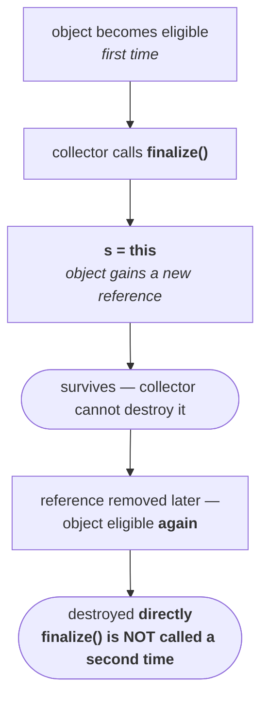

**What happens in the moment between the collector reaching the object and the object being destroyed?** That is finalization.

---


> [!important] Just before destroying an object, the garbage collector always calls the **`finalize()`** method on it **to perform cleanup activities**. Once `finalize()` completes, the collector destroys the object.

| Question | Answer |
|---|---|
| Who calls `finalize()`? | the **garbage collector** |
| When? | **just before** destroying the object |
| Why? | to perform **cleanup activities** |
| What happens after it completes? | the collector destroys the object |

**What counts as cleanup?** Resource deallocation — closing a database connection, closing a network connection. Those are the things that need doing before the object disappears.

> [!warning] **`finalize()` is deprecated, and the JDK is actively trying to get rid of it.** Compiling any class that overrides it on JDK 25 produces:
>
> ```
> warning: [removal] finalize() in Object has been deprecated and marked for removal
> ```
>
> It has been deprecated since Java 9 and marked **for removal** since Java 18. Finalization can already be switched off with `--finalization=disabled`, and the plan is to remove the mechanism entirely in a future release.
>
> **The modern replacements** are `try`-with-resources with `AutoCloseable` for anything scope-bound — which is what you should actually be writing for connections — and `java.lang.ref.Cleaner` for the rare case where you genuinely need a safety net after an object becomes unreachable.
>
> Everything in these notes is still worth learning: it is asked constantly, and the *reasons* it was deprecated only make sense once you know the cases below. But if an interviewer asks whether you would use it, the answer is no.

---

# Where `finalize()` comes from

If the collector can call `finalize()` on *any* object, the method must be available on every object. It is:

> `finalize()` is defined in the **`Object`** class, and hence it is available to **every Java class** — because `Object` is the superclass of them all.

Its declaration, in full:

```java
protected void finalize() throws Throwable
```

Three things worth reading off that signature: it is **`protected`**, it returns **`void`**, and it declares **`throws Throwable`** — the broadest thing it is possible to throw, which matters enormously for Case 3.

And in `Object`, the body is empty. Open `Object.java` and the method is there with nothing inside it.

> [!info] **Why `Object`'s version is empty, and why that is correct.** The `Object` class cannot possibly know what cleanup *your* object needs — only you know that this object holds a database connection. So the base implementation does nothing, and **you override it in your own class** to define your own cleanup activities.

---

# Case 1 — which class's `finalize()` actually runs?

The first case, and the one that catches almost everybody.

```java
class Test {
    public static void main(String[] args) {
        String s = new String("durga");
        Test t = new Test();
        s = null;
        System.gc();
        System.out.println("End of main");
    }

    public void finalize() {
        System.out.println("finalize method called");
    }
}
```

A `String` object is created and then made eligible by nulling `s`. The collector is requested. `Test` overrides `finalize()`.

## What everyone predicts

First, a thread observation that the prediction rests on. Before `System.gc()` there is **one thread** — main. After it there are **two**: main, and the garbage collector. Main carries on to print `End of main`; the collector calls `finalize()` and destroys the object. Two threads running at once means **the order of output is not predictable**.

So the expected answer is one of these two:

```
finalize method called          End of main
End of main                     finalize method called
```

Durga Sir says that if he showed this program to a hundred students, ninety-nine would pick one of those two.

## What actually happens

Measured on JDK 25:

```
End of main
```

That is all. Run it a thousand times on a thousand machines and it is always just `End of main`. `finalize()` is never called.

There is no mistake in the program, and none in the JVM. The mistake is in the expectation.

## Why

**Which object is eligible for collection here?** The `String` object — that is the one whose reference was nulled.

So the collector calls `finalize()` **on the `String` object**. And which class's `finalize()` does that run? **`String`'s.** Not `Test`'s.

It is the same rule as any other method call, and Durga Sir makes the connection explicitly: if you call `s.m1()`, which `m1()` runs depends on what `s` actually is — `Student`'s if it is a `Student`, `Customer`'s if it is a `Customer`, `String`'s if it is a `String`. `finalize()` is not special.

`String` does not override `finalize()`, so it inherits the empty one from `Object`. Empty method, no output.

> [!important] **Case 1, stated properly.** Just before destroying an object, the collector calls `finalize()` **on the object that is eligible** — so **that object's class's** `finalize()` runs. If a `String` object is eligible, `String`'s `finalize()` runs, *not* the `Test` class's, no matter what `Test` overrides.

## Making it work

Change one thing — make the eligible object a `Test`:

```java
class Test {
    public static void main(String[] args) {
        Test t = new Test();
        t = null;
        System.gc();
        System.out.println("End of main");
    }

    public void finalize() {
        System.out.println("finalize method called");
    }
}
```

Measured on JDK 25:

```
End of main
finalize method called
```

Now the eligible object *is* a `Test`, so `Test`'s `finalize()` runs. And note the ordering — `End of main` came first on this run, which is exactly the two-thread unpredictability described above. The other order is equally legal.

> [!info] **This is why people think `finalize()` is broken.** They make a `String` or a `Student` eligible, override `finalize()` in the class holding `main`, see nothing printed, and conclude the method does not work. It works perfectly; it ran on the wrong class.

---

# Case 2 — calling `finalize()` yourself

`finalize()` is a method like any other, and it is not private. So: **can the programmer call it explicitly?**

Yes. And the consequence is the important bit.

> [!important] **If the programmer calls `finalize()`, it executes like an ordinary method call and the object is *not* destroyed.** If the **garbage collector** calls it, the object **is** destroyed once the method completes.
>
> `finalize()` does not destroy anything. It performs cleanup. Destruction is the collector's separate act, immediately afterwards — and only when the collector was the caller.

## The program

```java
class Test {
    public static void main(String[] args) {
        Test t = new Test();
        t.finalize();                  // 1 — by the programmer
        t.finalize();                  // 2 — by the programmer
        t = null;
        System.gc();                   // 3 — by the garbage collector
        System.out.println("End of main");
    }

    public void finalize() {
        System.out.println("finalize method called");
    }
}
```

**How many times does `finalize()` run?** Three. Twice by the programmer as ordinary method calls, and once by the collector just before destruction.

Measured on JDK 25:

```
finalize method called
finalize method called
End of main
finalize method called
```

The first two are the explicit calls, in order, before anything else. Then `End of main` from the main thread and the collector's call — and again, those last two could arrive in either order.

> [!example]- **Proof that the third call is the collector's** — run the same program with finalization switched off
> JDK 18 added a flag to disable finalization entirely. Running the identical program with it:
>
> ```
> java --finalization=disabled Case2
>
> finalize method called
> finalize method called
> End of main
> ```
>
> Two calls, not three. The programmer's explicit calls are unaffected — they are ordinary method calls and nothing can stop them. The collector's call is gone, because finalization is off. That cleanly separates which of the three calls came from where.

> [!important] A cleanup method called by *you* is just a method. The same method called by *the runtime* is the last thing that happens before the object is destroyed. Who calls it decides what it means 

---

# Where cases 1 and 2 leave us

| | Established |
|---|---|
| What `finalize()` is for | cleanup activities, immediately before destruction |
| Who normally calls it | the garbage collector |
| Where it is declared | `Object`, as `protected void finalize() throws Throwable`, with an empty body |
| **Case 1** | the **eligible object's own class**'s `finalize()` runs — not the class you happened to override it in |
| **Case 2** | you may call it yourself, but then it is **just a method call** and the object survives |

---

# Case 3 — an exception inside `finalize()`

> [!important] **If the *programmer* calls `finalize()` and an uncaught exception is raised inside it, the JVM terminates the program abnormally**, propagating that exception.
>
> **If the *garbage collector* calls `finalize()` and an uncaught exception is raised inside it, the JVM ignores the exception entirely** and the rest of the program continues normally.


## The program

```java
class Test {
    public static void main(String[] args) {
        Test t = new Test();
        t.finalize();      // line 1 — comment this out to switch cases
        t = null;
        System.gc();
        System.out.println("End of main");
    }

    public void finalize() {
        System.out.println("finalize method called");
        System.out.println(10/0);    // ArithmeticException, no catch block
    }
}
```

`10/0` raises an `ArithmeticException`, and there is no `catch` block anywhere — so it is an **uncaught** exception. The only variable is who called the method.

**With line 1 present — the programmer calls it.** Measured on JDK 25:

```
finalize method called
Exception in thread "main" java.lang.ArithmeticException: / by zero
	at Test.finalize(Test.java:11)
	at Test.main(Test.java:4)

exit code: 1
```

Abnormal termination. `End of main` never printed.

**With line 1 commented out — only the collector calls it.** Measured on JDK 25:

```
End of main
finalize method called

exit code: 0
```

Normal termination. The `ArithmeticException` is still raised inside `finalize()` — the code did not change — but the JVM swallows it and the program finishes cleanly. Exit code 0.

> [!info] **The exit codes are the cleanest evidence.** `1` versus `0`, from the same class file, with the difference being one commented line. That is not the exception being avoided; it is the exception being **ignored**.


**If a `catch` block *is* present, it executes in both cases.** The collector does not skip your exception handling. The ignoring applies only when nothing catches the exception.

So, which of these is true?

| Statement | |
|---|---|
| While executing `finalize()`, the JVM ignores **every** exception | **invalid** |
| While executing `finalize()`, the JVM ignores **only uncaught** exceptions | **valid** |

> [!important] **Say "only uncaught".** If a `catch` block exists, the exception is caught and handled exactly as it would be anywhere else — the JVM has nothing to ignore. The special behaviour only kicks in when the exception would otherwise escape.

> [!warning] **This is one of the reasons `finalize()` was deprecated.** A method whose exceptions are silently discarded is a method whose failures are invisible. Cleanup that quietly did not happen, with no log line and no stack trace, is precisely the sort of bug that is impossible to find. `AutoCloseable` and try-with-resources do not behave this way — an exception from `close()` propagates, and suppressed exceptions are attached to the primary one rather than discarded.

---

# Case 4 — `finalize()` runs only once per object

## The mechanism


The object is eligible. The collector arrives. It cannot destroy it directly — protocol says it must call `finalize()` first. So it does, and the method starts executing.

The two parties want opposite things:

- **the collector** wants `finalize()` to finish as fast as possible, so it can finally destroy the object
- **the object** wants it to take as long as possible — every extra minute is another minute alive on the heap

The method runs on. Nearly done. And then, in the last moment, this line executes inside `finalize()`:

```java
s = this;
```

**The object has just given itself a new reference.** Some variable that outlives the collection — a static field — now points at the object being finalized.

`finalize()` completes. And the collector **cannot destroy it**, because it is no longer unreachable. It has a reference.

The collector is disappointed — it waited all that time, and the object was saved in the last second. *I will see your end next time.* The object is delighted; it survived.



Later the reference does go away, and the object becomes eligible a second time. Does the collector call `finalize()` again?

**No.** It destroys the object directly.

> [!important] **Case 4.** On any object, the garbage collector calls `finalize()` **only once** — even if that object becomes eligible for collection multiple times.

## The proof, with hash codes

```java
class FinalizeDemo {

    static FinalizeDemo s;

    public static void main(String[] args) throws Exception {
    
        FinalizeDemo f = new FinalizeDemo();
        System.out.println(f.hashCode());

        f = null;                        // eligible — first time
        System.gc();
        Thread.sleep(5000);

        System.out.println(s.hashCode()); // still alive?

        s = null;                        // eligible — second time
        System.gc();
        Thread.sleep(5000);

        System.out.println("end of main method");
    }

    public void finalize() {
        System.out.println("finalize method called");
        s = this;                        // resurrection
    }
}
```

The `Thread.sleep(5000)` calls give the collector — a separate thread — time to actually run before main continues. That is also why `main` declares `throws Exception`: `sleep()` throws `InterruptedException` and he is not interested in handling it.

Measured on JDK 25:

```
724542711
finalize method called
724542711
end of main method
```

Read those four lines carefully, because each one is a step in the argument:

| Output | What it proves |
|---|---|
| `724542711` | the object's identity, recorded before anything happens |
| `finalize method called` | it became eligible and the collector called `finalize()` — **first and only time** |
| `724542711` | **the same object is still on the heap** — `s.hashCode()` worked, so `s` is not null and the object was never destroyed |
| `end of main method` | after the second eligibility and second `System.gc()`, **no second `finalize method called` appears** |

> [!important] **Two eligibilities, one `finalize()`.** The object was eligible twice — once when `f = null`, once when `s = null`. `finalize()` ran exactly once. That is the whole of Case 4, demonstrated rather than asserted.

> [!warning] **What you have just seen is object resurrection, and it is a large part of why `finalize()` is being removed.** An object that is already being collected can make itself reachable again, which means the collector has to run a second pass to establish whether finalizable objects are *really* unreachable. Every object with a `finalize()` method therefore survives at least one extra collection cycle and imposes a cost on every collection.
>
> Add the "only once" rule and the picture gets worse: a resurrected object can never be finalized again, so if its cleanup mattered, it silently never happens the second time.
>
> **`Cleaner` deliberately cannot do this** — the cleanup action is not given a reference to the object, so it has nothing to resurrect. That design decision is a direct response to this case.

---

# Cases 3 and 4, summarised

| | Rule |
|---|---|
| **Case 3** | uncaught exception in `finalize()` — **programmer called it** → abnormal termination; **collector called it** → exception ignored, program continues |
| **Case 3, precisely** | the JVM ignores **only uncaught** exceptions; a `catch` block runs in both cases |
| **Case 4** | the collector calls `finalize()` **only once per object**, however many times that object becomes eligible |

---

Every program so far has requested collection explicitly, with `System.gc()` or `Runtime.getRuntime().gc()`. Drop that, and the question becomes:

**If the program is running low on memory and nobody asks, does the JVM run the collector by itself?**

---

# Case 5 — the JVM decides on its own

The way to answer it is to count. Create objects in a loop, make each one eligible immediately, and have `finalize()` increment a counter — so the counter tells you exactly how many objects the collector actually got to.

```java
class Test {
    static int count = 0;

    public static void main(String[] args) {
        for (int i = 0; i < 10; i++) {
            Test t = new Test();
            t = null;                    // eligible immediately
        }
    }

    public void finalize() {
        count++;
        System.out.println("finalize method called " + count);
    }
}
```

No `System.gc()` anywhere. If `finalize()` never runs, the collector never came.

**Ten objects: no output.** Ten objects is nothing; there is no memory pressure, so the JVM has no reason to collect.

Raise it. A hundred — nothing. A thousand — nothing. Ten thousand — nothing. Then at **one lakh** in the lecture, output suddenly appears: 41 objects finalized. Run it again: 71. Again: 81. Then 142, then 145.

## Measured on JDK 25

The demo still works, but the threshold has moved a long way, because a default heap in 2026 is vastly larger than one in 2016:

```
created         10  ->  finalize() ran        0 times
created        100  ->  finalize() ran        0 times
created      1,000  ->  finalize() ran        0 times
created     10,000  ->  finalize() ran        0 times
created    100,000  ->  finalize() ran        0 times     ← fired in the lecture, not here

created  1,000,000  ->  finalize() ran    9,814 times      ← first sign of the collector

created 10,000,000  ->  finalize() ran 3,875,064 times
```

One lakh — the number that triggered it on his machine — does nothing on mine. It takes a million.

And the run-to-run variation he demonstrates is just as visible. **Same command, five consecutive runs:**

```
created 1000000  ->  finalize() ran 20,487 times
created 1000000  ->  finalize() ran 10,489 times
created 1000000  ->  finalize() ran 15,387 times
created 1000000  ->  finalize() ran 12,429 times
created 1000000  ->  finalize() ran 11,172 times
```

Five runs, five different answers, nothing changed between them.

> [!important] **Two conclusions, and they are the point of the whole exercise.** The collector **did** run without being asked — so yes, the JVM triggers collection on its own when memory gets tight. And the number of objects it collected is **different every single time**, so there is nothing here you can predict or depend on.

> [!info] **The exact threshold is a property of the machine, not of Java.** On his system the problem started at one lakh objects; on mine it takes a million; on another machine it might take a crore. Some JVMs collect when free memory drops below about 10%. None of this is specified.

## The five questions with no answer


> The behaviour of the GC is **vendor dependent** and varies from JVM to JVM, hence we can't expect an exact answer for the following:

> 1. What is the **algorithm** followed by GC?
> 2. Exactly at **what time** does the JVM run GC?
> 3. In which **order** does GC identify the eligible objects?
> 4. In which **order** does GC destroy the objects?
> 5. Whether GC destroys **all** eligible objects or not.

Question 5 is answered by the measurement above: a million objects were eligible and roughly ten to twenty thousand were collected. **No, it does not destroy all of them.**

> [!important] **If an interviewer asks any of those five, the correct answer starts with "it is not guaranteed."** Then say what *is* true. Confidently naming a specific behaviour is the wrong answer, because the specification deliberately does not require one.

## The two things you *can* say

**1 — When the program runs low on memory, the JVM runs the collector automatically.** Not at a stated moment, but reliably enough to state as a general rule.

**2 — Most collectors follow the mark-and-sweep algorithm.** Ninety to ninety-five percent of them, in his estimate — not all. The algorithm in one line: **if the object has a reference, mark it; if it does not, sweep it.**

> [!warning] **"Mark and sweep" is the right vocabulary and an incomplete picture on a modern JVM.** Marking live objects and reclaiming the rest is still the foundation, but no production collector today is a plain mark-and-sweep. They are **generational** — the heap is split so that short-lived objects are collected cheaply and often — and they combine marking with copying and compaction to avoid fragmentation. G1 has been the default since Java 9; ZGC and Shenandoah do most of their marking concurrently with your application running.
>
> None of that is in this course, and it is a known gap in these notes rather than something Durga Sir gets wrong — he is careful to say the algorithm is vendor dependent, which remains exactly right.

---

# Memory leaks — when the collector cannot help

## The collector cries

Throughout this chapter the object has been the one crying — the collector turns up dancing, announcing it is going to destroy you. But heroes do not only laugh, as Durga Sir puts it. **Sometimes the collector cries.**

Here is when.

```java
Student s1  = new Student();
Student s2  = new Student();
Student s3  = new Student();
// … one crore of them, every single one held by a live reference
```

Ten million objects, and **every one still has a reference variable pointing at it.**

Memory pressure begins, so the JVM runs the collector. The collector arrives in the heap area and starts checking. Is this one eligible? No — it has a reference. This one? No — it has a reference. This one? No. It keeps roaming the heap looking for something, anything, it is allowed to destroy.

Meanwhile the program reaches a critical stage. The JVM turns up and lays into the collector: *I sent you half an hour ago and you have not freed a single bit of memory. What have you been doing?*

The collector cries. Then, after a few minutes, it explains:

*What can I do? **No object is eligible.** Every object in the heap has a reference variable. There is nothing for me to destroy.*

And the JVM has to accept it: *sorry — if no object is eligible, you can do nothing and I can do nothing.*

The program fails with **`OutOfMemoryError`**. The collector is present, the JVM is present, and neither is of any use.

## Whose fault?

Not the JVM's. Not the collector's. **The programmer's, one hundred percent.**

Ten million objects were created, and the programmer is not genuinely using ten million objects — but references were kept to all of them. Had any been made eligible, the collector would have freed the space and the program would have carried on.

> [!important] **Definition.** An object which is **not being used** in the application and is **not eligible for GC** is a **memory leak**.
>
> Both halves are required. Not used, so it is waste. Not eligible, so the collector cannot touch it. If memory leaks are present, the application will at some point go down with `OutOfMemoryError` — and the fix is the practice from the very beginning of this chapter: **if an object is no longer required, make it eligible.**

> [!warning] **The PDF says `OutOfMemoryException`. There is no such type — it is `OutOfMemoryError`.** That matters more than a typo normally would, because the distinction is itself an interview question: `OutOfMemoryError` extends `Error`, not `Exception`. You are not expected to catch it and you generally cannot recover from it, which is exactly the distinction Durga Sir drew in the previous note — exceptions are recoverable, errors are not.

## Finding them

The lecture names third-party memory management tools that attach to a running Java program and show, on a GUI, how many objects were created, how many are in use, and how many are not — with suspected leaks highlighted in red. The ones listed are **HP OVO**, **IBM Tivoli**, **JProbe** and **Patrol**.

> [!warning] **That tool list is the most dated thing in the chapter — every one of those is legacy or discontinued.** Nobody reaches for them in 2026, and naming them in an interview would be actively strange.
>
> What is used now: **Eclipse MAT** for heap dump analysis, **VisualVM** and **JDK Mission Control** for live monitoring, **Java Flight Recorder** for low-overhead production profiling, and `jcmd` / `jmap` to capture a heap dump in the first place. The typical workflow is to run with `-XX:+HeapDumpOnOutOfMemoryError`, then open the resulting dump in MAT and read the dominator tree to find what is retaining the memory.
>
> **This is a known gap in these notes**, and a deliberate one — the tooling is not taught anywhere in this course, and closing it properly is a separate piece of work.

> [!important] **This is an interview question at your level, and Durga Sir says so explicitly.** For candidates with two or three years upwards, *"what is a memory leak?"* is fair game. The answer, complete: **objects that the application is no longer using but which are not eligible for garbage collection, because references to them are still being held. They accumulate, the collector cannot reclaim them, and eventually the application dies with `OutOfMemoryError`.** Then give an example — a static collection that only ever grows is the classic one.

---

# The chapter, end to end

Thirteen videos, and this is the whole of it:

| Module | What it settled |
|---|---|
| **Introduction** | the collector is a daemon thread inside the JVM whose job is to destroy useless objects — which is why Java has no `delete` keyword |
| **Eligibility** | four ways: nullifying, reassigning, objects created inside a method, Island of Isolation |
| **Requesting** | `System.gc()` and `Runtime.getRuntime().gc()` — a request, never a command |
| **Finalization** | five cases: whose `finalize()` runs, calling it yourself, exceptions inside it, why it runs only once, and when the JVM collects unprompted |
| **Memory leaks** | objects unused but not eligible — the one failure the collector cannot save you from |

And the thread running through all of it: **almost nothing about the collector is guaranteed.** Not when it runs, not what algorithm it uses, not what order it works in, not whether it finishes the job. What *is* guaranteed is the part you control — an object with no reachable reference is eligible, and making objects eligible when you are done with them is the only lever you actually have.

> [!info] **What this chapter does not cover, so you know where you stand.** Generational heap layout (Eden, survivor spaces, old generation), the specific collectors and how to choose between them, GC logs, heap dump analysis, and reference types beyond the ordinary strong reference — soft, weak and phantom. None of that is in Durga Sir's course. It is the material the interview-QA files in `JVM-ARCHITECTURE/` flag as gaps, and it is the next thing to pick up.
