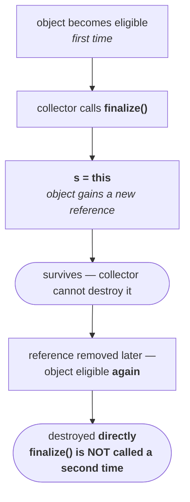

# Case 3 — an exception inside `finalize()`

> [!important] **If the *programmer* calls `finalize()` and an uncaught exception is raised inside it, the JVM terminates the program abnormally**, propagating that exception.
>
> **If the *garbage collector* calls `finalize()` and an uncaught exception is raised inside it, the JVM ignores the exception entirely** and the rest of the program continues normally.


## The program

```java
class Test {
    public static void main(String[] args) {
        Test t = new Test();
        t.finalize();      // line 1 — comment this out to switch cases
        t = null;
        System.gc();
        System.out.println("End of main");
    }

    public void finalize() {
        System.out.println("finalize method called");
        System.out.println(10/0);    // ArithmeticException, no catch block
    }
}
```

`10/0` raises an `ArithmeticException`, and there is no `catch` block anywhere — so it is an **uncaught** exception. The only variable is who called the method.

**With line 1 present — the programmer calls it.** Measured on JDK 25:

```
finalize method called
Exception in thread "main" java.lang.ArithmeticException: / by zero
	at Test.finalize(Test.java:11)
	at Test.main(Test.java:4)

exit code: 1
```

Abnormal termination. `End of main` never printed.

**With line 1 commented out — only the collector calls it.** Measured on JDK 25:

```
End of main
finalize method called

exit code: 0
```

Normal termination. The `ArithmeticException` is still raised inside `finalize()` — the code did not change — but the JVM swallows it and the program finishes cleanly. Exit code 0.

> [!info] **The exit codes are the cleanest evidence.** `1` versus `0`, from the same class file, with the difference being one commented line. That is not the exception being avoided; it is the exception being **ignored**.


**If a `catch` block *is* present, it executes in both cases.** The collector does not skip your exception handling. The ignoring applies only when nothing catches the exception.

So, which of these is true?

| Statement | |
|---|---|
| While executing `finalize()`, the JVM ignores **every** exception | **invalid** |
| While executing `finalize()`, the JVM ignores **only uncaught** exceptions | **valid** |

> [!important] **Say "only uncaught".** If a `catch` block exists, the exception is caught and handled exactly as it would be anywhere else — the JVM has nothing to ignore. The special behaviour only kicks in when the exception would otherwise escape.

> [!warning] **This is one of the reasons `finalize()` was deprecated.** A method whose exceptions are silently discarded is a method whose failures are invisible. Cleanup that quietly did not happen, with no log line and no stack trace, is precisely the sort of bug that is impossible to find. `AutoCloseable` and try-with-resources do not behave this way — an exception from `close()` propagates, and suppressed exceptions are attached to the primary one rather than discarded.

---

# Case 4 — `finalize()` runs only once per object

## The mechanism


The object is eligible. The collector arrives. It cannot destroy it directly — protocol says it must call `finalize()` first. So it does, and the method starts executing.

The two parties want opposite things:

- **the collector** wants `finalize()` to finish as fast as possible, so it can finally destroy the object
- **the object** wants it to take as long as possible — every extra minute is another minute alive on the heap

The method runs on. Nearly done. And then, in the last moment, this line executes inside `finalize()`:

```java
s = this;
```

**The object has just given itself a new reference.** Some variable that outlives the collection — a static field — now points at the object being finalized.

`finalize()` completes. And the collector **cannot destroy it**, because it is no longer unreachable. It has a reference.

The collector is disappointed — it waited all that time, and the object was saved in the last second. *I will see your end next time.* The object is delighted; it survived.



Later the reference does go away, and the object becomes eligible a second time. Does the collector call `finalize()` again?

**No.** It destroys the object directly.

> [!important] **Case 4.** On any object, the garbage collector calls `finalize()` **only once** — even if that object becomes eligible for collection multiple times.

## The proof, with hash codes

```java
class FinalizeDemo {

    static FinalizeDemo s;

    public static void main(String[] args) throws Exception {
    
        FinalizeDemo f = new FinalizeDemo();
        System.out.println(f.hashCode());

        f = null;                        // eligible — first time
        System.gc();
        Thread.sleep(5000);

        System.out.println(s.hashCode()); // still alive?

        s = null;                        // eligible — second time
        System.gc();
        Thread.sleep(5000);

        System.out.println("end of main method");
    }

    public void finalize() {
        System.out.println("finalize method called");
        s = this;                        // resurrection
    }
}
```

The `Thread.sleep(5000)` calls give the collector — a separate thread — time to actually run before main continues. That is also why `main` declares `throws Exception`: `sleep()` throws `InterruptedException` and he is not interested in handling it.

Measured on JDK 25:

```
724542711
finalize method called
724542711
end of main method
```

Read those four lines carefully, because each one is a step in the argument:

| Output | What it proves |
|---|---|
| `724542711` | the object's identity, recorded before anything happens |
| `finalize method called` | it became eligible and the collector called `finalize()` — **first and only time** |
| `724542711` | **the same object is still on the heap** — `s.hashCode()` worked, so `s` is not null and the object was never destroyed |
| `end of main method` | after the second eligibility and second `System.gc()`, **no second `finalize method called` appears** |

> [!important] **Two eligibilities, one `finalize()`.** The object was eligible twice — once when `f = null`, once when `s = null`. `finalize()` ran exactly once. That is the whole of Case 4, demonstrated rather than asserted.

> [!warning] **What you have just seen is object resurrection, and it is a large part of why `finalize()` is being removed.** An object that is already being collected can make itself reachable again, which means the collector has to run a second pass to establish whether finalizable objects are *really* unreachable. Every object with a `finalize()` method therefore survives at least one extra collection cycle and imposes a cost on every collection.
>
> Add the "only once" rule and the picture gets worse: a resurrected object can never be finalized again, so if its cleanup mattered, it silently never happens the second time.
>
> **`Cleaner` deliberately cannot do this** — the cleanup action is not given a reference to the object, so it has nothing to resurrect. That design decision is a direct response to this case.

---

# Cases 3 and 4, summarised

| | Rule |
|---|---|
| **Case 3** | uncaught exception in `finalize()` — **programmer called it** → abnormal termination; **collector called it** → exception ignored, program continues |
| **Case 3, precisely** | the JVM ignores **only uncaught** exceptions; a `catch` block runs in both cases |
| **Case 4** | the collector calls `finalize()` **only once per object**, however many times that object becomes eligible |

