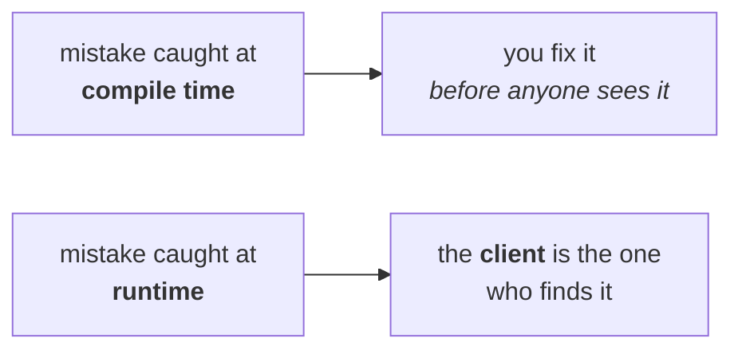

> The main objective of **generics** is to provide **type safety** and to resolve **type casting** problems.


---

# Case 1 — type safety

```java
String[] s = new String[10000];
s[0] = "durga";
s[1] = "ravi";
s[2] = Integer.valueOf(10);     
```

That third line is a genuine mistake —  The compiler stops it dead. Measured on JDK 25:

```
error: incompatible types: Integer cannot be converted to String
```

The mistake is visible **immediately**, so it gets corrected on the spot:

```java
s[2] = "shiva";
```


> **Arrays are type safe** — we can give a **guarantee** for the type of elements present inside the array. A `String` array can contain only `String` objects; a `Student` array only `Student` objects.

## The same job with a collection

```java
ArrayList l = new ArrayList();
l.add("durga");
l.add("ravi");
l.add(Integer.valueOf(10));      // the same mistake
```

**This compiles.** No error, no warning that stops anything. `ArrayList` accepts any object, so the mistake sails through and the list is handed over.

The recipient is unimpressed — last time it came as an array, and an array carries a guarantee that this does not. He accepts it on the promise that it holds only strings, and starts reading:

```java
String n1 = (String) l.get(0);   // durga  — fine
String n2 = (String) l.get(1);   // ravi   — fine
String n3 = (String) l.get(2);   // ✗
```

Measured on JDK 25:

```
got: durga ravi
retrieval 3 -> java.lang.ClassCastException: class java.lang.Integer cannot be cast to class java.lang.String
```

**`ClassCastException`, at runtime, on caller machine.** 

> **Collections are not type safe** — we cannot give any guarantee for the type of elements present inside a collection.

## Why this matters more than it sounds



> [!important] **Failing at compile time versus failing at runtime is the whole argument.** Failing at compile time is a good day: you correct the mistake and hand over working code. Failing at runtime means control has already left your hands — the code is with the client, and it is the client who gets the exception. Wherever a particular type of element is required, a collection is not recommended, precisely because it cannot fail early.

## So why not simply use arrays?

If arrays are type safe and collections are not, generics look unnecessary. There is one problem:

> **Arrays are fixed in size.** To use an array you must know the size in advance.

And often you do not. You want type safety *and* a growable container — and nothing in the language gave you both. **That gap is what generics fill.**

> [!important] **State the purpose precisely: to provide type safety *to the collections*.** Collections are growable but unsafe; arrays are safe but fixed. Generics add the missing half to the growable one.

---

# Case 2 — type casting

The second problem, and it appears at retrieval rather than insertion.

## With an array — no cast needed

```java
String[] s = new String[10000];
s[0] = "durga";
String name1 = s[0];             // no cast
```

`s` is a `String[]`, so `s[0]` **is** a `String`. There is a guarantee, so it assigns straight into a `String` variable.

> In the case of arrays, at the time of retrieval it is **not required** to perform type casting, because there is a guarantee for the type of elements present inside the array.

## With a collection — the cast is compulsory

```java
ArrayList l = new ArrayList();
l.add("durga");
String name1 = l.get(0);         // ✗
```

Measured on JDK 25:

```
error: incompatible types: Object cannot be converted to String
```

The first element **is** a string — but the compiler cannot know that. `l.get(0)` might be an `Integer`, a `Student`, a `Customer`; its declared type is `Object`. So the assignment is refused, and the fix is a cast:

```java
String name1 = (String) l.get(0);   // compiles
```

> In the case of collections, at the time of retrieval **compulsorily** we should perform type casting, because there is no guarantee for the type of elements present inside the collection.

> [!important] **And that is the second headache.** Every single retrieval needs a cast — and each cast is a place a `ClassCastException` can be born, which is Case 1 again wearing different clothes. The two problems are the same problem seen from both ends of the container.

---

# The two problems, and the answer

| | Arrays | Collections |
|---|---|---|
| Type safe | ✅ **yes** — guaranteed element type | ❌ **no** |
| Wrong type is caught | at **compile time** | at **runtime**, as `ClassCastException` |
| Cast needed on retrieval | ❌ **no** | ✅ **compulsory** |
| Growable | ❌ **no** — fixed size | ✅ **yes** |

To overcome both problems of collections, Sun introduced **generics in 1.5**.

> Hence the main objectives of generics are:
> **1.** To provide **type safety** to the collections.
> **2.** To resolve **type casting** problems.

---

# What this part established

| | |
|---|---|
| The one-line purpose of generics | provide **type safety**, resolve **type casting** problems |
| Arrays are | **type safe** — the element type is guaranteed |
| Collections are | **not type safe** — anything can go in |
| A wrong type in a collection surfaces as | **`ClassCastException`**, at **runtime** |
| Retrieval from an array | needs **no cast** |
| Retrieval from a collection | needs a **compulsory cast** |
| Why arrays are not the answer | they are **fixed in size** |
| Generics arrived in | **1.5** |
