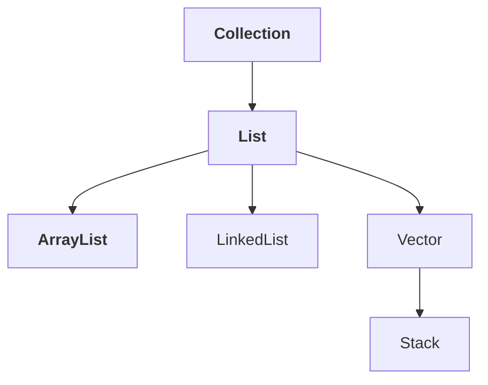
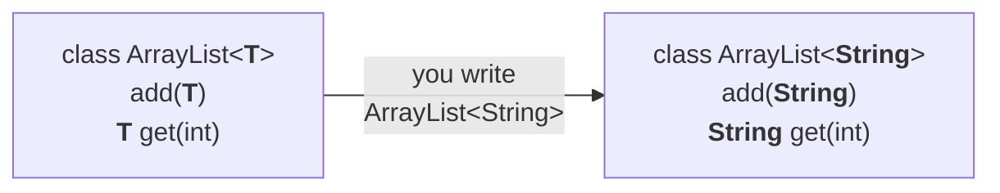

# The generic version, and what it fixes

Here is the syntax that solves both, and it is one line:

```java
ArrayList<String> l = new ArrayList<String>();
```

## Problem one solved — type safety

```java
l.add("durga");                  // ✅
l.add("ravi");                   // ✅
l.add(Integer.valueOf(10));      // ✗
l.add("shiva");                  // ✅ after correcting
```

Measured on JDK 25:

```
error: incompatible types: Integer cannot be converted to String
```

**The mistake is now caught at compile time**, which is exactly what the raw `ArrayList` could not do. Through generics we are getting type safety.

## Problem two solved — no cast

```java
String name1 = l.get(0);         // no cast
```

`l` is an `ArrayList<String>`, so `l.get(0)` **is** a `String` — guaranteed. It assigns directly.

> At the time of retrieval we are **not required** to perform type casting.

## The two side by side

This comparison is asked directly.

| | `ArrayList l = new ArrayList();` | `ArrayList<String> l = new ArrayList<String>();` |
|---|---|---|
| Version | **non-generic** | **generic** |
| What can be added | **any** type of object | **only** `String` |
| Type safe | ❌ **no** | ✅ **yes** |
| Cast at retrieval | ✅ **compulsory** | ❌ **not required** |

---

# Conclusion 1 — polymorphism applies to the base type only

Recall polymorphism from OOP: **using a parent reference to hold a child object.** With collections that works as expected:

```java
ArrayList<String> l = new ArrayList<String>();   // ✅
List<String>      l = new ArrayList<String>();   // ✅ List is the parent
Collection<String> l = new ArrayList<String>();  // ✅ Collection is above that
```



In `ArrayList<String>`, `ArrayList` is the **base type** and `String` is the **parameter type**. Polymorphism worked on the base type — so try it on the parameter type, since `Object` is the parent of `String`:

```java
ArrayList<Object> l = new ArrayList<String>();   // ✗
```

Measured on JDK 25:

```
error: incompatible types: ArrayList<String> cannot be converted to ArrayList<Object>
```

> **Polymorphism is applicable only for the base type, but not for the parameter type.**

Whatever the parameter type is on the right, the **same** type must appear on the left.

> [!question]- **Deep dive — why the language forbids something that looks obviously safe.** Worth opening once, because the rule feels arbitrary until you see what it prevents.
> Suppose `ArrayList<Object> l = new ArrayList<String>();` were allowed. `l` is declared as holding `Object`s, so this must be legal:
> ```java
> l.add(Integer.valueOf(10));
> ```
> But the object underneath is genuinely an `ArrayList<String>`, and somebody else holds a reference to it *as* an `ArrayList<String>`:
> ```java
> String s = stringList.get(0);   // gets an Integer — ClassCastException
> ```
> The whole point of generics was to make that impossible. Allowing the assignment would put the runtime failure straight back, so the compiler refuses one line earlier.
> **Arrays do allow it**, which is why `Object[] a = new String[3]; a[0] = 10;` compiles and then throws `ArrayStoreException` at runtime — the exact hole generics were designed to close.

---

# Conclusion 2 — the parameter type cannot be a primitive

```java
ArrayList<String> l;     // ✅
ArrayList<Integer> l;    // ✅
ArrayList<Student> l;    // ✅ any class
ArrayList<Runnable> l;   // ✅ any interface
ArrayList<int> l;        // ✗
```

Measured on JDK 25:

```
error: unexpected type
  required: reference
  found:    int
```

> For the type parameter we can provide **any class or interface name, but not a primitive**. If we try to provide a primitive we will get a compile-time error.

The reason is the one from collections: **collections can hold only objects, never primitives.**

> [!info] **`required: reference` is the phrase to notice.** The compiler is not saying `int` is unknown — it is saying it needs a *reference* type and got a value type. This exact wording is unchanged since the recording, verified on JDK 25.

---

# Generic classes — what is happening underneath

Both fixes came from a syntax change, so the obvious question is what changed inside `ArrayList` to make it work.

## Until 1.4 — the non-generic declaration

```java
class ArrayList {
    add(Object o);
    Object get(int index);
}
```

Read those two lines and both problems are explained:

- **`add` takes an `Object`.** Everything in Java is an `Object`, so **any** type can be added — and type safety is gone.
- **`get` returns an `Object`.** So at retrieval you must cast down to what you actually want — and the cast is compulsory.

> [!important] **Both headaches trace to that one `Object`.** Not to a flaw in collections generally — to the parameter type of `add` and the return type of `get`.

## From 1.5 — the generic declaration

```java
class ArrayList<T> {
    add(T o);
    T get(int index);
}
```

`T` is the **type parameter**. `Object` has been replaced by it in both places.

> Based on our runtime requirement, **`T` will be replaced with our provided type.**

So when you write:

```java
ArrayList<String> l = new ArrayList<String>();
```

the compiler considers the class to be:

```java
class ArrayList<String> {
    add(String s);
    String get(int index);
}
```



And now both fixes follow mechanically:

- **`add` takes only a `String`** → adding anything else is a compile error → **type safety**.
- **`get` returns a `String`** → no cast needed → **type casting problem resolved**.

> [!important] **This is the answer to "how do generics work internally?"** Not magic and not a runtime check — a **type parameter** substituted at compile time, which changes the signatures of the methods you are calling.

> [!warning] **The compile error he quotes here no longer appears in this form.** In the Java 6/7 era, adding an `Integer` to an `ArrayList<String>` gave `cannot find symbol: method add(java.lang.Integer)` — which fit the story exactly, since after substitution no such method existed. Modern javac reports it as an argument mismatch instead:
> ```
> error: incompatible types: Integer cannot be converted to String
> ```
> The **mechanism is unchanged** and so is the reasoning; only the diagnostic was reworded. Verified on JDK 25.

## The definition

> In generics we are associating a **type parameter** to the class. Such **parameterised classes** are nothing but **generic classes**.

**Generic class = a class with a type parameter.**

> [!info] **The idea is not new to Java.** C++ had it as **templates**, and the word fits: the class is a template, and `T` is filled in with whatever you supply. `ArrayList<String>` and `ArrayList<Student>` are two stampings of one template.

---

# Writing your own generic class

Generics are not only for collections. Any ordinary class can be generic.

A bank has account categories — gold, silver, platinum — so:

```java
class Account<T> {}

Account<Gold>     a1 = new Account<Gold>();
Account<Platinum> a2 = new Account<Platinum>();
```

## A complete program

```java
class Gen<T> {

    T obj;

    Gen(T obj) {
        this.obj = obj;
    }

    public void show() {
        System.out.println("The type of object is :" +   
                       obj.getClass().getName());
    }

    public T getObject() {
        return obj;
    }
}

class GenericsDemo {
    public static void main(String[] args) {
    
        Gen<Integer> g1 = new Gen<Integer>(10);
        g1.show();
        System.out.println(g1.getObject());

        Gen<String> g2 = new Gen<String>("Akshay");
        g2.show();
        System.out.println(g2.getObject());

        Gen<Double> g3 = new Gen<Double>(10.5);
        g3.show();
        System.out.println(g3.getObject());
    }
}
```

Measured on JDK 25:

```
The type of object is :java.lang.Integer
10

The type of object is :java.lang.String
Akshay

The type of object is :java.lang.Double
10.5
```

**Three uses of one class, three different types**, and `getClass().getName()` reports what each actually holds.

Notice where `T` appears — and that it can appear anywhere you need it:

| Position | In the program |
|---|---|
| Instance variable type | `T obj;` |
| Constructor parameter | `Gen(T obj)` |
| Method return type | `public T getObject()` |

Exactly the pattern `ArrayList<T>` uses for `add(T)` and `T get(int)`.

> [!info] **`Gen<Integer> g1 = new Gen<Integer>(10)` relies on autoboxing.** The constructor needs an object and `10` is a primitive, so it becomes an `Integer` automatically — which is also why Conclusion 2 above is not a real restriction in practice.

> [!warning] **You would not write the type twice today.** Since **Java 7** the diamond operator infers the right-hand side:
> ```java
> Gen<Integer> g1 = new Gen<>(10);
> ArrayList<String> l = new ArrayList<>();
> ```
> Everything in this note behaves identically; the repetition is 2016 syntax, kept as taught. Verified on JDK 25.

---

# What this part established

| | |
|---|---|
| Generic syntax | `ArrayList<String> l = new ArrayList<String>();` |
| It gives | **type safety** and **no cast at retrieval** |
| Polymorphism applies to | the **base type** only, **never** the parameter type |
| The parameter type must be | a **class or interface** — never a primitive |
| Non-generic `ArrayList` used | `add(Object)` and `Object get(int)` — the source of both problems |
| Generic `ArrayList` uses | `add(T)` and `T get(int)` |
| `T` is | the **type parameter**, replaced by your provided type |
| A generic class is | a class **with a type parameter** — a parameterised or template class |
| Generics apply to | **any** class, not only collections |
