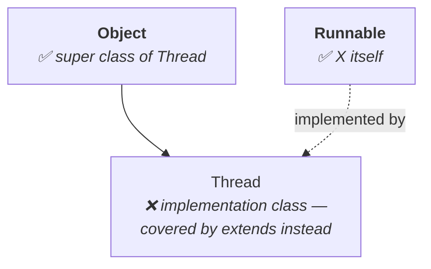
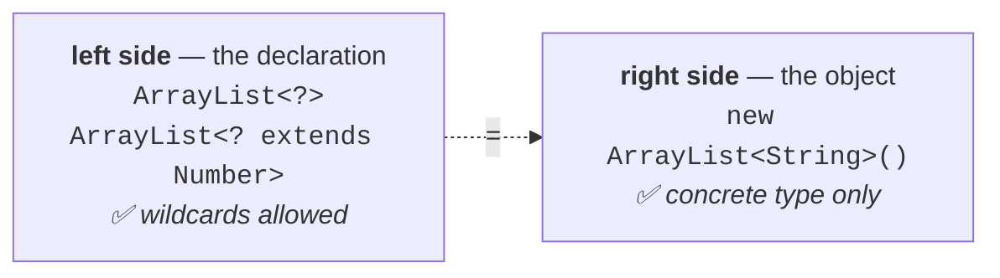

# The problem the wildcard solves

This is the hardest section of the chapter. It starts with a method that works, and then breaks it.

```java
ArrayList<String> l = new ArrayList<String>();
m1(l);
```

To accept that argument the method must be declared:

```java
public static void m1(ArrayList<String> l) { … }
```

Fine. Now a second requirement arrives:

```java
ArrayList<Integer> l1 = new ArrayList<Integer>();
m1(l1);          // ✗ — m1 takes ArrayList<String>
```

Note `02`'s Conclusion 1 already settled this: **polymorphism does not apply to the parameter type**, so `ArrayList<Integer>` is simply not an `ArrayList<String>`. A second method is required:

```java
public static void m1(ArrayList<Integer> l) { … }
```

Then `ArrayList<Double>`. Then `ArrayList<Student>`. Then `ArrayList<Customer>`.

```java
public static void m1(ArrayList<Double> l)   { … }
public static void m1(ArrayList<Student> l)  { … }
public static void m1(ArrayList<Customer> l) { … }
```

> **Every change in the argument type compulsorily requires a new method.** The length of the code increases and readability goes down.

What is wanted is **one** method callable with an `ArrayList` of **any** type. That is the wildcard:

```java
public static void m1(ArrayList<?> l) { … }
```

**`?` means any type.**

---

# The four forms

Everything in this note is these four declarations. For each one, ask **two** questions — and the second is the one people forget.

> [!important] **The two questions, for every form.**
> **1.** How can I **call** this method — what argument types does it accept?
> **2.** Inside the method, what can I **add** to the list?
>
> They have different answers, and the exam tests the second far more often than the first.

## Form 1 — `m1(ArrayList<String> l)`

**Calling it:** only with an `ArrayList<String>`. Nothing else.

**Inside it:**

```java
l.add("A");     // ✅
l.add(null);    // ✅
l.add(10);      // ✗
```

Measured on JDK 25:

```
l.add(10);   error: incompatible types: int cannot be converted to String
```

`l` is a fixed, known type, so `String` values go in — and `null`, because **`null` is a valid value for any reference type**.

## Form 2 — `m1(ArrayList<?> l)`

**Calling it:** with an `ArrayList` of **any type**. This is the whole advantage — one method for `String`, `Integer`, `Double`, `Student`, `Customer`.

**Inside it:**

```java
l.add(null);    // ✅
l.add("A");     // ✗
l.add(10);      // ✗
```

Measured on JDK 25:

```
l.add("A");   error: incompatible types: String cannot be converted to CAP#1
```


> [!info] **`CAP#1` in the error message is worth decoding.** It stands for **capture #1** — the compiler's name for the one specific but unknown type this `?` stands for on this call. It is telling you it knows there is a definite type there and refuses to guess. The Java 6/7 message was less explicit; the meaning is unchanged. Verified on JDK 25.

> [!important] **There is a universal rule: for every advantage, something is lost.** You gained the ability to pass any list. What you lost is the ability to put anything in it.
>
> The reason is exactly the reason it is flexible. **You do not know the type.** A caller may pass an `ArrayList<Integer>`; adding `"A"` would corrupt it. Since the compiler cannot know which, it permits nothing — except `null`, which is valid for every type.

**So what is it good for?** Reading.

```java
public static void m1(ArrayList<?> l) {
    System.out.println(l);
}
```

> These types of methods are best suitable for **read-only operations**.

## Form 3 — `m1(ArrayList<? extends X> l)`

A bounded wildcard. `X` may be a class or an interface:

| If `X` is a… | Callable with an `ArrayList` of |
|---|---|
| **class** | `X` or its **child classes** |
| **interface** | `X` or its **implementation classes** |

**Inside it:** the same restriction as Form 2 — **nothing except `null`**.

```java
l.add(null);    // ✅
l.add(10);      // ✗
```

Measured on JDK 25, with `ArrayList<? extends Number>`:

```
l.add(10);   error: incompatible types: int cannot be converted to CAP#1
```

The narrowing helps the **caller**, not the body. You know it is **some** kind of `Number` — but `Integer`? `Double`? Adding an `Integer` to an `ArrayList<Double>` would be wrong, so nothing is allowed.

> These types of methods are **also** best suitable for read-only operations.

## Form 4 — `m1(ArrayList<? super X> l)`

And here the pattern breaks — in both directions.

**First: `super` is legal here.** Note `03` established that `super` is banned in a class-level bound. That remains true.

> [!important] **`super` is not allowed with `T` at class level. It is allowed with `?` at method level.** Most people carry super is not allowed in generics as a flat rule and get caught by exactly this. Both halves are examinable.

**Calling it:**

| If `X` is a… | Callable with an `ArrayList` of |
|---|---|
| **class** | `X` or its **super classes** |
| **interface** | `X`, or **super classes of `X`'s implementation classes** |

That second row is genuinely awkward, and it is worth walking. Take `X` as `Runnable`. `Runnable` itself qualifies. Its implementation classes — `Thread`, for instance — do **not**, because those are **children** and are already covered by `extends`. What qualifies is what sits **above** `Thread`: `Object`.



**Inside it — this is the one that can accept data:**

```java
l.add("A");     // ✅  with ArrayList<? super String>
l.add(null);    // ✅
l.add(10);      // ✗
```

Measured on JDK 25:

```
l.add("A")   OK
l.add(null)  OK
l.add(10)    error: incompatible types: int cannot be converted to CAP#1
```

> Within the method we can add **`X` type of objects and `null`** to the list.

The reason is the mirror image of Form 3. The list holds `X` **or something more general**, so an `X` is guaranteed to fit whatever it actually is. `ArrayList<Object>` will happily take a `String`.

---

# The four forms, together

| Declaration              | Callable with                             | Can add inside      |
| ------------------------ | ----------------------------------------- | ------------------- |
| `ArrayList<String>`      | `ArrayList<String>` only                  | `String` and `null` |
| `ArrayList<?>`           | `ArrayList` of **any** type               | **`null` only**     |
| `ArrayList<? extends X>` | `X` or its **children** / implementations | **`null` only**     |
| `ArrayList<? super X>`   | `X` or its **super** classes              | **`X` and `null`**  |
|                          |                                           |                     |

> [!important] **One sentence carries the table.** `? extends` widens who may **call** you and forbids writing; `? super` narrows who may call you and permits writing. **Flexible in, or flexible out — never both.**

> [!info] **This has a name you will meet outside the course: PECS — Producer `extends`, Consumer `super`.** If the parameter **produces** values for you to read, use `? extends`. If it **consumes** values you hand it, use `? super`. It is the same table compressed into four words, and it is how the rule is usually stated in modern code review. Nothing above changes; PECS is just the mnemonic.

---

# Which declarations compile


Measured on JDK 25:

| Declaration | Result |
|---|---|
| `ArrayList<String> l = new ArrayList<String>();` | ✅ valid |
| `ArrayList<?> l = new ArrayList<String>();` | ✅ valid |
| `ArrayList<?> l = new ArrayList<Integer>();` | ✅ valid |
| `ArrayList<? extends Number> l = new ArrayList<Integer>();` | ✅ valid |
| `ArrayList<? super String> l = new ArrayList<Object>();` | ✅ valid |
| `ArrayList<? extends Number> l = new ArrayList<String>();` | ❌ |
| `ArrayList<?> l = new ArrayList<? extends Number>();` | ❌ |
| `ArrayList<?> l = new ArrayList<?>();` | ❌ |

**Row 6** fails because `String` is not a child of `Number`:

```
error: incompatible types: ArrayList<String> cannot be converted to ArrayList<? extends Number>
```

**Rows 7 and 8** fail for a different and more important reason:

```
error: unexpected type
  required: class or interface without bounds
  found:    ?
```

> The wildcard can be used **only in the declaration part**. On the **right-hand side** we must specify a class or interface **without any bounds**.



> [!important] **The reasoning is worth more than the rule.** `?` means some type I am not naming — which is a perfectly good description of a **reference**, and useless as a description of an **object**. Creating an object requires knowing what to create. A reference may be vague; the thing it points to cannot be.
>
> `required: class or interface without bounds` is the compiler saying exactly that: on the right it needs a real, unqualified type.

---

# What this part established

| | |
|---|---|
| What `?` means | **any type** |
| Why it exists | one method instead of one per argument type |
| `ArrayList<?>` — calling | `ArrayList` of **any** type |
| `ArrayList<?>` — adding | **`null` only** — the type is unknown |
| `ArrayList<? extends X>` — calling | `X` or its children / implementations |
| `ArrayList<? extends X>` — adding | **`null` only** |
| `ArrayList<? super X>` — calling | `X` or its **super** classes |
| `ArrayList<? super X>` — adding | **`X` and `null`** |
| Why `null` is always allowed | it is a valid value for **any** type |
| `?` and `super` at **method** level | ✅ **allowed** |
| `T` and `super` at **class** level | ❌ not allowed |
| `?` on the **right-hand side** | ❌ never — needs a class or interface **without bounds** |
| Best use of `?` and `? extends` | **read-only** operations |
