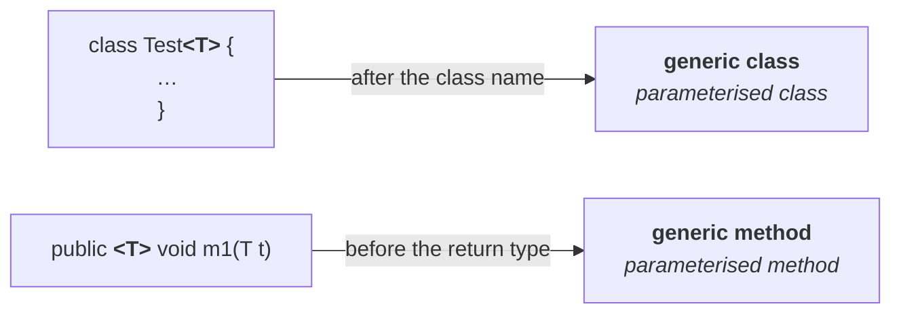
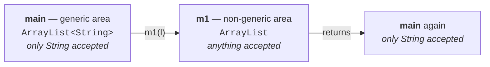

# Where a type parameter can be declared

Every generic class so far declared its type parameter next to the class name:

```java
class Test<T> {
    // T can be used anywhere within this class
}
```

That is **class level**. But sometimes you do not want the whole class parameterised — you want type safety for **one method only**. So the parameter can be declared there instead:

```java
class Test {                         // an ordinary, non-generic class
    public <T> void m1(T t) {
        // T can be used anywhere within this method
    }
}
```

> We can declare the type parameter either **at class level** or **at method level**.

And the position differs:

| Level | Where the parameter goes |
|---|---|
| **Class** | immediately **after the class name** — `class Test<T>` |
| **Method** | immediately **before the return type** — `public <T> void m1(T t)` |



> A class with a type parameter is a **generic class**. A method with a type parameter is a **generic method**.

## Bounds work here too, with identical rules

Everything from note `03` applies unchanged — this is copy-paste, not new material. Measured on JDK 25:

| Declaration | Result |
|---|---|
| `public <T> void m1(T t) {}` | ✅ valid |
| `public <T extends Number> void m1(T t) {}` | ✅ valid |
| `public <T extends Number & Comparable> void m1(T t) {}` | ✅ valid |
| `public <T extends Number & Comparable & Runnable> void m1(T t) {}` | ✅ valid |
| `public <T extends Runnable & Number> void m1(T t) {}` | ❌ `interface expected here` |
| `public <T extends Number & Thread> void m1(T t) {}` | ❌ `interface expected here` |

The same two rules produce the last two failures: **the class comes first**, and **at most one class**.

---

# Communication with non-generic code

What happens when a generic object reaches code that knows nothing about generics?


> If we send a **generic** object to a **non-generic** area, it starts behaving like a **non-generic** object.
> If we send a **non-generic** object to a **generic** area, it starts behaving like a **generic** object.

> That is, **the location in which the object is present decides its behaviour.**

## The same thing as a program

```java
import java.util.*;

class Test {
    public static void main(String[] args) {
        ArrayList<String> l = new ArrayList<String>();
        l.add("durga");
        l.add("ravi");
        // l.add(10);            // ✗ compile-time error here

        m1(l);                    // hand it to non-generic code

        System.out.println(l);
        // l.add(10.5);          // ✗ still a compile-time error here
    }

    public static void m1(ArrayList l) {     // non-generic parameter
        l.add(10);
        l.add(10.5);
        l.add(true);
    }
}
```

Two areas, and the same list behaves differently in each:



Inside `m1` the parameter is a **raw** `ArrayList`, so `10`, `10.5` and `true` all go in without complaint. Back in `main`, `l` is an `ArrayList<String>` again and `l.add(10.5)` is a compile error once more — **even though those values are now sitting in the list.**

> [!info] **Why this is allowed at all:** to provide **compatibility with old versions**. Not all code in a project is written by one person or at one time — some of it predates 1.5 and knows nothing about generics. If a generic object could not be passed to it, no existing codebase could adopt generics incrementally.

---

# The conclusion the whole chapter has been building to

> **Generics are applicable only at compile time. At runtime there is no such concept.**

The argument is short. Generics exist to give type safety and to remove casts — and **both of those are compiler activities**. If you add a wrong type, the *compiler* objects. If you skip a cast, the *compiler* objects. Nothing in either job needs to survive into execution.

So, as the **last step of compilation, the generic syntax is removed**, and the JVM never sees it. This is **erasure**.

## Proof 1 — the runtime does not check

```java
import java.util.*;

class Test {
    public static void main(String[] args) {
        ArrayList l = new ArrayList<String>(); // raw reference, generic object
        l.add(10);
        l.add(10.5);
        l.add(true);
        System.out.println(l);
    }
}
```

The object was created as `new ArrayList<String>()`, so if generics existed at runtime, adding an `Integer` would have to fail.

Measured on JDK 25 — **compiles with no error, runs with no exception**:

```
[10, 10.5, true]
```

**The compiler checks the reference type; the JVM checks the runtime object.** The reference here is a raw `ArrayList`, so the compiler permits everything — and by the time the JVM runs, `<String>` is gone.

> [!important] **This is the cleanest single proof.** If generics existed at runtime, this program would have to throw. It does not — it prints all three values.

## Proof 2 — the declarations are indistinguishable

Given that erasure has happened, all of these are **equal**:

```java
ArrayList l = new ArrayList<String>();
ArrayList l = new ArrayList<Integer>();
ArrayList l = new ArrayList<Double>();
ArrayList l = new ArrayList();
```

At runtime there is no `String`, `Integer` or `Double` in any of them — every one is a plain `ArrayList`.

And by the same reasoning, these two are also equal:

```java
ArrayList<String> l1 = new ArrayList();
ArrayList<String> l2 = new ArrayList<String>();
```

Both accept only `String`, because the **left-hand side** is what the compiler checks:

```java
l1.add("A");    // ✅
l1.add(10);     // ✗
```

## Proof 3 — the name clash

This is the sharpest of the three, because it shows erasure causing an error rather than permitting one.

Start with ordinary Java:

```java
class Test {
    public int m1(int i) { return 10; }
    public void m1(int i) {}
}
```

Invalid — `error: method m1(int) is already defined`. A method's **signature** is its name and parameter types; the return type is not part of it. Two methods with the same signature cannot coexist, because a call to `t.m1(10)` would be ambiguous.

Now the generic version:

```java
import java.util.*;

class Test {
    public void methodOne(ArrayList<String> l) {}
    public void methodOne(ArrayList<Integer> l) {}
}
```

These look different — `ArrayList<String>` against `ArrayList<Integer>`. Measured on JDK 25:

```
error: name clash: methodOne(ArrayList<Integer>) and methodOne(ArrayList<String>)
       have the same erasure
```

### Why, and the three steps of compilation

> **At compile time:**
> **1.** Compile the code normally, **considering** the generic syntax.
> **2.** **Remove** the generic syntax.
> **3.** Compile the **resultant** code once again, and check for mismatches.

After step 2 both methods have become:

```java
public void methodOne(ArrayList l) {}
public void methodOne(ArrayList l) {}
```

Two methods, one signature — rejected at step 3.

> [!important] **The word `erasure` in the message is the definition.** An **erasure** is a method signature *after the generic syntax has been removed*. Both methods have the same erasure, so both cannot exist.
>
> And note what this proves: if generics survived to runtime, these would be genuinely different methods and the code would be fine. **The error exists only because the syntax is erased** — which is the point being demonstrated.

---

# What this part established

| | |
|---|---|
| Type parameter can be declared at | **class level** or **method level** |
| Class level position | after the **class name** |
| Method level position | before the **return type** |
| A method with a type parameter | a **generic method** |
| Bounds at method level | identical rules — class first, one class only |
| Generic object in non-generic code | behaves like a **non-generic** object |
| Why that is permitted | **compatibility with old versions** |
| Generics apply | **only at compile time** |
| At runtime | there is **no such concept** — the syntax is **erased** |
| The compiler checks | the **reference type** |
| The JVM checks | the **runtime object** |
| An **erasure** is | a signature after the generic syntax is removed |
| Two methods with the same erasure | **cannot** coexist — `name clash` |

> [!info] **His closing note on the chapter:** of the whole Core Java / SCJP syllabus, two topics are worth studying twice — **generics** and **inner classes**. The rest is ordinary; these two bring new syntax, new words and new terminology at once.
