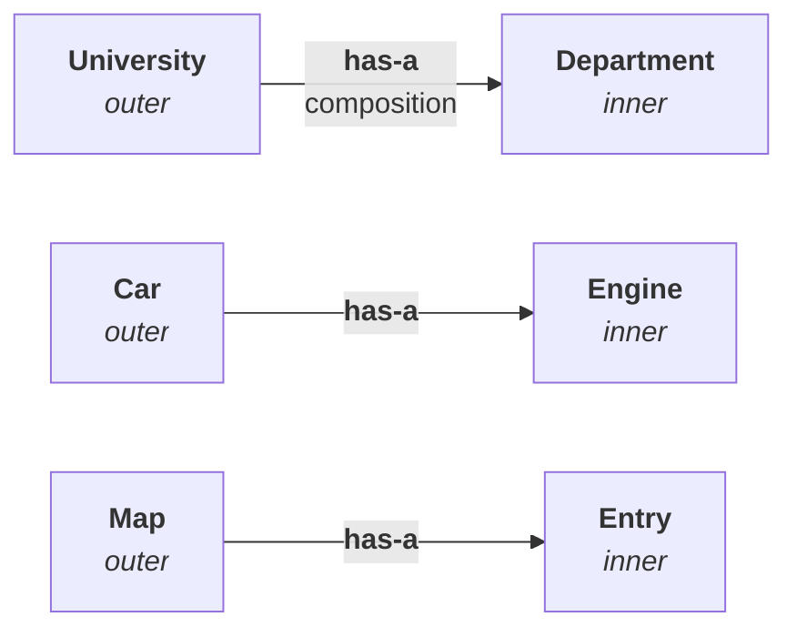
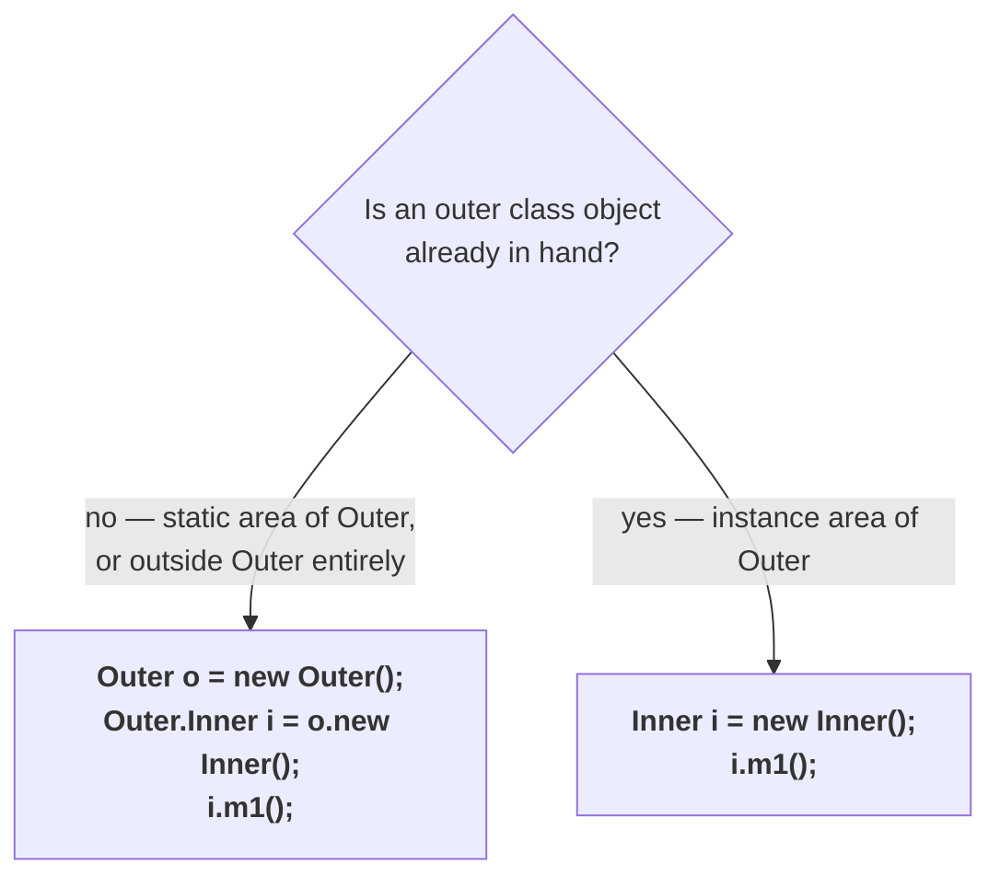

# What an inner class is

He opens with a warning. In the whole Core Java / OCJP syllabus there are **only two difficult topics**: **generics** and **inner classes**. Both bring new syntax at once, so both need clear clarity rather than familiarity. Inner classes is the relatively simpler of the two — **not that much dangerous than generics**.

The definition is short:

> Sometimes we can declare a class **inside another class**. Such types of classes are called **inner classes**.

```java
class Test {
    class A {
    }
}
```

`A` is declared inside `Test`, so `A` is an inner class.

---

# The history — why inner classes exist at all

Java **1.0** arrived in **1995**, and Sun created an enormous hype around it: a top-level, very simple, platform independent language — once Java 1.0 comes, all the remaining languages are going to be packed.

Worldwide programming experts waited for the day, and when it came they analysed the features and were very happy. Platform independent. Object oriented. Robust. Secured. Simple. A long list.

But they identified **two areas** where Java was not up to the mark:

**Problem 1 — performance.** In 1995 C and C++ were the popular languages, and against them Java's performance was very, very low.

**Problem 2 — AWT.** The GUI concepts had an **n** number of bugs in them.

The experts went back to Sun: why don't you fill this gap? And Sun responded fast — **the 1.1 version came just three months later**, targeting exactly those two problems:

| Problem | What 1.1 introduced |
|---|---|
| Performance | **JIT compilers** — just-in-time compilation |
| AWT/GUI bugs | the **event handling** concept — listeners |

> [!info] **His verdict on how well the first fix worked:** performance improved by 0.00001 percent — relatively, no improvement at all. And he adds that this is still the biggest problem with Java as of 1.8. Take the sarcasm rather than the number; JIT is genuinely why Java performs as it does today, but his point is that it did not close the gap with C in 1997.

**And inner classes came in as part of the second fix.** As part of event handling, Sun used a class inside a class for the first time.

> **The inner classes concept was introduced in the 1.1 version, to fix GUI bugs, as a part of event handling. But because of the powerful features and benefits of inner classes, programmers slowly started using them in regular coding also.**

So in the olden days inner classes were specific to GUI. These days it is an ordinary programming concept.

---

# When to use an inner class

This is the design question — the interview version is can you explain a scenario where inner classes are best suited? — and he gives one sentence to memorise before any example:

> **Without existing one type of object, if there is no chance of existing another type of object, then we should go for inner classes.**

He is explicit that the sentence means nothing yet. Three examples follow, and the clarity comes after them.

## Example 1 — university and department

A university contains several departments: computer science, electronics, electrical. Now suppose the government decides the university is involved in some illegal activity and closes it. **If the university closes, do all the departments close?** Yes.

So **without existing a `University` object there is no chance of existing a `Department` object.** A department is always part of a university. If that is true, why would you define `Department` as a separate top-level class?

```java
class University {
    class Department {
    }
}
```

`University` is the **outer class**, `Department` is the **inner class**.

## Example 2 — car and engine

A car has several individual components, and the major one is the engine. **Without existing a `Car` object there is no chance of existing an `Engine` object** — an engine is always part of a car.

```java
class Car {
    class Engine {
    }
}
```

## Example 3 — map and entry

The first two are his own inventions. This one is **not** — it is already in the Java API.

A `Map` is a group of **key–value pairs**:

| Key | Value |
|---|---|
| 101 | durga |
| 102 | ravi |
| 103 | shiva |

And **each key–value pair is called an entry.** Without existing a `Map` object, there is no chance of existing an `Entry` object — an entry is always part of a map. So:

```java
interface Map {
    interface Entry {
    }
}
```

`Map` is the **outer interface**, `Entry` is the **inner interface**.

> [!example]- **Proof — `Entry` really is declared inside `Map`, and the class file name says so.** Open this for the one-line confirmation that example 3 is not invented.
> Measured on JDK 25:
> ```
> $ javap java.util.Map
> public interface java.util.Map<K, V> {
>   public abstract java.util.Set<java.util.Map$Entry<K, V>> entrySet();
>   …
> }
>
> $ javap java.util.Map.Entry
> public interface java.util.Map$Entry<K, V> {
>   public abstract K getKey();
>   …
> }
> ```
> Note the name: **`java.util.Map$Entry`**. That `$` is the same one discussed further down this note — it is how a nested type's class file is named, and it is visible right here in the JDK's own API. And in ordinary use:
> ```java
> for (Map.Entry<Integer, String> e : m.entrySet())
>     System.out.println(e.getKey() + " = " + e.getValue());
> ```
> ```
> 101 = durga
> 102 = ravi
> 103 = shiva
> ```

## The two conclusions the examples were for

Now the sentence means something. Restate it in terms of the classes:

> **Note 1.** Without existing an **outer class object**, there is no chance of existing an **inner class object**.

Every example fits: no `University` → no `Department`; no `Car` → no `Engine`; no `Map` → no `Entry`.

And the second conclusion is the one people get wrong:

> **Note 2.** The relation between outer class and inner class is **not an is-a relationship**. It is a **has-a relationship** — that is, **composition or aggregation**.

A university **has a** department. A car **has an** engine. A map **has an** entry. The outer class is not a parent and the inner class is not a child.



> [!important] **This is the sharpest thing in the note.** Inheritance is for **is-a** plus code reusability — a parent class with common methods and a child with specific ones. Inner classes are for **has-a**. If you catch yourself calling the outer class a parent, you have the wrong concept.

---

# The four types of inner class

> Based on the **position of declaration** and **behaviour**, all inner classes are divided into **four types**.

| | Type | What makes it that type |
|---|---|---|
| **1** | **normal** or **regular** inner class | a named class, directly inside a class, no `static` |
| **2** | **method local** inner class | declared **inside a method** |
| **3** | **anonymous** inner class | declared **without a name** |
| **4** | **static nested** class | declared with the **`static`** modifier |

> [!important] **Read the fourth row again — it says nested, not inner.** Three of the four are called inner classes and the fourth is called a **static nested class**. That is not a naming accident and it is not just for the sake of a name; there is a real internal reason, which comes when static nested classes are covered. Notice it now so the word does not surprise you later.

---

# Normal or regular inner classes

```java
class Outer {
    class Inner {
    }
}
```

Is this a static nested class? No — there is no `static` modifier. Is it anonymous? No — it has a name. Is it method local? No — it is not inside a method. **Whatever remains is the normal or regular inner class.**

But that is not the definition to give in an interview, because the obvious follow-up is then what is a method local inner class? and you would have to answer **the one that is not normal, not anonymous and not static** — the same thing going in circles. So state it positively:

> If we are declaring **any named class**, **directly inside a class**, **without a static modifier**, such a type of inner class is called a **normal or regular inner class**.

Three requirements, each ruling out one of the other three types:

| Requirement | Rules out |
|---|---|
| **named** class | anonymous |
| **directly** inside a class | method local |
| **without** `static` | static nested |

---

# What the compiler produces

Save that `Outer`/`Inner` pair as `Outer.java` and compile it. **How many `.class` files?**

**Two** — because whether it is an outer class or an inner class, **every class gets its own separate `.class` file.** Measured on JDK 25:

```
Outer.class
Outer$Inner.class
```

The outer one is straightforward. The inner one is **not** `Inner.class`, because `Inner` is not a direct, standalone class — it lives inside `Outer`. So the outer class name comes first, then a **dollar symbol**, then the inner class name.

> [!important] **This is a genuinely useful fact outside the exam.** A **jar** file — Java archive — contains a group of `.class` files. Extract one and look at the names. **Anywhere you see a dollar symbol in a class file name, that is an inner class.** What is before the `$` is the outer class name and what is after it is the inner class name. `java.util.Map$Entry` in the deep dive above is exactly this.

## Running them

```
$ java Outer
```

Does `Outer` contain a `main` method? No. So running it fails. And the same for the inner class, since it has no `main` either:

```
$ java Outer$Inner
```

Measured on JDK 25, both commands produce:

```
Error: Main method not found in class Outer, please define the main method as:
   public static void main(String[] args)
or a JavaFX application class must extend javafx.application.Application
```

## Now add a main method to the outer class

```java
class Outer {
    class Inner {
    }

    public static void main(String[] args) {
        System.out.println("outer class main method");
    }
}
```

Still two class files. Measured on JDK 25:

```
$ java Outer
outer class main method

$ java Outer$Inner
Error: Main method not found in class Outer$Inner, …
```

The outer class runs; the inner class still has no `main`, so it still cannot be run.

---

# Why you could not put main inside the inner class

This is the section that carries the reasoning, and the reasoning matters more than the rule.

Try it:

```java
class Outer {
    class Inner {
        public static void main(String[] args) {
            System.out.println("inner class main method");
        }
    }
}
```

**This compiles, and it runs.** Measured on JDK 25:

```
$ javac O2.java
$ java 'O2$Inner'
inner class main method
```

Two class files, and `java Outer$Inner` prints the message — so **an inner class may declare static members, may have a `main`, and may be run directly from the command prompt.**

> [!important] **Older material says all three of those are impossible, and you will meet it.** Through **Java 15** an inner class could not declare static members at all, and the compiler said:
> ```
> error: Illegal static declaration in inner class O2.Inner
>   modifier 'static' is only allowed in constant variable declarations
> ```
> **Java 16 lifted the restriction** (JEP 395, the records JEP, carried it). The cutover is exact — `javac --release 15` still rejects the program and `--release 16` accepts it.
>
> The reasoning behind the old rule is still the reasoning of this whole chapter, and it is why the restriction existed: without an outer object there is no chance of an inner object, so **inner class code is not directly touchable** and everything about an inner class is instance-level. `static` is precisely the opposite — directly touchable, no object required.

> [!info] **Even under the old rule, no static members at all was too strong.** `static final` **compile-time constants** were always permitted — that is what the old error meant by **constant variable declarations**:
>
> | Declaration inside the inner class | Through Java 15 |
> |---|---|
> | `static int x = 10;` | ❌ illegal |
> | `static void m() {}` | ❌ illegal |
> | `static final int x = 10;` | ✅ **allowed** |
> | `static final String s = "a";` | ✅ **allowed** |
> | `static final Object o = null;` | ❌ illegal — not a constant expression |
>
> All five are legal now.

> [!important] **What did not change is the idea the chapter is built on.** An inner class instance still holds a hidden reference to its enclosing instance, and you still cannot create one without an outer object. Java 16 changed only whether **static** declarations are permitted alongside that — not the has-a relationship.

---

# Accessing inner class code

Everything below is syntax, and he flags it as directly examinable — from line 12, which of the following is the proper code to call `m1()`? There are three cases and only two distinct answers.

The class under discussion:

```java
class Outer {
    class Inner {
        public void m1() {
            System.out.println("inner class method");
        }
    }
}
```

`m1()` is an **instance** method of `Inner`, so calling it requires an `Inner` object — and an `Inner` object requires an `Outer` object first.

## Case 1 — from the static area of the outer class

That is, from `main` inside `Outer`. Two steps:

```java
public static void main(String[] args) {
    Outer o = new Outer();                 // step 1 — the outer object
    Outer.Inner i = o.new Inner();         // step 2 — the inner object, via that outer object
    i.m1();
}
```

Two pieces of that line are new syntax and both get tested:

- The reference type is **`Outer.Inner`**, with a **dot** — even though the **class file** is `Outer$Inner` with a dollar. In code you write the dot.
- The creation is **`o.new Inner()`** — `new` prefixed by an existing outer object reference. This is the syntactical dancing he refers to, and it exists nowhere else in the language.

### Collapsing it into one line

Those two lines can be combined, because `o` is just `new Outer()`:

```java
Outer.Inner i = new Outer().new Inner();
```

And all three lines collapse the same way:

```java
new Outer().new Inner().m1();
```

> **Learn the shortcut form as well as the long one.** The exam asks for it in both shapes.

## Case 2 — from the instance area of the outer class

Now `m1()` is called from `m2()`, an instance method of `Outer`:

```java
class Outer {
    class Inner {
        public void m1() { System.out.println("inner class method"); }
    }

    public void m2() {
        Inner i = new Inner();      // no o.new — just new
        i.m1();
    }

    public static void main(String[] args) {
        Outer o = new Outer();
        o.m2();
    }
}
```

The obvious objection: how can you create an `Inner` object without creating an `Outer` object first? The answer is that you already did.

> To enter `m2()` at all, an outer object must have been created — you cannot call an instance method without one. **The outer object already exists**, so from inside `m2()` you can create the inner object directly and call `m1()`.

> [!important] **Case 2 is the easy one, and that is the point.** From the instance area it is `Inner i = new Inner();` — ordinary, familiar code with no new syntax at all. All the awkward syntax in case 1 exists only because there was no outer object to hand.

## Case 3 — from outside the outer class

```java
class Outer {
    class Inner {
        public void m1() { System.out.println("inner class method"); }
    }
}

class Test {
    public static void main(String[] args) {
        Outer o = new Outer();
        Outer.Inner i = o.new Inner();
        i.m1();
    }
}
```

**This is exactly the same code as case 1.** No outer object is available here either, so the same two steps are required.

All four call sites measured on JDK 25 — each prints `inner class method`.

## The summary



| Accessing inner class code from | The code |
|---|---|
| the **static area** of the outer class, **or** from **outside** the outer class | `Outer o = new Outer();`<br/>`Outer.Inner i = o.new Inner();`<br/>`i.m1();` |
| the **instance area** of the outer class | `Inner i = new Inner();`<br/>`i.m1();` |

---

# What this part established

| | |
|---|---|
| An inner class is | a class declared **inside another class** |
| It arrived in | the **1.1** version, three months after 1.0 |
| Why | to fix **GUI bugs**, as part of **event handling** |
| The two hard topics in the syllabus | **generics** and **inner classes** |
| When to use one | without existing one type of object, **no chance** of existing another |
| The three examples | University–Department, Car–Engine, **Map–Entry** |
| Outer/inner relationship | **has-a** — composition or aggregation, **never is-a** |
| The four types | normal/regular · method local · anonymous · **static nested** |
| A normal inner class is | a **named** class, **directly** inside a class, **without** `static` |
| Class files generated | `Outer.class` and **`Outer$Inner.class`** |
| A `$` in a class file name means | it is an **inner class** |
| Static members inside an inner class | ✅ **legal** — forbidden through Java 15 |
| From the static area / outside | `Outer.Inner i = o.new Inner();` |
| From the instance area | `Inner i = new Inner();` |
