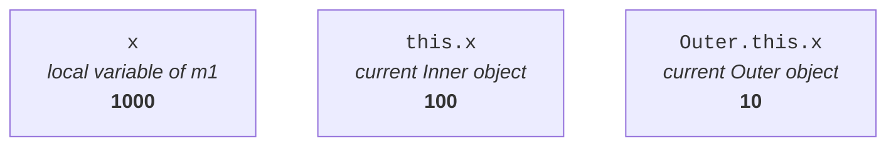
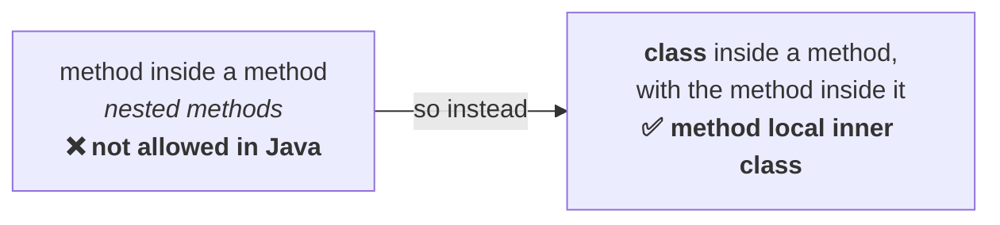

# Accessing the outer class's members

Note `01` covered how to reach *into* an inner class. This is the other direction — from inside the
inner class, what of the outer class can you see?

```java
class Outer {
    int x = 10;              // instance variable of Outer
    static int y = 20;       // static variable of Outer

    class Inner {
        public void m1() {
            System.out.println(x);
            System.out.println(y);
        }
    }

    public static void main(String[] args) {
        new Outer().new Inner().m1();
    }
}
```

Is this valid? **Most people say no**, because of `System.out.println(y)` — note `01` established
that an inner class cannot have static members, so surely a static variable is out of bounds.

That is the trap, and the distinction is one word:

> **Declaring is different from accessing.** Inside an inner class we cannot **declare** static
> members. It does not mean we cannot **access** them.

Measured on JDK 25:

```
10
20
```

> From a normal or regular inner class we can access **both static and non-static members** of the
> outer class **directly**.

Instance variable, static variable, private variable, public variable — it makes no difference.

---

# Three variables named x

Now the twist. Take the same name at three different levels:

```java
class Outer {
    int x = 10;                     // instance variable of OUTER

    class Inner {
        int x = 100;                // instance variable of INNER

        public void m1() {
            int x = 1000;           // LOCAL variable of m1
            System.out.println(x);
            System.out.println(this.x);
            System.out.println(Outer.this.x);
        }
    }

    public static void main(String[] args) {
        new Outer().new Inner().m1();
    }
}
```

Three variables, all called `x`, in three different contexts. Measured on JDK 25:

```
1000
100
10
```

Each line reaches a different one:

| Written as | Reaches | Value |
|---|---|---|
| `x` | the **local** variable of `m1` — the nearest one | `1000` |
| `this.x` | the **current inner class object**'s variable | `100` |
| `Outer.this.x` | the **current outer class object**'s variable | `10` |

> **Within an inner class, `this` always refers to the current inner class object.** If we want to
> refer to the current outer class object, we have to use **outer class name `.this`**.



## Why not `super.x`?

The obvious guess for reaching the outer class is `super.x`. **The compiler rejects it**, and note
`01` already said why:

> The outer class is **not** the parent class and the inner class is **not** the child class.

Measured on JDK 25:

```
error: cannot find symbol
            System.out.println(super.x);
                                    ^
```

`Inner`'s superclass is `Object`, which has no `x`. The relationship to `Outer` is **has-a**, and
`super` only ever means is-a.

> [!important] **`Outer.this` is the syntax that exists because there is no inheritance here.** If
> the outer class really were a parent, `super` would have done the job and this syntax would not
> need to exist. Its existence is the proof of the has-a rule.

> [!info] **This arrangement is only needed when there is a naming conflict.** With three `x`s you
> need a way to say which one. If the names were distinct, plain `x` would reach whichever one is in
> scope and none of this would be required.

---

# Which modifiers apply

For an **outer class** — recapped from the modifiers topic:

`public`, *default*, `final`, `abstract`, `strictfp` — **five**.

For an **inner class**, those five **plus** `private`, `protected` and `static` — **eight**.

Measured on JDK 25, all sixteen cases:

| Modifier | Outer class | Inner class |
|---|---|---|
| `public` | ✅ | ✅ |
| *default* | ✅ | ✅ |
| `final` | ✅ | ✅ |
| `abstract` | ✅ | ✅ |
| `strictfp` | ✅ | ✅ |
| `private` | ❌ | ✅ |
| `protected` | ❌ | ✅ |
| `static` | ❌ | ✅ |
| **Total** | **5** | **8** |

The three that only an inner class gets are exactly the three that need an enclosing type to be
meaningful — `private` and `protected` are about visibility *within* something, and `static` is the
fourth category of inner class.

> [!warning] **`strictfp` still counts but no longer does anything.** Since **Java 17** all
> floating-point expressions are evaluated strictly, so the keyword is a no-op and compiling with it
> produces a warning. It remains an "applicable modifier" for exam purposes — the counts of 5 and 8
> are unchanged. Verified on JDK 25.

---

# Nesting of inner classes

Can an inner class contain another inner class? Yes.

> Inside an inner class we can declare another inner class — that is **nesting of inner classes**, and
> it is possible.

```java
class A {
    class B {
        class C {
            public void m1() {
                System.out.println("innermost class method");
            }
        }
    }
}
```

Three levels. To call `m1()` you need a `C` object; to get a `C` you need a `B`; to get a `B` you need
an `A`. So the chain from note `01` just repeats:

```java
class Test {
    public static void main(String[] args) {
        A a = new A();
        A.B b = a.new B();
        A.B.C c = b.new C();
        c.m1();
    }
}
```

Measured on JDK 25:

```
innermost class method
```

And the class files show the nesting depth directly:

```
A.class
A$B.class
A$B$C.class
```

> **Do not assume only one level.** Any number of levels of inner classes is acceptable.

---

# Method local inner classes

The second of the four categories.

> Sometimes we can declare a class **inside a method**. Such types of inner classes are called
> **method local inner classes**.

## Why they exist — the nested method problem

The motivation is worth following, because it explains a restriction in the language.

Suppose you have a method with 50,000 lines in it, and some functionality is needed **repeatedly**
inside it. The best reusable component in Java is a method, so the natural move is to define that
functionality as a method and call it wherever needed:

```java
class Test {
    public void m1() {
        // … 50,000 lines …

        public void sum(int x, int y) {          // ✗ a method inside a method
            System.out.println("the sum is " + (x + y));
        }

        sum(10, 20);
        sum(100, 200);
        sum(1000, 2000);
    }
}
```

**This does not compile.**

> **Declaring a method inside another method is not possible in Java. The nested method concept is
> not allowed.**

So how do you get the functionality? **Two options.**

**Option 1 — declare `sum` at class level.** It works. But if this functionality is required *only*
by `m1` and nowhere outside it, you would not want it visible at class level.

**Option 2 — the way round the restriction.** You cannot put a method inside a method. But you *can*
put a **class** inside a method, and a class can certainly contain a method:

```java
class Test {
    public void m1() {
        class Inner {
            public void sum(int x, int y) {
                System.out.println("the sum is " + (x + y));
            }
        }

        Inner i = new Inner();
        i.sum(10, 20);
        i.sum(100, 200);
        i.sum(1000, 2000);
    }

    public static void main(String[] args) {
        Test t = new Test();
        t.m1();
    }
}
```

Measured on JDK 25:

```
the sum is 30
the sum is 300
the sum is 3000
```



> **The main purpose of a method local inner class is to define method-specific, repeatedly required
> functionality.** They are best suited to **meeting nested method requirements** — wherever nested
> methods are required, we can run the show with method local inner classes.

## Their scope, and why they are rare

Where is that `Inner` class accessible? Only inside `m1`, exactly like a local variable declared
there.

> We can access method local inner classes **only within the method where we declared them**. Outside
> that method we cannot access them. **Because of this lesser scope, method local inner classes are
> the most rarely used type of inner class.**

And the companion fact, which he plants here for later:

> **The most commonly used type of inner class is the anonymous inner class.**

Do not answer "normal or regular" just because that is the one covered so far.

---

# Instance method versus static method

A method local inner class can be declared inside **either** an instance method or a static method.
But there is a difference between the two, and it is the ordinary static rule showing through.

```java
class Test {
    int x = 10;                 // instance variable
    static int y = 20;          // static variable

    public void m1() {          // instance method
        class Inner {
            public void m2() {
                System.out.println(x);       // line 1
                System.out.println(y);
            }
        }
        new Inner().m2();
    }

    public static void main(String[] args) {
        new Test().m1();
    }
}
```

Measured on JDK 25:

```
10
20
```

Now make `m1` **static**. The inner class is now sitting in a static area, and a static area cannot
reach an instance variable. Measured on JDK 25:

```
error: non-static variable x cannot be referenced from a static context
```

| Inner class declared inside | Can access, of the outer class |
|---|---|
| an **instance** method | **both** static and non-static members directly |
| a **static** method | **only static** members directly |

---

# The most dangerous conclusion — local variables

He flags this as the most important point in the section.

```java
class Test {
    public void m1() {
        int x = 10;                    // local variable of m1

        class Inner {
            public void m2() {
                System.out.println(x);  // accessing m1's local variable
            }
        }

        Inner i = new Inner();
        i.m2();
    }

    public static void main(String[] args) {
        new Test().m1();
    }
}
```

> As taught: **from a method local inner class we cannot access local variables of the method in
> which we declared that inner class.** The compiler is, in his words, a very decent person about it:
>
> **`local variable x is accessed from within inner class; needs to be declared final`**
>
> **If the local variable is declared `final`, then we can access it** — no problem at all.

## Why — the memory argument

This is the reasoning he says to dig into, and it is the best deep-dive material in the chapter.

> [!question]- **Deep dive — why a non-final local variable cannot be reached, argued from stack and
> heap.** Open this for the mechanism; the rule above is what gets asked, but this is what makes it
> stick.
> Three facts have to be in place first:
>
> **1.** **Local variables live on the stack. Objects live on the heap.**
> **2.** A local variable is **created when the method starts executing and destroyed when the method
> completes.**
> **3.** **Every `final` variable is replaced by its value at compile time.**
>
> Now trace the program. `t.m1()` is called. Control enters `m1`, and `x = 10` is created **on the
> stack**. Then `new Inner()` runs, and that object is created **on the heap**. Calling `i.m2()`
> prints `x` — fine, `m1` is still executing, so `x` is still on the stack.
>
> Then `m1` completes. **The local variable `x` is destroyed.** But the `Inner` object on the heap
> **may still exist** — somebody may still hold a reference to it.
>
> And here is the problem. `m2()` is an inner class method, so it can be called directly on that
> surviving object without going through `m1` at all. Control arrives inside `m2`, reaches
> `System.out.println(x)` — and **where is `x` supposed to come from?** `m1` is not running. The stack
> frame that held `x` is gone.
>
> That is the whole reason for the restriction.
>
> **Now the `final` case.** If `x` is `final`, fact 3 applies: at **compile time** `x` has already
> been replaced by the literal `10`. So after `m1` completes and the stack frame is gone, `m2` calling
> `System.out.println(x)` is really `System.out.println(10)` — **there is no dependency on the local
> variable at all**, because the value was baked in before the program ever ran.

> [!warning] **Since Java 8 the variable does not have to say `final` — it only has to *behave* like
> it.** This is "effectively final", and it is why the rule looks broken on a modern JDK. Measured on
> JDK 25, the program above — with a plain `int x = 10;`, no `final` — **compiles and runs**:
> ```
> 10
> ```
> The requirement has not been dropped, only relaxed: the variable must never be reassigned. Add one
> line and it fails again:
> ```java
> int x = 10;
> x = 11;              // now it is no longer effectively final
> ```
> ```
> error: local variables referenced from an inner class must be final or effectively final
> ```
> **The mechanism in the deep dive is unchanged** — the value is still captured rather than shared,
> which is exactly why reassignment is what breaks it. Only the ceremony of writing `final` went
> away. Note the message itself names both cases, so it is easy to recognise. Verified on JDK 25;
> `javac --release 8` gives the identical message.

---

# The three exam questions

He builds one program and varies it three times. This is the exact shape the certification question
takes.

```java
class Test {
    int i = 10;                  // instance variable
    static int j = 20;           // static variable

    public void m1() {
        int k = 30;              // local variable
        final int m = 40;        // final local variable

        class Inner {
            public void m2() {
                // line 1 — which of i, j, k, m can be accessed here?
            }
        }
    }
}
```

## Question 1 — as written above

| Variable | Accessible? | Why |
|---|---|---|
| `i` | ✅ | `m1` is an instance method, so instance members are reachable |
| `j` | ✅ | static members are always reachable |
| `k` | ❌ | a local variable that is **not final** |
| `m` | ✅ | a local variable that **is** final |

## Question 2 — `m1` declared `static`

| Variable | Accessible? | Why |
|---|---|---|
| `i` | ❌ | **instance** variable, and we are now in a static context |
| `j` | ✅ | static |
| `k` | ❌ | not final |
| `m` | ✅ | final |

## Question 3 — `m2` declared `static`

This is the one he says most people get wrong by answering the variables at all.

> **Forget about accessing — the code will not compile**, because inside an inner class we cannot
> declare static members.

> [!warning] **All three answers have moved on JDK 25, and question 3 changed for a subtle reason.**
> Measured on JDK 25:
>
> | | As taught | JDK 25 |
> |---|---|---|
> | **Q1** | `i` ✅ `j` ✅ `k` ❌ `m` ✅ | **all four accessible** — `k` is effectively final |
> | **Q2** | `i` ❌ `j` ✅ `k` ❌ `m` ✅ | only `i` fails — `k` is now fine |
> | **Q3** | compile error — static not allowed in an inner class | **still a compile error, different cause** |
>
> Question 3 is worth reading carefully. Since Java 16 a static method inside an inner class is
> **legal**, so his stated reason no longer applies. But the code still fails, because a static method
> cannot reach the enclosing instance or the captured locals. Measured:
> ```
> error: non-static variable i cannot be referenced from a static context
> error: non-static variable k cannot be referenced from a static context
> error: non-static variable m cannot be referenced from a static context
> ```
> Only `j` survives. **Same verdict, completely different reason** — and if the exam asks *why*, the
> modern answer is the static-context rule, not the declaration rule. Verified on JDK 25.

---

# Modifiers on a method local inner class

The last point, and it comes from an analogy with local variables.

Inside a method, can you declare a local variable `public`, `private` or `protected`? **No** — a local
variable's scope is only that method, so access modifiers are meaningless. **The only applicable
modifier for a local variable is `final`.**

A method local inner class is in the same position:

> The only applicable modifiers for method local inner classes are **`final`**, **`abstract`** and
> **`strictfp`**. Applying any other modifier gives a compile-time error.

Measured on JDK 25:

| Modifier | Result |
|---|---|
| *default* | ✅ valid |
| `final` | ✅ valid |
| `abstract` | ✅ valid |
| `strictfp` | ✅ valid |
| `public` | ❌ `illegal start of expression` |
| `private` | ❌ `illegal start of expression` |
| `protected` | ❌ `illegal start of expression` |
| `static` | ❌ `illegal start of expression` |

Note that `final` and `abstract` are allowed **separately**, never together — that combination is
illegal anywhere in Java.

---

# What this part established

| | |
|---|---|
| From a normal inner class you can access | **both** static and non-static members of the outer class |
| Declaring vs accessing | you cannot **declare** statics inside; you can **access** them |
| `this` inside an inner class | the current **inner** class object |
| To reach the outer object | **`Outer.this`** |
| `super` to reach the outer class | ❌ — the relation is **has-a**, not is-a |
| Modifiers, outer class | **5** — `public`, *default*, `final`, `abstract`, `strictfp` |
| Modifiers, inner class | **8** — those plus `private`, `protected`, `static` |
| Nesting of inner classes | ✅ any number of levels — `A$B$C.class` |
| A method local inner class is | a class declared **inside a method** |
| Why they exist | Java has **no nested methods** |
| Their purpose | method-specific, **repeatedly required** functionality |
| Their scope | only the method they are declared in — **most rarely used** type |
| Most **commonly** used type | **anonymous** inner classes |
| Inside an **instance** method | can access both static and non-static outer members |
| Inside a **static** method | can access **only static** outer members |
| Local variables of the enclosing method | ❌ unless **`final`** — *effectively final* since Java 8 |
| Modifiers on a method local inner class | only **`final`**, **`abstract`**, **`strictfp`** |
