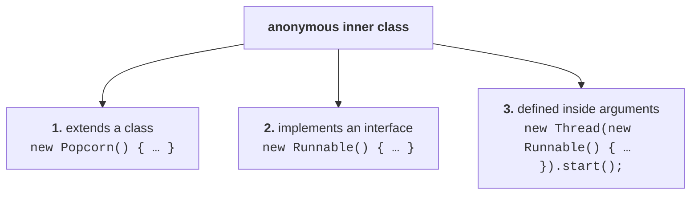
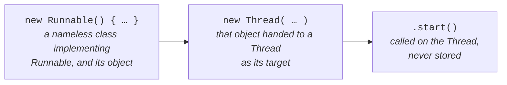

# The third category, and the one that matters

Two categories are covered — normal/regular, and method local. This is the third, and he introduces it as **the most valuable concept**:

> **The most repeatedly used type of inner class is the anonymous inner class.**

The definition is the shortest of the four:

> Sometimes we can declare an inner class **without a name**. Such types of inner classes are called **anonymous inner classes.**

Nameless. And the obvious objection arrives immediately: **without a name, how can you access it?** A name is compulsory to refer to anything. That objection is answered by two stories before any code.

## The stranger who gave directions

Before this session you went to the main office asking to attend the SCJP demo, and were told: go to the Canara Bank building, second floor, five minutes' walk. You came to the signal, walked towards the SR Nagar police station, passed Axis Bank, passed the community hall — and still no Canara Bank building. Have you crossed it, or is it still ahead?

So you stopped **someone walking on the road**: do you know the Canara Bank building? And he said: go straight, two minutes, on the right hand side. You said thanks, found the building, came to the second floor, and here you are.

Now the question. **That person helped you. What is his name?** You don't know. His mobile number? His mail ID? His address? You don't know any of it.

Why didn't you take his contact information?

> **What is the need?** I am never going to communicate with that person again in the rest of my life. **Just for instant use.**

## The bus conductor

The same shape, in case the first did not land. Some of you came here by city bus. You gave money to the conductor, asked for a ticket to SR Nagar, he gave the ticket and the change, you got down.

**What is the conductor's name?** You never asked. Mobile number? Mail ID?

Why not? — Because tomorrow there will be a different conductor on a different bus, and it makes no difference.

And he pushes it one step further, which is the funny half: suppose tomorrow you **do** ask. Conductor, what is your name? Your mobile number? Your address? Do you have any daughters? How much property do you have? What is the conductor going to say?

> Just let me know — don't show, let me know.
>
> **To an anonymous person, how can we share our personal information?** We won't.

## The point of both

> **Just for instant use — one-time usage — created classes are anonymous inner classes.** If it is only for instant use, we are not required to give any name.

> [!important] **Java has exactly two anonymous characters.** The **anonymous inner class**, and the **anonymous array**. Both exist for the same reason: created for one-time use, so there is no point naming them.

---

# The three categories

> Based on declaration and behaviour, there are **three types** of anonymous inner class:
>
> **1.** Anonymous inner class **that extends a class** **2.** Anonymous inner class **that implements an interface** **3.** Anonymous inner class **that is defined inside arguments**



---

# The new syntax, before any example

He stops to clarify the syntax on its own, because if you are aware of this syntax, there is nothing in anonymous inner classes.

Start with something ordinary:

```java
Popcorn p = new Popcorn();
```

That creates a `Popcorn` object. Now, **instead of the semicolon**, take a curly brace open, a curly brace close, and **then** the semicolon:

```java
Popcorn p = new Popcorn() {
};
```

What is that doing? The braces are a **class body**.

> We are declaring a class **that extends `Popcorn`, without a name** — an anonymous inner class. And for that child class, we are creating an object **with the parent reference**.

Two activities in one statement. And the question that follows is the one to get right:

> **Is it a `Popcorn` object, or a child class object?** Even though you wrote `new Popcorn()`, it is a **child class object**, held by a parent reference.

The same shape with `Thread`:

```java
Thread t = new Thread() {
};
```

**Writing a class that extends `Thread`** — the anonymous version of `class MyThread extends Thread`. Again a child class object, held by a `Thread` reference.

## And now the interface case, which he calls the most dangerous

```java
Runnable r = new Runnable();        // ✗
```

**This cannot compile.** `Runnable` is an **interface**, and you cannot create an object of an interface. Measured on JDK 25:

```
error: Runnable is abstract; cannot be instantiated
```

But add the braces:

```java
Runnable r = new Runnable() {
};
```

and it is fine — because now it means something completely different:

> We are writing a class **that implements `Runnable`**, without a name. And for that implemented class we are creating an object, **with the interface reference**.

> [!important] **Same three characters, two opposite meanings — and this is the whole trick.**
>
> | Written | Means |
> |---|---|
> | `new Popcorn()` | create a `Popcorn` object |
> | `new Popcorn() { }` | write a **child class** of `Popcorn` and create **its** object |
> | `new Runnable()` | ❌ impossible — an interface has no object |
> | `new Runnable() { }` | write an **implementing class** and create **its** object |
>
> The `{ }` changes `new X()` from **instantiate X** into **declare a nameless subtype of X and instantiate that**. Once that clicks, all three categories are the same idea.

---

# Category 1 — an anonymous inner class that extends a class

## The problem it solves

```java
class Popcorn {
    public void taste() {
        System.out.println("salty");
    }
}
```

Assume `Popcorn` has **a hundred more methods** besides `taste()` — 101 in total. Anyone who wants popcorn functionality creates a `Popcorn` object and calls them.

> [!info] **His aside on popcorn pricing, kept because it is how the example is remembered.** PVR, Big Cinemas, IMAX. Big Cinemas has the highest rate — two cokes and three popcorns came to around ₹450–500, and he was genuinely shocked. IMAX is ₹40 for a jumbo pack, **too good**. And the point he draws from it: once you have spent ₹100–120, **the taste of the popcorn should be better — and even if it isn't, you should feel like it is, because you paid.**

Now the requirement. **I want popcorn functionality, but I am not satisfied with the `taste()` implementation.** I don't want salty, I want **spicy**. The other hundred methods I want exactly as they are.

The normal solution is a child class:

```java
class SubPopcorn extends Popcorn {
    public void taste() {
        System.out.println("spicy");
    }
}
```

The remaining hundred methods come through inheritance; only `taste()` is **overridden**.

## Why that is the wrong solution here

**Because the spicy implementation is a one-time requirement.**

> If it is only a one-time requirement, going permanently is **not at all recommended.**

And two analogies for why:

**The bus.** You travel to your native place maybe once in five or six months — for a festival. Anyway you **do** need to travel. So **why don't you buy a bus?** Meaningless. For a one-time need, buying the bus is **anathema**.

**The doctor.** Once a year you may get sick — a cold, a fever. Anyway it **does** happen. So **why don't you recruit one permanent super-specialist doctor for yourself?** Maintaining that doctor throughout the year, for a once-a-year need, is the same absurdity.

> **Temporary requirement and permanent requirement are different things.** Wherever the one-time requirement is, **there only** we run the show.

## The program

```java
class Popcorn {
    public void taste() {
        System.out.println("salty");
    }
}

class Test {
    public static void main(String[] args) {
        Popcorn p = new Popcorn() {
            public void taste() {
                System.out.println("spicy");
            }
        };
        p.taste();

        Popcorn p1 = new Popcorn();
        p1.taste();

        Popcorn p2 = new Popcorn() {
            public void taste() {
                System.out.println("sweet");
            }
        };
        p2.taste();
    }
}
```

Three requirements, three lines. Measured on JDK 25:

```
spicy
salty
sweet
```

- **`p`** — a child class object with `taste()` overridden to spicy. Parent reference, child object, so at runtime the **overriding** method is the one that runs.
- **`p1`** — a plain `Popcorn` object, so the original `salty` runs.
- **`p2`** — another anonymous child, this time sweet.

**Three activities happen in the `p` statement**, and he wants all three named:

> **1.** We are declaring a class that extends `Popcorn` **without a name** — an anonymous inner class. **2.** In that child class we are **overriding** the `taste()` method.
> **3.** For that child class we are creating an object **with the parent reference**.

## How many class files?

Not two. **Four.** Because whether it is a normal class or an anonymous inner class, every class gets its own `.class` file (note `01`).

And the anonymous ones have no name, so the compiler numbers them: outer class name, `$`, and a number in order of appearance.

Measured on JDK 25:

```
Popcorn.class
Test.class
Test$1.class      ← the spicy one, first anonymous class in Test
Test$2.class      ← the sweet one, second
```

## Proving it at runtime

The claim that `p` is **not** a `Popcorn` object can be checked directly:

```java
System.out.println(p.getClass().getName());
System.out.println(p1.getClass().getName());
System.out.println(p2.getClass().getName());
```

Measured on JDK 25:

```
Test$1
Popcorn
Test$2
```

> [!important] **This is the proof that `new Popcorn() { }` does not give you a `Popcorn`.** `p1` is genuinely a `Popcorn`. `p` and `p2` are objects of `Test$1` and `Test$2` — two child classes that exist only because you wrote a pair of braces. And `p` **is** also a `Popcorn` in the is-a sense, which is exactly why the parent reference can hold it.

---

# Category 2 — an anonymous inner class that implements an interface

He teaches this through threads, and warns that **multithreading combined with anonymous inner classes is a very common exam pairing.**

## The recap

There are two ways to define a thread: **by extending `Thread`**, and **by implementing `Runnable`**. Both get the anonymous treatment.

## Extending Thread — normal versus anonymous

**Normal class approach:**

```java
class MyThread extends Thread {
    public void run() {
        for (int i = 0; i < 3; i++)
            System.out.println("child thread");
    }
}

class ThreadDemo {
    public static void main(String[] args) {
        MyThread t = new MyThread();
        t.start();
        for (int i = 0; i < 3; i++)
            System.out.println("main thread");
    }
}
```

Writing a class that extends `Thread` and overriding `run()` is **defining a thread**. Whatever code goes inside `run()` is the **job of the thread**. Before `t.start()` there is one thread — main; after it there are two, main and child.

**Anonymous inner class approach** — when that job is a one-time requirement:

```java
class ThreadDemo {
    public static void main(String[] args) {
        Thread t = new Thread() {
            public void run() {
                for (int i = 0; i < 3; i++)
                    System.out.println("child thread");
            }
        };
        t.start();
        for (int i = 0; i < 3; i++)
            System.out.println("main thread");
    }
}
```

> **Same copy-paste as the popcorn example — only the class names changed.** Write a class that extends `Thread`, override `run()`, create an object of it with a parent reference.

Measured on JDK 25 — both versions produce mixed output, and the class file `ThreadDemo$1.class` appears for the anonymous version.

## Implementing Runnable — normal versus anonymous

**Normal class approach:**

```java
class MyRunnable implements Runnable {
    public void run() {
        for (int i = 0; i < 3; i++)
            System.out.println("child thread");
    }
}

class ThreadDemo {
    public static void main(String[] args) {
        MyRunnable r = new MyRunnable();
        Thread t = new Thread(r);
        t.start();
        …
    }
}
```

> [!info] **His car analogy for why the `Thread` wrapper is needed.** Creating a `MyRunnable` object means you have created **a car**. But somebody is required to **drive** it — to start it. Who has the start capability? The **`Thread`** class. `MyRunnable` does not. So `new Thread(r)` hands the car to a driver, and `r` becomes the **target runnable**: when you start this thread, please run this class's `run()` method.

**Anonymous inner class approach:**

```java
class ThreadDemo {
    public static void main(String[] args) {
        Runnable r = new Runnable() {
            public void run() {
                for (int i = 0; i < 3; i++)
                    System.out.println("child thread");
            }
        };

        Thread t = new Thread(r);
        t.start();

        for (int i = 0; i < 3; i++)
            System.out.println("main thread");
    }
}
```

Measured on JDK 25 — mixed output, as expected.

> **The doubt most people have here is `Runnable r = new Runnable() { … }`.** Runnable is an interface, how can you create an object? You are not. It is an **implemented class object**, and this is an anonymous inner class that implements an interface.

---

# Category 3 — an anonymous inner class defined inside arguments

The third category is the second one with the intermediate variables deleted.

Start from `Thread t = new Thread(r);`. What is `r`? A runnable-implemented class object. So instead of naming it, **write it directly in the argument position**:

```java
new Thread(new Runnable() {
    public void run() {
        for (int i = 0; i < 3; i++)
            System.out.println("child thread");
    }
});
```

And then `t` itself is not wanted either — **I don't want this bloody `t`** — so `.start()` goes straight onto the expression:

```java
class ThreadDemo {
    public static void main(String[] args) {
        new Thread(new Runnable() {
            public void run() {
                for (int i = 0; i < 3; i++)
                    System.out.println("child thread");
            }
        }).start();

        for (int i = 0; i < 3; i++)
            System.out.println("main thread");
    }
}
```

Measured on JDK 25 — mixed output, and `ThreadDemo$1.class` is generated exactly as before.

> [!important] **His warning about this one is worth keeping verbatim:** don't show this code anywhere — people may blame you, asking whether it is Java code or not. But it is **perfectly valid, executable Java**, and he runs it to prove the point. This is the shape you will actually meet in real codebases and in exam questions.

Read it in the order the compiler does:



---

# What this part established

| | |
|---|---|
| An anonymous inner class is | an inner class **without a name** |
| Its purpose | **instant use** — one-time usage |
| Java's two anonymous characters | anonymous **inner class**, anonymous **array** |
| Most commonly used inner class type | **anonymous** |
| The three categories | **extends** a class · **implements** an interface · defined **inside arguments** |
| `new Popcorn()` | creates a `Popcorn` object |
| `new Popcorn() { }` | declares a **nameless child** and creates **its** object |
| `new Runnable()` | ❌ `Runnable is abstract; cannot be instantiated` |
| `new Runnable() { }` | declares a **nameless implementing class** and creates its object |
| The reference type is | the **parent** class or the **interface** |
| The object is | the **child** / implementing class object |
| Class files for anonymous classes | `Outer$1.class`, `Outer$2.class` — numbered in order |
| `p.getClass().getName()` proves it | prints `Test$1`, not `Popcorn` |
| When to use a top level class | **permanent**, repeated requirement |
| When to use an anonymous class | **temporary**, one-time requirement |
