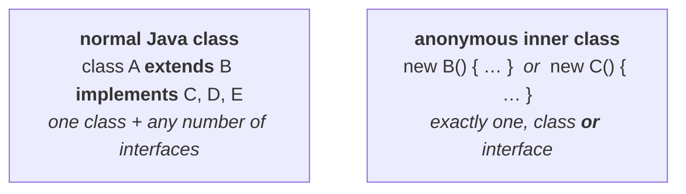
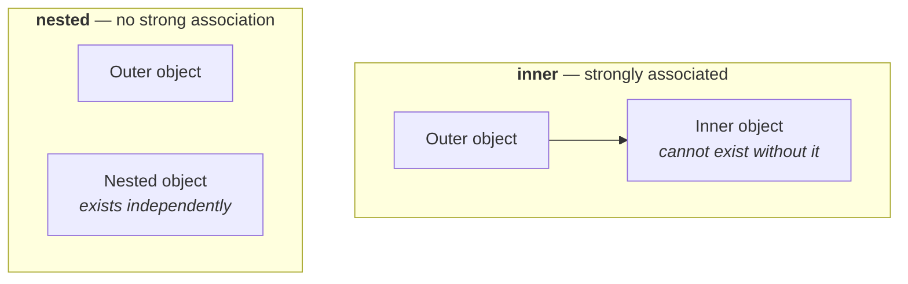

> [!info] **This note follows on from note `03`**, which covers anonymous inner classes themselves and
> their three categories. Everything here assumes that syntax — `new Popcorn() { … }`,
> `new Runnable() { … }` — is already familiar.

# Normal Java class versus anonymous inner class

Five differences, and the first is the one where there is no difference at all.

## 1 — extending a class

A normal Java class can extend **only one** class at a time:

```java
class A extends B { }
```

And an anonymous inner class? Recall what `new Popcorn() { … }` actually means — *I am writing a
class that extends `Popcorn`*. How many classes can it extend? One: `Popcorn`. Same with
`new Thread() { … }` — one class, `Thread`.

> **A normal Java class can extend only one class at a time. Of course, an anonymous inner class also
> can extend only one class at a time.**

**No difference.** But do not assume the rest follow the same way.

## 2 — implementing interfaces

Here they diverge. A normal Java class can implement **any number**:

```java
class A implements B, C, D { }
```

An anonymous inner class cannot. `new Runnable() { … }` means *I am writing a class that implements
`Runnable`* — and there is exactly one slot between the `new` and the `{`.

> **A normal Java class can implement any number of interfaces simultaneously, but an anonymous inner
> class can implement only one interface at a time.**

## 3 — both at once

A normal Java class can do both together:

```java
class A extends B implements C, D, E { }
```

An anonymous inner class cannot, for the same reason as above — there is one slot, and it takes
either a class or an interface.

> **An anonymous inner class can extend a class or can implement an interface, but not both
> simultaneously.**

Measured on JDK 25, trying to name two supertypes is a syntax error before anything else:

```
error: ';' expected
Object o = new I1(), I2() {};
```



## 4 — constructors

In a normal Java class you can write as many constructors as you like:

```java
class Test {
    Test() { }
    Test(int i) { }
}
```

In an anonymous inner class you cannot write **any**. And the reason is almost silly once you see it:

> **The name of the constructor and the name of the class must be the same. But an anonymous inner
> class does not have a name.** Hence we cannot write any constructor explicitly.

Measured on JDK 25, the compiler's complaint says exactly that in its own way:

```java
Popcorn p = new Popcorn() {
    Z2() { }                            // ✗
    public void taste() { … }
};
```

```
error: invalid method declaration; return type required
            Z2() { }
            ^
```

**It is not even read as a constructor.** With no class name to match, `Z2()` is parsed as a *method*
that forgot its return type. That is the strongest possible confirmation of his reasoning.

> [!important] **So what runs instead?** `new Thread() { … }` calls the **parent class constructor**.
> The compiler generates a constructor implicitly, and it does nothing but chain to the superclass —
> which is why an anonymous inner class always depends on a constructor that already exists on its
> parent. You cannot add initialisation parameters of your own.

> [!info] **An instance initialiser block is the workaround, and it is worth knowing.** If you need
> setup code in an anonymous inner class, a bare `{ … }` block inside the body runs at construction
> time and does the job a constructor would have done. That is post-2016 idiom rather than his
> material, but it is the answer to *"then how do you initialise one?"*

## 5 — when to use which

> If the requirement is **standard and required several times**, then we should go for a **normal top
> level class**.
>
> If the requirement is **temporary and required only once** — instant use — then we should go for an
> **anonymous inner class**.

## The five differences together

| | Normal Java class | Anonymous inner class |
|---|---|---|
| Extend a class | only **one** | only **one** — *no difference* |
| Implement interfaces | **any number** | **only one** |
| Extend **and** implement | ✅ simultaneously | ❌ **one or the other**, never both |
| Constructors | **any number** | ❌ **none** — it has no name |
| Best for | standard, reused functionality | temporary, **one-time** use |

---

# Where anonymous inner classes are genuinely used

The interview question is *where are anonymous inner classes best suited?*, and there is a single
standard answer:

> **In GUI based applications, to implement event handling.**

## Why the requirement fits so exactly

Picture a GUI frame — an ATM screen, say — with several buttons on it:

**withdraw** · **get balance** · **change pin** · **mini statement**

Click `withdraw` and you expect one behaviour. Click `get balance` and you expect a completely
different one. And the behaviour for `withdraw` is needed **only for that button** and nowhere else.

That is exactly *temporary, required only once, instant use* — difference 5 above, arising naturally.

## The code

```java
class MyGuiFrame extends JFrame {
    JButton b1, b2, b3, b4, b5, b6;

    …

    b1.addActionListener(new ActionListener() {
        public void actionPerformed(ActionEvent e) {
            // b1 specific functionality
        }
    });

    b2.addActionListener(new ActionListener() {
        public void actionPerformed(ActionEvent e) {
            // b2 specific functionality
        }
    });
}
```

`ActionListener` is an **interface**, so `new ActionListener() { … }` is *writing a class that
implements `ActionListener`* — structurally identical to `new Runnable() { … }`.

> [!info] **A naming detail he mentions in passing:** **listeners are interfaces, events are
> classes.** `ActionListener` is the interface you implement; `ActionEvent` is the class you receive.

## What it saves

Count the top-level classes in that program: **one**.

Now suppose anonymous inner classes did not exist. For `b1` you would need
`class MyActionListener1 implements ActionListener`, for `b2`
`class MyActionListener2 implements ActionListener`, and so on — **one whole top-level class per
button**, each used exactly once.

> Wherever that functionality is required, **there only** we can run the show.

Measured on JDK 25 — a two-button version of that program, with the listeners fired directly:

```
b1 specific functionality
b2 specific functionality
```

and the class files produced:

```
GuiDemo.class
GuiDemo$1.class
GuiDemo$2.class
```

**One class you wrote, two anonymous classes the compiler generated** — `$1` and `$2`, numbered
rather than named, because they have no names. The saving is visible right there in the file listing.

> [!info] **His live demo uses AWT rather than Swing** — a `Frame` with
> `f.addWindowListener(new WindowAdapter() { public void windowClosing(WindowEvent e) { … } })`,
> which prints *"I'm closing window"* ten times and then calls `System.exit(0)`. Same shape, one
> extra idea: `WindowAdapter` is a **class**, not an interface, so that one is *an anonymous inner
> class that extends a class* rather than one that implements an interface — both categories from
> note `03` appearing in one screen.

---

# Static nested classes

The fourth and last category — and the first thing to settle is the name.

> Sometimes we can declare an inner class **with the `static` modifier**. Such types of inner classes
> are called **static nested classes**.

Note `01` flagged that the fourth category is called *nested* while the other three are called
*inner*, and promised a reason. Here it is.

## Why the word is "nested"

The argument runs by analogy with variables, so start there:

```java
class Test {
    int x = 10;              // instance variable
    static int y = 20;       // static variable
}
```

**Without existing a `Test` object, is there any chance of existing `x`?** No — an instance variable
is always part of an object.

**Without existing a `Test` object, is there any chance of existing `y`?** **Yes.** A static variable
is nowhere related to any particular object; it talks at class level.

Now apply exactly the same reasoning to classes:

```java
class Outer {
    class Inner { }                 // non-static — like an instance variable
    static class Nested { }         // static — like a static variable
}
```

- `Inner` is non-static, so **without an `Outer` object there is no chance of an `Inner` object.** The
  inner class object is **strongly associated** with the outer class object.
- `Nested` is static, so **without an `Outer` object there may well be a `Nested` object.** It is
  **not strongly associated** with the outer class at all.

> **That is why the word is *nested* rather than *inner*.** With a static nested class you have
> simply taken one class and put it inside another — there is **no strong association** between them.
> With a genuine inner class, the inner one is always inner: outer first, then inner.



> [!important] **This single distinction generates every difference in the table below.** Do not
> memorise four rows; memorise *strongly associated or not* and derive them.

## Creating one — no outer object required

```java
class Outer {
    static class Nested {
        public void m1() {
            System.out.println("static nested class method");
        }
    }

    public static void main(String[] args) {
        Nested n = new Nested();        // no outer object anywhere
        n.m1();
    }
}
```

Compare that with note `01`'s `Outer.Inner i = o.new Inner();` — all the awkward syntax is gone,
because there is nothing to attach to. Within the same class you can reach a static member directly,
without even the class name.

Measured on JDK 25:

```
static nested class method
```

**From outside the outer class**, you need the class name as a qualifier, exactly as with any other
static member:

```java
Outer.Nested n = new Outer.Nested();
n.m1();
```

Measured on JDK 25 — prints the same line. And note the two forms side by side:

| | Creating it |
|---|---|
| normal inner class | `Outer.Inner i = o.new Inner();` — an outer **object** first |
| static nested class | `Outer.Nested n = new Outer.Nested();` — the outer **class name** only |

The generated class file is still `Outer$Nested.class` — the `$` convention from note `01` does not
change.

## Static members, main, and running it directly

Note `01` established that a normal inner class cannot hold static members, because you cannot touch
it directly. **A static nested class you *can* touch directly** — so static members are fine,
including `main`.

```java
class Test {
    static class Nested {
        public static void main(String[] args) {
            System.out.println("static nested class main method");
        }
    }

    public static void main(String[] args) {
        System.out.println("outer class main method");
    }
}
```

Two `main` methods, and which one runs depends on which class you name. Measured on JDK 25:

```
$ java Test
outer class main method

$ java Test$Nested
static nested class main method
```

> **In a static nested class we can declare static members including a `main` method, and hence we
> can invoke a static nested class directly from the command prompt.**

## Which outer members it can reach

A static nested class sits in a static context, so the ordinary static rule applies:

```java
class Test {
    int x = 10;                  // instance variable
    static int y = 20;           // static variable

    static class Nested {
        public void m1() {
            System.out.println(x);     // ✗
            System.out.println(y);     // ✅
        }
    }
}
```

Measured on JDK 25:

```
error: non-static variable x cannot be referenced from a static context
            System.out.println(x);
                               ^
```

> **From a static nested class we can access only the static members of the outer class directly. We
> cannot access non-static members.**

Contrast with note `02`: from a *normal* inner class, **both** static and non-static members are
reachable.

---

# Normal inner class versus static nested class

The summary table, and every row traces back to the association point.

| | Normal / regular inner class | Static nested class |
|---|---|---|
| **1. Existence** | without an outer class object there is **no chance** of an inner class object — **strongly associated** | without an outer class object there **may** be a nested class object — **not strongly associated** |
| **2. Static members** | ❌ cannot declare any | ✅ can declare them |
| **3. `main` method** | ❌ cannot declare one, hence **cannot** be run from the command prompt | ✅ can declare one, hence **can** be run from the command prompt |
| **4. Outer members reachable** | **both** static and non-static, directly | **only static** |

> [!warning] **Rows 2 and 3 no longer distinguish the two on a modern JDK.** As note `01` records,
> **Java 16 permitted static members in inner classes**, so a normal inner class can now hold statics
> *and* a `main`, and can be run directly from the command prompt. Measured on JDK 25, `java
> Outer$Inner` on an inner class carrying a `main` runs it.
>
> **Rows 1 and 4 are untouched**, and they are the ones that matter — the association rule and the
> access rule. If you are asked for the difference on a modern JDK, lead with those two. The table
> above is still exactly right for the exam as it is written, and for any JDK up to 15. Verified on
> JDK 25.

---

# What this part established

| | |
|---|---|
| Anonymous class extending | only **one** class — same as a normal class |
| Anonymous class implementing | only **one** interface — normal classes allow any number |
| Extending **and** implementing | ❌ never both — one slot only |
| Constructors in an anonymous class | ❌ **impossible** — a constructor needs the class's name |
| What runs instead | the **parent class constructor** |
| Normal top level class is for | **standard**, repeatedly required functionality |
| Anonymous inner class is for | **temporary**, one-time, instant use |
| Best suited to | **GUI applications, event handling** |
| Listeners are | **interfaces**; events are **classes** |
| A static nested class is | an inner class declared with **`static`** |
| Why "nested" and not "inner" | it is **not strongly associated** with the outer class object |
| Creating one | `Outer.Nested n = new Outer.Nested();` — **no outer object** |
| Static members and `main` | ✅ allowed — it can be run from the command prompt |
| Outer members it can reach | **only static** ones |
