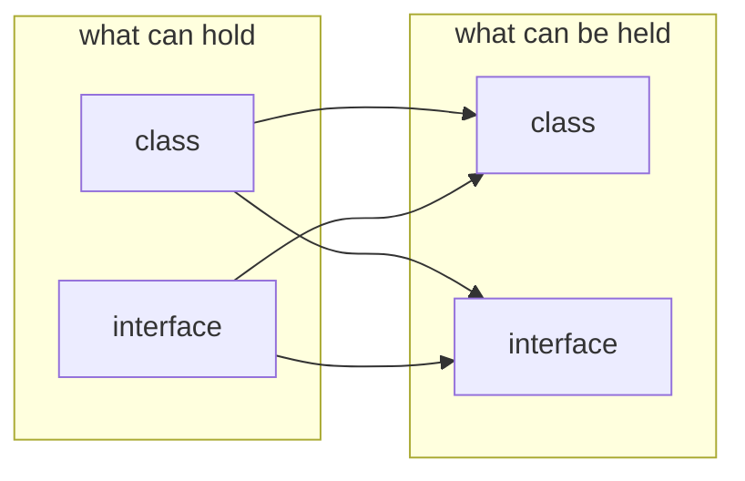
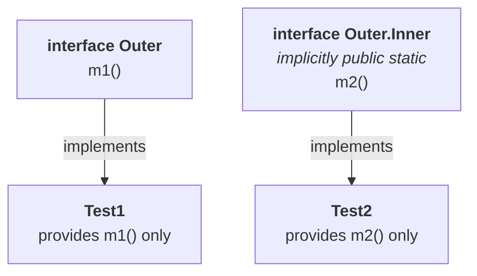

# The four combinations

The chapter so far has covered classes inside classes. But a class is not the only thing that can go inside, and a class is not the only thing that can hold something. With classes and interfaces there are **four** combinations:

| | Combination |
|---|---|
| **1** | a **class** inside a **class** |
| **2** | an **interface** inside a **class** |
| **3** | an **interface** inside an **interface** |
| **4** | a **class** inside an **interface** |

And if an interviewer asks whether some particular one is allowed, there is a one-line answer:

> **Anything inside anything is possible.**

Measured on JDK 25 — all four compile:

| Declaration | Result |
|---|---|
| `class A { class B {} }` | ✅ valid |
| `class A { interface B {} }` | ✅ valid |
| `interface A { interface B {} }` | ✅ valid |
| `interface A { class B {} }` | ✅ valid |



The rest of this note is **when** you would want each one.

---

# Case 1 — a class inside a class

Already covered in note `01`, and the rule is the same sentence the chapter opened with:

> **Without existing one type of object, if there is no chance of existing another type of object, then we can declare a class inside a class.**

**Example — university and department.** A university consists of several departments. Without existing a university there is no chance of existing a department. Hence we declare the `Department` class inside the `University` class.

```java
class University {
    class Department {
    }
}
```

---

# Case 2 — an interface inside a class

A different motivation entirely, and worth stating carefully because it is not about object lifetime at all.

> If we require **multiple implementations of an interface**, and **all those implementations are related to a particular class only**, then we can define the interface inside that class.

## The example

`VehicleTypes` is a class that deals with vehicles. Every kind of vehicle must report its wheel count, so there is an interface for that — and several implementations of it, all of which belong to this one class and are used nowhere else.

```java
class VehicleTypes {
    interface Vehicle {
        public int getNumberOfWheels();
    }

    static class Bus implements Vehicle {
        public int getNumberOfWheels() { return 6; }
    }

    static class Auto implements Vehicle {
        public int getNumberOfWheels() { return 3; }
    }

    // … several more implementation classes
}
```

A bus has six wheels, an auto has three. Both implement `Vehicle`, and `Vehicle` sits inside `VehicleTypes` because it exists only to serve it.

Measured on JDK 25:

```java
VehicleTypes.Vehicle v = new VehicleTypes.Bus();
System.out.println(v.getNumberOfWheels());
v = new VehicleTypes.Auto();
System.out.println(v.getNumberOfWheels());
```

```
6
3
```

> [!important] **The test is different from case 1's.** Case 1 asks can this object exist without that one? Case 2 asks is this interface used anywhere except here? Both end with declare it inside, but for unrelated reasons — do not merge them.

---

# Case 3 — an interface inside an interface

And the example for this one is already familiar: **`Map` and `Entry`.**

A map is a group of key–value pairs, and **each key–value pair is called an entry**:

| Key | Value |
|---|---|
| 101 | durga |
| 102 | ravi |
| 103 | shiva |
| 104 | pavan |

Without existing a `Map` object there is no chance of existing an `Entry` object — an entry is always associated with a map. Hence `Entry` is defined inside `Map`:

```java
interface Map {
    interface Entry {
    }
}
```

Note `01` used this as the third design example; here it is again as the canonical case-3 combination. It is a genuine part of the Java API, not an invented one.

---

# Implementing an outer and an inner interface

This is the section with the real content, and it turns on one implicit modifier.

```java
interface Outer {
    public void m1();

    interface Inner {
        public void m2();
    }
}
```

`Outer` has `m1()`. `Inner` has `m2()`. Now — if a class implements `Outer`, does it have to implement `Inner` too?

> **Every interface declared inside an interface is always `public static`, whether we declare it or not.**

Because it is **static**, it is not tied to anything. So:

> When we are implementing the outer interface, **we are not required to provide implementation for the inner interface**. And when we are implementing the inner interface, **we are not required to provide implementation for the outer**. Both can be implemented **independently**.

```java
class Test1 implements Outer {
    public void m1() {
        System.out.println("outer interface method implementation");
    }
}

class Test2 implements Outer.Inner {
    public void m2() {
        System.out.println("inner interface method implementation");
    }
}

class Test {
    public static void main(String[] args) {
        Test1 t1 = new Test1();
        t1.m1();

        Test2 t2 = new Test2();
        t2.m2();
    }
}
```

Notice `implements Outer.Inner` — `Inner` is not a top-level type, so it has to be qualified by the interface it lives in.

Measured on JDK 25:

```
outer interface method implementation
inner interface method implementation
```

`Test1` never mentions `m2()` or `Inner`. `Test2` never mentions `m1()` or `Outer`. Neither one is incomplete.



---

# Case 4 — a class inside an interface

There are **two** distinct reasons for this one, and both are worth having.

## Reason 1 — the class is closely tied to the interface

> If the functionality of a class is **closely associated with an interface**, and it is not used anywhere else, then it is highly recommended to declare that class **inside the interface**.

**Example — an email service.**

```java
interface EmailService {
    public void sendMail(EmailDetails e);

    class EmailDetails {
        String toList;
        String ccList;
        String subject;
        String body;
        …
    }
}
```

Follow the dependency chain: `EmailDetails` is required only by `sendMail()`, and `sendMail()` is required only by `EmailService`. So `EmailDetails` is required only by `EmailService` and is used nowhere else. **Why take it outside?** Declaring it inside improves modularity.

> **This is a recurring shape.** Very often an interface method's **argument type** or **return type** is a class used only by that interface. Those are exactly the classes to declare inside it.

## Reason 2 — providing a default implementation

The more interesting one.

You have an interface. You would like to ship a **ready-made implementation** alongside it, so that callers who are happy with the defaults can just use it, and callers who are not can write their own.

```java
interface Vehicle {
    public int getNumberOfWheels();

    class DefaultVehicle implements Vehicle {
        public int getNumberOfWheels() {
            return 2;
        }
    }
}

class Bus implements Vehicle {
    public int getNumberOfWheels() {
        return 6;
    }
}
```

> [!info] **Why the default is two wheels.** If you ask somebody do you have a vehicle?, the common expectation is a **two wheeler** — a bike, or a cycle. A four wheeler is the special case. So two is the sensible default.

`DefaultVehicle` is the **default implementation** of `Vehicle`, shipped inside it. `Bus` is a **customised implementation**, written outside by whoever was not satisfied with the default.

## Using both

```java
class Test {
    public static void main(String[] args) {
        Vehicle.DefaultVehicle d = new Vehicle.DefaultVehicle();
        System.out.println(d.getNumberOfWheels());

        Bus b = new Bus();
        System.out.println(b.getNumberOfWheels());
    }
}
```

Measured on JDK 25:

```
2
6
```

And note what that first line did **not** need: any instance of `Vehicle`. You created `Vehicle.DefaultVehicle` directly.

> **Every class declared inside an interface is always `public static`, whether we declare it or not.** Hence we can create its object directly, **without having any instance of the outer interface type** — exactly as a static nested class needs no outer object (note `04`).

> [!info] **Java 8 gave interfaces another way to do this, and it is what you would write today.** A `default` method puts the implementation directly on the interface:
> ```java
> interface Vehicle {
>     default int getNumberOfWheels() { return 2; }
> }
> ```
> Callers who are happy inherit it for free with no separate class at all. The nested-class approach is still valid, still compiles, and is still what you will find in pre-8 code — and it is still the answer to why would you declare a class inside an interface? Verified on JDK 25.

---

# The three modifier conclusions

Everything above rests on implicit modifiers, and here they are collected. The asymmetry between them is the examinable part.

> **1.** Every **interface** declared inside an **interface** is always **`public static`**, whether we declare it or not.
>
> **2.** Every **class** declared inside an **interface** is always **`public static`**, whether we declare it or not.
>
> **3.** Every **interface** declared inside a **class** is always **`static`**, **but need not be public.**

That third one is the odd one out, and it has a practical consequence: an interface inside a class **may be declared `private`**. An interface or class inside an **interface** may not, because it is already public.

Measured on JDK 25:

| Declaration | Result |
|---|---|
| `class P { private interface N {} }` | ✅ **valid** |
| `interface P { private interface N {} }` | ❌ `illegal combination of modifiers: public and private` |
| `interface P { private class N {} }` | ❌ `illegal combination of modifiers: public and private` |

> [!important] **That error message is the proof of conclusions 1 and 2.** The compiler says **public and private** — but you only wrote `private`. The `public` came from the language itself, exactly as conclusion 1 and 2 state. Nothing else in the chapter demonstrates an implicit modifier so directly.

And `javap` confirms all three from the other direction. Measured on JDK 25:

```
$ javap 'Outer$Inner'                 # interface inside an interface
public interface Outer$Inner {

$ javap 'Vehicle$DefaultVehicle'      # class inside an interface
public class Vehicle$DefaultVehicle implements Vehicle {

$ javap -p 'HasIface$Nested'          # interface inside a CLASS
interface HasIface$Nested {
```

The first two say **`public`**. The third does not — default access, because for that one `public` is not implied.

---

# What this part established

| | |
|---|---|
| The four combinations | class-in-class · interface-in-class · interface-in-interface · class-in-interface |
| All four are | ✅ **valid** — **anything inside anything is possible** |
| **Class inside a class** — when | without one object, no chance of the other |
| **Interface inside a class** — when | multiple implementations, all tied to that one class |
| **Interface inside an interface** — example | **`Map.Entry`** |
| **Class inside an interface** — reason 1 | the class is used **only** by that interface |
| **Class inside an interface** — reason 2 | to ship a **default implementation** |
| Implementing outer and inner interfaces | **independently** — neither requires the other |
| Interface inside an **interface** | always **`public static`** |
| Class inside an **interface** | always **`public static`** |
| Interface inside a **class** | always **`static`**, but **need not be public** |
| Hence an interface inside a class | **can** be `private` |
| Creating a class declared in an interface | directly — **no outer instance needed** |
