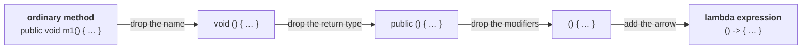

# Why Java 8 exists at all

Java 8 was released on **18th March 2014**. It is the next major version after 1.5 — everything
between them was incremental, and everything after it (9, 10) was, at the time of this lecture, still
waiting for the industry to catch up.

> **Before Java 8, Sun people gave importance only for objects. In the 1.8 version, Oracle people gave
> importance for the functional aspects of programming, to bring its benefits to Java.**

That does **not** make Java a functional-oriented programming language. It is still object oriented.
Java 8 only *enables* functional programming inside it.

## The story behind it — Python was winning

Java was the number one programming language. Then around **2012–13** its popularity started sliding,
and other languages started occupying its place — **Python, R, Scala**.

The reason was length. What takes 10 lines in those languages took 100 lines in Java:

> Sir, you may have heard this statement already — *in Python very less code you have to write, but in
> Java very huge code you have to write.* Python is giving left and right to Java, like anything.

So Java people analysed it: *what features are we lacking compared to other languages? If we do not
correct this, one fine day Java will fade out from the market.* The answer was **concise code**, and
the way to get concise code was to enable functional programming.

> [!info] **The ego, in his words.** Up to Java 7 the Java people had a very great ego — *"we are an
> object-oriented programming language, we never talk about functions, we never talk about procedural
> programming."* Then the realisation: *"if we stick to this object-oriented ego we may miss a number
> of features, and the other languages will dominate. Better to keep the ego aside for some time and
> enable functional programming in Java."* That change of mindset is what produced the whole of Java 8.

**So the one-line answer to "what is the main objective of Java 8?" is: concise code** — very less code
to do many things — achieved by enabling functional programming, and the vehicle for that is the
**lambda expression**.

---

# Two demos, before any theory

Both of these are shown before a single rule is stated. The point is not to understand the syntax yet;
it is to see how much shorter the code gets.

## Demo 1 — a function that squares an int

The Java 7 way. Write a method that takes an `int` and returns its square:

```java
class Tester {
    public static int squareIt(int n) {
        return n * n;
    }
    public static void main(String[] args) {
        System.out.println("The square of 4 is " + squareIt(4));
        System.out.println("The square of 5 is " + squareIt(5));
    }
}
```

Measured on JDK 25:

```
The square of 4 is 16
The square of 5 is 25
```

**Count the lines — twelve.** And his reaction to being shown that code is the whole motivation for the
chapter:

> *"Why are you typing like this? You are going to provide one integer value, you have to return the
> square value. That's all. Why is a separate method required?"*

So remove the method entirely and write **one line**:

```java
import java.util.function.*;

class Tester2 {
    public static void main(String[] args) {
        Function<Integer, Integer> f = i -> i * i;
        System.out.println("The square of 40 is " + f.apply(40));
        System.out.println("The square of 50 is " + f.apply(50));
    }
}
```

Measured on JDK 25:

```
The square of 40 is 1600
The square of 50 is 2500
```

`Function` lives in **`java.util.function`**. Wherever the code is required, there itself you write the
function — no separate method anywhere.

## Demo 2 — check whether a number is even

```java
import java.util.function.*;

class Tester3 {
    public static void main(String[] args) {
        Predicate<Integer> p = i -> i % 2 == 0;
        System.out.println(p.test(4));
        System.out.println(p.test(5));
    }
}
```

Measured on JDK 25:

```
true
false
```

> [!important] **Do not chase the syntax yet.** *"Don't ask sir what is this function, how are you
> writing it, what is the meaning of this. All these things we are going to discuss in detail."* The
> only thing these two demos are for is the shape of the win: **a function can now be handled just like
> an object**, and that is what makes the code concise.

---

# What is actually new in Java 8

| | Feature |
|---|---|
| 1 | **Lambda expressions** |
| 2 | **Functional interfaces** |
| 3 | **Default methods** and **static methods** inside interfaces |
| 4 | **Predefined functional interfaces** — `Predicate`, `Function`, `Consumer`, `Supplier`, … |
| 5 | **Double colon operator (`::`)** — method reference and constructor reference |
| 6 | **Stream API** |
| 7 | **Date and Time API** |
| 8 | **`Optional` class** |
| 9 | **Nashorn** — the JavaScript engine *(since removed — see below)* |

> [!info] **The `::` operator is not C++'s `::`.** In C++ the double colon is the **scope resolution
> operator**. In Java 8 it means something completely different — **method reference** and
> **constructor reference**. Same symbol, unrelated job.

> [!important] **Item 9 is the one that did not last: Nashorn was removed from the JDK in Java 15**
> (JEP 372), having been deprecated in Java 11. Measured on JDK 25:
> ```java
> ScriptEngine e = new ScriptEngineManager().getEngineByName("nashorn");
> System.out.println("nashorn engine: " + e);
> ```
> ```
> nashorn engine: null
> ```
> **No exception — you just get `null` back**, which is the confusing part when old code stops working.
> It survives outside the JDK as a standalone artifact (`org.openjdk.nashorn:nashorn-core`), and
> GraalVM's JavaScript engine is the mainstream replacement. **The other eight are all still current.**

## The release dates worth having

| Version | Released |
|---|---|
| Java 7 | 28th July 2011 |
| **Java 8** | **18th March 2014** |
| Java 9 | 21st September 2017 |
| Java 10 | March 2018 |
| **Java 25** | the current release |

**8, 11, 17, 21 and 25 are the long-term-support versions**, which is why Java 8 refuses to die and why
this chapter still matters:

> *"Java 8 is that much important. Now the dependent technologies like Spring are starting to use
> Java 8 features, and that is why a big boom came for Java 8."*

---

# Lambda expressions

## Where the word comes from

Somewhere in school or college you have already seen the symbol **λ**.

**Lambda calculus** was introduced in **1930**, and it was a big change in the mathematics world — once
it arrived, several difficult problems were solved in the easiest way. Slowly, programmers started
using it too: *"why don't we use these lambdas in our programming, so that our life becomes easy?"*

**LISP was the first programming language which used lambda expressions.** After it: **C#.Net,
Objective-C, C, C++, Python, Ruby** — and finally Java.

> [!important] **The interview trap in that sentence.** If somebody asks you *what is the speciality of
> Java?* — **do not answer "lambda expressions."**
>
> *"If you tell that to other-language people, they may see you from top to bottom"* — because lambda
> expressions came to Java **very lately**. Python already had it, LISP already had it, C, C++, Ruby,
> Scala, JavaScript, C#.NET, all already had it. **This is not a Java-specific brand new feature.** It
> is Java catching up. Whatever concepts were better in other languages, Java people implemented them,
> and lambda expressions are one of those.

## What is a lambda expression

> **A lambda expression is just an anonymous (nameless) function** — a function which does not have a
> **name**, a **return type**, or **access modifiers**.

Lambda expressions are also known as **anonymous functions** or **closures**.



**Three things are removed, one thing is added.** The one added thing is the **arrow symbol `->`**,
which is what tells the compiler this is a lambda expression at all.

> [!info] **On the difficulty.** Asked whether lambda expressions are easy or hard, the class split.
> His answer: *"very, very, very easy — even nursery level. Some people may feel it is a very difficult
> concept. No. The reason they feel that is they did not learn it properly."*

---

# Writing a lambda expression — four conversions

The order matters here. Each example removes one more thing than the last, and the rule that permits
the removal is stated as it is used.

## Conversion 1 — a method that prints hello

```java
public void m1() {
    System.out.println("hello");
}
```

Remove the name, the return type, the modifier. Add the arrow:

```java
() -> { System.out.println("hello"); }
```

The body has only **one line**, so the curly braces are optional:

```java
() -> System.out.println("hello");
```

> **Rule — curly braces.** If the body contains **more than one statement**, curly braces are
> **mandatory**. If it contains exactly one, they are **optional**.

> **Rule — zero parameters.** If there are no parameters, you must still write the **empty parentheses
> `()`**. They cannot be dropped.

## Conversion 2 — a method that prints the sum of two ints

```java
public void add(int a, int b) {
    System.out.println(a + b);
}
```

Name, return type, modifiers gone; arrow added; one line so no braces:

```java
(int a, int b) -> System.out.println(a + b);
```

Here `a` and `b` are the **parameter names** and `int` is the **parameter type**. And the type can go
too:

```java
(a, b) -> System.out.println(a + b);
```

> **Rule — types.** Usually you can specify the type of a parameter. **If the compiler can expect the
> type based on the context, you can remove the type** — the programmer is not required to state it.

> **Rule — multiple parameters** must be separated by commas.

## Conversion 3 — a method that returns a square

```java
public int squareIt(int n) {
    return n * n;
}
```

Strip it down:

```java
(int n) -> { return n * n; }
```

Drop the braces — and the moment the braces go, **`return` must go with them**:

```java
(int n) -> n * n;
```

> [!important] **The `return` rule, both directions.**
> - **With curly braces**, if you are returning something, `return` is **compulsory**.
> - **Without curly braces**, `return` **cannot be used at all**. You just write the value, and the
>   compiler treats it as the returned value automatically.

Then drop the type, and then — because there is only one parameter — the parentheses:

```java
(n) -> n * n;
n -> n * n;
```

> **Rule — parentheses.** If **only one parameter** is available **and** the compiler can infer its
> type, then you can remove the type **and the parentheses**. If you keep the type, you must keep the
> parentheses.

> [!important] **Parentheses on a lambda's parameter are optional. Parentheses on a method *call* are
> not.** `f.apply(40)` always needs them.

## Conversion 4 — a method that returns a string's length

```java
public int m1(String s) {
    return s.length();
}
```

Every rule so far applies at once. The most concise form:

```java
s -> s.length();
```

## All four, compiled and run

```java
interface Sum { public void sum(int a, int b); }
interface Sq   { public int square(int x); }
interface Len  { public int len(String s); }

class Forms {
    public static void main(String[] args) {
        Runnable r = () -> System.out.println("hello");
        r.run();

        Sum s1 = (int a, int b) -> System.out.println(a + b);
        s1.sum(20, 5);
        Sum s2 = (a, b) -> System.out.println(a + b);
        s2.sum(5, 10);

        Sq q1 = (int x) -> { return x * x; };
        Sq q2 = (x) -> x * x;
        Sq q3 = x -> x * x;
        System.out.println(q1.square(7) + " " + q2.square(5) + " " + q3.square(3));

        Len l = s -> s.length();
        System.out.println(l.len("Durga"));
    }
}
```

Measured on JDK 25:

```
hello
25
15
49 25 9
5
```

Every form he writes is still valid, unchanged, eleven years later.

## The summary of what is optional

| Part of the lambda | Rule |
|---|---|
| **Name** | never present — that is what *anonymous* means |
| **Return type** | never present |
| **Modifiers** | never present |
| **Arrow `->`** | **mandatory** — it is what makes it a lambda |
| **Parameter types** | optional **when the compiler can infer them from the context** |
| **Parentheses** | optional **only** for exactly one parameter with no type written |
| **Empty `()`** | mandatory when there are zero parameters |
| **Curly braces** | optional for a one-statement body, mandatory for more |
| **`return`** | mandatory inside braces, **illegal** without them |

> [!example]- **Deep dive — the four ways to write it wrong, with the exact compiler messages.** Useful
> because two of these errors say nothing about lambdas at all, so they are hard to recognise in the
> exam room. All measured on JDK 25.
>
> **1. Type written, parentheses dropped.**
> ```java
> Sq2 q = int x -> x * x;
> ```
> ```
> error: '.class' expected
> ```
> Nothing about lambdas. The compiler stopped understanding the line at `int` and started guessing at
> `int.class`.
>
> **2. Braces kept, `return` dropped.**
> ```java
> Sq2 q = x -> { x * x; };
> ```
> ```
> error: not a statement
> ```
> `x * x` on its own is an expression, not a statement — the same error you would get writing it in an
> ordinary method body.
>
> **3. Braces dropped, `return` kept.**
> ```java
> Sq2 q = x -> return x * x;
> ```
> ```
> error: illegal start of expression
> ```
> After the arrow with no brace, the compiler is parsing an **expression**, and `return` cannot start
> one.
>
> **4. Braces kept, but nothing returned.**
> ```java
> Sq3 q = x -> { int y = x * x; };
> ```
> ```
> error: incompatible types: bad return type in lambda expression
>     missing return value
> ```
> This is the one that names lambdas explicitly, because here the compiler *did* match the lambda
> against `Sq3.square`, and then found the body returns nothing.

> [!question]- **Deep dive — "the compiler can guess the type from the context." What context, exactly?**
> He promises the answer for the next session; here is the short version, and the error that proves it.
>
> The context is the **type of the variable the lambda is assigned to**. Write `Sq q = x -> x * x;` and
> the compiler looks at `Sq`, finds its single method `int square(int x)`, and concludes that `x` is an
> `int` and the result must be an `int`. That target type is the only source of the information — the
> lambda itself says nothing about types.
>
> Take the target type away and the compiler has nothing to work with. Measured on JDK 25:
> ```java
> var f = x -> x * x;
> ```
> ```
> error: cannot infer type for local variable f
>   (lambda expression needs an explicit target-type)
> ```
> The message names the mechanism outright: **a lambda expression needs an explicit target type.** This
> is also why a lambda can never stand alone as a statement — it must always be assigned to, passed to,
> or returned as something whose type is known.

---

# Functional interfaces — the first look

The obvious next question: *you have written a lambda expression, how do you call it?*

> **To invoke a lambda expression, a functional interface is compulsory.**

## What makes an interface functional

He teaches this backwards — the examples first, then the definition.

| Interface | Its single method |
|---|---|
| `Runnable` | `run()` |
| `Comparable` | `compareTo()` |
| `Comparator` | `compare()` |
| `ActionListener` | `actionPerformed()` |
| `Callable` | `call()` |

*"What is the common point?"* They are all interfaces — and every one of them **contains exactly one
abstract method**.

> **If an interface contains only one abstract method, such an interface is called a functional
> interface, and that method is called the functional method or the Single Abstract Method (SAM).**

> [!important] **The word is new; the concept is old.** `Runnable`, `Comparable`, `ActionListener`,
> `Callable` have been in Java since long before Java 8. Nothing was added to them. Java 8 only gave a
> **name** to the shape they already had, and made that shape mean something: **wherever a functional
> interface is expected, you can write a lambda expression instead.**

That relationship — functional interface on the left, lambda expression on the right — is where the
next part starts.

---

# What this part established

| | |
|---|---|
| Java 8 released | **18th March 2014** — next major version after 1.5 |
| Why it exists | Python and others were winning on **concise code** |
| Main objective | bring the benefits of **functional programming** into Java |
| Java is still | **object oriented** — not a functional language |
| Lambda calculus | **1930**, mathematics; **LISP** was the first language to use it |
| Interview trap | lambda is **not** Java's speciality — Java got it last |
| A lambda expression is | an **anonymous function** — no name, no return type, no modifiers |
| Also known as | anonymous functions, **closures** |
| The one mandatory symbol | the **arrow `->`** |
| Braces | optional for one statement, mandatory for more |
| `return` | compulsory inside braces, **illegal** without them |
| Parentheses | droppable only for a single untyped parameter; `()` required for zero |
| Types | droppable when the compiler can infer them **from the target type** |
| To invoke a lambda | a **functional interface** is compulsory |
| Functional interface | an interface with exactly **one abstract method** (**SAM**) |
