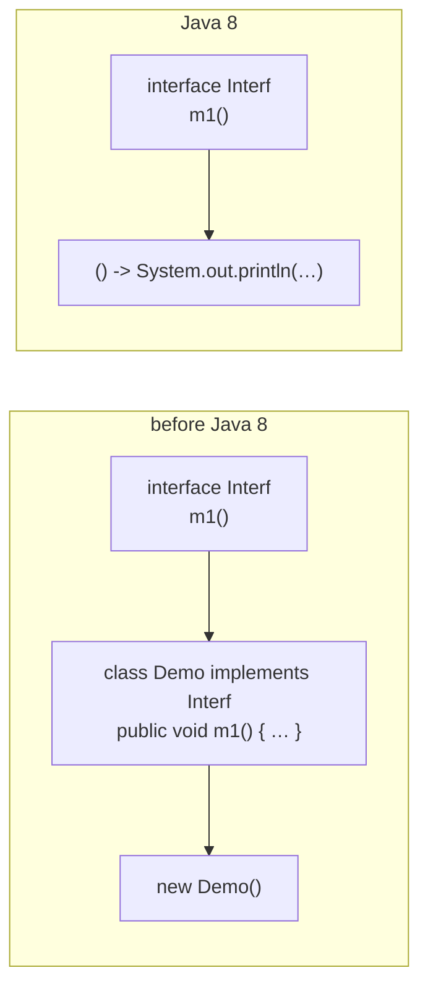

# Recap — the lambda expression in one sentence

> **A lambda expression is nothing but an anonymous function** — a function with **no name**, **no
> return type** and **no modifiers**.

And one more fact that was not stated in part 1, which everything later depends on:

> **A lambda expression always represents exactly one method.**

The three conversions are walked again, and the rules restated as they are used:

| Method | Lambda |
|---|---|
| `public void m1() { System.out.println("hello"); }` | `() -> System.out.println("hello")` |
| `public void add(int a, int b) { System.out.println(a + b); }` | `(a, b) -> System.out.println(a + b)` |
| `public int squareIt(int n) { return n * n; }` | `n -> n * n` |

**The rules, collected:**

1. A lambda expression can have **any number** of arguments — zero, one, two, any.
2. If **multiple** arguments are present they must be separated by **commas**.
3. If **only one** argument is present, the **parentheses are optional**. With zero arguments or two
   or more, the parentheses are **mandatory**.
4. If the compiler can guess the types automatically, the **types can be removed**.
5. If the body contains **only one line**, the **curly braces are optional**.

---

# The `return` statement — the quiz he stops the class for

> *"This return statement is dangerous in the lambda expression. I didn't give that much importance to
> this in the last session, but compulsorily you people should give it."*

Four candidate lambdas for `public int squareIt(int n) { return n * n; }`. **Which are valid?**

```java
n -> return n * n;        // 1
n -> { return n * n; }    // 2
n -> { return n * n }     // 3
n -> { n * n; }           // 4
```

Only **number 2** is valid. Measured on JDK 25:

| | Lambda | Result | Why |
|---|---|---|---|
| **1** | `n -> return n * n;` | ❌ `error: illegal start of expression` | **without** curly braces you **cannot use** `return` |
| **2** | `n -> { return n * n; }` | ✅ prints `36` | correct |
| **3** | `n -> { return n * n }` | ❌ `error: ';' expected` | **semicolon missing** |
| **4** | `n -> { n * n; }` | ❌ `error: not a statement` | inside braces, returning a value **requires** `return` |

> [!important] **The two rules, stated strictly.**
> - **Without curly braces we cannot use the `return` keyword.** Whatever you write, the compiler
>   automatically considers it the returned value.
> - **Within curly braces, if you want to return a value, `return` is compulsory.**
>
> And case 3 is the one that catches people, because it has nothing to do with lambdas: **inside curly
> braces every statement is an ordinary Java statement, so every statement must end with a semicolon.**

---

# Functional interfaces

Once a lambda expression is written, **to invoke it a functional interface is compulsory.**

> **An interface which contains a single abstract method is called a functional interface**, and that
> method is called the **functional method** or **SAM — Single Abstract Method**.

| Interface | Its single abstract method |
|---|---|
| `Runnable` | `run()` |
| `Callable` | `call()` |
| `Comparable` | `compareTo()` |
| `Comparator` | `compare()` |
| `ActionListener` | `actionPerformed()` |

## Default and static methods do not count

The obvious objection, and he puts it to the class as a question: *from 1.8 onwards an interface can
also contain **default methods** and **static methods**. So can a functional interface contain them?*

> **Yes. The restriction is applicable only for abstract methods — not for default methods, and not
> for static methods.**
>
> A functional interface must contain **exactly one abstract method**, but it can contain **any number
> of default methods** and **any number of static methods**.

```java
@FunctionalInterface
interface F1 {
    public abstract void m1();
    default void m2() { System.out.println("default m2"); }
    public static void m3() { System.out.println("static m3"); }
}
```

Measured on JDK 25: **compiles fine.** One abstract method, one default, one static — still a
functional interface.

## The `@FunctionalInterface` annotation

Java 8 introduced the **`@FunctionalInterface`** annotation to say *explicitly* that an interface is
meant to be functional.

> *"Now I am conveying to the compiler — my intention is, I want to make this one a functional
> interface. If I am doing any mistake, please object me, please stop me."*

**It is optional, not mandatory.** If an interface contains exactly one abstract method it **is** a
functional interface whether you declare it or not. What the annotation buys you is that the compiler
checks your intention and complains immediately if you break it.

### Both ways of breaking it, with the exact messages

**Zero abstract methods.** Measured on JDK 25:

```java
@FunctionalInterface
interface F2 { }
```

```
error: Unexpected @FunctionalInterface annotation
  F2 is not a functional interface
    no abstract method found in interface F2
```

**More than one abstract method.** Measured on JDK 25:

```java
@FunctionalInterface
interface F3 { public void m1(); public void m2(); }
```

```
error: Unexpected @FunctionalInterface annotation
  F3 is not a functional interface
    multiple non-overriding abstract methods found in interface F3
```

Both messages are unchanged since the recording — including the phrase **"non-overriding"**, which is
the hinge of the whole inheritance section below.

---

# Functional interfaces and inheritance

Four cases, and the answers are not symmetric.

## Case 1 — child adds nothing

```java
@FunctionalInterface interface A1 { public void methodOne(); }
@FunctionalInterface interface B1 extends A1 { }
```

✅ **Valid.** The parent's method is available to the child by default, so the child also has exactly
one abstract method.

> **If a parent interface is a functional interface and the child interface does not contain any new
> abstract method, then the child interface is also a functional interface.**

## Case 2 — child redeclares the same method

```java
@FunctionalInterface interface A2 { public void methodOne(); }
@FunctionalInterface interface B2 extends A2 { public void methodOne(); }
```

✅ **Valid.** *"You are overriding this method with this method — I am not doing any big activity."*
The child still has **one** method, because the second declaration overrides the first rather than
adding to it. This is exactly what **"non-overriding"** in the error message is guarding.

## Case 3 — child adds a new abstract method

```java
@FunctionalInterface interface A3 { public void methodOne(); }
@FunctionalInterface interface B3 extends A3 { public void methodTwo(); }
```

❌ **Invalid.** Measured on JDK 25:

```
error: Unexpected @FunctionalInterface annotation
  B3 is not a functional interface
    multiple non-overriding abstract methods found in interface B3
```

The child now has two abstract methods — one inherited, one its own.

## Case 4 — the same child, without the annotation

```java
@FunctionalInterface interface A4 { public void methodOne(); }
interface B4 extends A4 { public void methodTwo(); }
```

✅ **Valid.** Measured on JDK 25 — compiles fine.

> [!important] **This is the loophole worth remembering.** Nothing is wrong with a child interface that
> adds a second abstract method. It is simply **a normal interface**, and a normal interface may
> contain any number of abstract methods. The error in case 3 was never about the interface — it was
> about the **claim** made by the annotation. Remove the claim and the code is fine.

| Case | Child | Functional? |
|---|---|---|
| 1 | adds nothing | ✅ yes |
| 2 | redeclares the **same** method | ✅ yes — it overrides, it does not add |
| 3 | adds a **new** abstract method, annotated | ❌ compile error |
| 4 | adds a **new** abstract method, **not** annotated | ✅ valid — it is just a normal interface |

---

# Connecting the two — implementing a functional interface

This is the section where lambdas and functional interfaces finally meet. He does it twice: once the
old way, once the new way.

## The old way — a separate implementation class

```java
interface Interf { public void m1(); }

class Demo implements Interf {
    public void m1() { System.out.println("hello"); }
}

class Hello1 {
    public static void main(String[] args) {
        Demo d = new Demo();
        d.m1();
        Interf i = new Demo();
        i.m1();
    }
}
```

Measured on JDK 25:

```
hello
hello
```

Two ways of calling it, and the second is worth naming: `Interf i = new Demo();` works because
**a parent reference can be used to hold a child object.** No rocket science — an interface, an
implementation class, an object, a method call.

## The new way — a lambda instead of the class

The method being implemented is `public void m1() { System.out.println("hello"); }`, and its lambda is
`() -> System.out.println("hello")`. So put the lambda where the object went:

```java
interface Interf2 { public void m1(); }

class Hello2 {
    public static void main(String[] args) {
        Interf2 i = () -> System.out.println("hello by lambda expression");
        i.m1();
        i.m1();
        i.m1();
    }
}
```

Measured on JDK 25:

```
hello by lambda expression
hello by lambda expression
hello by lambda expression
```

**The entire `Demo` class is gone.** No top-level implementation class anywhere in the file.



> [!important] **What the reference is actually for.** `i` is a functional-interface reference and the
> lambda is the implementation of its single method. Calling `i.m1()` runs the lambda body — and you
> can call it **any number of times**, exactly like a method on an object.
>
> Writing the lambda without ever calling it is also perfectly valid. But **to call it, a functional
> interface is compulsory** — that is the entire job the interface is doing here: **providing a
> reference to the lambda expression.**

---

# The second example — and how the compiler guesses the type

## The old way

```java
interface Interf3 { public void add(int a, int b); }

class DemoAdd implements Interf3 {
    public void add(int a, int b) { System.out.println("The sum: " + (a + b)); }
}

class Add1 {
    public static void main(String[] args) {
        Interf3 i = new DemoAdd();
        i.add(10, 20);
    }
}
```

Measured on JDK 25:

```
The sum: 30
```

## The lambda way

```java
interface Interf4 { public void add(int a, int b); }

class Add2 {
    public static void main(String[] args) {
        Interf4 i = (a, b) -> System.out.println("The sum: " + (a + b));
        i.add(10, 20);
        i.add(100, 200);
        i.add(1000, 2000);
    }
}
```

Measured on JDK 25:

```
The sum: 30
The sum: 300
The sum: 3000
```

## Now the question from part 1 gets its answer

*How can the compiler guess the types automatically?*

Follow what the compiler knows when it reaches `(a, b) -> …`:

1. The reference is of type `Interf4`.
2. `Interf4` is a functional interface — it contains **only one abstract method**.
3. Therefore `a` and `b` can only be the arguments of **that one method**, `add(int a, int b)`.
4. Therefore `a` is `int` and `b` is `int`. There was never a second possibility to choose from.

> *"These are the arguments to which method? Compiler — `a` and `b` are of what type? `int`. The
> compiler can map that automatically. Why are you specifying it?"*

## The analogy — "write the points on the screen"

This is how he explains *why* you are allowed to leave things out, and it is the best thing in the
session. He starts with an instruction to the class and then deletes words from it one at a time:

> **"Write the points that are on the screen, in your notes pages, with a pen."**

- **"with a pen"** — if I ask you to write, obviously you are going to write with a pen. Without a pen
  is it even possible to write? Not required. Remove it.
- **"pages"** — if I ask you to write in your notes, obviously it is the pages inside the notes.
  Remove it.
- **"in your notes"** — if I ask you to write these points, everyone is going to write in their notes
  only. Remove it.
- **"that are on the screen"** — *these points* already means whatever is on the screen. Remove it.

What survives is **"Write the points."** Nothing was lost; every deleted word was recoverable from the
context.

**Now the same deletion, on the lambda:**

| Written | What made it removable |
|---|---|
| `Interf4 i = new DemoAdd();` + a whole class | the class exists only to implement one method |
| `(int a, int b) -> …` | `Interf4` has one method; its parameters are `int` |
| the method name `add` | `Interf4` has one method — there is nothing else it could be |

> *"If I am talking about `Interf4`, it is always talking about `add` only. Why are you specifying
> `add` explicitly? Unnecessary time waste."*

---

# Why "exactly one" abstract method

The reason is the type inference above, run in reverse. Suppose the interface had two:

```java
interface Interf5 {
    public void add(int a, int b);
    public void product(int a, int b);
}

Interf5 i = (a, b) -> System.out.println("The sum: " + (a + b));
```

*Are `a` and `b` the arguments to `add`, or the arguments to `product`?*

> *"Compiler will get shocked like anything."*

Measured on JDK 25:

```
error: incompatible types: Interf5 is not a functional interface
    multiple non-overriding abstract methods found in interface Interf5
```

> [!important] **So the SAM rule is not arbitrary bookkeeping.** A lambda expression carries no method
> name. The **only** way to know which method it implements is for there to be exactly one candidate.
> Two candidates and the mapping is ambiguous — which is why a functional interface must contain
> exactly one abstract method.

---

# Two questions from the class

> [!question]- **Deep dive — "if the compiler is doing all this work, does it hurt performance?"** A
> genuinely good question from the class, and his answer generalises well beyond lambdas.
>
> No. **Compilation happens once; execution happens many times.**
>
> Our code is compiled once, and after compilation it moves to production and runs. **Performance is
> always about runtime execution, not compile time.** So even if the compiler has to do extra work
> matching a lambda against a functional interface, it pays that cost exactly once.
>
> *"Compiler, please bear it — it is only one time."*

> [!info] **Is a lambda expression a general concept or a specific one?**
> **Very specific.** Lambda expressions are applicable **only where a functional interface is
> involved**. They are never usable anywhere else. **Lambda expressions are always associated with
> functional interfaces.**

---

# What this part established

| | |
|---|---|
| A lambda always represents | exactly **one** method |
| `return` without braces | **illegal** — the value is returned automatically |
| `return` inside braces | **compulsory** if a value is returned |
| Inside braces | every statement needs its **semicolon** |
| Functional interface | an interface with exactly **one abstract method** (**SAM**) |
| Default and static methods | **unlimited** — the restriction is on abstract methods only |
| `@FunctionalInterface` | **optional**; it makes the compiler enforce your intention |
| Zero abstract methods | `no abstract method found in interface` |
| Two abstract methods | `multiple non-overriding abstract methods found in` |
| Child adds nothing | still a functional interface |
| Child redeclares the same method | still a functional interface — it **overrides**, it does not add |
| Child adds a new abstract method | error **only if annotated**; otherwise a normal interface |
| To invoke a lambda | a functional interface reference is **compulsory** |
| How types are inferred | one abstract method ⇒ only one possible parameter list |
| Why exactly one method | with two, the compiler cannot tell which one the lambda implements |
| Compile-time cost | irrelevant — **compiled once, executed many times** |
| Lambda expressions are | a **very specific** concept, only for functional interfaces |
