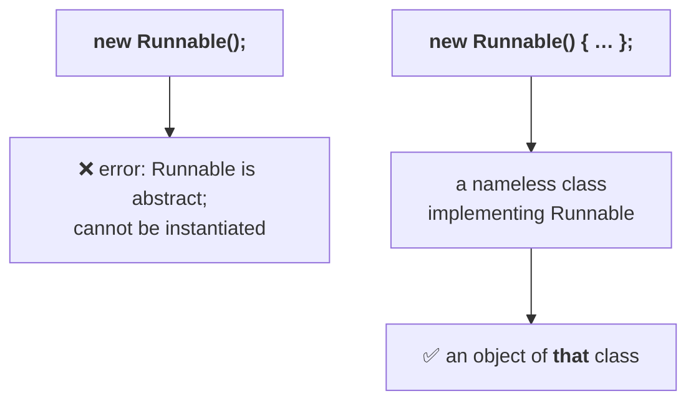

# Lambda expressions on your own classes

The earlier collections examples sorted `Integer` objects. The obvious worry — *is this only for
built-in types?* — is answered first.

> **Lambda expressions are applicable to our own classes too.** Not just `Integer` and `String` —
> `Employee` objects, `Student` objects, `Customer` objects, whatever your application has.

## The `Employee` class, and why `toString()` comes first

```java
class Employee {
    String name;
    int eno;
    Employee(String name, int eno) { this.name = name; this.eno = eno; }
}
```

Now print an employee. **Whenever we try to print any object reference, `toString()` is called
internally** — and `Employee` does not have one, so `Object`'s default implementation runs. Measured on
JDK 25:

```
Emp2@1dbd16a6
```

*"This type of thing I don't want. I want something meaningful."* So override it:

```java
public String toString() { return eno + " : " + name; }
```

> **If you want to print your own class object in a meaningful way, it is highly recommended to
> override `toString()`.**

## Sorting employees by employee number

`Collections.sort(list, comparator)`, and the comparator contract is the one from the last part:
**negative** if the first should come before, **positive** if after, **zero** if equal.

For ascending order of employee numbers: if `e1.eno < e2.eno` then `e1` comes first, so return
negative.

```java
import java.util.*;

class EmpDemo {
    public static void main(String[] args) {
        ArrayList<Employee> l = new ArrayList<Employee>();
        l.add(new Employee("Durga", 872425));
        l.add(new Employee("Sunny", 212345));
        l.add(new Employee("Bunny", 111213));
        l.add(new Employee("Chinny", 434343));
        l.add(new Employee("Vinny", 424345));

        System.out.println("before  : " + l);

        Collections.sort(l, (e1, e2) -> (e1.eno < e2.eno) ? -1 : (e1.eno > e2.eno) ? 1 : 0);
        System.out.println("by eno  : " + l);

        Collections.sort(l, (e1, e2) -> e1.name.compareTo(e2.name));
        System.out.println("by name : " + l);
    }
}
```

Measured on JDK 25:

```
before  : [872425 : Durga, 212345 : Sunny, 111213 : Bunny, 434343 : Chinny, 424345 : Vinny]
by eno  : [111213 : Bunny, 212345 : Sunny, 424345 : Vinny, 434343 : Chinny, 872425 : Durga]
by name : [111213 : Bunny, 434343 : Chinny, 872425 : Durga, 212345 : Sunny, 424345 : Vinny]
```

## Sorting by name — and why `compareTo` is enough

The second sort needs no `if` at all:

```java
(e1, e2) -> e1.name.compareTo(e2.name)
```

> **`String`'s `compareTo()` is already alphabetical order.** For numbers it is already ascending
> order. That is the **default natural sorting order**, and it is implemented internally through
> `Comparable.compareTo()`.

So `compareTo` already returns the negative / positive / zero that `Comparator.compare` needs — its
result can be handed straight back.

Read the output: Bunny, Chinny, Durga, Sunny, Vinny — B, C, D, S, V.

> [!info] **Where lambdas fit in collections.** The functional interfaces in collections are
> **`Comparable` and `Comparator`** — and both are about **sorting**. So: *wherever sorting is
> required, lambda expressions can be used.*

> [!question]- **Deep dive — a question from the class: how would you find the second-highest salary?**
> Asked mid-session, and his answer is worth keeping because it is a common interview question and the
> reasoning is pure sorting.
>
> In SQL you would write a query. In Java you have to write the logic yourself — and the logic is one
> line of thought:
>
> **Sort by salary in descending order.** Then the highest-paid employee is at index 0, and the
> **second element is the employee with the second-highest salary.** That is the whole algorithm.
>
> (He leaves the code as practice, and notes it as a nice exercise for the reader.)

---

# Anonymous inner classes — the syntax first

Before comparing the two, the syntax has to be readable.

> **An anonymous inner class is a class without a name.**

## Case 1 — extending a class

Start with something familiar:

```java
Thread t = new Thread();
```

That creates a `Thread` object. Now **remove the semicolon and open a curly brace instead**:

```java
Thread t = new Thread() {
    // some code
};
```

*What am I doing here?* Three things at once:

1. Writing a **class that extends `Thread`** — a child class of `Thread`.
2. That child class has **no name**.
3. Creating an **object of that child class**.

That is an anonymous inner class extending `Thread`.

## Case 2 — implementing an interface

```java
Runnable r = new Runnable();
```

**Invalid** — `Runnable` is an interface; you cannot create an object of an interface. Measured on
JDK 25:

```
error: Runnable is abstract; cannot be instantiated
```

But this is fine:

```java
Runnable r = new Runnable() {
    public void run() { … }
};
```

> [!important] **This is the sentence to get exactly right.** `new Runnable() { … }` does **not**
> create a `Runnable` object. It creates an **implementation class of `Runnable`** that has **no
> name**, and then an **object of that implementation class**. The words `new Runnable` are being used,
> but the object is not a `Runnable` object — it is an object of its implementation class.
>
> **The semicolon is the whole difference.** `new Runnable();` tries to instantiate the interface and
> fails. `new Runnable() { … }` declares an implementation and instantiates that.



> **An anonymous inner class must either extend a class or implement an interface** — one of the two
> always happens.

## A thread written with an anonymous inner class

```java
Runnable r = new Runnable() {
    public void run() {
        for (int i = 0; i < 10; i++) System.out.println("Child Thread");
    }
};
Thread t = new Thread(r);
t.start();
for (int i = 0; i < 10; i++) System.out.println("Main Thread");
```

Count the activities packed into that one expression:

1. Writing a class that implements `Runnable`
2. Providing an implementation for `run()`
3. Creating an object of that implementation class

> **When should you go for an anonymous inner class?** *Wherever the functionality is required, there
> only* — **for instant use.** Instead of writing a separate named implementation class somewhere else
> in the file, you define it exactly at the point of use.

After `t.start()` there are **two threads** — main and child — and the output is **mixed**, exactly as
in the previous part.

## Replacing it with a lambda

`Runnable` implements one abstract method, so it is a functional interface, so:

```java
Runnable r = () -> {
    for (int i = 0; i < 10; i++) System.out.println("Child Thread");
};
```

Same mixed output.

---

# Anonymous inner class vs lambda expression

This is the heart of the session, and he states the conclusion before proving it.

> **A lambda expression is NOT a replacement for anonymous inner classes.**
> **Anonymous inner classes are more powerful than lambda expressions.**

## The proof — one interface with two abstract methods

```java
interface A {
    public void m1();
    public void m2();
}
```

**Can this be implemented with a lambda expression?** No — a lambda applies only to functional
interfaces, and this has two abstract methods. Measured on JDK 25:

```
error: incompatible types: A is not a functional interface
    multiple non-overriding abstract methods found in interface A
```

**Can it be implemented with an anonymous inner class?** Yes:

```java
class TwoAIC {
    public static void main(String[] args) {
        A a = new A() {
            public void m1() { System.out.println("m1 execution"); }
            public void m2() { System.out.println("m2 execution"); }
        };
        a.m1();
        a.m2();
    }
}
```

Measured on JDK 25:

```
m1 execution
m2 execution
```

> [!important] **The asymmetry, stated exactly.**
> - **Wherever a lambda expression works, an anonymous inner class also works.**
> - **Wherever an anonymous inner class works, a lambda may NOT work.**
>
> So anonymous inner classes are the more powerful of the two, and the replacement rule is narrow:
>
> > **Only if an anonymous inner class implements an interface that contains a single abstract method
> > can it be replaced with a lambda expression.** Not every time.

> [!info] **Where the misconception comes from.** Before 1.8 everybody feared anonymous inner classes,
> so when lambdas arrived people assumed they had come to abolish them. **Anonymous inner class ≠
> lambda expression.** Lambdas resolve the *complexity* of anonymous inner classes in the one case
> where they apply; they do not replace the concept.

## Everything an anonymous inner class can do that a lambda cannot

Measured on JDK 25:

```java
class Concrete { public void m1() { System.out.println("concrete m1"); } }
abstract class Abs { public abstract void m1(); }

Concrete c = new Concrete() { public void m1() { System.out.println("anon extends concrete"); } };
Abs a      = new Abs()      { public void m1() { System.out.println("anon extends abstract"); } };
```

```
anon extends concrete
anon extends abstract
```

Both work, and both produce class files (`Extend$1.class`, `Extend$2.class`).

Now try a lambda where an **abstract class** is expected:

```java
abstract class Abs2 { public abstract void m1(); }
Abs2 x = () -> System.out.println("nope");
```

```
error: incompatible types: Abs2 is not a functional interface
```

> [!important] **Read that error closely — `Abs2` has exactly one abstract method.** It is still
> rejected. **A lambda needs an *interface*, not merely a type with one abstract method.** "Functional
> interface" means interface, literally.

## `this` means different things in the two

This is the difference most likely to be asked, and it is measurable.

**Inside a lambda expression:**

```java
class This1 {
    int x = 777;
    public void m2() {
        Interf i = () -> {
            int x = 888;
            System.out.println(x);
            System.out.println(this.x);
        };
        i.m1();
    }
}
```

Measured on JDK 25:

```
888
777
```

**Inside an anonymous inner class:**

```java
class This2 {
    int x = 777;
    public void m2() {
        Interf2 i = new Interf2() {
            int x = 888;
            public void m1() {
                System.out.println(x);
                System.out.println(this.x);
                System.out.println(This2.this.x);
            }
        };
        i.m1();
    }
}
```

Measured on JDK 25:

```
888
888
777
```

> **Inside an anonymous inner class, `this` always refers to the current anonymous inner class object.
> Inside a lambda expression, `this` always refers to the current *outer* class object** — the
> enclosing class in which the lambda is declared.

That is why the anonymous inner class needs `This2.this.x` to reach 777, while the lambda gets it from
plain `this.x`. And notice the other half of it: the anonymous inner class **has its own instance
variable** `x = 888`; the lambda's `x = 888` is just a **local variable**.

> **Inside a lambda expression we cannot declare instance variables.** Whatever variables you declare
> inside a lambda are simply local variables.

## Variables from outside

From a lambda you can access enclosing class variables and enclosing method variables directly — but
not identically:

```java
class Final1 {
    int x = 10;                 // instance variable
    public void m2() {
        int y = 20;             // local variable
        Interf3 i = () -> {
            System.out.println(x);
            System.out.println(y);
            x = 888;            // fine
            y = 999;            // compile error
        };
        i.m1();
    }
}
```

Measured on JDK 25:

```
error: local variables referenced from a lambda expression must be final or effectively final
```

Remove the `y = 999;` and it compiles and runs:

```
10
20
x is now 888
```

> **A local variable referenced from a lambda expression is implicitly final** — you cannot reassign
> it, inside the lambda or after it. An **instance** variable has no such restriction.

## The full comparison

| | Anonymous inner class | Lambda expression |
|---|---|---|
| What it is | a **class** without a name | a **method** without a name (anonymous function) |
| Can extend an abstract class | ✅ yes | ❌ no |
| Can extend a concrete class | ✅ yes | ❌ no |
| Can implement an interface with **many** abstract methods | ✅ yes | ❌ no — **single** abstract method only |
| Instance variables | ✅ can declare | ❌ cannot — they are just local variables |
| Can be instantiated | ✅ yes | ❌ no |
| `this` refers to | the **anonymous inner class** object | the **enclosing outer class** object |
| Best choice when | you must handle **multiple methods** | the interface has a **single abstract method** |
| At compile time | a separate `.class` file — `Outer$1.class` | **no** `.class` file — becomes a **private method** |

> [!important] **Where each one actually lands in memory**, since this is the row people garble.
> An anonymous inner class produces **a real loaded class**: its metadata goes into **Metaspace**
> (native memory, outside the heap) and each instance goes on the **heap**, like any object. A lambda
> produces **no class file at all** — the compiler emits a private method plus an `invokedynamic` call
> site, and the implementation object is spun up at first execution.
>
> Older material calls the metadata destination *"the permanent memory of the JVM (PermGen)"*.
> **PermGen was removed in Java 8** (JEP 122) and replaced by Metaspace; the distinction the row is
> drawing is right, but that is the wrong name for the place.

---

# The practice test

The session ends by running a quiz live, question by question. Every answer below is his.

> [!question]- **Q1 — Which of the following is true regarding lambda expressions?** (four options)
> 1. If a lambda expression contains multiple parameters, they are separated with commas
> 2. A lambda expression can have any number of arguments, including zero
> 3. A lambda body can contain multiple statements, enclosed within curly braces
> 4. If a lambda expression contains only one argument, the parentheses are optional
>
> **Answer: all four are correct.**

> [!question]- **Q2 — Which is valid regarding functional interfaces?**
> 1. Should contain only one **abstract** method
> 2. Should contain only one **static** method
> 3. Can contain any number of abstract methods
> 4. Should contain only one **default** method
>
> **Answer: 1 only.** The restriction is on abstract methods; static and default methods are unlimited.

> [!question]- **Q3 — Which of these are true?**
> 1. The main objective of a lambda expression is to enable functional programming in Java
> 2. Lambda expressions apply only to Java, not to other languages
> 3. With lambda expressions we write concise code, so readability improves
> 4. A functional interface reference can be used to hold a lambda expression
>
> **Answer: 1, 3 and 4.** Number 2 is false — *"it is applicable for every language, but very
> unfortunately it came very late in Java."*

> [!question]- **Q4 — `interface Interf { public int product(int a, int b); }` — which lambdas are valid?**
> - **First — invalid**, because the interface expects parameters and none were supplied.
> - **Second — invalid**: without curly braces you must not use `return`.
> - **Third — valid.**
> - **Fourth — valid.**

> [!question]- **Q5 — In which case will we NOT get a compile-time error?**
> - `@FunctionalInterface` with **two** abstract methods — ❌ error.
> - `@FunctionalInterface` with **only a default** method — ❌ error; it needs one abstract method.
> - The third — ✅ **valid**, no compile error.
> - `@FunctionalInterface` with **zero** abstract methods — ❌ error.

> [!question]- **Q6 — `interface Interf { public int sum(int a, int b); }` — which lambdas are valid?**
> - **First — valid.**
> - **Second — valid.**
> - **Third — invalid**: within curly braces, `return` is compulsory and it was missing.
> - **Fourth — invalid**: without curly braces, `return` must not be used.

> [!question]- **Q7 — Which of the following are valid lambda expressions?**
> - `x, y -> x * y` — ❌ **wrong**: with **two** parameters the parentheses are **mandatory**.
> - The second — ✅ valid.
> - The third — ✅ valid.
> - The fourth — ✅ valid.
>
> A student asks about the single-parameter case: with **only one** argument the parentheses are
> optional, which is why that one is fine without them.

> [!question]- **Q8 — `interface A { public void m1(); }` — which children are functional interfaces?**
> - Child declaring **the same** `m1()` — ✅ functional interface.
> - Child declaring a **new** abstract method — ❌ not functional: one method comes from the parent and
>   another is defined here, so the child has **two**.
> - The third — ✅ valid.
> - "All of the above" — ❌, since the second one fails.

> [!question]- **Q9 — `interface Interf { public int square(int n); }` — which lambdas are valid?**
> - **First — invalid**: within curly braces every statement must end with a semicolon, and
>   `return n * n` has none.
> - **Second — valid.**
> - **Third — invalid**: without curly braces you must not use `return`.
> - **Fourth — invalid**: within curly braces `return` is compulsory.
>
> Note the two semicolons that must both be present: the one ending the statement *inside* the braces,
> and the one ending the lambda expression itself.

> [!question]- **Q10 — Which of the following are true?**
> 1. Only for functional interfaces can we write a lambda expression implementation — ✅
> 2. For any interface we can write a lambda expression — ❌
> 3. A functional interface must be declared with the annotation — ❌ **optional**
> 4. If any interface contains a single abstract method it is always a functional interface, whether
>    or not `@FunctionalInterface` is used — ✅

**Score: 100 out of 100.**

---

# What this part established

| | |
|---|---|
| Lambdas work on | **your own classes** too — `Employee`, `Student`, `Customer` |
| Printing an object calls | `toString()` — override it or get `Emp2@1dbd16a6` |
| Functional interfaces in collections | **`Comparable`** and **`Comparator`** — both about sorting |
| `String.compareTo()` | already alphabetical; for numbers already ascending — **natural sorting order** |
| Anonymous inner class | a class **without a name** |
| `new Runnable();` | ❌ `Runnable is abstract; cannot be instantiated` |
| `new Runnable() { … }` | an unnamed **implementation class**, and an object of it |
| When to use one | wherever the functionality is required — **for instant use** |
| Which is more powerful | **anonymous inner class** |
| Replacement rule | only when it implements an interface with a **single abstract method** |
| Lambda + abstract class | ❌ — one abstract method is not enough, it must be an **interface** |
| `this` in an anonymous inner class | the **anonymous inner class** object |
| `this` in a lambda | the **enclosing outer class** object |
| Instance variables in a lambda | impossible — they are local variables |
| Local variables used in a lambda | **implicitly final** — cannot be reassigned |
| Class files | `Outer$1.class` vs **none** |
