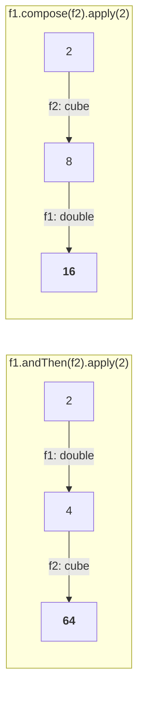

# Where `Predicate` stops

A quick restatement before the new material, because the whole part is built by contrast with it.

> **Predicate is a boolean-valued function.** Wherever some **conditional check** is required, go for `Predicate`.

```java
import java.util.function.*;

Predicate<Integer> p = i -> i % 2 == 0;
System.out.println(p.test(10));
System.out.println(p.test(15));
```

Measured on JDK 25:

```
true
false
```

But conditional checking is not the only thing programs do.

> Sometimes my requirement is: I will provide some input, perform some operation, and provide the corresponding output. I don't want a conditional check.

Give it 4, get 16 back. **That result need not be boolean.** It can be `int`, `String`, a `Student`, a `Customer` — anything. `Predicate` cannot express that, because its return type is fixed.

---

# `Function`

> **`Function` is a predefined functional interface for: take an input, perform some operation, and return a result of any type.**

```java
interface Function<T, R> {
    public R apply(T t);
}
```

## Why it takes two type parameters and `Predicate` takes one

This is the exam question hiding in the shape of the two interfaces.

| | Input type | Return type | Type parameters |
|---|---|---|---|
| `Predicate<T>` | varies | **always `boolean`** | **1** |
| `Function<T, R>` | varies | **varies** | **2** |

> Because a predicate's return type is **always boolean**, there is nothing to specify — so only the input type is a parameter. A function's return type **changes from example to example**, so it must be specified explicitly. That is the entire reason for the difference.

| Interface | Its single method |
|---|---|
| `Predicate<T>` | `test()` |
| `Function<T, R>` | `apply()` |

## Three functions

```java
import java.util.function.*;

Function<Integer, Integer> f = i -> i * i;
System.out.println(f.apply(4));
System.out.println(f.apply(5));
```

Measured on JDK 25: `16` and `25`.

```java
Function<String, Integer> f = s -> s.length();
System.out.println(f.apply("Durga"));
System.out.println(f.apply("Durga Software Solutions"));
```

Measured on JDK 25: `5` and `24`.

```java
Function<String, String> f = s -> s.toUpperCase();
```

Input `String`, output `String` — for a case conversion both sides are the same type. Read each one by asking the two questions in order: **what type goes in, what type comes out.** That is the whole of choosing the type parameters.

---

# A realistic example — grading students

Not `Integer` and `String` this time; a class of your own.

```java
class Student {
    String name;
    int marks;
    Student(String name, int marks) { this.name = name; this.marks = marks; }
}
```

**Write a function to find the grade of a student from their marks.**

| Marks | Grade | Meaning |
|---|---|---|
| ≥ 80 | **A** | distinction |
| ≥ 60 | **B** | first class |
| ≥ 50 | **C** | second class |
| ≥ 35 | **D** | third class |
| below 35 | **E** | failed |

Input is a `Student`. Output is a grade, which is a `String`. So: `Function<Student, String>`.

```java
Function<Student, String> f = st -> {
    int marks = st.marks;
    String grade = "";
    if (marks >= 80)      grade = "A[Distinction]";
    else if (marks >= 60) grade = "B[First Class]";
    else if (marks >= 50) grade = "C[Second Class]";
    else if (marks >= 35) grade = "D[Third Class]";
    else                  grade = "E[Failed]";
    return grade;
};
```

> [!info] **A question from the class: could those `if`s be predicates?** Yes — inside a function we can use a predicate, no problem. Each condition like `marks >= 50` is a boolean check and could be a `Predicate`. But you would **not replace the whole function with a predicate**, because the function returns a `String`, not a boolean. Predicates go **inside**; the function is still the right outer shape.

Call it with `f.apply(s1)`.

---

# `Consumer`

The third predefined functional interface, and the name is the definition.

> Consumer always takes some input value and does not return anything. Just consume.

> **`Consumer` takes the input, performs an operation, and returns nothing.** I am not expecting any return type from you — you just consume.

```java
interface Consumer<T> {
    public void accept(T t);
}
```

The method name follows the same pattern as the others: `Predicate` → `test`, `Function` → `apply`, `Consumer` → **`accept`**.

```java
Consumer<String> c = s -> System.out.println(s);
c.accept("Durga");
```

Prints `Durga` and returns nothing.

> [!info] **Realistic uses.** Give it an `Employee` object and it prints the employee's information — or **stores that information in the database**. After storing, it returns nothing. That is a consumer.

**One type parameter**, for the same reason as `Predicate` — there is no return type to specify, because there is no return value at all.

---

# All three together

This is the example he builds to give the complete picture — one program using a function, a predicate and a consumer, each for the job it fits.

```java
import java.util.function.*;

class Grade {
    public static void main(String[] args) {
        Student[] s = {
            new Student("Durga", 100),
            new Student("Sunny", 65),
            new Student("Bunny", 55),
            new Student("Chinny", 45),
            new Student("Vinny", 25)
        };

        Function<Student, String> f = st -> {
            int marks = st.marks;
            String grade = "";
            if (marks >= 80)      grade = "A[Distinction]";
            else if (marks >= 60) grade = "B[First Class]";
            else if (marks >= 50) grade = "C[Second Class]";
            else if (marks >= 35) grade = "D[Third Class]";
            else                  grade = "E[Failed]";
            return grade;
        };

        Predicate<Student> p = st -> st.marks >= 60;

        Consumer<Student> c = st ->
            System.out.println(st.name + "  " + st.marks + "  " + f.apply(st));

        System.out.println("--- every student ---");
        for (Student s1 : s) c.accept(s1);

        System.out.println("--- only marks >= 60 ---");
        for (Student s1 : s) if (p.test(s1)) c.accept(s1);
    }
}
```

Measured on JDK 25:

```
--- every student ---
Durga  100  A[Distinction]
Sunny  65  B[First Class]
Bunny  55  C[Second Class]
Chinny  45  D[Third Class]
Vinny  25  E[Failed]
--- only marks >= 60 ---
Durga  100  A[Distinction]
Sunny  65  B[First Class]
```

**Read off which does what:**

| | Job in this program | Returns |
|---|---|---|
| `Function<Student, String>` | evaluate the **grade** | a `String` |
| `Predicate<Student>` | check **marks ≥ 60** | `boolean` |
| `Consumer<Student>` | **print** the student's information | nothing |

And notice the consumer **calls the function inside itself** — `f.apply(st)` sits in the consumer's body. They compose freely.

> [!info] **Why these are almost always written inline.** Usually consumers, all these things are lambda expressions, just for instant usage purposes. Asked whether a consumer defined in one class can be called from another — generally no, because it is declared **inside a method**, so it is local to that method. That is the normal way to use them.

> [!question]- **Deep dive — his digression on the grade table: don't try for 100 out of 100.** Not technical, and it comes straight out of writing the grades A through E. Kept because it is his, and because it is the kind of aside that makes the example stick.
>
> Among distinction, first class, second class, third class and failed — which people are going to succeed like anything in their life? Maybe the failed student or the third class student. The person getting distinction, the chance of success is very, very low.
>
> His argument: in your own classroom, look at where the topper ended up. The 90–100% people often become developers; the 60–65% people settle well, become HR heads, company owners, politicians. Failed persons are going to manage third class people, third class people are going to manage second class people… first class people are going to manage distinction people. He mentions seeing a video about a state education minister who was an eighth-standard failure.
>
> My sincere recommendation: don't try to get 100 out of 100, it's a time waste. 80%, 85% is more than enough, and spend the rest of the time on other activities. Don't waste your valuable life to get 100 out of 100.

---

# Function chaining — `andThen` and `compose`

> **Two functions can be combined to form more complex functions.**

Two methods do it, and the only difference between them is **order**.

| | Order |
|---|---|
| `f1.andThen(f2)` | **f1 first**, then f2 applied to its result |
| `f1.compose(f2)` | **f2 first**, then f1 applied to its result |

## The example that makes the difference visible

```java
import java.util.function.*;

class Chain {
    public static void main(String[] args) {
        Function<Integer, Integer> f1 = i -> 2 * i;        // double
        Function<Integer, Integer> f2 = i -> i * i * i;    // cube
        System.out.println("f1.andThen(f2).apply(2) = " + f1.andThen(f2).apply(2));
        System.out.println("f1.compose(f2).apply(2) = " + f1.compose(f2).apply(2));
    }
}
```

Measured on JDK 25:

```
f1.andThen(f2).apply(2) = 64
f1.compose(f2).apply(2) = 16
```

**Trace both:**



- **`andThen`** — 2 doubled is 4; 4 cubed is 4 × 4 × 4 = **64**.
- **`compose`** — 2 cubed is 8; 8 doubled is **16**.

> It's a simple syntactical trick, beyond that nothing is there. In general you can just use `andThen`, which reads in the order it executes.

**Chaining is not limited to two.** `f1.andThen(f2).andThen(f3).andThen(f4).apply(10)` is fine — any number, applied left to right.

---

# What this part established

| | |
|---|---|
| Use `Predicate` when | you need a **conditional check** — the answer is boolean |
| Use `Function` when | you need an **operation** whose result can be **any type** |
| Use `Consumer` when | you need to take input and **return nothing** |
| `Predicate<T>` | method **`test()`**, **1** type parameter, returns `boolean` |
| `Function<T, R>` | method **`apply()`**, **2** type parameters, returns `R` |
| `Consumer<T>` | method **`accept()`**, **1** type parameter, returns `void` |
| Why `Predicate` has one parameter | its return type is **always boolean** — nothing to specify |
| Why `Function` has two | its return type **varies**, so it must be stated |
| Predicates inside a function | fine — the conditions can be predicates, the whole thing cannot |
| `f1.andThen(f2)` | **f1 first** → 2 doubled then cubed = **64** |
| `f1.compose(f2)` | **f2 first** → 2 cubed then doubled = **16** |
| Chaining length | unlimited — `andThen` can be repeated |
| How these are normally written | **inline, for instant use**, local to the method |
