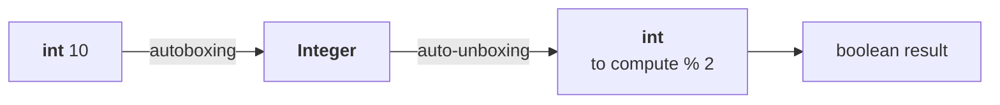

# Where we are

Four one-argument interfaces, three two-argument ones:

| One argument | Two arguments |
|---|---|
| `Predicate` | `BiPredicate` |
| `Function` | `BiFunction` |
| `Consumer` | `BiConsumer` |
| `Supplier` | — *(nothing to double)* |

> [!info] **And there it stops.** *"For three arguments, a predefined functional interface is not
> there — you have to write the code explicitly based on your requirement."* The API gives you one and
> two; beyond that you declare your own functional interface.

Only **three** names in the package begin with `Bi` — `BiConsumer`, `BiFunction`, `BiPredicate` — and
in the documentation they sit together because the listing is alphabetical.

---

# The problem this part exists to solve

Everything so far works. It also has a **performance cost that is invisible until you look for it.**

## Watch what happens to one `int`

```java
import java.util.function.*;

Predicate<Integer> p = i -> i % 2 == 0;
System.out.println(p.test(10));
```

Measured on JDK 25: `true`. Correct — and expensive.

**`Predicate<Integer>`, not `Predicate<int>`.** A type parameter must be a **reference type**, never a
primitive. So passing the literal `10` sets off a chain:



1. `int` → `Integer`, because the predicate expects an `Integer` — **autoboxing**
2. `Integer` → `int`, because arithmetic like `% 2` only works on primitives — **auto-unboxing**

> **Autoboxing** = automatic conversion from primitive to wrapper object.
> **Auto-unboxing** = automatic conversion from wrapper object back to primitive.
>
> Both arrived in Java 1.5. Here they are doing work nobody asked for.

## Now scale it

```java
int[] x = {0, 5, 10, 15, 20, 25, 30};
for (int x1 : x) if (p.test(x1)) System.out.println(x1);
```

Output is `0 10 20 30`. But **seven values means seven autoboxings and seven auto-unboxings**. Ask for
50 numbers and it is fifty of each.

> [!important] **The conclusion, and it is the reason the rest of this part exists.** *"Whatever
> functional interfaces we discussed up to this — these things are applicable for **object types**, but
> not for primitive types."* Feed them primitives and you pay conversion on every single call.
>
> **The fix is the primitive versions.**

---

# Primitive predicates

```java
IntPredicate p = i -> i % 2 == 0;
int[] x = {0, 5, 10, 15, 20, 25, 30};
for (int x1 : x) if (p.test(x1)) System.out.print(x1 + " ");
```

Measured on JDK 25:

```
0 10 20 30 
```

**Identical output. Zero autoboxing, zero auto-unboxing.**

> [!important] **Notice what is missing: the type parameter.** `IntPredicate`, not
> `IntPredicate<Integer>`. *"Where is our type parameter? Gone. We are not required to specify it —
> because which type of input this predicate can take is already there in the name itself."*

**The three primitive predicates:**

| | Takes |
|---|---|
| `IntPredicate` | `int` |
| `LongPredicate` | `long` |
| `DoublePredicate` | `double` |

Method is still `test()`, and `and()` / `or()` / `negate()` are all still there. *"Whatever names and
so on, everything is the same."*

> [!info] **A question from the class: is there a primitive `BiPredicate`?** No. Measured on JDK 25,
> `IntBiPredicate` gives `cannot find symbol`. **For two primitive arguments you must use the ordinary
> `BiPredicate` and accept the boxing.**

---

# Primitive functions

Functions have **two** types to worry about — input and return — so their primitive family is larger,
and it splits into three groups by which end you control.

## Group 1 — control the INPUT only

| | Takes | Returns |
|---|---|---|
| `IntFunction<R>` | `int` | **anything** |
| `LongFunction<R>` | `long` | **anything** |
| `DoubleFunction<R>` | `double` | **anything** |

Method: `apply()`.

## Group 2 — control BOTH ends

| | Takes | Returns | Method |
|---|---|---|---|
| `IntToLongFunction` | `int` | `long` | **`applyAsLong`** |
| `IntToDoubleFunction` | `int` | `double` | **`applyAsDouble`** |
| `LongToIntFunction` | `long` | `int` | **`applyAsInt`** |
| `LongToDoubleFunction` | `long` | `double` | **`applyAsDouble`** |
| `DoubleToIntFunction` | `double` | `int` | **`applyAsInt`** |
| `DoubleToLongFunction` | `double` | `long` | **`applyAsLong`** |

> [!important] **The method is NOT `apply` — and this is where he says most people fail.** For anything
> with a primitive return type the method is **`applyAsInt`**, **`applyAsLong`** or **`applyAsDouble`**,
> named after **what comes out**, not what goes in.
>
> *"Most of the people are going to fail. Boss, it is just `apply`? No — `applyAsLong`."*
>
> The rule that makes it guessable: **read the return type, then say `applyAs<ReturnType>`.**

## Group 3 — control the RETURN only

| | Takes | Returns | Method |
|---|---|---|---|
| `ToIntFunction<T>` | **anything** | `int` | `applyAsInt` |
| `ToLongFunction<T>` | **anything** | `long` | `applyAsLong` |
| `ToDoubleFunction<T>` | **anything** | `double` | `applyAsDouble` |
| `ToIntBiFunction<T, U>` | **any two** | `int` | `applyAsInt` |
| `ToLongBiFunction<T, U>` | **any two** | `long` | `applyAsLong` |
| `ToDoubleBiFunction<T, U>` | **any two** | `double` | `applyAsDouble` |

**A worked pick.** *Write a function to find the square root of a given number.* Input is `int`, and
`Math.sqrt` returns `double` — so both ends are primitive and known: `IntToDoubleFunction`.

```java
IntToDoubleFunction sqrt = i -> Math.sqrt(i);
System.out.println(sqrt.applyAsDouble(9));
System.out.println(sqrt.applyAsDouble(7));
```

Measured on JDK 25:

```
3.0
2.6457513110645907
```

**No boxing anywhere.** Had this been `Function<Integer, Double>` there would be a conversion on the
way in *and* on the way out.

> [!info] **A realistic version of the same shape.** Give an employee number, get back the salary.
> Employee number is `int`, salary is `double` — `IntToDoubleFunction` again.

**And when only one end is a primitive**, you have a choice: `ToIntFunction<String>` (any input, `int`
out) or `IntFunction<R>` (`int` in, any output). *"You can control either the input type or the return
type."* One conversion remains at the uncontrolled end.

```java
ToIntFunction<String> len = s -> s.length();
System.out.println(len.applyAsInt("Durga"));
```

Measured on JDK 25: `5`.

---

# Primitive consumers and suppliers

## Consumers

| | Takes |
|---|---|
| `IntConsumer` | `int` |
| `LongConsumer` | `long` |
| `DoubleConsumer` | `double` |
| `ObjIntConsumer<T>` | an object **and** an `int` |
| `ObjLongConsumer<T>` | an object **and** a `long` |
| `ObjDoubleConsumer<T>` | an object **and** a `double` |

**Method is always `accept`** — no `acceptAsInt`, because a consumer returns nothing, so there is no
return type to name. That is the one place the naming rule does not apply, and it is consistent once
you see why.

The `Obj…Consumer` family is *"something like `BiConsumer`"* — two arguments, where the **first is any
object type and the second is a primitive**.

```java
IntConsumer ic = i -> System.out.println(i);
ic.accept(42);

ObjIntConsumer<String> oic = (s, i) -> System.out.println(s + i);
oic.accept("value ", 99);
```

Measured on JDK 25:

```
42
value 99
```

## Suppliers

A supplier takes **no input**, so the only thing to specialise is the **return type** — and here
`boolean` gets its own, which it does nowhere else:

| | Returns | Method |
|---|---|---|
| `BooleanSupplier` | `boolean` | **`getAsBoolean`** |
| `IntSupplier` | `int` | **`getAsInt`** |
| `LongSupplier` | `long` | **`getAsLong`** |
| `DoubleSupplier` | `double` | **`getAsDouble`** |

Same naming rule as the functions, with `get` instead of `apply`.

```java
BooleanSupplier bs = () -> true;
IntSupplier is = () -> 7;
LongSupplier ls = () -> 7L;
DoubleSupplier ds = () -> 7.5;
System.out.println(bs.getAsBoolean() + " " + is.getAsInt() + " " + ls.getAsLong() + " " + ds.getAsDouble());
```

Measured on JDK 25:

```
true 7 7 7.5
```

---

# `UnaryOperator` — when input and output are the same type

Now a different kind of specialisation. Not about primitives at all.

```java
Function<Integer, Integer> f = i -> i * i;
```

Look at that line: **`Integer` twice.** Input type and return type are the same, and you had to say so
twice.

> **If the input type and the output type are always the same, don't use `Function` — use
> `UnaryOperator`.**

```java
UnaryOperator<Integer> uo = i -> i * i;
System.out.println(uo.apply(6));
```

Measured on JDK 25: `36`. **One type parameter instead of two.**

## The proof that it is a `Function`

Measured on JDK 25:

```
$ javap java.util.function.UnaryOperator
public interface java.util.function.UnaryOperator<T> extends java.util.function.Function<T, T> {
```

> **`UnaryOperator<T>` is literally `Function<T, T>`** — a child of `Function` with both parameters
> pinned to the same type. It inherits `apply`, `andThen` and `compose` unchanged.

**Its primitive versions**, which drop the type parameter entirely:

| | Takes and returns | Method |
|---|---|---|
| `IntUnaryOperator` | `int` | `applyAsInt` |
| `LongUnaryOperator` | `long` | `applyAsLong` |
| `DoubleUnaryOperator` | `double` | `applyAsDouble` |

> [!info] **It need not be a primitive to be worth using.** *"If I provide a `Student` object as
> argument, the input is `Student` and the output is also `Student` — then don't go for a function,
> better to go for `UnaryOperator`."* Increment an employee's salary and hand the employee back: same
> type in, same type out.

---

# `BinaryOperator` — two arguments, all three types the same

The same idea one level up.

```java
BiFunction<String, String, String> f = (s1, s2) -> s1 + s2;
```

**`String` three times.** Two inputs and the result are all the same type — so:

```java
BinaryOperator<String> bo = (s1, s2) -> s1 + s2;
System.out.println(bo.apply("Durga", "Software"));
```

Measured on JDK 25:

```
DurgaSoftware
```

**One type parameter instead of three.** And the same proof:

```
$ javap java.util.function.BinaryOperator
public interface java.util.function.BinaryOperator<T> extends java.util.function.BiFunction<T, T, T> {
```

> **`BinaryOperator<T>` is `BiFunction<T, T, T>`** — a child of `BiFunction`.

| | Takes two | Returns | Method |
|---|---|---|---|
| `IntBinaryOperator` | `int` | `int` | `applyAsInt` |
| `LongBinaryOperator` | `long` | `long` | `applyAsLong` |
| `DoubleBinaryOperator` | `double` | `double` | `applyAsDouble` |

```java
IntBinaryOperator ibo = (a, b) -> a * b;
System.out.println(ibo.applyAsInt(10, 20));
```

Measured on JDK 25: `200`.

## Unary vs binary, in one line

> **`UnaryOperator` applies to ONE input type. `BinaryOperator` applies to TWO input types — and both
> require that all the types involved are the same.**

---

# A question from the class — chaining primitive operators

Kalim asks: *if I want to increment `i` and also square it, is that one example or two?*

**Two.** Each takes one `int` and returns one `int`, so each is an `IntUnaryOperator`:

```java
IntUnaryOperator f1 = i -> i + 1;
IntUnaryOperator f2 = i -> i * i;
System.out.println(f1.applyAsInt(4));
System.out.println(f2.applyAsInt(5));
System.out.println(f1.andThen(f2).applyAsInt(4));
```

Measured on JDK 25:

```
5
25
25
```

The chained call: 4 + 1 = 5, then 5 × 5 = **25**.

> [!question]- **Deep dive — so why not write one operator that does both?** The follow-up question,
> and the answer is about who gets to reuse what.
>
> You *could* write a single operator doing increment-then-square. But then:
>
> - somebody who wants **only the increment** cannot have it
> - somebody who wants **only the square** cannot have it
> - somebody who wants **both** is the only one served
>
> Keep them separate and **all three** are served: call `f1`, call `f2`, or call `f1.andThen(f2)`.
> *"If we are taking different, that is the biggest advantage. In the same function, if we are doing
> all the operations, then individual calling is not applicable."*
>
> This is the composition argument in miniature, and it is why the API ships small interfaces and
> chaining methods rather than big ones.

---

# The whole package, measured

He explores the API live rather than reciting it. For reference, here is the complete list, taken from
the JDK 25 sources — **43 functional interfaces** in `java.util.function`:

```
BiConsumer            BiFunction            BiPredicate           BinaryOperator
BooleanSupplier       Consumer              DoubleBinaryOperator  DoubleConsumer
DoubleFunction        DoublePredicate       DoubleSupplier        DoubleToIntFunction
DoubleToLongFunction  DoubleUnaryOperator   Function              IntBinaryOperator
IntConsumer           IntFunction           IntPredicate          IntSupplier
IntToDoubleFunction   IntToLongFunction     IntUnaryOperator      LongBinaryOperator
LongConsumer          LongFunction          LongPredicate         LongSupplier
LongToDoubleFunction  LongToIntFunction     LongUnaryOperator     ObjDoubleConsumer
ObjIntConsumer        ObjLongConsumer       Predicate             Supplier
ToDoubleBiFunction    ToDoubleFunction      ToIntBiFunction       ToIntFunction
ToLongBiFunction      ToLongFunction        UnaryOperator
```

> [!important] **Do not memorise that list — memorise the naming scheme, and every name is derivable.**
>
> | Fragment | Means |
> |---|---|
> | `Bi…` | takes **two** arguments |
> | `Int…` / `Long…` / `Double…` | the **input** is that primitive |
> | `To<Type>…` | the **return** is that primitive; input is anything |
> | `<A>To<B>Function` | input `A`, return `B` — both primitive |
> | `Obj<Type>Consumer` | an object **and** that primitive, returns nothing |
> | `UnaryOperator` | `Function` where input and output are the same type |
> | `BinaryOperator` | `BiFunction` where all three types are the same |
> | method `applyAs<Type>` / `getAs<Type>` | named after the **return** type |
>
> That is why he keeps guessing names correctly before checking the documentation — and gets them
> right nearly every time.

> [!info] **His closing observation, worth keeping.** *"In every example we used a lambda expression,
> but you never felt that we are using a special concept — because we are already habituated. If you
> start using these things in regular coding, we are habituating functional programming, and indirectly
> lambda expressions."* The interfaces are not the point; they are the scaffolding that makes lambdas
> ordinary.

---

# What this part established

| | |
|---|---|
| Three-argument interfaces | **do not exist** — write your own |
| Only three `Bi` types | `BiPredicate`, `BiFunction`, `BiConsumer` |
| The problem with the generic versions | type parameters must be **reference types**, so primitives box |
| Autoboxing | primitive → wrapper; **auto-unboxing** wrapper → primitive; both since 1.5 |
| Cost | one box **and** one unbox **per call** — seven elements, seven of each |
| The fix | the **primitive versions**, which take no type parameter |
| Primitive predicates | `IntPredicate`, `LongPredicate`, `DoublePredicate` |
| Primitive `BiPredicate` | ❌ does not exist |
| Control input only | `IntFunction<R>`, `LongFunction<R>`, `DoubleFunction<R>` |
| Control both | `IntToDoubleFunction` and its five siblings |
| Control return only | `ToIntFunction<T>`, `ToLongFunction<T>`, `ToDoubleFunction<T>` (+ `Bi` forms) |
| The method-name rule | **`applyAs<ReturnType>`** — named after what comes **out** |
| Consumers | always `accept` — nothing is returned, so nothing to name |
| Suppliers | `getAsBoolean` / `getAsInt` / `getAsLong` / `getAsDouble` |
| `UnaryOperator<T>` | **is** `Function<T, T>` — proved with `javap` |
| `BinaryOperator<T>` | **is** `BiFunction<T, T, T>` — proved with `javap` |
| Use them when | input and output types are the **same** — one type parameter, not two or three |
| Chaining primitives | `f1.andThen(f2).applyAsInt(4)` → 4+1=5, 5×5 = **25** |
| Keep operators small | so callers can use either one alone, or both chained |
| Total in `java.util.function` | **43** interfaces, all derivable from the naming scheme |
