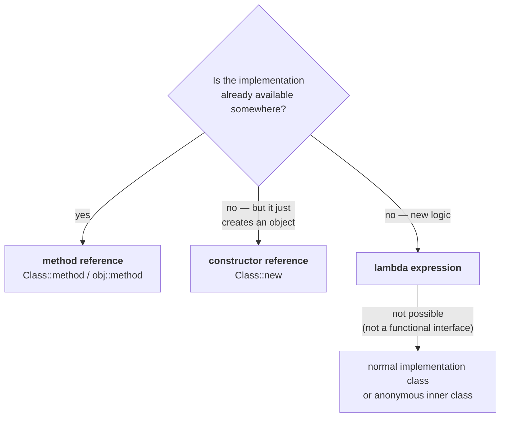

# The problem with writing a lambda every time

A lambda expression is written **fresh, at the point of use**. Open the parentheses, write the arrow,
write the body. Every time.

But very often **the code you want already exists somewhere** — in a method you or somebody else wrote
months ago. Writing it again as a lambda duplicates it.

> **Method references and constructor references are an alternative syntax to lambda expressions**, and
> their advantage is **code reusability** — you point at existing code instead of re-implementing it.

Both use the **double colon operator, `::`**.

> [!info] **Not C++'s `::`.** In C++ the double colon is the **scope resolution operator**. In Java it
> means **method reference** or **constructor reference**. Same symbol, completely different job.

---

# Method reference

## Where we start

A thread body, written as a lambda:

```java
Runnable r = () -> {
    for (int i = 0; i < 10; i++) System.out.println("Child Thread");
};
Thread t = new Thread(r);
t.start();
```

This lambda is the implementation of **`run()`**, because `Runnable` has only that one abstract method.

## Now suppose the code already exists

```java
public static void m1() {
    for (int i = 0; i < 10; i++) System.out.println("Child Thread");
}
```

*"That job of the child thread is already available inside `m1`. If the functional interface refers to
this method instead of writing it again and again, our life will become very easy."*

```java
Runnable r = MRef::m1;
```

That is it. **The lambda is gone.** When anybody calls `run()` on `r`, `MRef.m1()` executes in its
place.

Measured on JDK 25:

```
Child Thread 1
Child Thread 1
Child Thread 1
```

> **A functional interface method can be mapped to a method we specify, using `::`.** In this example,
> `Runnable`'s `run()` refers to `MRef`'s `m1()`. Ask for `run`, get `m1`.

## Static or instance — both work, with different syntax

| The target method is | Syntax |
|---|---|
| **static** | `ClassName::methodName` |
| **instance** | `objectReference::methodName` |

The reason is the ordinary one: **an instance method can only be called on an object**, so a reference
to it needs an object.

```java
MRef t1 = new MRef();
Runnable r2 = t1::m2;
new Thread(r2).start();
```

Measured on JDK 25:

```
Child Thread 2
Child Thread 2
Child Thread 2
```

Get it wrong — name an instance method through the class — and it fails. Measured on JDK 25:

```java
public void m1() { }
Runnable r = BadStatic::m1;
```

```
error: incompatible types: invalid method reference
    unexpected instance method m1() found in unbound lookup
```

> [!info] **Recognise this one by the first line, `invalid method reference`** — the second line
> explaining *why* is worded differently across JDK versions, but the first is stable.

---

# The one rule: argument types must match

This is the whole contract, and it is narrower than people expect.

> **In a method reference, only the ARGUMENT TYPES must match. Everything else is free.**

| Must match | Need not match |
|---|---|
| **argument types** | method **name** |
| | **return** type |
| | **modifiers** (`public`, `private`, …) |

## Proof — a private method with a different return type

`Runnable.run()` is `public void run()`. Point it at this:

```java
private int m2() {
    for (int i = 0; i < 3; i++) System.out.println("Child Thread 2");
    return 0;
}
```

**`private`, not `public`. Returns `int`, not `void`. Named `m2`, not `run`.** Measured on JDK 25 — it
compiles and runs correctly.

> *"I'm not performing overriding, just I'm giving the reference. That's all."* This is the key insight:
> a method reference is **not** an override, so none of the override rules apply. Only the call has to
> work, and for the call to work only the arguments matter.

## And what happens when the arguments differ

```java
public static void m1(int x) { }
Runnable r = BadArg::m1;
```

`run()` takes no arguments; `m1` demands an `int`. Measured on JDK 25:

```
error: incompatible types: invalid method reference
    method m1 in class BadArg cannot be applied to given types
      required: int
```

## A second worked example

```java
interface Interf { public void add(int a, int b); }

class Sum {
    public static void sum(int x, int y) {
        System.out.println("The sum is " + (x + y));
    }
    public static void main(String[] args) {
        Interf i = (a, b) -> System.out.println("The sum is " + (a + b));
        i.add(10, 20);

        Interf i1 = Sum::sum;
        i1.add(100, 200);
    }
}
```

Measured on JDK 25:

```
The sum is 30
The sum is 300
```

`Interf.add` and `Sum.sum` have **different names**, and it does not matter — both take `(int, int)`.
Calling `i1.add(100, 200)` routes those two arguments straight into `sum`.

---

# Constructor reference

The same idea, pointed at a constructor instead of a method.

```java
ClassName::new
```

> **When do you use it?** *If the functional interface method returns an object* — if its job is
> **create an object and return it** — then go for a constructor reference.

## The basic form

```java
class Sample2 {
    Sample2() { System.out.println("Sample class constructor executed"); }
    Sample2(String s) { System.out.println("Sample class constructor with the argument: " + s); }
}

interface I1 { public Sample2 get(); }
interface I2 { public Sample2 get(String s); }

class CRef {
    public static void main(String[] args) {
        I1 i = Sample2::new;
        Sample2 s1 = i.get();
        Sample2 s2 = i.get();
        Sample2 s3 = i.get();

        System.out.println("--- with an argument ---");
        I2 i2 = Sample2::new;
        i2.get("Durga");
        i2.get("Ravi");
    }
}
```

Measured on JDK 25:

```
Sample class constructor executed
Sample class constructor executed
Sample class constructor executed
--- with an argument ---
Sample class constructor with the argument: Durga
Sample class constructor with the argument: Ravi
```

**Three calls to `i.get()`, three objects created** — each call runs the constructor again. And the
constructor may contain far more than a `println`: *"while creating this object we may have some bigger
code — all that code also will be executed."*

## Overload selection is automatic

`Sample2` has **two** constructors, and the same `Sample2::new` was used for both interfaces. The
compiler never gets confused:

> **The matching-argument constructor is always chosen.** `I1.get()` takes nothing → the no-arg
> constructor. `I2.get(String)` takes a `String` → the `String` constructor.

---

# The example that shows why this is worth it

Four fields, so a four-argument constructor:

```java
class Student2 {
    String name; int rollno, marks, age;
    Student2(String name, int rollno, int marks, int age) { … }
}
interface I3 { public Student2 get(String name, int rollno, int marks, int age); }
```

**Three ways to implement `I3`, worst to best:**

**1. A separate implementation class.**

```java
class Demo implements I3 {
    public Student2 get(String name, int rollno, int marks, int age) {
        Student2 s = new Student2(name, rollno, marks, age);
        return s;
    }
}
```

A whole class, a method signature repeating all four parameters, an object creation, a return.

**2. A lambda expression.**

```java
I3 lambda = (n, r, m, a) -> new Student2(n, r, m, a);
```

Better — but you still name all four parameters and pass them all through by hand.

**3. A constructor reference.**

```java
I3 ref = Student2::new;
```

Measured on JDK 25, both 2 and 3 work identically:

```
Student created: Durga 101 95 30
Student created: Ravi 102 88 28
```

> *"We are not required to worry about the number of arguments, we are not required to worry about
> creating an object."* Four parameters or forty — `Student2::new` does not change.

## Which one to use, as a decision



> **If the implementation is already available somewhere, reuse it with a method reference. If it is
> not available, go for a lambda expression. If a lambda is not possible either, go for a normal
> implementation.**

---

# A correction he makes at the end

> [!important] **A YouTube comment claimed that for a constructor reference the RETURN types must also
> match. He says flatly that this is wrong.**
>
> *"No, it is wrong. Return types are not required to match — only arguments are required to match."*
>
> And the proof is already in this note: the `private int m2()` pointed at `Runnable`'s
> `public void run()`. **Different return type, different modifier, different name — compiles and runs
> on JDK 25.** The argument list is the only thing checked.

---

# What this part established

| | |
|---|---|
| `::` is | the **double colon operator** — method reference and constructor reference |
| Not to be confused with | C++'s scope resolution operator |
| They are | an **alternative syntax** to lambda expressions |
| Their advantage | **code reusability** — point at existing code instead of rewriting it |
| Static target | `ClassName::methodName` |
| Instance target | `objectReference::methodName` |
| Instance method via class name | ❌ `invalid method reference` |
| **Must** match | the **argument types**, and nothing else |
| Need **not** match | method name, return type, modifiers |
| Why the rules are so loose | a method reference is **not** an override — only the call must work |
| Constructor reference | `ClassName::new` |
| Use it when | the functional interface method's job is to **create and return an object** |
| Multiple constructors | the **matching-argument** one is selected automatically |
| Every call to `get()` | runs the constructor again — a new object each time |
| Order of preference | implementation exists → **method reference**; creates an object → **constructor reference**; otherwise → **lambda** |
| The comment he corrects | return types do **not** need to match — only arguments |
