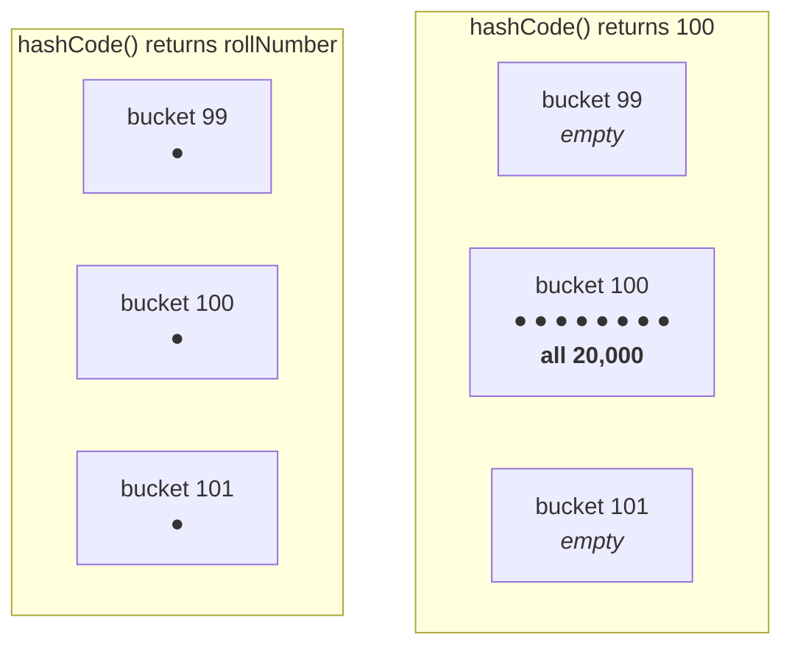

# What a hash code is not

He opens by asking how many people believe **hash code represents the address of the object** — a
common assumption — and then dismantles it with one question:

> **Is it possible to override `hashCode()`?** Yes.
> **Is it possible to override the address of an object?** No.
>
> **Therefore hash code and address are not the same thing.**

> [!important] **And a stronger fact underneath it:** in Java it is **impossible to know the address of
> an object**, or its size. Java is a **programmer-friendly** language, not a **machine-friendly** one —
> it does not expose memory-level information. *"If you want to know the address of an object or the
> size of an object, don't go for Java — better to go for C or C++."*

---

# What it is

> **For every object a unique number is generated by the JVM, which is the hash code.**

## What the JVM uses it for

> **The JVM uses hash code while saving objects into hashing-related data structures** — `HashSet`,
> `HashMap`, `Hashtable`.

Those structures are made of **buckets**:

- An object is added. The JVM asks it: *"what is your hash code?"* — **100**. It goes into bucket 100.
- The next object answers **150**. It goes into bucket 150.

> **All objects are inserted based on their hash code.** And the payoff is that **searching becomes
> efficient.**

---

# Why that matters — three search algorithms

> [!question]- **Deep dive — searching for Ravi in a classroom, three ways.** His comparison of linear
> search, binary search and hashing, and it is the clearest justification for hash codes in the chapter.
>
> Somebody asks: **is there a student named Ravi in this class?**
>
> **Linear search.** Ask each person in turn: *"Are you Ravi? Are you Ravi? Are you Ravi?"* With 1,000
> students and Ravi last — or absent — that is **1,000 comparisons**. 10 students, 10 seconds; 1,000
> students, 1,000 seconds.
> > Time complexity **O(n)**. *"The simplest search algorithm — and the worst."*
>
> **Binary search.** First make everyone sit in **alphabetical order**. Compare `R` with the middle
> person: if `R` is greater, throw away the first half; if smaller, throw away the second. Halve again,
> and again.
> > Time complexity **O(log n)**. Better — but still grows with the number of students.
>
> **Hashing.** Ask one question: **"Ravi, what is your hash code?"** — *100*. Go **directly** to bucket
> 100. Is Ravi there? Then he is in the class. Is the bucket empty? Then he is not.
> > *"I am never going to worry about the remaining buckets."* Time complexity **O(1)**.
>
> **The point:** linear and binary search both get slower as the class grows. **Hashing does not.** Ten
> elements or one crore, the answer takes one step.
>
> > **"The most powerful search algorithm up to today is hashing."**

---

# The default implementation

If you do not override it, `Object`'s version runs:

```java
public native int hashCode();
```

> **The `Object` class `hashCode()` method generates a hash code based on the address of the object.**

Measured on JDK 25:

```
default (Object's):
  498931366
  622488023
```

> [!important] **"Based on the address" is not "is the address".** Suppose the object's address is
> `1024`. The native implementation runs it through some algorithm — *"3 × 6 ÷ 2 × 10.7 …"*, we do not
> know which — and the result is `132`.
>
> **`132` is not an address.** The address was an *input* to the calculation, not the output. *"If you
> give the chance to `Object`'s `hashCode()` it will generate a hash code based on the address — it
> doesn't mean the hash code represents the address."*
>
> This also explains the note in `DECLARATIONS-AND-ACCESS-MODIFIERS/10`: `hashCode()` is `native`
> precisely **because** Java itself cannot see addresses.

---

# Overriding it — properly and improperly

> **Based on our requirement we can override `hashCode()` in our class, to generate our own hash code.**

But there is a right and a wrong way.

## The improper way

```java
class StudentBad {
    public int hashCode() { return 100; }
}
```

Measured on JDK 25:

```
overridden, constant (improper):
  100
  100
```

**Every student answers 100.** First student — *"what is your hash code?"* — 100. Second student — 100.

## The proper way

```java
class StudentGood {
    int rollNumber;
    public int hashCode() { return rollNumber; }
}
```

Measured on JDK 25:

```
overridden, roll number (proper):
  101
  102
```

**Every student has a different roll number, so every object gets a different hash code.**

> **Overriding `hashCode()` is said to be proper if, for every object, it generates a unique number.**

## Why the improper one is actually harmful

He asks the class *"what is the problem with returning the same number?"* — and the answer is the whole
point of hashing.

**If every object returns 100, every object goes into bucket 100.** The buckets exist to spread objects
out; a constant hash code collapses them into one. And a search now has to scan that single bucket
linearly — **you are back to O(n)**, having paid for a hash table.

**Measured on JDK 25** — inserting 20,000 objects into a `HashSet`:

```
constant hashCode : 913 ms
unique hashCode   : 3 ms
```

> [!important] **300× slower, from one line of code.** The program is still *correct* with the constant
> hash code — it just silently throws away everything the data structure was for. That is why the
> distinction between "proper" and "improper" is worth the name.



---

# What this part established

| | |
|---|---|
| Hash code is **not** | the address of the object |
| The proof | you can override a hash code; you cannot override an address |
| In Java you cannot know | an object's **address** or its **size** — go to C/C++ for that |
| Hash code is | a **unique number generated by the JVM** for every object |
| Who uses it | the **JVM**, when storing objects in hashing data structures |
| Where | `HashSet`, `HashMap`, `Hashtable` — objects go into **buckets** by hash code |
| Linear search | **O(n)** — ask everyone |
| Binary search | **O(log n)** — sort, then halve repeatedly |
| **Hashing** | **O(1)** — go straight to the bucket |
| The default `hashCode()` | `Object`'s, **native**, computed **from** the address |
| "Based on the address" | ≠ "is the address" |
| Proper override | a **different** number per object — e.g. the roll number |
| Improper override | the **same** number for all objects |
| Measured cost of improper | **913 ms vs 3 ms** for 20,000 inserts |
| Why | every object lands in one bucket — the search degrades to **O(n)** |
