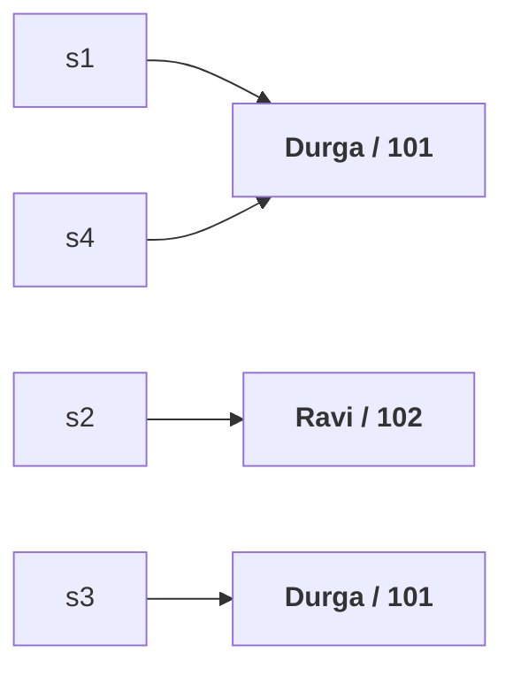

# What `equals()` is for

> **We can use `equals()` to check the equality of two objects.**

```java
obj1.equals(obj2);
```

And if our class does not define one, **`Object`'s `equals()` is executed.** The whole part is about what that default does, why it is usually wrong for your classes, and how to replace it correctly.

---

# The default behaviour

```java
class Student {
    String name; int rollNumber;
    Student(String name, int rollNumber) { this.name = name; this.rollNumber = rollNumber; }
}

Student s1 = new Student("Durga", 101);
Student s2 = new Student("Ravi",  102);
Student s3 = new Student("Durga", 101);   // same content as s1
Student s4 = s1;                          // same object as s1
```



Measured on JDK 25:

```
s1.equals(s2) → false
s1.equals(s3) → false
s1.equals(s4) → true
```

## Reading the middle one

`s1` and `s3` are **two different objects with identical content**. The default said `false`.

> [!important] **He stops here and asks a non-Java question.** In my class there are two students. Both have the same name, Durga. Both have the same roll number, 101. Are they equal or not?
>
> **Logically, yes.** So `false` is the **correct** output of the code and the **wrong** answer to the question — which is exactly the gap you override `equals()` to close.

> **The `Object` class `equals()` is meant for REFERENCE comparison (address comparison), not content comparison.** If two references point to the same object it returns `true`; otherwise `false`, however identical the contents.

> [!info] **Which is why the default is nearly useless for your own classes.** Reference comparison already has an operator — **`==`**. A method that does exactly what `==` does adds nothing. Most of the time we need to cross-check content, not references.

---

# Overriding it

## First decide what `equal` means

> If you want to override `equals()`, compulsorily you have to decide what content equality means.

For this `Student`, two fields exist, so: **same name and same roll number ⇒ equal.** Another requirement might demand same father's name and address too.

> **Requirement to requirement, the meaning of equality changes.** That decision is yours to make before you write a line.

## The signature, and the question it raises

```java
public boolean equals(Object obj)
```

> To perform a comparison two objects are required. But the argument gives only one. Where is the second?

**The second is `this`.** In `s1.equals(s2)`, `s2` arrives as `obj` and **`s1` is the object the method was called on**. Both are present; one is just implicit.

## The implementation

```java
public boolean equals(Object obj) {
    String name1 = this.name;
    int rollNumber1 = this.rollNumber;

    Student s = (Student) obj;          // cast — see below
    String name2 = s.name;
    int rollNumber2 = s.rollNumber;

    if (name1.equals(name2) && rollNumber1 == rollNumber2) return true;
    else return false;
}
```

Measured on JDK 25:

```
s1.equals(s2) → false
s1.equals(s3) → true      ← was false
s1.equals(s4) → true
```

**The middle answer flipped**, which was the entire point.

> [!important] **Two details in that method worth pausing on.**
>
> **Why the cast is necessary.** The parameter is declared `Object`. You can't ask an `Object` 'what is your name?' — it doesn't know what a name is. If it is a `Student`, it can tell you. The cast is what lets you reach `name` and `rollNumber`.
>
> **Why `.equals` for one field and `==` for the other.** `name1.equals(name2)` because names are **`String` objects**, and `String`'s `equals()` is already overridden for content comparison. `rollNumber1 == rollNumber2` because roll numbers are **primitives** — methods are applicable only for objects.

---

# The bug in that implementation

What happens when somebody passes an unrelated type?

```java
s1.equals("Durga")     // Student vs String
```

**Our version.** Measured on JDK 25:

```
Exception in thread "main" java.lang.ClassCastException:
class java.lang.String cannot be cast to class Student3
```

**`Object`'s version, same situation.** Measured on JDK 25:

```
false
```

> [!important] **This is a real defect, not a curiosity.** Our `equals()` **throws** where the method it replaced **returns `false`**. Any code that compares heterogeneous objects — and collections do this routinely — would crash against our class but not against a well-behaved one. **An override must not be more fragile than what it overrides.**

## The fix

```java
public boolean equals(Object obj) {
    try {
        Student s = (Student) obj;
        return this.name.equals(s.name) && this.rollNumber == s.rollNumber;
    } catch (ClassCastException e) {
        return false;
    }
}
```

Measured on JDK 25:

```
s1.equals(s3)      → true
s1.equals("Durga") → false
```

> **If we are passing a different type of object, our `equals()` should not raise `ClassCastException` — it should return `false`**, exactly as `Object`'s does.

> [!info] **What you would actually write today.** Catching `ClassCastException` works and makes his point about matching the contract, but the idiomatic form tests the type first and avoids the exception entirely:
> ```java
> public boolean equals(Object obj) {
>     if (this == obj) return true;
>     if (!(obj instanceof Student s)) return false;   // pattern matching, Java 16+
>     return rollNumber == s.rollNumber && name.equals(s.name);
> }
> ```
> `instanceof` is also **`null`-safe** — `null instanceof Student` is `false` — which the cast version is not: passing `null` skips the `ClassCastException` and fails later on `s.name`. Same contract, no exception used as control flow.

---

# What this part established

| | |
|---|---|
| `equals()` checks | the equality of two objects |
| `Object`'s `equals()` does | **reference (address) comparison** |
| So identical content in two objects gives | **`false`** |
| Which duplicates | the **`==`** operator — adding nothing |
| Before overriding | decide **what equality means** for your class |
| The second object | is **`this`** — the one the method was called on |
| The cast is needed | because the parameter is `Object`, which knows no fields |
| `String` fields | compare with **`.equals()`** |
| primitive fields | compare with **`==`** |
| Passing an unrelated type — our version | ❌ `ClassCastException` |
| Passing an unrelated type — `Object`'s | ✅ `false` |
| The fix | catch it and return **`false`** — match the contract |
| The modern form | `instanceof` pattern matching — also **null-safe** |
