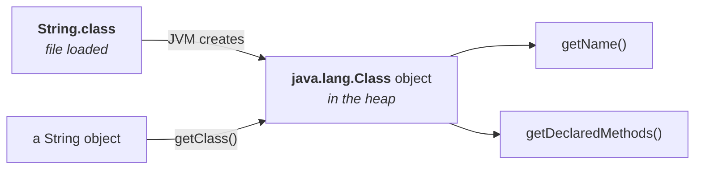

# `getClass()`

> **`public final Class getClass()`** — **returns the runtime class definition of an object.**

## The situation it solves

```java
ArrayList l = …;
Object o = l.get(0);
```

**What type is `o`?** You do not know. An `ArrayList` can hold anything — a `Student`, a `Customer`, a
`String`. That is why `get()` is declared to return **`Object`**: it is the only type that fits every
possibility.

So you are holding an object whose class you cannot see. `getClass()` hands you that class:

```java
Class c = o.getClass();
```

> [!important] **What comes back is an object of type `java.lang.Class`.** It is not the object's data —
> it is the **class definition itself**, packaged as an object you can interrogate: its name, its
> methods, its constructors, its parent.

## Where that `Class` object comes from

> **After loading every `.class` file, the JVM creates an object of type `java.lang.Class` in the heap
> area.** One per loaded class.
>
> **The programmer can use that `Class` object to get class-level information.**

So `getClass()` does not build anything — it hands you the object the JVM already made at class loading
time.



## Interrogating it

```java
import java.lang.reflect.*;

Object o = new String("Durga");
Class c = o.getClass();
System.out.println("fully qualified name: " + c.getName());

Method[] m = c.getDeclaredMethods();
int count = 0;
for (Method m1 : m) count++;
System.out.println("the number of methods: " + count);
```

Measured on JDK 25:

```
fully qualified name: java.lang.String
the number of methods: 151
first few: value, equals, length
```

> [!important] **Never memorise a method count — measure it.** `String` reports **151** methods here,
> including private helpers; it was 73 in the Java 8 era, before `isBlank`, `strip`, `lines`, `repeat`,
> `formatted`, `chars` and `transform` arrived. The number is a property of the JDK you are running,
> and the reflection technique above is the only answer that stays correct.

**And it works on anything.** Measured on JDK 25:

```
Student
java.util.ArrayList
java.lang.String
java.lang.Integer
```

> [!info] **The import that is required.** `Method` lives in **`java.lang.reflect`**, a **sub-package**
> — so `java.lang` being automatic does not cover it. `import java.lang.reflect.*;` is mandatory.

## The real-world use — JDBC

> **This concept is called reflection**, and `getClass()` is its entry point.

```java
Connection con = DriverManager.getConnection(url, user, password);
System.out.println(con.getClass().getName());
```

**`Connection` is an interface.** So what class is that object actually? It depends on the vendor —
Oracle's driver returns one implementation, MySQL's another.

> *"I don't want to hard-code any vendor-specific name in my program. I want to use generalised API
> names."* You program against `Connection`; `getClass().getName()` tells you at runtime **which
> vendor's implementation you actually got**.

---

# `finalize()`

> **`protected void finalize() throws Throwable`**

> [!question]- **Deep dive — the garbage collector's last wish.** His story for what `finalize()` is,
> and it gets the sequence exactly right.
>
> An object has no references pointing to it, so it is **eligible for garbage collection**.
>
> The garbage collector arrives and is delighted — *"today I got wonderful food, just like biryani"* —
> a useless object is its food. It starts dancing in front of the object: *"I am going to destroy
> you."*
>
> **The object starts crying.** And the garbage collector is not a cruel person:
>
> > *"Definitely I am going to destroy you, because if I don't, I am not doing my job well and the JVM
> > will give me left and right. **But before destruction — do you have any last wish?** Let me know and
> > I will fulfil it, then destroy you."*
>
> The object answers: *"There is a database connection associated with me, a network connection
> associated with me. **Can you please close them?** Then you can destroy me."*
>
> **To fulfil that last wish, the garbage collector calls `finalize()`.** Once it completes, the object
> is destroyed.

> **Just before destroying an object, the garbage collector calls `finalize()` to perform clean-up
> activities. Once `finalize()` completes, the garbage collector destroys the object.**

| Question | Answer |
|---|---|
| Who calls it? | the **garbage collector** |
| When? | **just before** destroying the object |
| Why? | to perform **clean-up activities** |

> [!warning] **Never write a `finalize()` method.** It is deprecated **for removal**, and compiling any
> class that overrides it produces:
> ```
> warning: [removal] finalize() in Object has been deprecated and marked for removal
> ```
> The mechanism was always unreliable: **no guarantee it ever runs, no guarantee when**, it can
> resurrect the object, and it delays collection. For the exact use case above — closing a database or
> network connection — use **try-with-resources** for scoped cleanup and **`java.lang.ref.Cleaner`**
> for the rest. The description above is still the right mental model of what it *does*, and it is
> still asked about constantly.

---

# `wait()`, `notify()`, `notifyAll()`

| |
|---|
| `public final void wait() throws InterruptedException` |
| `public final void wait(long ms) throws InterruptedException` |
| `public final void wait(long ms, int ns) throws InterruptedException` |
| `public final native void notify()` |
| `public final native void notifyAll()` |

> **We can use these methods for INTER-THREAD COMMUNICATION.**

## The producer–consumer sketch

Two threads share an object. One **produces** items, the other **consumes** them.

- The **consumer** wants an update that has not happened yet. It calls **`wait()`** and enters the
  **waiting state** — in effect saying *"if anyone updates this, let me know; I'm waiting."*
- The **producer** performs the update, then calls **`notify()`**.
- The waiting consumer **receives the notification** and continues.

> **The thread that is expecting the update is responsible for calling `wait()`. The thread that
> performs the update is responsible for calling `notify()`.**

> [!important] **And these are `Object` methods, not `Thread` methods** — which is the interview
> question hiding here. They live on `Object` because **any object can serve as the lock** two threads
> coordinate on, so every object must be able to host a wait set.

Full treatment belongs to the multithreading chapter; this is the reason they appear in the list of
`Object`'s eleven.

---

# What this part established

| | |
|---|---|
| `getClass()` returns | the **runtime class definition** of an object |
| What that is | a **`java.lang.Class`** object |
| Where it comes from | the JVM creates one **per loaded `.class` file**, in the heap |
| What you can ask it | name, methods, constructors, parent — **class-level information** |
| The concept | **reflection** |
| Required import | **`java.lang.reflect`** — a sub-package |
| `String` method count | his JDK **73**; JDK 25 **151** |
| Real use | finding the **vendor-specific** class behind an interface like `Connection` |
| `finalize()` is called by | the **garbage collector** |
| When | **just before** destroying the object |
| Why | **clean-up activities** |
| ⚠️ Status | **deprecated for removal** — use try-with-resources or `Cleaner` |
| `wait` / `notify` / `notifyAll` | **inter-thread communication** |
| Who calls `wait()` | the thread **expecting** the update |
| Who calls `notify()` | the thread **performing** the update |
| Why they are on `Object` | **any object** can be the lock threads coordinate on |
