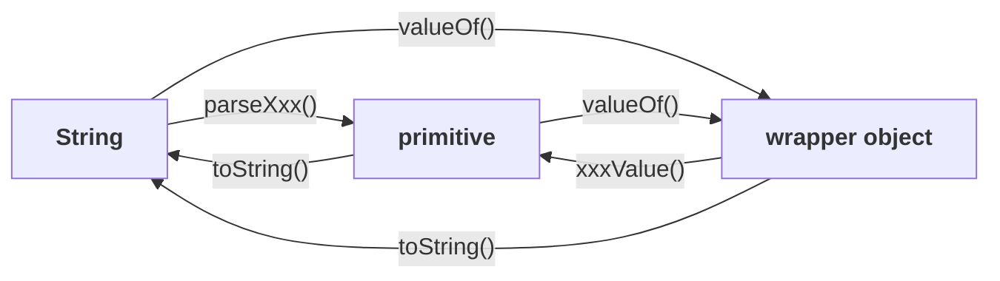

# The four utility methods

Every wrapper class carries the same small family of conversion methods. Learning them means learning **which direction each one converts**, and nothing else.

| Method | Converts |
|---|---|
| **`valueOf()`** | primitive **or** `String` → **wrapper object** |
| **`xxxValue()`** | wrapper object → **primitive** |
| **`parseXxx()`** | `String` → **primitive** |
| **`toString()`** | wrapper object **or** primitive → **`String`** |



**Read the diagram rather than memorising the list** — every method is just an arrow between three forms.

---

# `parseXxx()` — the most used of the four

> **We can use `parseXxx()` to convert a `String` to a primitive.**

> Out of all four methods, the most commonly used is `parseXxx()`. — and that is fair, because reading input always gives you text.

## Form 1

```java
public static primitive parseXxx(String s)
```

> **Every wrapper class EXCEPT `Character` contains a `parseXxx()` method.**

Measured on JDK 25:

```java
Integer.parseInt("10")        → 10
Double.parseDouble("10.5")    → 10.5
Boolean.parseBoolean("true")  → true
```

> [!important] **Why `Character` is excluded, and it is the same reason as in note `08`.** These methods exist to interpret a **`String`** form. A `char` has no meaningful string form distinct from itself — so there is no `parseChar`. Measured on JDK 25: `Character` has **zero** `parse` methods.
>
> **`Character` being the odd one out is a recurring pattern**, and it is worth carrying: no `String` constructor, no `parseXxx`.

## Form 2 — with a radix

Sometimes the string is not decimal.

```java
public static primitive parseXxx(String s, int radix)
```

```java
Integer.parseInt("1111", 2)    // treat as binary
```

Measured on JDK 25:

```
parseInt radix 2  : 15
parseInt radix 16 : 255       ← "ff"
```

> **This form is available only in the INTEGRAL type wrapper classes — `Byte`, `Short`, `Integer`, `Long`.** Not `Float`, not `Double`.

> [!info] **Why only integral types.** A radix is a **base for positional digits**, which is a whole-number idea. `"10.5"` in base 2 has no standard meaning, so the concept simply does not apply to floating point.

## The radix range

> **The allowed range of radix is 2 to 36.**

Measured on JDK 25:

```
radix 1  → NumberFormatException: radix 1 less than Character.MIN_RADIX
radix 2  → 3
radix 36 → 37
radix 37 → NumberFormatException: radix 37 greater than Character.MAX_RADIX
```

> [!question]- **Deep dive — why 2 at the bottom and 36 at the top.** The bounds look arbitrary and are not.
>
> **Why not radix 1?** A positional number system needs at least **two** distinct digits — one to mean none and one to mean some. With a single symbol you cannot express place value at all.
>
> **Why stop at 36?** Digits are written using **`0`–`9` then `a`–`z`**:
> - 10 numerals
> - 26 letters
> - **10 + 26 = 36**
>
> There are no more characters conventionally available, so 36 is where the notation runs out. The error messages name the constants directly: **`Character.MIN_RADIX`** (2) and **`Character.MAX_RADIX`** (36).

---

# `valueOf()` and `xxxValue()`

**`valueOf()` — get a wrapper object:**

```java
Integer.valueOf(10)      → 10     // from a primitive
Integer.valueOf("10")    → 10     // from a String
```

**`xxxValue()` — get the primitive back:**

```java
Integer.valueOf(10).intValue()   → 10
```

> [!info] **`valueOf()` is also the replacement for the deprecated constructors** (note `08`) — and the reason it is preferred is that it may return a **cached** object rather than always creating a new one.

---

# `toString()`

> **We can use `toString()` to convert a wrapper object or a primitive to a `String`.**

```java
Integer.toString(10)       → "10"
Integer.toString(15, 2)    → "1111"
```

Measured on JDK 25. **The radix form exists here too**, and it is the exact inverse of `parseInt("1111", 2)`.

> [!important] **The pair is worth seeing together, because they are the same conversion in opposite directions:**
> ```java
> Integer.parseInt("1111", 2)   // "1111" → 15    String → primitive
> Integer.toString(15, 2)       // 15 → "1111"    primitive → String
> ```

---

# What this part established

| | |
|---|---|
| `valueOf()` | primitive or `String` → **wrapper object** |
| `xxxValue()` | wrapper object → **primitive** |
| `parseXxx()` | `String` → **primitive** — the most used |
| `toString()` | wrapper or primitive → **`String`** |
| `parseXxx` exists in | every wrapper **except `Character`** |
| Why | there is no distinct `String` form of a `char` |
| The radix form | only in **integral** wrappers — `Byte`, `Short`, `Integer`, `Long` |
| Why not floating point | a radix is a **whole-number** notion |
| Radix range | **2 to 36** |
| Why 2 | fewer than two digits cannot express place value |
| Why 36 | **10 numerals + 26 letters** |
| The constants | `Character.MIN_RADIX`, `Character.MAX_RADIX` |
| `toString(value, radix)` | the **inverse** of `parseXxx(s, radix)` |
