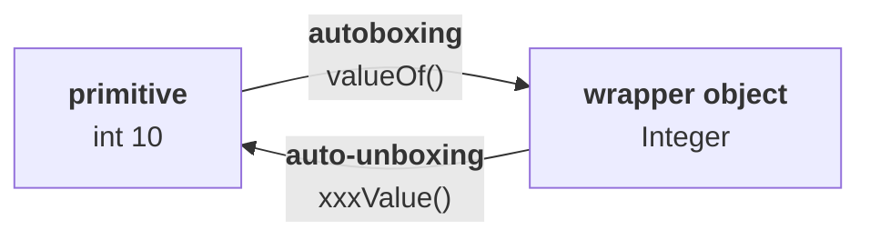

# The idea, in plain words

> *"I have a primitive value. **Keeping the primitive value inside a box** is autoboxing. **Remove the
> box** and you get the primitive back — auto-unboxing."*

> [!info] **He gives that version and then withdraws it.** *"Literally it is the same, but don't use
> this type of words in the interview room."* It is the right mental image and the wrong answer to give
> out loud — the definitions below are the ones to say.

---

# The definitions

> **Autoboxing: automatic conversion of a primitive to a wrapper object, BY THE COMPILER.**
>
> **Auto-unboxing: automatic conversion of a wrapper object to a primitive, BY THE COMPILER.**



**Both arrived in Java 1.5**, and the word doing the work in both definitions is **compiler** — this is
a compile-time convenience, not a runtime feature.

---

# Autoboxing

```java
Integer I = 10;
```

`I` is a reference variable — it expects an **`Integer` object**. You gave it the primitive `10`. **And
it compiles.**

> **The compiler converts `int` to `Integer` automatically, by autoboxing.**

## What the compiler actually writes

> *"How can the compiler perform this? After compilation, this line will become:"*
>
> ```java
> Integer I = Integer.valueOf(10);
> ```

**And that is exactly what happens.** Measured on JDK 25 with `javap -c`:

```
2: invokestatic  #7   // Method java/lang/Integer.valueOf:(I)Ljava/lang/Integer;
```

> [!important] **The bytecode confirms his claim word for word.** The source has no `valueOf` anywhere;
> the compiled class calls it. **Internally, autoboxing is implemented using the `valueOf()` methods** —
> the same `valueOf()` from note `09`.

---

# Auto-unboxing

```java
Integer I = new Integer(10);
int i = I;
```

`i` is an `int` — it expects a **primitive**. You gave it an object. **And it compiles.**

> **The compiler converts `Integer` to `int` automatically, by auto-unboxing.**

## What the compiler writes

> ```java
> int i = I.intValue();
> ```

Measured on JDK 25:

```
7: invokevirtual #13  // Method java/lang/Integer.intValue:()I
```

> **Internally, auto-unboxing is implemented using the `xxxValue()` methods.**

---

# The two conversions and their machinery

| Conversion | Name | Implemented with |
|---|---|---|
| primitive → wrapper object | **autoboxing** | **`valueOf()`** |
| wrapper object → primitive | **auto-unboxing** | **`xxxValue()`** |

> [!important] **Nothing new was added to the language runtime.** Both features are the compiler
> inserting calls to methods that already existed in note `09`. That is why the whole mechanism is
> invisible at runtime — and why understanding `valueOf` and `xxxValue` first makes autoboxing obvious
> rather than magical.

> [!info] **And it explains the earlier code.** Note `08` showed this pre-1.5 requirement:
> ```java
> ArrayList l = new ArrayList();
> Integer i = new Integer(10);
> l.add(i);
> ```
> From 1.5 onward you write `l.add(10)` and the compiler inserts `Integer.valueOf(10)` for you. **The
> rule that collections hold only objects never changed** — the compiler just stopped making you say so.

---

# What this part established

| | |
|---|---|
| Autoboxing | primitive → **wrapper object**, automatically |
| Auto-unboxing | wrapper object → **primitive**, automatically |
| Who performs both | the **compiler** |
| Introduced in | **Java 1.5** |
| Autoboxing compiles to | **`Integer.valueOf(10)`** — confirmed in bytecode |
| Auto-unboxing compiles to | **`I.intValue()`** — confirmed in bytecode |
| Nothing new at runtime | both reuse the utility methods from note `09` |
| What it changed | `l.add(10)` now works — the *rule* about collections did not change |
