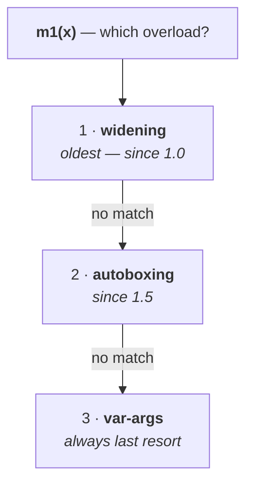

# The three mechanisms

When you call an overloaded method, the compiler may have to convert your argument to make it fit. It has three ways to do that — and when more than one would work, there is a **fixed order of preference**. That order is this part.

| | What it is | Since |
|---|---|---|
| **widening** | assigning a smaller type to a bigger one | **Java 1.0** |
| **autoboxing** | primitive → wrapper object | **Java 1.5** |
| **var-args** | a method taking any number of arguments | **Java 1.5** |

## Widening

> **Assigning a smaller data type value to a bigger data type variable.**

```
byte → short → int → long → float → double
        char ↗
```

`byte` is 1 byte, `short` is 2 — so `byte` to `short` widens. Also `char` → `int`, `int` → `long`, `long` → `float`, `float` → `double`.

## Var-arg methods

```java
public static void m1(int i)      { }    // exactly one int
public static void m1(int... x)   { }    // any number of ints
```

> **A var-arg method can be called with any number of arguments, INCLUDING ZERO.**

```java
m1();                // ✅
m1(10);              // ✅
m1(10, 20);          // ✅
m1(10, 20, 30, 40);  // ✅
```

---

# Case 1 — autoboxing vs widening

```java
class C1 {
    public static void m1(Integer i) { System.out.println("autoboxing"); }
    public static void m1(long l)    { System.out.println("widening"); }

    public static void main(String[] args) {
        int x = 10;
        m1(x);
    }
}
```

**Both would work.** `int` → `Integer` is autoboxing; `int` → `long` is widening. Which wins?

Measured on JDK 25:

```
widening
```

> [!question]- **Deep dive — his explanation for why, and it generalises.** The reason is not a rule about types at all.
>
> Autoboxing came, and at the same time widening also wanted the chance. Both met at some common place to fight — because only one can get it. After half an hour of fighting, **who wins the race?**
>
> **Widening.** Because this widening person has 19-plus years of industry experience — widening exists since **Java 1.0** (1995). But autoboxing came in 1.5 — a fresher.
>
> > **Old concept vs new concept: the compiler always gives preference to the OLD concept, to provide compatibility with older versions.**
>
> That is the actual engineering reason, not just an analogy. Code written before 1.5 had `m1(x)` resolving to `m1(long)`. If Java 1.5 had let autoboxing take priority, **every such call would silently start invoking a different method** after an upgrade. Backward compatibility forced the ordering.

> **Widening dominates autoboxing.**

---

# Case 2 — widening vs var-args

```java
public static void m1(int... x) { System.out.println("var-arg"); }
public static void m1(long l)   { System.out.println("widening"); }
```

Measured on JDK 25:

```
widening
```

**Same reasoning:** var-args also arrived in 1.5; widening is from 1.0.

> **Widening dominates var-arg methods.**

---

# Case 3 — autoboxing vs var-args

```java
public static void m1(int... x)  { System.out.println("var-arg"); }
public static void m1(Integer i) { System.out.println("autoboxing"); }
```

**Now both candidates are from 1.5** — the seniority argument cannot decide it.

Measured on JDK 25:

```
autoboxing
```

> [!important] **The tie-break is a different principle: var-args always come last.** A var-arg method is the compiler's **last resort** — it is only chosen when no fixed-arity method can be made to work, because it is the most permissive signature there is and would otherwise swallow every call.
>
> This is why the ordering is not simply oldest wins but a three-level ladder.

---

# The complete order

> **1. Widening** **2. Autoboxing** **3. Var-args**



| Contest | Winner | Why |
|---|---|---|
| autoboxing vs **widening** | **widening** | older concept — backward compatibility |
| var-args vs **widening** | **widening** | older concept |
| var-args vs **autoboxing** | **autoboxing** | var-args are always the **last** resort |

> [!info] **A practical consequence worth carrying.** If you overload a method and one version takes a wrapper while another takes a wider primitive, **the primitive version wins for primitive arguments** — which is frequently not what the author intended. It is a real source of surprising behaviour in APIs, and this ordering is why.

---

# What this part established

| | |
|---|---|
| Widening | smaller type → bigger type; since **Java 1.0** |
| Autoboxing | primitive → wrapper; since **Java 1.5** |
| Var-args | any number of arguments, **including zero**; since **Java 1.5** |
| Widening vs autoboxing | **widening** wins |
| Widening vs var-args | **widening** wins |
| Autoboxing vs var-args | **autoboxing** wins |
| The resolution order | **widening → autoboxing → var-args** |
| Why widening leads | it is the **oldest** — changing it would break pre-1.5 code silently |
| Why var-args trail | they are the **last resort**, being the most permissive signature |
