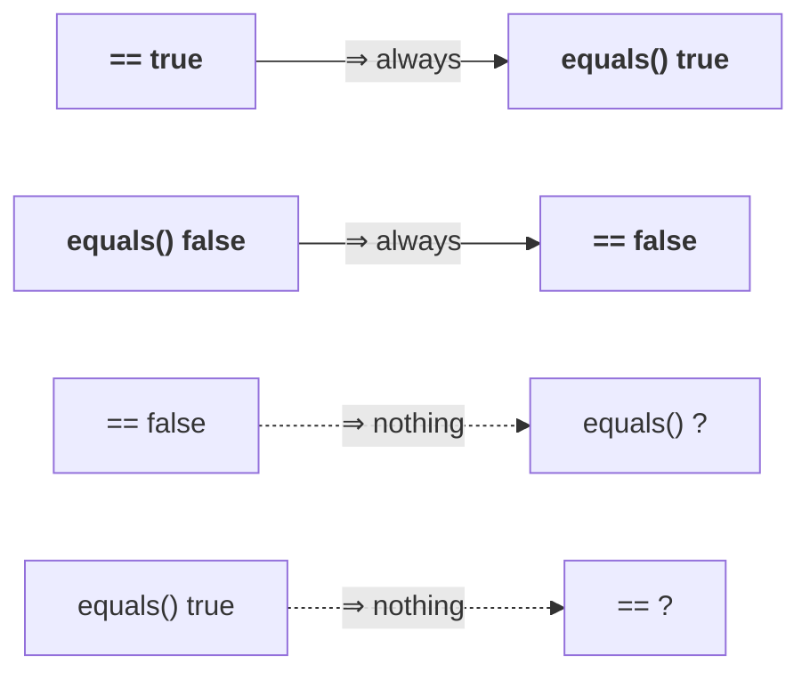

# The four implications

`==` compares **references**. `equals()` compares **whatever it was overridden to compare** — content, usually. That asymmetry produces four conclusions, and only two of them are certainties.

## 1. `==` true ⇒ `equals()` true

> **If two objects are equal by `==`, then they are ALWAYS equal by `equals()`.**

If `r1 == r2` is true, both references point at **the same object** — and any sane `equals()`, including `Object`'s, reports an object equal to itself.

## 2. `==` false ⇒ nothing follows

> **If two objects are not equal by `==`, we CAN'T CONCLUDE ANYTHING about `equals()`. It may return true or false.**

Two distinct objects might still hold identical content — and if `equals()` was overridden for content comparison, it says `true`.

## 3. `equals()` true ⇒ nothing follows

> **If two objects are equal by `equals()`, we CAN'T CONCLUDE ANYTHING about `==`.**

The mirror image of 2. Content equality says nothing about identity.

## 4. `equals()` false ⇒ `==` false

> **If two objects are not equal by `equals()`, then they are ALWAYS not equal by `==`.**

The contrapositive of 1. If they were the same object, `equals()` would have said `true`; it did not, so they are different objects, so `==` is false.



> [!important] **His advice on how to hold this.** Don't try to remember the points. Remember the internal concept, then you can easily remember the conclusions.
>
> The internal concept is one sentence: **`==` true means the same object, which is the strongest thing you can say.** Everything else follows — a strong fact implies a weak one (1 and 4 are certainties), and a weak fact implies nothing about a strong one (2 and 3 are not).

---

# The worked example

```java
String s1 = new String("Durga");
String s2 = new String("Durga");
StringBuffer sb1 = new StringBuffer("Durga");
StringBuffer sb2 = new StringBuffer("Durga");
```

Measured on JDK 25:

| Expression | Result | Why |
|---|---|---|
| `s1 == s2` | **false** | two separate objects — `new` guarantees it |
| `s1.equals(s2)` | **true** | `String` **overrides** `equals()` for content comparison |
| `sb1 == sb2` | **false** | two separate objects |
| `sb1.equals(sb2)` | **false** | **`StringBuffer` does NOT override `equals()`** |
| `s1.equals(sb1)` | **false** | unrelated types — no exception, just `false` |

> [!important] **Rows 2 and 4 are the pair worth remembering.** Identical content, identical shape of call — **opposite answers**, purely because one class overrode `equals()` and the other did not.
>
> Confirmed on JDK 25: `javap java.lang.StringBuffer` contains **zero** `equals` methods, so `Object`'s reference comparison runs.
>
> **This is the concrete cost of not overriding `equals()`,** and the reason note `03` spent a whole session on how to do it.

---

# `==` between unrelated types is a compile error

```java
String s1 = new String("Durga");
StringBuffer sb1 = new StringBuffer("Durga");

s1 == sb1
```

Measured on JDK 25:

```
error: incomparable types: String and StringBuffer
```

> **To use the equality operator, there must be some relation between the argument types — child to parent, parent to child, or the same type. If there is no relation, we get a compile-time error.**

**But `equals()` in the same situation is fine:**

```java
s1.equals(sb1)     → false
```

> [!important] **The difference in one line: `==` is checked by the compiler; `equals()` is a method call.**
>
> `==` has a **compile-time type rule** — the compiler can see the comparison is meaningless and refuses it. `equals()` takes an **`Object`** parameter, so **anything** fits at compile time, and the answer is decided at runtime.
>
> | | Unrelated types |
> |---|---|
> | `==` | ❌ **compile-time error** — `incomparable types` |
> | `.equals()` | ✅ compiles, returns **`false`** |
>
> And note `03` showed the third possibility: a **badly written** `equals()` throws `ClassCastException` here instead of returning `false` — which is exactly why that catch block mattered.

---

# The differences, collected

| | `==` | `.equals()` |
|---|---|---|
| What it is | an **operator** | a **method** |
| Compares | **references** — are these the same object? | whatever it is overridden to compare — usually **content** |
| Can it be overridden? | ❌ never | ✅ yes |
| Unrelated argument types | ❌ **compile-time error** | ✅ returns **`false`** |
| Works on primitives | ✅ | ❌ methods need objects |
| Default behaviour | fixed | `Object`'s = reference comparison |

---

# What this part established

| | |
|---|---|
| `==` true | ⇒ `equals()` **always** true |
| `==` false | ⇒ **nothing** can be concluded |
| `equals()` true | ⇒ **nothing** can be concluded |
| `equals()` false | ⇒ `==` **always** false |
| The idea behind all four | `==` true is the **strongest** claim; strong ⇒ weak, weak ⇏ strong |
| `String.equals()` | **overridden** — content comparison |
| `StringBuffer.equals()` | **not overridden** — reference comparison |
| Same content, different answers | because one class overrode it and one did not |
| `==` on unrelated types | ❌ `incomparable types` — a **compile-time** error |
| `equals()` on unrelated types | ✅ **`false`** — decided at runtime |
| Why they differ | `==` is type-checked by the compiler; `equals()` accepts `Object` |
