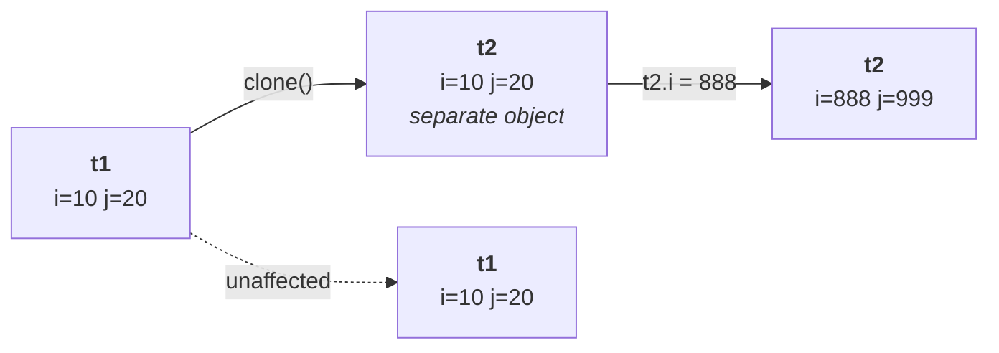

# What cloning is

> **The process of creating an exactly duplicate object is called cloning.**

> [!info] **The word arrived from outside programming.** In the late 1990s cloning was discovered and
> *"the entire world felt happy — exactly the same Xerox copy can be created, something like a
> miracle."* Then the disadvantages were weighed against the advantages, and **cloning on human beings
> was banned** in most jurisdictions.
>
> *"But not required to worry — **cloning on a Java object is legal.**"*

---

# Why you would want it

## Reason 1 — a backup copy

> [!question]- **Deep dive — the SCJP notes and the driving licence.** His two analogies for why a
> duplicate is worth making, and the second is the sharper one.
>
> **The notes.** You write your SCJP notes carefully, in two or three colours, over 600–700 pages. If
> that book is lost, it is a serious problem. So what experienced students do: **take a Xerox copy, keep
> the original safe, and use the copy day to day.** Lose the copy and nothing is lost — take another
> from the original.
>
> **The licence.** *"How many of you carry the **original** driving licence in your pocket?"* Several
> hands. *"Never recommended."* Take a colour photocopy, carry that, and keep the original somewhere
> secure. Same for the PAN card and voter ID.
>
> > **The purpose of maintaining a duplicate is backup. If something goes wrong, the original is
> > untouched and you can recover.**

**In code:** you obtained an object through a **risky or expensive operation**. Operating on it
directly is dangerous — if something goes wrong, there is no way back. So **clone it first**, work on
the clone, and keep the original in reserve.

## Reason 2 — to preserve state

You are going to perform updates, and later you need to **compare the updated values against the
original ones.**

> *"If all operations are performed on the original object only, then where are my initial values?"*

**Clone before updating**, and the original state survives for comparison.

> **The main purpose of cloning: to maintain a backup copy, and to preserve the state of an object.**

---

# The method

```java
protected native Object clone() throws CloneNotSupportedException
```

Confirmed on JDK 25:

```
protected native java.lang.Object clone() throws java.lang.CloneNotSupportedException;
```

**Read the signature piece by piece** — every part of it is examinable:

| Part | Meaning |
|---|---|
| **`protected`** | not `public` — so it is not callable from anywhere |
| **`native`** | not implemented in Java (see `DECLARATIONS-AND-ACCESS-MODIFIERS/10`) |
| **`Object`** return type | it can clone anything, so it returns the most general type |
| **`throws CloneNotSupportedException`** | it fails when cloning is not permitted |

---

# Performing a clone

```java
class Test implements Cloneable {
    int i = 10, j = 20;
    public Object clone() throws CloneNotSupportedException {
        return super.clone();
    }
}

Test t1 = new Test();
Test t2 = (Test) t1.clone();
t2.i = 888; t2.j = 999;
```

Measured on JDK 25:

```
t1: 10 20
t2: 888 999
same object? false
```

> [!important] **Three things that output proves at once.** A **genuinely separate object** was created
> (`t1 == t2` is false); it started with **the original's values** (`10, 20`); and **modifying the copy
> leaves the original untouched** — which is the entire point of a backup.

## The three requirements

**1. The class must implement `Cloneable`.** Measured on JDK 25 without it:

```
java.lang.CloneNotSupportedException: T2
```

> **`Cloneable` is a marker interface** — no methods, and implementing it grants the ability. This is
> the exact example from `DECLARATIONS-AND-ACCESS-MODIFIERS/13`, and *"don't feel `clone()` is available
> inside `Cloneable`"* — it lives in `Object`.

**2. You must override `clone()` and call `super.clone()`.** The inherited one is `protected`, so it is
not reachable from outside your class; overriding it as `public` is what exposes the ability.

**3. The result must be cast.** `clone()` returns `Object`, so `(Test)` is required to get your type
back.



---

# What this part established

| | |
|---|---|
| Cloning is | creating an **exactly duplicate object** |
| Purpose 1 | maintain a **backup copy** — work on the copy, keep the original safe |
| Purpose 2 | **preserve state** so updated values can be compared against originals |
| The method | `protected native Object clone() throws CloneNotSupportedException` |
| Where it lives | **`Object`** — not in `Cloneable` |
| `protected` | so it must be overridden to be usable from outside |
| `native` | the copy is made below the Java level |
| Returns `Object` | so a **cast** is required |
| Requirement 1 | the class must **implement `Cloneable`** |
| Without it | `CloneNotSupportedException` |
| Requirement 2 | override `clone()` and call **`super.clone()`** |
| The result | a **separate object** with the original's values |
| Modifying the clone | leaves the original **untouched** |
