Everything in this chapter sits one level below the code you write. You will not call any of it, and you do not need it to write a working program — but the moment an interviewer asks *what actually happens when you run `java Test`*, this is the answer, and it is the difference between a confident reply and a silence.

The topic starts one step further back than the JVM, with the word in its name.

---

# What a virtual machine is

Ask what *virtual* means and the answer arrives easily: **something that is not physical, not original**. The word is already familiar from elsewhere — virtual classroom, virtual memory, virtual space. In each case something behaves like the real thing without being made of the same stuff.

Put a calculator on the table and you can weigh it, measure it, describe its dimensions. Now open the calculator application on your machine. It adds, subtracts and multiplies exactly like the physical one — and it has no weight and no size. There is nothing to measure.

The same question about the JVM lands the same way: **what does a JVM weigh? What are its dimensions?** The question is meaningless, and that meaninglessness is the definition.

> **A virtual machine is a software simulation of a machine which can perform operations like a physical machine.**

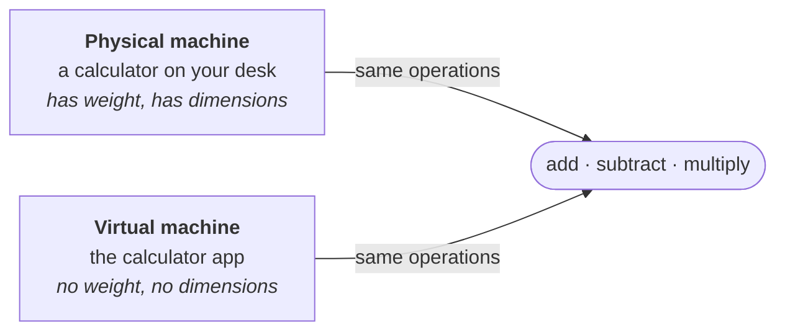

> [!important] **The test is behaviour, not substance.** A virtual machine is not a lesser version of a real one — it is a program that presents the same interface and performs the same operations. Whether anything physical sits underneath is exactly what the word *virtual* is telling you not to assume.

---

## Two types of virtual machine

The split matters because only one half of it is a programmer's concern.

> **There are 2 types of virtual machines:**
> 1. **Hardware based** or **system based** virtual machines
> 2. **Software based**, **application based** or **process based** virtual machines

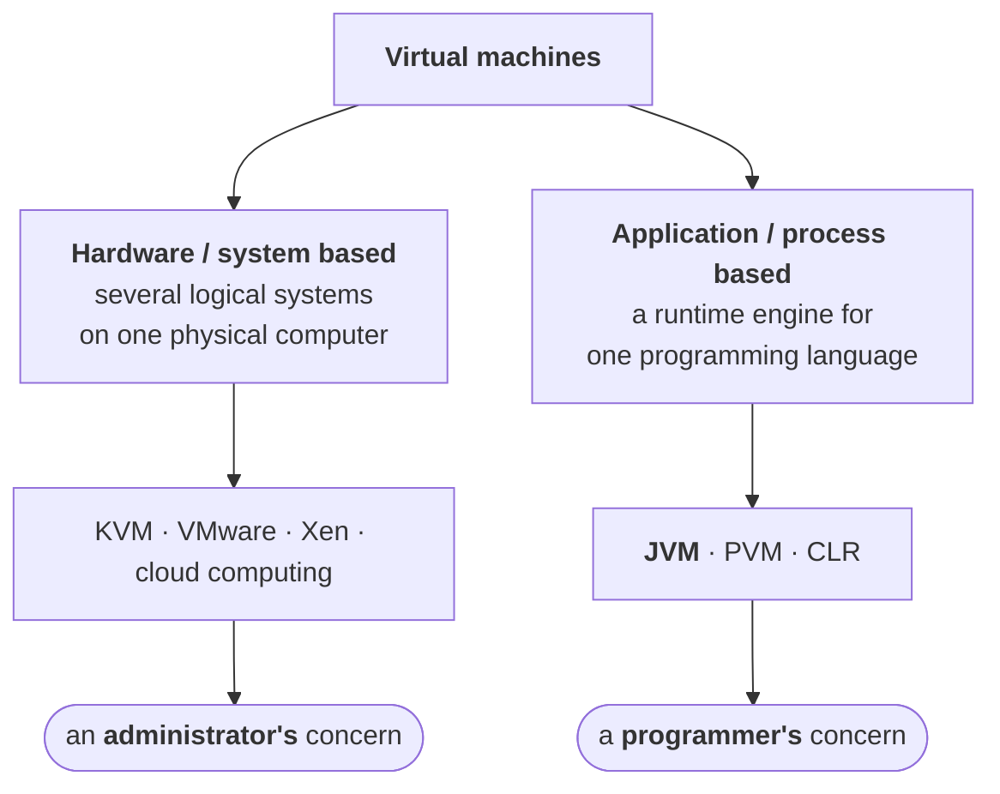

### Hardware based / system based

> **It provides several logical systems on the same computer with strong isolation from each other.**

One physical machine. On top of it, several logical machines — one for user 1, one for user 2, one for user 3 — each behaving as an independent system, each isolated from the others. Every one of those users is ultimately talking to the same physical box.

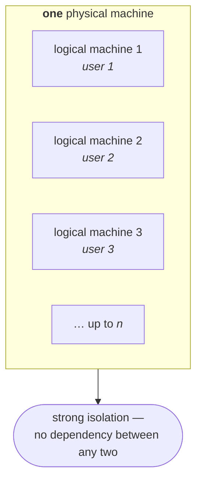

> **Examples:**
> 1. **KVM** — Kernel Based Virtual Machine, for Linux systems
> 2. **VMware** — Virtual Machine ware
> 3. **Xen**
> 4. **Cloud computing**

And the reason anyone does this:

> **The main advantage of hardware based virtual machines is the effective utilization of hardware resources.**

Physically one machine; logically six. The hardware that would sit idle serving one user is shared across all of them.

> [!info] **This is not your job.** Carving a machine into logical systems is administration, not programming. It is worth being able to define — it is half of a standard question — but you will not implement it. The second category is the one you work inside every day.

### Application based / process based

> **These virtual machines act as runtime engines to run a particular programming language application.**

One language, one engine that runs it:

| Virtual machine | Runs |
|---|---|
| **JVM** — Java Virtual Machine | Java applications |
| **PVM** — Parrot Virtual Machine | scripting language applications, such as **Perl** |
| **CLR** — Common Language Runtime | **.NET** based applications |

Read the table sideways and the pattern is the point: **whatever the language, something has to be there at runtime to actually run it.** For Java that something is the JVM, and it is what the rest of this chapter takes apart.

---

# The JVM

Two facts, and they are the whole of its job description.

> **JVM is the part of JRE.**
>
> **JVM is responsible to load and run Java applications.**

The JRE in turn sits inside the JDK, so the nesting runs JDK ⊃ JRE ⊃ JVM. And the responsibility is exactly two verbs:

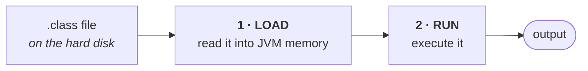

**Load and run.** Every component introduced from here on exists to serve one of those two verbs — which is a useful thing to hold on to, because the architecture diagram arrives next and it has a lot of boxes in it.

## What "runtime" actually means

The word sits in the middle of J-**R**-E and gets used constantly, so it is worth pinning down before going further.

Start with a program that does nothing at all:

```java
class Hi {
    public static void main(String[] args) {
        System.out.println("hello");
    }
}
```

Compile it and `Hi.class` appears. **The code for `println` is not inside that file.** `println` is a real method that ends up talking to the operating system to get characters onto a screen — and none of that machinery is present. The class file contains the *name* `java/io/PrintStream.println` and nothing else about it. Same for `System`. Same for `String`.

So the file you produced is not a program a computer can run. Two things must already exist on the machine before `hello` can appear:

**1 · Something that can read bytecode.** `Hi.class` is bytecode, and bytecode is not x86 and not ARM. No real CPU has an instruction called `invokevirtual`; nothing in the silicon responds to it. Something has to sit in the middle — read the bytecode, and drive the CPU with instructions it does understand. **That is the JVM.**

**2 · Something that supplies the library code.** `println`'s actual implementation has to come from somewhere. It comes from the library classes that ship with Java, sitting on disk, waiting to be loaded when a class file names them.

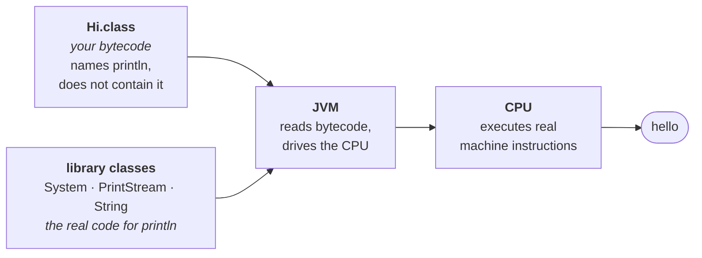

**Those two things together are a runtime.**

> **A runtime is what must already be present on a machine for a compiled program to run.**

And it is not an abstraction — it is two directories you can look at:

```
bin/java        ← the JVM. the translator. one executable file
lib/modules     ← the library classes your code names but does not contain
```

### Compile time and run time

The word also names a *moment*, and both meanings come from the same split:

| | What happens | What must be present |
|---|---|---|
| **compile time** | `javac Hi.java` → `Hi.class` | the **JDK** — `javac` and the other tools |
| **run time** | `java Hi` → `hello` | the **runtime** — JVM + libraries |

This is also where **runtime error** comes from — an error that happens in the second row, while the program is executing with real data. `NullPointerException`, `ArrayIndexOutOfBoundsException`, division by zero. The compiler could not have caught them, because at compile time there is no data yet.

### The friend test

The cleanest way to feel the difference. You compile `Hi.java` on your machine and email **`Hi.class`** to a friend with a brand-new laptop.

```
YOUR machine     javac  +  JVM  +  libraries      you build AND run
THEIR machine              JVM  +  libraries      they only run
```

Their laptop needs no compiler — **the compiling already happened, on your machine, before the email.** What arrives is already bytecode.

Those two bundles are exactly the two names from the definition above:

| Bundle | Name | Can it build? | Can it run? |
|---|---|---|---|
| `javac` + JVM + libraries | **JDK** — Java Development Kit | ✅ | ✅ |
| JVM + libraries | **JRE** — Java **Runtime** Environment | ❌ | ✅ |

Which is what `JDK ⊃ JRE ⊃ JVM` is really saying: the JRE is the running half, and the JDK is that same half plus the tools for building.

### Every language has one

Not a Java idea. A compiled or interpreted program is never self-sufficient, so every language ships something that has to be there at run time:

| Language | You ship | What must be present to run it | Called |
|---|---|---|---|
| **Java** | `.class` bytecode | JVM + library classes | the **JRE** |
| **C#** | IL bytecode | CLR + base class library | the **.NET runtime** |
| **Python** | `.py` source | interpreter + standard library | **CPython** |
| **JavaScript** | `.js` source | engine + built-in objects | **Node.js** / the browser |
| **Go** | a native binary | *bundled inside the binary itself* | (nothing to install) |

That is the same point the virtual machine table made earlier, from the other direction: **whatever the language, something must be there at run time to actually run it.**

> [!info] **Go is the interesting row.** It compiles to a binary you can copy onto a bare machine and run with nothing installed — so it looks like it has no runtime. It does: garbage collection and thread scheduling still have to happen, so Go's runtime is **compiled into every binary it produces**. Same jobs, different packaging — bundled instead of installed separately. Which tells you what the JRE really was: Java's runtime, packaged as a separate install so that one copy could serve every Java program on the machine.

> [!important] **A runtime is not a launcher that starts your program and steps aside.** It is underneath your program the entire time it runs. Every object allocated, every exception thrown, every thread scheduled, every garbage collection — that is the runtime working while your code works. "Load and run" describes the JVM's job; the running never stops needing it.

---

> [!warning] **"JVM is part of the JRE, JRE is part of the JDK" is still the right answer — but the JRE is no longer a folder you can point at.** Java 9 removed the separate JRE directory from the JDK (JEP 220), and the standalone JRE download went with it. The **relationship is unchanged and still examinable**; only the folder that used to correspond to it has disappeared. The section below is what that means on disk.

## Where the JRE went

The nesting `JDK ⊃ JRE ⊃ JVM` is not just a mental model. **It used to be the actual folder layout**, which is why the definition can be stated so flatly — you could open a file manager and click through the boxes.

### Earlier — the boxes were folders

```
jdk1.7.0/                        ← the JDK
├── bin/         javac, javadoc, jar, java …     the "D" for Development
├── lib/         tools.jar
└── jre/                         ← the JRE, literally a folder inside the JDK
    ├── bin/     java, and the JVM itself
    └── lib/     rt.jar  ← every library class: String, Object, ArrayList …
```

Two things followed from this that are worth naming, because both have since stopped being true:

- **`jre/` was a directory you could `cd` into.** "The JRE is part of the JDK" was a fact about the filesystem, not only about concepts.
- **You could download the JRE on its own.** Someone who only wanted to *run* Java installed a JRE — a smaller package with `java` but no `javac`. That was the normal end-user download.

### Currently — one directory, no inner JRE

Measured on the JDK 25 on this machine:

```
openjdk-25.0.1/Contents/Home/
├── bin/         javac, java, jar, jlink …    tools and runtime, side by side
├── lib/         modules  ← replaces rt.jar
├── jmods/       java.base.jmod, java.sql.jmod, java.xml.jmod …
├── conf/  include/  legal/  man/
└── (no jre/)
```

`$JAVA_HOME/jre` does not exist — the directory is simply absent. `java` and `javac` now sit in the same `bin/`, and there is no inner folder left to label "the JRE".

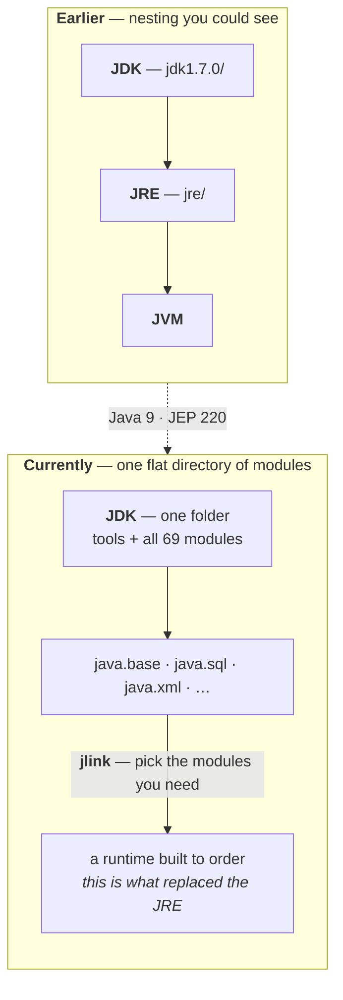

### Why it changed — the runtime became modular

Java 9 split the runtime into modules — **69 of them on this JDK** (`java.base`, `java.sql`, `java.desktop`, and so on). Once the runtime is a set of parts rather than one lump, *"the JRE"* stops being a single fixed thing worth shipping. You build the runtime you actually need:

```
jlink --add-modules java.base --output myruntime
```

Measured result of running exactly that:

| | Size | Contains |
|---|---|---|
| Full JDK 25 | **369 MB** | 69 modules, every tool |
| `jlink` runtime, `java.base` only | **47 MB** | 1 module — `java.base@25.0.1` |

And its `bin/` holds **`java` and `keytool` — no `javac`**. It runs (`openjdk version "25.0.1"`) but cannot compile. That is a JRE in every sense the definition means; it is just built to order rather than shipped as a fixed product.

### What to actually say when asked

| Claim | Holds today? |
|---|---|
| JVM is part of the JRE | ✅ conceptually — a runtime is built around the JVM |
| JRE is part of the JDK | ✅ conceptually — a JDK is a runtime plus compilers and tools |
| There is a `jre/` folder inside the JDK | ❌ gone since Java 9 |
| You can download a JRE by itself | ❌ gone — build one with `jlink` |

> [!important] **The definition is safe; the folder is not.** Answer the question as taught and it is correct. Go looking for the directory and it will not be there — and the reason it is not there (modules, and `jlink` building runtimes on demand) is itself a good thing to be able to explain.

---

# The basic architecture

At the top level, three parts, in the order a class file passes through them.

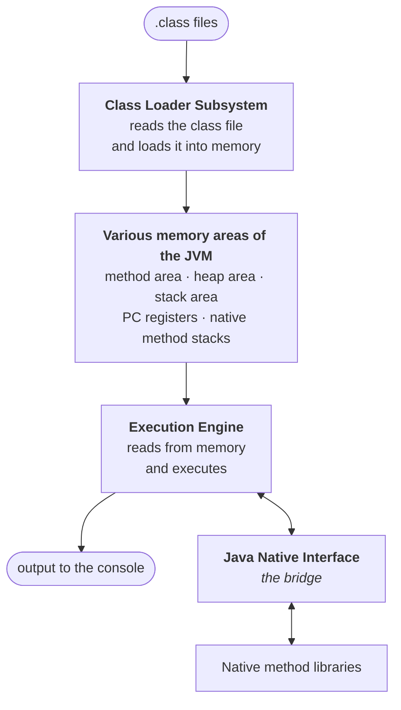

His own summary of that diagram is three sentences, and they are worth being able to produce on demand:

> 1. The **class loader subsystem** reads the `.class` file and stores it inside JVM memory.
> 2. The **execution engine** reads that `.class` file from memory and executes it.
> 3. The corresponding **output** is displayed to the console.

The **five memory areas** get a full treatment later in the chapter; for now, just the names and one line each:

| Memory area | Holds |
|---|---|
| **Method area** | class-level data — everything read out of the `.class` file |
| **Heap area** | objects |
| **Stack area** | method calls and local variables |
| **PC registers** | the address of the currently executing instruction |
| **Native method stacks** | native method calls |

> [!info] **Why the JNI is drawn off to the side.** While executing, a program sometimes needs to reach code that is not written in Java at all — the native method libraries. The execution engine cannot talk to those directly, so something has to sit in the middle and mediate. That mediator is the **Java Native Interface**. It is a supporting piece for the execution engine rather than a fourth module.

> [!question]- Where does the PC register idea come from?
> Straight out of computer organisation — if you have taken that subject, you have already met the program counter. It holds the address of the instruction being executed, and it moves on when that instruction completes. The JVM keeps one per thread, for exactly the same reason a CPU keeps one.

---

# The class loader subsystem

The first module, and the one this note finishes on.

> **The class loader subsystem is responsible for the following 3 activities:**
> 1. **Loading**
> 2. **Linking** — verification, preparation, resolution
> 3. **Initialization**

The name says the job: **read `.class` files from the hard disk and load them into JVM memory.** This note covers activity 1. Linking and initialization are the next note.

---

## Loading

> **Loading means reading class files and storing the corresponding binary data in the method area.**

Follow one file. You write `Test.java`, compile it, and `Test.class` appears on the hard disk — in some directory on `C:` or `D:`, wherever you were working. That is *outside* the JVM. The JVM's first job is to bring it *inside*:

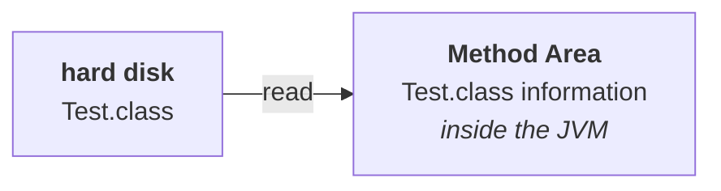

### What exactly gets stored

"The class data" is vague. This list is not:

> **For each class file the JVM will store the following information in the method area:**
> 1. Fully qualified name of the loaded class / interface / enum
> 2. Fully qualified name of its **immediate parent** class
> 3. Whether the `.class` file relates to a class, an interface, or an enum
> 4. The modifiers information
> 5. Variables / fields information
> 6. Methods information
> 7. Constant pool information — **and so on**

> [!info] **There is an eighth worth naming: constructors information.** The seven above are the standard list, but constructors are certainly in there too — the "and so on" is doing real work. It matters for the demo below, where you can ask a class for its constructors just as easily as its methods.

Drawn out, the method area is not one undivided lump — it is **one block of data per loaded class**, and each block holds that same list of items:

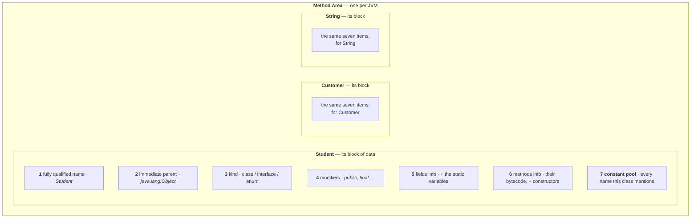

Three details in that list repay attention.

**"Immediate" parent, not the whole ancestry.** Each class records only its direct superclass, and the chain is walked one link at a time.

**Class, interface or enum is stored explicitly.** By the time you are looking at binary data in the method area, nothing about the shape of the file tells you which it was.

**The constant pool lives here too** — it is item 7, part of a class's block, not a separate memory area. Every class gets its own. This matters later: the resolution phase in note `02` works by rewriting entries inside these pools, and knowing they sit in the method area is what makes that phase make sense.

---

## The `Class` object

Loading does not stop at the method area. One more thing happens, immediately:

> **After loading the `.class` file, immediately the JVM will create an object of the type `class Class` to represent class-level binary information on the heap memory.**

So every loaded class ends up represented **twice**, in two memory areas, for two different audiences:

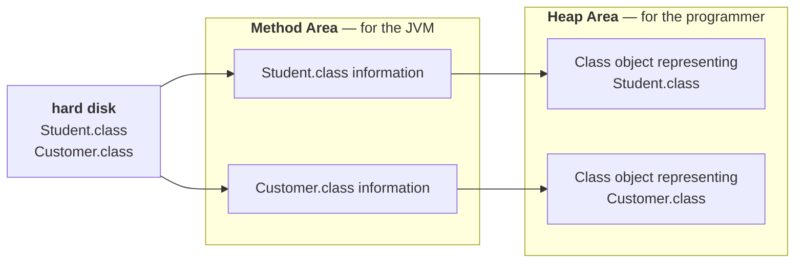

> [!important] **It is a `Class` object, not a `Student` object — and the distinction is the whole point.** Loading `Student.class` does **not** create a `Student`. No constructor has run; you never asked for a student. What gets created is one object of type `java.lang.Class` whose job is to *describe* `Student` — its name, its parent, its methods, its fields. The `Student` objects come later, when your code says `new Student()`, and they are a completely separate thing living elsewhere on the heap.

And its purpose:

> **The `Class` object can be used by the programmer to get class-level information** — fully qualified name of the class, parent name, methods and variables information, and so on.

*How many methods does `Student` have? How many constructors does `Customer` have?* Those questions are answerable at runtime precisely because this object exists.

### What lives where — definition versus value

The two areas are not two copies of the same thing. They hold different *kinds* of thing, and one sentence separates them:

> [!important] **The method area holds the class's DEFINITION. The heap holds the VALUES.**
> The declaration *"there is a field called `name`, of type `String`"* is written once, in the method area, and never repeated. What `name` actually **is** — `"Amit"` for one student, `"Riya"` for another — lives inside each object on the heap. Definition once; values many.

```
METHOD AREA  ── one copy, shared by everything
   Student's field DECLARATIONS      "there is a String called name"
   Student's method BYTECODE          the actual code of getName()
   Student's STATIC variables         count = 2   ← the real value lives here
   constant pool

HEAP  ── many objects
   Class object for Student           ← the handle to everything above
   Student object #1   name = "Amit"  ← this student's value
   Student object #2   name = "Riya"  ← that student's value
```

So `getName()`'s bytecode exists **once**, however many students you create. A thousand `Student` objects on the heap share the single copy of that method in the method area; each carries only its own values. That is why creating an object is cheap — you are allocating room for its *fields*, not for another copy of its code.

Which gives two separate routes for two separate questions:

| You want to know | Ask | Example |
|---|---|---|
| something about **the class** | the `Class` object | *what methods does `Student` have?* |
| something about **one instance** | that `Student` object | *what is this student's name?* |

And the same split, stated the way it is usually examined — where each kind of variable lives:

| Variable | Lives in | Because |
|---|---|---|
| **static** | **method area** | it belongs to the class — one copy, shared |
| **instance** | **heap** | it belongs to an object — one per object |
| **local** | **stack** | it belongs to a method call — dies when the call returns |

> [!info] **This table is the spine of the next three notes.** Each memory area gets a note of its own — method area in `04`, heap in `05`, stack in `06` — and each one re-derives its row of this table from that area's own properties. Learning it here means the later notes confirm something you already believe rather than introducing it cold.

---

## Demo 1 — interrogating a class at runtime

Take an ordinary class with two methods:

```java
class Student {

    private String name;
    private int rollNo;

    public String getName() {
        return name;
    }

    public int getMarks() {
        return 10;
    }
}
```

Now load it deliberately and ask it about itself:

```java
import java.lang.reflect.*;

class Test {
    public static void main(String[] args) throws Exception {
        Class c = Class.forName("Student");

        Method[] m = c.getDeclaredMethods();
        int count = 0;
        for (Method m1 : m) {
            System.out.println(m1.getName());
            count++;
        }
        System.out.println("number of methods: " + count);
    }
}
```

Three pieces to notice:

| Piece | What it does |
|---|---|
| `Class.forName("Student")` | **loads** the class — the whole story above happens right here |
| the return value | the `Class` object the JVM just created on the heap |
| `getDeclaredMethods()` | reads the methods information out of the method area, through that object |

So one line of code triggers both halves of loading: `Student.class` goes into the method area, and its `Class` object appears on the heap. The variable you get back *is* that object.

> [!info] **`Method` is not in `java.lang`.** It lives in **`java.lang.reflect`**, so an import is required — unlike `Class` itself, which is in `java.lang` and needs nothing. Forgetting this is the usual first compile error here. `Class.forName` also throws `ClassNotFoundException`, hence the `throws Exception`.

> [!info] **The order of `getDeclaredMethods()` is not specified.** The notes print `setRollNo` first, JDK 25 printed `getName` first. Neither is wrong — the JVM makes no guarantee about ordering, so never write code that depends on it.
### Pointing it at the standard library

The same program works on classes you never wrote. Change one string:

```java
Class c = Class.forName("java.lang.String");
```

and it prints `String`'s methods instead of `Student`'s. Nothing else in the program changes.

**That is the takeaway.** The JVM stores methods information for *every* class it loads — yours and the standard library's alike — so the `Class` object can answer for any of them. Method counts vary by JDK version and are not worth memorising; the technique is, because it tells you how to check anything on whatever JDK you are actually running.

One example is worth remembering, though:

> **Most people say `Object` has 11 methods. Strictly speaking there are 12** — the twelfth being a private native method that exists for the class's own internal use, which is why nobody counts it.

Verified on JDK 25 with `javap -p java.lang.Object` — 12 declared methods:

| # | Method | Declared as |
|---|---|---|
| 1 | `getClass()` | `public final native Class<?>` |
| 2 | `hashCode()` | `public native int` |
| 3 | `equals(Object)` | `public boolean` |
| 4 | `clone()` | `protected native Object` — `throws CloneNotSupportedException` |
| 5 | `toString()` | `public String` |
| 6 | `notify()` | `public final native void` |
| 7 | `notifyAll()` | `public final native void` |
| 8 | `wait()` | `public final void` — `throws InterruptedException` |
| 9 | `wait(long)` | `public final void` — `throws InterruptedException` |
| 10 | `wait(long, int)` | `public final void` — `throws InterruptedException` |
| 11 | `finalize()` | `protected void` — `throws Throwable` |
| **12** | **`wait0(long)`** | **`private final native void`** ← the twelfth |

Rows 1–11 are the ones everybody names. Row 12 is the one nobody does.

> [!info] **Three `wait` overloads, counted separately.** `wait()`, `wait(long)` and `wait(long, int)` are three distinct methods with three distinct signatures — which is why the tally reaches 11 and not 9. They come back in the multithreading chapter.

> [!warning] **The count is still 12 and the reasoning is still exactly right — one name changed.** The private native method used to be `registerNatives`; on modern JDKs it is **`wait0`**, the native primitive that the three public `wait` overloads delegate to. So if you are asked "how many methods does `Object` have", the honest answer is still *"eleven that anyone uses, twelve declared"* — just don't name `registerNatives` as the twelfth on a current JDK.

---

## Demo 2 — one `Class` object per class, however many instances

This is the conclusion loading builds to, and it is a favourite exam point.

Create two `Student` objects and ask each one for its class:

```java
class Test {
    public static void main(String[] args) {
        Student s1 = new Student();
        Class c1 = s1.getClass();

        Student s2 = new Student();
        Class c2 = s2.getClass();

        System.out.println(c1.hashCode());
        System.out.println(c2.hashCode());
        System.out.println(c1 == c2);
    }
}
```

The first `new Student()` triggers the full sequence — `Student.class` is read from the hard disk into the method area, and its `Class` object is created on the heap. The question is what the **second** one does.

Nothing. The class is already loaded.

Output on JDK 25:

```
724542711
724542711
true
```

> **Note: for every loaded `.class` file only one `Class` object will be created, even though we are using the class multiple times in our application.**

> [!important] **Read the two lines of output separately, because they are guaranteed differently.** The hash code number itself is **not something to memorise or depend on** — it is an identity hash code and varies from system to system. What is fixed, and what the demo is actually showing, is that **both printed values are identical** and that `c1 == c2` is `true`. Those two facts are the result; the number is incidental.
>
> One measured caveat: running this twice on JDK 25 gave the *same* number both times. HotSpot's default identity-hash generator is a per-thread pseudo-random sequence, so a deterministic single-threaded program like this one tends to reproduce it. "Varies from system to system" holds; "varies every run" does not, at least not here — which is exactly the kind of thing that makes an incidental number look like a guarantee if you only ever run it on one machine.

Put as a question: *use the `Student` class ten times — how many `Class` objects get created?* **One.**

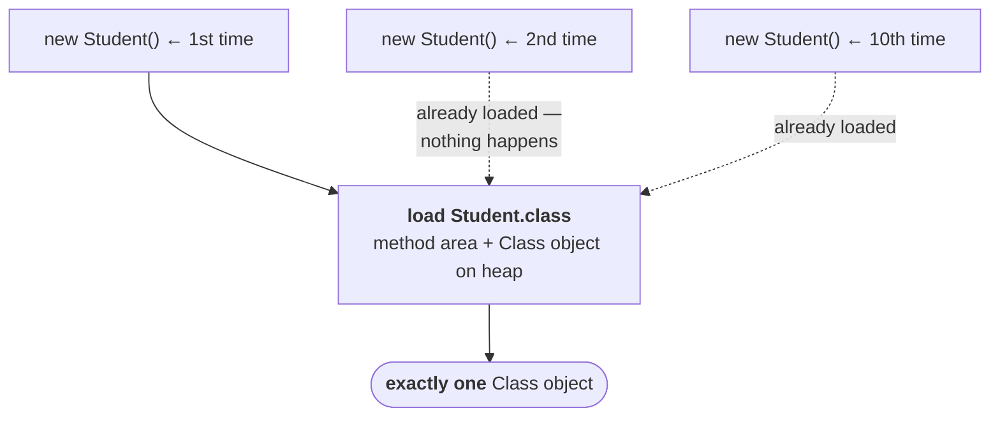

> [!info] **`Student.class` is that same object too.** The literal form is just another way of reaching it without an instance — verified: `Student.class == c1` is `true`. Which is also why `Class.forName("Student")` in the previous demo and `s1.getClass()` in this one hand you the identical object.

> [!question]- Why does one object per class matter beyond the exam?
> Because it is the anchor for class identity in the JVM. Two objects are the same *type* precisely when their `Class` objects are the same object — that is what `instanceof` and every cast are ultimately checking. It is also what makes the `Class` object a safe place to hang per-class data: static field values live there, and synchronising on it (`synchronized(Student.class)`) gives you exactly one lock for the whole class, because there is exactly one object.

---

That is loading complete: the `.class` file read off the disk, its binary data in the method area, and one `Class` object on the heap standing for it.

The class loader subsystem has two activities left — **linking** and **initialization** — and linking has three phases of its own.
