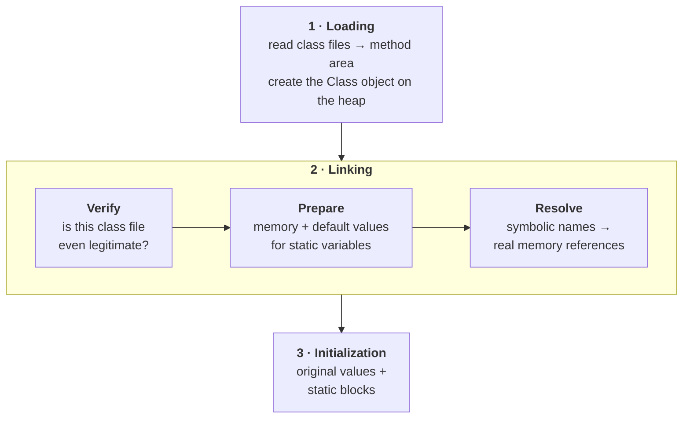
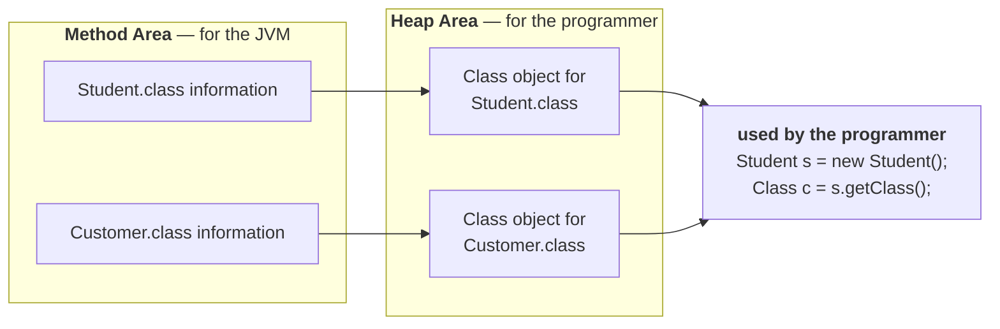
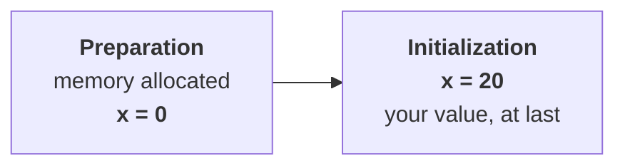
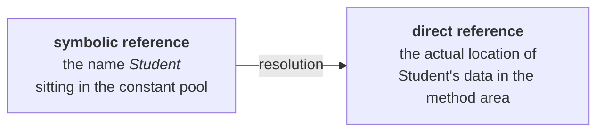
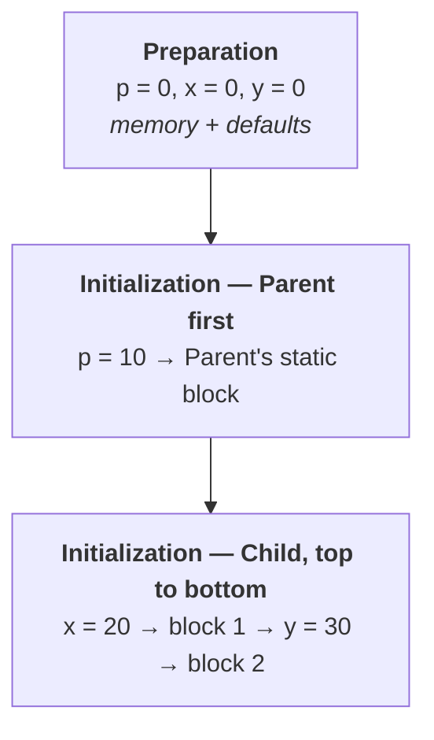
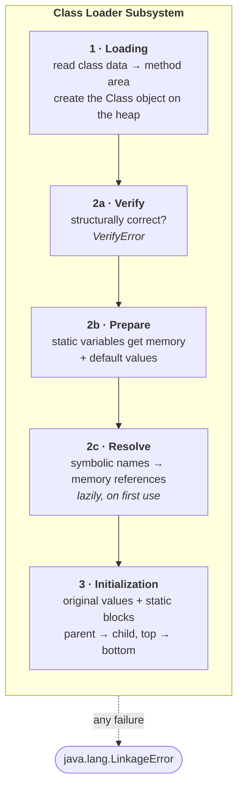

The class loader subsystem is one module of the JVM, and everything in this note sits inside it.

> **The class loader subsystem is responsible for the following three activities:**
> 1. **Loading**
> 2. **Linking** — verification, preparation, resolution
> 3. **Initialization**

Loading was the previous topic. This note picks up from what loading left behind, then walks the remaining two activities to the end.



---

## Recap — what loading left behind

> **Loading means reading class files and storing the corresponding binary data in the method area.**

And it is worth knowing exactly *what* gets stored, because "the class data" is vague and this list is not:

> **For each class file the JVM stores the following information in the method area:**
> 1. Fully qualified name of the loaded class / interface / enum
> 2. Fully qualified name of its immediate parent class
> 3. Whether the `.class` file relates to a class, an interface, or an enum
> 4. The modifiers information
> 5. Variables / fields information
> 6. Methods information
> 7. Constant pool information — and so on

Then one more thing happens, immediately:

> **After loading the `.class` file, the JVM creates an object of type `class Class` to represent class-level binary information on the heap memory.**

So every loaded class ends up represented **twice**, in two different memory areas, for two different audiences:



> **The `Class` object can be used by the programmer to get class-level information** — fully qualified name of the class, parent name, methods and variables information, and so on.

### The program that makes the `Class` object concrete

This is the example from the notes — a plain class with two private fields and two methods, interrogated at runtime through its `Class` object:

```java
import java.lang.reflect.*;

class Student {
    private String name;
    private int rollNo;

    public String getName() {
        return name;
    }

    public void setRollNo(int rollNo) {
        this.rollNo = rollNo;
    }
}

class Test1 {
    public static void main(String[] args) {
        Student s = new Student();
        Class c = s.getClass();
        System.out.println(c.getName());

        Method[] m = c.getDeclaredMethods();
        for (int i = 0; i < m.length; i++)
            System.out.println(m[i]);

        Field[] f = c.getDeclaredFields();
        for (int i = 0; i < f.length; i++)
            System.out.println(f[i]);
    }
}
```

Output, run on JDK 25:

```
Student
public java.lang.String Student.getName()
public void Student.setRollNo(int)
private java.lang.String Student.name
private int Student.rollNo
```

Read that against the seven-item list above and the connection is exact — the name, the methods, the fields, **including the `private` ones**, all read back out of the binary information that loading put in the method area.

> [!important] **This is why `getClass()` exists at all.** You are not asking the object about itself; you are asking for the JVM's own record of the class, exposed as an ordinary heap object you can call methods on. Reflection, frameworks like Spring and Hibernate, JUnit finding your test methods, Jackson mapping JSON onto fields — all of it is this one mechanism.

> [!info] **The order of `getDeclaredMethods()` is not specified.** The notes print `setRollNo` first, JDK 25 printed `getName` first. Neither is wrong — the JVM makes no guarantee about ordering, so never write code that depends on it.

### One `Class` object per class, not per instance

> **Note: For every loaded `.class` file only one `Class` object will be created, even though we are using the class multiple times in our application.**

```java
class Test2 {
    public static void main(String[] args) {
        Student s1 = new Student();
        Student s2 = new Student();
        Class c1 = s1.getClass();
        Class c2 = s2.getClass();
        System.out.println(c1 == c2);
        System.out.println(c1);
        System.out.println(Student.class == c1);
    }
}
```

Output:

```
true
class Student
true
```

Two `Student` objects, **one** `Class` object — and `Student.class` is that same object again. It follows directly from loading: the class file is read once, so there is one record of it, so there is one object representing that record.

---

## Linking

> **Linking consists of three activities:**
> 1. **Verification**
> 2. **Preparation**
> 3. **Resolution**

---

## 1 · Verification

Start with a claim you have heard many times: **Java is a secure language.** Notice how it actually shows up in practice — you can download somebody's `.class` file and run it on your machine, and the operating system says nothing. Run a downloaded `.exe` built from C or C++ and you get a warning that it may harm your computer.

Something in the JVM is earning that difference, and it is a component inside the class loader subsystem called the **bytecode verifier**.

> **Verification is the process of ensuring that the binary representation of a class is structurally correct or not.**
>
> **That is, the JVM will check whether the `.class` file was generated by a valid compiler or not — i.e. whether the `.class` file is properly formatted or not.**
>
> **Internally the bytecode verifier, which is part of the class loader subsystem, is responsible for this activity.**
>
> **If verification fails then we will get a runtime error saying `java.lang.VerifyError`.**

| Question the verifier asks | Consequence if the answer is no |
|---|---|
| Is this file structurally a class file at all? | reject it |
| Was it produced by a valid compiler? | reject it |
| Is the bytecode internally consistent? | reject it |

The threat model is stated plainly in the lecture: **assume this `.class` file was not generated by a compiler at all — it was written by a human being to spread a virus.** The verifier is the component that catches it, and refuses to run it.

### Watching it happen

This is easy to demonstrate rather than take on faith. Compile an ordinary class, then edit the compiled bytes by hand — replacing the final `return` opcode (`0xB1`) with a `nop` (`0x00`), so the method runs off the end of its own code. No compiler would ever emit that.

Running the patched class on JDK 25:

```
Error: Unable to initialize main class Victim
Caused by: java.lang.VerifyError: Control flow falls through code end
Exception Details:
  Location:
    Victim.main([Ljava/lang/String;)V @9: <invalid>
```

A second experiment, cruder: every class file begins with the magic number `0xCAFEBABE`. Change the first two bytes to `0xDEAD` and run it:

```
Error: LinkageError occurred while loading main class Victim
        java.lang.ClassFormatError: Incompatible magic value 3735927486 in class file Victim
```

Two different failures, both before a single instruction of the program executed. The second one is worth noting for later — the JVM's own message calls it a **LinkageError**.

> [!important] **This is why a `.class` file cannot carry a virus in the way a native binary can.** Not because Java is polite, but because **nothing runs before the verifier has agreed the bytecode is well-formed**. Native code has no equivalent gate — it is handed to the CPU as-is, which is exactly what the OS warning is about.

> [!warning] **"Java is secure" is a narrower claim today than when this was recorded.** The verifier guarantees the *bytecode* is structurally and type-safe. It has never had an opinion on whether well-formed code is **malicious** — a perfectly valid class file can still delete your files, and the verifier will pass it happily.
>
> The part that used to handle *that* was the sandbox: applets, `SecurityManager`, policy files. That machinery is now gone. On JDK 25:
>
> ```
> System.setSecurityManager(new SecurityManager());
> -> java.lang.UnsupportedOperationException: Setting a Security Manager is not supported
> ```
>
> Applets were removed, and the `SecurityManager` was deprecated for removal in Java 17 and permanently disabled in Java 24. So keep the verifier claim — it is true, it still runs on every class, and it is what the question is asking about — but do not extend it into "therefore untrusted Java code is safe to run." Modern isolation is containers and processes, not the JVM.

---

## 2 · Preparation

Second phase of linking, and much smaller.

> **In this phase the JVM will allocate memory for the class-level static variables and assign default values (but not original values).**
>
> **Note: original values will be assigned in the initialization phase.**

Not your values. **Default** values:

| Type | Default assigned during preparation |
|---|---|
| `int`, `short`, `byte`, `long` | `0` |
| `float`, `double` | `0.0` |
| `char` | `' '` |
| `boolean` | `false` |
| any reference type | `null` |

So for `static int x = 20;` the story splits in two:



And the same split applies to static blocks: **no static block runs during preparation.** They belong to initialization — proved by the program a little further down this note, once initialization has been defined.

> [!warning] **Where these static variables live has changed twice since this was recorded.** The lecture says "method area", which is the correct *specification* term and still the right answer to give. The implementation underneath it has moved:
>
> | Java version | Where class metadata lives |
> |---|---|
> | ≤ 7 | **PermGen** — a fixed-size region of the heap, famous for `OutOfMemoryError: PermGen space` |
> | 8 and later | **Metaspace** — native memory, grows on demand |
>
> Confirmed on JDK 25: `-XX:MaxPermSize=64m` is now a **fatal** startup error (`Unrecognized VM option`), while `MaxMetaspaceSize` and `CompressedClassSpaceSize` are live flags.
>
> One further detail worth knowing, because it contradicts the diagram most people carry: since Java 8 the **values** of static fields are stored in the `Class` object on the **heap**, not in Metaspace. Metaspace holds the class metadata. "Static variables live in the method area" is the examinable sentence; "static values sit on the heap with the `Class` object" is what is actually true of HotSpot.

---

## 3 · Resolution

The intuition is a compile error you have seen hundreds of times:

```
cannot find symbol
  symbol: variable x
  symbol: method m1()
  symbol: class Test
```

**Symbol.** That word is the whole idea. Your source code is full of names, and at compile time the compiler's job is to confirm every one of them refers to something real. If it cannot, you get *cannot find symbol* and no class file at all.

But once compilation succeeds and you run the program, a name is still only a name. The compiled `.class` file contains **names**, not memory locations. Turning them into locations is resolution:

> **Resolution is the process of replacing symbolic names used by the loaded type with original memory references.**
>
> **Symbolic references are resolved into direct references by searching through the method area to locate the referenced entity.**



The reason the target is the method area is the same reason from the loading phase: **that is where loaded class data lives.** Resolution is pointing the names at data that loading already put there.

### The example, and its real constant pool

Take the class the lecture uses:

```java
class Test {
    public static void main(String[] args) {
        String s = new String("Durga");
        Student s1 = new Student();
    }
}
```

**How many class files does the class loader subsystem load for this?** Four:

| Class | Why |
|---|---|
| `Test` | the class being run |
| `String` | used explicitly |
| `Student` | used explicitly |
| `Object` | the parent of every class — loading a child loads its parents |

> **The names of these classes are stored in the constant pool of the `Test` class. In the resolution phase these names are replaced with actual references from the method area.**

Note how many symbols are actually in that tiny program — `Test`, `main`, `args`, `String`, `s`, `Student`, `s1`. Every one is a symbol; the four above are just the **class-level** ones.

And this is checkable rather than assertable. Running `javap -v Test` on JDK 25 prints the constant pool, and its `Class` entries are exactly those four:

```
   #2 = Class              #4             // java/lang/Object
   #7 = Class              #8             // java/lang/String
  #14 = Class              #15            // Student
  #17 = Class              #18            // Test
   #1 = Methodref          #2.#3          // java/lang/Object."<init>":()V
  #11 = Methodref          #7.#12         // java/lang/String."<init>":(Ljava/lang/String;)V
  #16 = Methodref          #14.#3         // Student."<init>":()V
```

Every one of those is a **symbolic** reference — a name plus a descriptor, no addresses anywhere. Resolution is what turns `#14 = Class // Student` into a pointer to the loaded `Student` data.

> [!important] **The constant pool is why a class file is portable.** It ships names, not addresses, so it can be loaded into any JVM, on any machine, at any memory location. The cost of that portability is that somebody has to do the lookup at runtime — and that somebody is the resolution phase.

> [!warning] **Resolution is lazy in practice, not a step that happens up front.** The lecture presents resolve as a phase that runs through and replaces everything. The JVM specification explicitly permits either strategy, and **HotSpot resolves each reference the first time it is actually used**.
>
> Easy to demonstrate: compile a class that references `Missing`, then delete `Missing.class` and run it.
>
> ```
> --- run WITHOUT touching Missing (its .class is deleted) ---
> main started — Lazy is loaded, linked and initialised
> main finished without ever touching Missing
>
> --- run WITH touching Missing ---
> main started — Lazy is loaded, linked and initialised
> Exception in thread "main" java.lang.NoClassDefFoundError: Missing
>         at Lazy.main(Lazy.java:5)
> ```
>
> The program ran to completion with a **broken symbolic reference sitting in its constant pool**, because nothing ever asked for it. Had resolution been eager, the first run would have failed too.
>
> This is not a footnote — it explains a whole family of real bugs, where a missing or mismatched jar causes `NoClassDefFoundError` deep into a run rather than at startup.

---

## Initialization

The last of the three activities, and the mirror image of preparation:

> **In this phase all static variables will be assigned with original values, and static blocks will be executed — from parent to child, and from top to bottom.**

Two things happen, and only these two:

| | Preparation | Initialization |
|---|---|---|
| **Static variables** | memory allocated, **default** values | **original** values assigned |
| **Static blocks** | not executed | **executed** |

### One program that shows both phases at once

The gap between preparation and initialization is observable. Read a static variable from a static block placed *before* its declaration and you see the default value that preparation left behind:

```java
class Parent {
    static int p = 10;
    static { System.out.println("Parent static block  | p = " + p); }
}

class Child extends Parent {
    static int x = 20;
    static { System.out.println("Child static block 1 | x = " + x + ", y = " + Child.y); }
    static int y = 30;
    static { System.out.println("Child static block 2 | x = " + x + ", y = " + y); }
}

public class InitOrder {
    public static void main(String[] args) {
        System.out.println("--- touching Child for the first time ---");
        System.out.println("Child.y = " + Child.y);
    }
}
```

Output on JDK 25:

```
--- touching Child for the first time ---
Parent static block  | p = 10
Child static block 1 | x = 20, y = 0
Child static block 2 | x = 20, y = 30
Child.y = 30
```

Four lines of output, and every rule from both phases is visible in them:

| Rule | Evidence in that output |
|---|---|
| **Preparation assigns defaults** | `y = 0` in block 1 — `y` already has memory, but no original value yet |
| **Initialization assigns original values** | `y = 30` by block 2 |
| **Parent before child** | `Parent`'s block ran before either of `Child`'s |
| **Top to bottom** | block 1 ran before block 2, and `y`'s declaration sits between them |
| **Static blocks belong to initialization** | nothing printed until `main` touched `Child` |

So static variables and static blocks are not two separate mechanisms — the JVM runs both in **source order**, treating `static int y = 30;` and a `static { … }` as the same kind of step.



> [!info] **Note the first line of that output.** `--- touching Child for the first time ---` printed *before* any static block ran. Initialization is **lazy**: it happens on first active use of the class, not when the program starts. This is what makes the singleton holder idiom work, and it is why a static block can appear to "never run" in a class nobody touches.

---

## When any of it fails: `LinkageError`

One error type covers the whole pipeline.

> **Note: while loading, linking and initialization, if any error occurs then we will get a runtime error saying `java.lang.LinkageError`. Of course `VerifyError` is a child class of `LinkageError` only.**

Confirmed by walking the hierarchy on JDK 25:

```
VerifyError                 -> LinkageError -> Error -> Throwable -> Object
ClassFormatError            -> LinkageError -> Error -> Throwable -> Object
NoClassDefFoundError        -> LinkageError -> Error -> Throwable -> Object
ExceptionInInitializerError -> LinkageError -> Error -> Throwable -> Object
```

Which maps neatly back onto the phases:

| Error | Phase that threw it |
|---|---|
| `ClassFormatError` | loading — the bytes are not a class file |
| `VerifyError` | verification — the bytecode is not consistent |
| `NoClassDefFoundError` | resolution — a referenced class is not there |
| `ExceptionInInitializerError` | initialization — a static block or initialiser threw |

> [!important] **These are `Error`s, not `Exception`s, and that is deliberate.** They mean the program's own structure is broken — a missing class, a corrupt file, a static initialiser that blew up. There is nothing sensible to catch and recover from, because the class you needed does not exist in any usable form.

---

## The whole process, end to end



That whole sequence is what the phrase **class loading** refers to, and the class loader subsystem is responsible for all of it — three activities, with linking holding three phases of its own.

Next: **who** performs the loading. There is not one class loader but three, arranged in a hierarchy.
