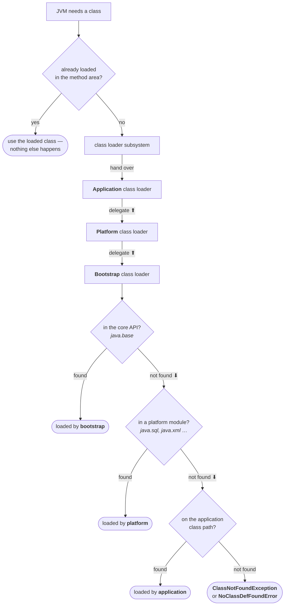
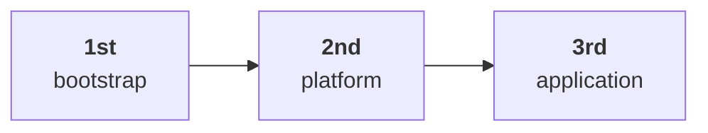

**Bootstrap is the root** of the whole family. Platform is its child; application is platform's child. And each one **only ever searches its own location** — no loader goes looking in another's territory.

---

## The naive guess, and why it is wrong

Your program hits `Student s = new Student();` and `Student.class` needs loading. The request reaches the **application** class loader.

Now, what does it do?

The obvious answer — and it is what almost everyone assumes — is that the application class loader searches the **application** class path. That is its location, after all.

**It does not.** Not first, anyway.

> [!important] **The application class loader's first move is to hand the request upwards, not to search.** It delegates to its parent, platform. Platform does not search either — it delegates to *its* parent, bootstrap. Only when the request has reached the top does anybody actually look at a directory. This inversion is the entire idea.

---

## The delegation hierarchy algorithm

> The class loader follows the delegation hierarchy principle.

The full sequence, in the order it happens.

### 1 — Is it already loaded?

> Whenever the JVM comes across a particular class, first it will check whether the corresponding `.class` file is already loaded or not. If it is already loaded in the method area, then the JVM will use that loaded class.

This is the cheapest possible answer and it comes first. A class already sitting in the method area is simply reused — the same fact from the loading note seen from the other side: one load per class, one `Class` object, forever.

### 2 — If not loaded, the request travels up

The JVM asks the class loader subsystem, which hands the request to the **application** class loader. Application delegates it to **platform**. Platform delegates it to **bootstrap**.

Three hand-offs and **not one search yet**.

### 3 — Now the searching starts, from the top down

**Bootstrap** searches its own territory — the core API. If the class is there, it is loaded and the search ends. Otherwise the request passes back down to **platform**.

**Platform** searches the platform modules. If found, loaded, done. Otherwise back down to **application**.

**Application** searches the application class path. If found, loaded. If not — there is nowhere left to look, and you get `ClassNotFoundException` or `NoClassDefFoundError`.



Read the diagram as two distinct movements and it stops being fiddly:

| Movement | What happens |
|---|---|
| **Up** — application → platform → bootstrap | pure delegation, **no searching at all** |
| **Down** — bootstrap → platform → application | searching, each loader in its own location only |

---

## What the algorithm buys you: priority

The searching order falls straight out of the shape:

> The class loader subsystem will give highest priority to the bootstrap class loader, then the platform class loader, followed by the application class loader.



So if the same class is reachable from more than one place, **the higher loader wins**. *Present in all three?* Bootstrap loads it. *Present to platform and application only?* Platform loads it, and the application copy is never even looked at.

> [!important] **This is why you cannot hijack a core class.** Write your own `java.lang.String`, drop it in your working directory, and it will never be reached — the request goes up to bootstrap first, bootstrap finds the real `String`, and the search stops there. Delegating upward before searching is precisely the mechanism that makes the core API impossible to shadow from application code. Security is not a side effect of this design; it is the reason for it.
>
> On a modern JDK there is a **second, earlier defence**: the module system refuses to let you even define the package. Compiling a rogue `java.lang.String` on JDK 25:
>
> ```
> java/lang/String.java:1: error: package exists in another module: java.base
> ```
>
> It never gets as far as class loading. Give the delegation answer in an interview — that is what is being asked — and add the module point after it.

---

## Seeing it, with three classes at three levels

The demonstration asks three classes who loaded them:

```java
public class Test {
    public static void main(String[] args) {
    
        System.out.println("String   -> " + String.class.getClassLoader());
        System.out.println("Test     -> " + Test.class.getClassLoader());
        System.out.println("Customer -> " + Customer.class.getClassLoader());
        System.out.println("   and it came from: " + Customer.where());
        
    }
}
```

Setting it up is half the lesson, because the interesting case has to be **arranged**: the same class must exist in two places at once, so you can watch the higher loader win.

Two copies of `Customer`, identical except for what they report:

```java
// in  app/   — reachable via the application class path
public class Customer { 
	public static String where() { 
		return "APPLICATION class path"; 
		} 
	}

// in  boot/  — appended to the bootstrap class path with -Xbootclasspath/a
public class Customer { 
	public static String where() { 
		return "BOOTSTRAP class path";   
		} 
	}
```

**Run 1 — `Customer` only on the application class path:**

```
java -cp app Test

String   -> null

Test     -> jdk.internal.loader.ClassLoaders$AppClassLoader@7a8c5397

Customer -> jdk.internal.loader.ClassLoaders$AppClassLoader@7a8c5397
   and it came from: APPLICATION class path
```

**Run 2 — same command, but `Customer` is now *also* on the bootstrap class path:**

```
java -Xbootclasspath/a:boot -cp app Test

String   -> null

Test     -> jdk.internal.loader.ClassLoaders$AppClassLoader@7a8c5397

Customer -> null
   and it came from: BOOTSTRAP class path
```

Both measured on JDK 25. Nothing about the program changed between the runs — only where `Customer` could be found.

Now walk each line through the algorithm:

| Class | Journey | Loaded by | Printed |
|---|---|---|---|
| `String` | up to bootstrap → found in the core API immediately | **bootstrap** | `null` |
| `Test` | up to bootstrap → not there → platform → not there → application → **found** | **application** | `...$AppClassLoader@…` |
| `Customer`, run 1 | up to bootstrap → not there → platform → not there → application → **found** | **application** | `...$AppClassLoader@…` |
| `Customer`, run 2 | up to bootstrap → **found** — stops there | **bootstrap** | `null` |

Run 2 is the case worth dwelling on. `Customer` exists in **two** locations, and the copy on the application class path is never even looked at — bootstrap is searched first, finds one, and the search ends.

**And the `where()` line proves it.** It is not merely that a different *loader* answered; a different *copy of the class* was loaded and ran. The application copy sat there unused.

> [!info] **`null` is an answer, not a failure.** `String` *was* loaded, and something loaded it. But bootstrap is written in C/C++, so there is no Java object to hand back and print. The chicken-and-egg problem from the previous note shows up here as a literal `null` on your console.
>
> The two non-`null` lines are nothing special either — just the default `toString()` shape, **`ClassName@hashcode-in-hexadecimal`**.

> [!question]- Why two different errors at the bottom — `ClassNotFoundException` and `NoClassDefFoundError`?
> Because there are two different ways to ask for a class. `ClassNotFoundException` is a **checked exception** and comes from asking for a class *by name at runtime* — `Class.forName("Student")` with no such class anywhere. `NoClassDefFoundError` is an **`Error`**, and it comes from the JVM resolving a reference that the compiler had already accepted — the class was there when you compiled, and it is gone now.
>
> Same end of the same search; different question asked. And the second is a `LinkageError` subclass, which ties it back to the failure family from the previous note.

---

## The shape to remember

Strip everything else away and the algorithm is one sentence: **ask your parent first; search your own place only if every ancestor has already failed.**

Everything else follows from it — why bootstrap has priority, why core classes cannot be shadowed, why a class in two locations resolves to the higher one, and why the loader that eventually loads your class is almost never the one the request was handed to.
