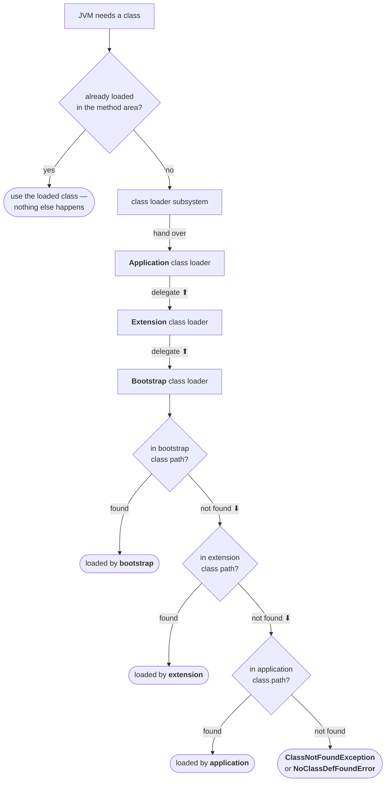
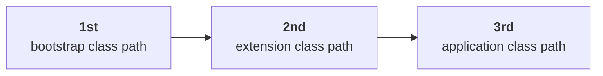

Three class loaders exist, each with exactly one place it looks. That leaves an obvious question unanswered: when your program needs a class, **which of the three actually goes and gets it?**

The answer is an algorithm with a name, and it is one of the most reliably asked things in this whole chapter.

---

## Where we are

A one-line recap of the three, because the algorithm is entirely about the relationship between them:

| Loader | Searches | Implemented in |
|---|---|---|
| **Bootstrap** / primordial | bootstrap class path — `jdk/jre/lib`, i.e. `rt.jar` | C / C++ — **not** a Java object |
| **Extension** | extension class path — `jdk/jre/lib/ext` | Java |
| **Application** / system | application class path — the `classpath` environment variable | Java |

**Bootstrap is the root** of the whole family. Extension is its child; application is extension's child. And each one **only ever searches its own location** — no loader goes looking in another's territory.

---

## The naive guess, and why it is wrong

Your program hits `Student s = new Student();` and `Student.class` needs loading. The request reaches the **application** class loader.

Now, what does it do?

The obvious answer — and the lecture calls this out explicitly as what most people assume — is that the application class loader searches the **application** class path. That is its location, after all.

**It does not.** Not first, anyway.

> [!important] **The application class loader's first move is to hand the request upwards, not to search.** It delegates to its parent, extension. Extension does not search either — it delegates to *its* parent, bootstrap. Only when the request has reached the top does anybody actually look at a directory. This inversion is the entire idea, and getting it backwards is the single most common way this question is failed.

---

## The delegation hierarchy algorithm

> **The class loader follows the delegation hierarchy principle.**

The full sequence, in the order it happens:

**1 — Is it already loaded?**

> **Whenever the JVM comes across a particular class, first it will check whether the corresponding `.class` file is already loaded or not. If it is already loaded in the method area, then the JVM will use that loaded class.**

This is the cheapest possible answer and it comes first. A class already sitting in the method area is simply reused — which is the same fact from the loading note, seen from the other side: one load per class, one `Class` object, forever.

**2 — If not loaded, the request travels up.**

> **If it is not already loaded, then the JVM requests the class loader subsystem to load that particular class. Then the class loader subsystem hands over the request to the application class loader. The application class loader delegates that request to the extension class loader, and the extension class loader in turn delegates that request to the bootstrap class loader.**

Three hand-offs and **not one search yet**.

**3 — Now the searching starts, from the top down.**

> **The bootstrap class loader searches in the bootstrap class path for the required `.class` file. If it is available, it will be loaded. Otherwise the bootstrap class loader delegates that request to the extension class loader.**
>
> **The extension class loader searches in the extension class path. If the required `.class` file is available it will be loaded, otherwise it delegates that request to the application class loader.**
>
> **The application class loader searches in the application class path. If the specified `.class` is available, it will be loaded. Otherwise we will get a runtime exception saying `ClassNotFoundException` or `NoClassDefFoundError`.**



Read the diagram as two distinct movements and it stops being fiddly:

| Movement | What happens |
|---|---|
| **Up** — application → extension → bootstrap | pure delegation, **no searching at all** |
| **Down** — bootstrap → extension → application | searching, each loader in its own location only |

---

## What the algorithm buys you: priority

The searching order falls straight out of the shape:

> **The class loader subsystem will give highest priority to the bootstrap class path, then the extension class path, followed by the application class path.**



So if the same class sits in more than one location, the higher one wins — and the lecture puts the question directly: *if a class is present in all three locations, which is considered?* Bootstrap. *If it is in the extension and application paths only?* Extension.

> [!important] **This is why you cannot hijack a core class.** Write your own `java.lang.String`, drop it in your working directory, and it will never be reached — the request goes up to bootstrap first, bootstrap finds the real `String`, and the search stops there. Delegating upward before searching is precisely the mechanism that makes the core API impossible to shadow from application code. Security is not a side effect of this design; it is the reason for it.

---

## Seeing it, with three classes at three levels

The demonstration asks three classes who loaded them:

```java
class Test {
    public static void main(String[] args) {
        System.out.println(String.class.getClassLoader());
        System.out.println(Test.class.getClassLoader());
        System.out.println(Customer.class.getClassLoader());
    }
}
```

Setting this up is half the lesson, because the interesting case has to be *arranged*. In the lecture he compiles `Customer.java`, packages the result into a jar with `jar -cvf custom.jar Customer.class`, and copies that jar into the JDK's `jre/lib/ext` directory — so that:

> **`Customer.class` is present in both the extension and application class paths, and `Test.class` is present only in the application class path.**

Now walk each one through the algorithm:

| Class | Journey | Loaded by | Printed |
|---|---|---|---|
| `String` | up to bootstrap → found in `rt.jar` immediately | **bootstrap** | `null` |
| `Test` | up to bootstrap → not there → extension → not there → application → **found** | **application** | `sun.misc.Launcher$AppClassLoader@1912a56` |
| `Customer` | up to bootstrap → not there → extension → **found** (never reaches application, though it is there too) | **extension** | `sun.misc.Launcher$ExtClassLoader@1072b90` |

`Customer` is the case worth dwelling on. It exists in **two** locations, and the copy in the application class path is never even looked at — extension is searched first, finds it, and the search ends. That single line of output is the priority rule made visible.

And the first line has its own explanation:

> **The bootstrap class loader is not a Java object. Hence we got `null` in the first case. But the extension and application class loaders are Java objects, and hence we get the corresponding output for the remaining two.**

That "corresponding output" is nothing special — it is the default `toString()` shape: **`ClassName@hashcode-in-hexadecimal`**.

> [!info] **`null` is an answer, not a failure.** `String` *was* loaded, and something loaded it. But bootstrap is written in C/C++, so there is no Java object to hand back and print. The chicken-and-egg problem from the previous note shows up here as a literal `null` on your console.

> [!question]- Why two different errors at the bottom — `ClassNotFoundException` and `NoClassDefFoundError`?
> Because there are two different ways to ask for a class. `ClassNotFoundException` is a **checked exception** and comes from asking for a class *by name at runtime* — `Class.forName("Student")` with no such class anywhere. `NoClassDefFoundError` is an **`Error`**, and it comes from the JVM resolving a reference that the compiler had already accepted — the class was there when you compiled, and it is gone now.
>
> Same end of the same search; different question asked. And the second is a `LinkageError` subclass, which ties it back to the failure family from the previous note.

---

## What has changed since this lecture

The algorithm itself is **untouched** — parent-first delegation is exactly how the JDK still works, and it is still the answer to give. What has moved is the same set of names and paths from the previous note, plus one genuinely new layer.

> [!warning] **The chain is real, and you can print it.** Verified on JDK 25:
>
> ```
> String.class.getClassLoader()  -> null
> Loaders.class.getClassLoader() -> jdk.internal.loader.ClassLoaders$AppClassLoader
>
> --- the parent chain, child to root ---
>   ...$AppClassLoader        parent-> ...$PlatformClassLoader
>   ...$PlatformClassLoader   parent-> null
>   null   <- bootstrap, no Java object
> ```
>
> App → Platform → `null`. Three levels, same order, same `null` at the root for the same reason. **Extension is called the platform class loader now**, and the class names are `jdk.internal.loader.ClassLoaders$…` rather than `sun.misc.Launcher$…`.

> [!warning] **The `Customer` demo cannot be reproduced today — there is nowhere to put the jar.** `jre/lib/ext` does not exist on a modern JDK and `java.ext.dirs` reads `null` (verified). The extension mechanism was removed deliberately, precisely because a jar dropped into a shared directory silently changing which class an application loads is a deployment hazard.
>
> The *priority* it demonstrates still holds, and it still applies to the platform loader. You simply cannot stage the collision by hand any more.

> [!warning] **A rogue `java.lang.String` now fails even earlier than delegation.** The lecture's security argument is that delegation protects the core API. That is still true — but since Java 9 the module system rejects the attempt before class loading is ever consulted. Compiling one on JDK 25:
>
> ```
> java/lang/String.java:1: error: package exists in another module: java.base
> ```
>
> It does not compile at all. And a program using `String` alongside such a class on the classpath still reports `String.class.getClassLoader()` as `null` — the real one, from bootstrap.
>
> So there are now **two** independent defences: the module system refuses to let you define the package, and delegation would refuse to reach your copy even if you got past that. Give the delegation answer in an interview — it is what is being asked — and the module point is a good thing to add after it.

---

## The shape to remember

Strip everything else away and the algorithm is one sentence: **ask your parent first; search your own place only if every ancestor has already failed.**

Everything else follows from it — why bootstrap has priority, why core classes cannot be shadowed, why a class in two locations resolves to the higher one, and why the loader that eventually loads your class is almost never the one the request was handed to.
