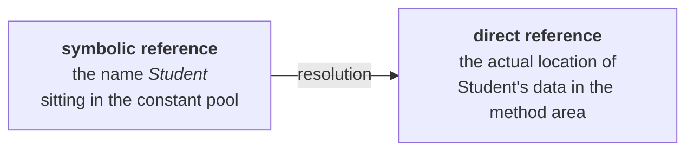
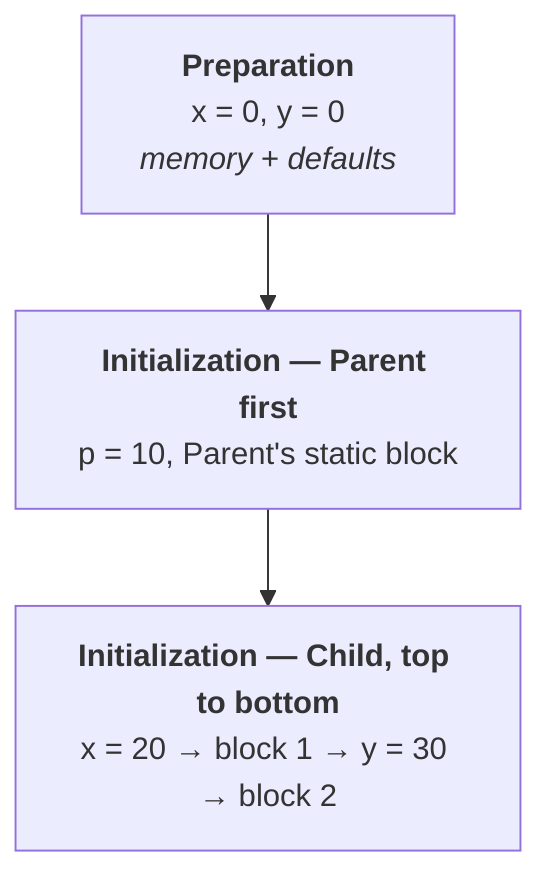
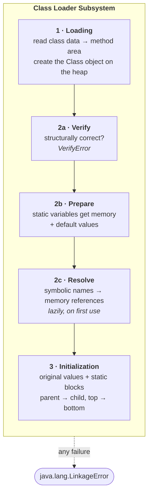

Verification asked whether the class file is legitimate. Preparation gave its static variables memory. The third phase of linking is where the class stops being a self-contained file and gets wired to everything it refers to.

---

## Resolution

The intuition is a compile error you have seen hundreds of times:

```
cannot find symbol
  symbol: variable x
  symbol: method m1()
  symbol: class Test
```

**Symbol.** That word is the whole idea. Your source code is full of names — `Test`, `String`, `Student`, `main`, `s`, `args` — and at compile time the compiler's job is to confirm every one of them refers to something real. If it cannot, you get *cannot find symbol* and no class file at all.

But a name is not an address. The compiled `.class` file still contains **names**, not memory locations. Turning them into locations is resolution:

> **Resolution is the process of replacing symbolic names in our program with original memory references from the method area.**



The reason the target is the method area is the same reason from the loading phase: **that is where loaded class data lives.** Resolution is pointing the names at data that loading already put there.

### The example, and its real constant pool

Take the class the lecture uses:

```java
public class Test {
    public static void main(String[] args) {
        String s = new String("durga");
        Student s1 = new Student();
    }
}
```

**How many class files does the JVM load for this?** Four:

| Class | Why |
|---|---|
| `Test` | the class being run |
| `String` | used explicitly |
| `Student` | used explicitly |
| `Object` | the parent of every class — loading a child loads its parents |

Those names are stored in the **constant pool** of `Test`, and this is checkable rather than assertable. Running `javap -v Test` on JDK 25 prints the pool, and the `Class` entries in it are exactly the four classes above:

```
   #2 = Class              #4             // java/lang/Object
   #7 = Class              #8             // java/lang/String
  #14 = Class              #15            // Student
  #17 = Class              #18            // Test
   #1 = Methodref          #2.#3          // java/lang/Object."<init>":()V
  #11 = Methodref          #7.#12         // java/lang/String."<init>":(Ljava/lang/String;)V
  #16 = Methodref          #14.#3         // Student."<init>":()V
```

Every one of those is a **symbolic** reference — a name plus a descriptor, no addresses anywhere. Resolution is what turns `#14 = Class // Student` into a pointer to the loaded `Student` data.

> [!important] **The constant pool is why a class file is portable.** It ships names, not addresses, so it can be loaded into any JVM, on any machine, at any memory location. The cost of that portability is that somebody has to do the lookup at runtime — and that somebody is the resolution phase.

> [!warning] **Resolution is lazy in practice, not a step that happens up front.** The lecture presents resolve as a phase that runs through and replaces everything. The JVM specification explicitly permits either strategy, and **HotSpot resolves each reference the first time it is actually used**.
>
> Easy to demonstrate: compile a class that references `Missing`, then delete `Missing.class` and run it.
>
> ```
> --- run WITHOUT touching Missing (its .class is deleted) ---
> main started — Lazy is loaded, linked and initialised
> main finished without ever touching Missing
>
> --- run WITH touching Missing ---
> main started — Lazy is loaded, linked and initialised
> Exception in thread "main" java.lang.NoClassDefFoundError: Missing
>         at Lazy.main(Lazy.java:5)
> ```
>
> The program ran to completion with a **broken symbolic reference sitting in its constant pool**, because nothing ever asked for it. Had resolution been eager, the first run would have failed too.
>
> This is not a footnote — it explains a whole family of real bugs, where a missing or mismatched jar causes `NoClassDefFoundError` deep into a run rather than at startup.

---

## Initialization

The last activity of the class loader subsystem, and the mirror image of preparation:

> **In this phase all static variables are assigned their original values, and static blocks are executed — from parent to child, and from top to bottom.**

Two rules, and both were visible in the output from the previous note:

```
--- touching Child for the first time ---
Parent static block  | p = 10
Child static block 1 | x = 20, y = 0
Child static block 2 | x = 20, y = 30
Child.y = 30
```

| Rule | Evidence in that output |
|---|---|
| **Parent before child** | `Parent`'s block ran before either of `Child`'s |
| **Top to bottom** | block 1 ran before block 2; `y` was still `0` in block 1 because its declaration sits *between* them |

So static variables and static blocks are not two separate mechanisms — the JVM runs both in **source order**, treating a `static int y = 30;` and a `static { … }` as the same kind of step.



> [!info] **Note the first line of that output.** `--- touching Child for the first time ---` printed *before* any static block ran. Initialization is **lazy**: it happens on first active use of the class, not when the program starts. This is what makes the singleton holder idiom work, and it is why a static block can appear to "never run" in a class nobody touches.

---

## When any of it fails: `LinkageError`

One error type covers the whole pipeline.

> **While loading, linking or initialization, if any error occurs, we get a runtime error: `java.lang.LinkageError`.**

`VerifyError` from the previous note is not a separate thing — it is a **subclass**. Confirmed by walking the hierarchy on JDK 25:

```
VerifyError                 -> LinkageError -> Error -> Throwable -> Object
ClassFormatError            -> LinkageError -> Error -> Throwable -> Object
NoClassDefFoundError        -> LinkageError -> Error -> Throwable -> Object
ExceptionInInitializerError -> LinkageError -> Error -> Throwable -> Object
```

Which maps neatly back onto the phases:

| Error | Phase that threw it |
|---|---|
| `ClassFormatError` | loading — the bytes are not a class file |
| `VerifyError` | verification — the bytecode is not consistent |
| `NoClassDefFoundError` | resolution — a referenced class is not there |
| `ExceptionInInitializerError` | initialization — a static block or initialiser threw |

> [!important] **These are `Error`s, not `Exception`s, and that is deliberate.** They mean the program's own structure is broken — a missing class, a corrupt file, a static initialiser that blew up. There is nothing sensible to catch and recover from, because the class you needed does not exist in any usable form.

---

## The whole process, end to end



That is the complete answer to *"what does the class loader subsystem do?"* — three activities, with linking holding three phases of its own.

Next: **who** performs the loading. There is not one class loader but three, arranged in a hierarchy.
