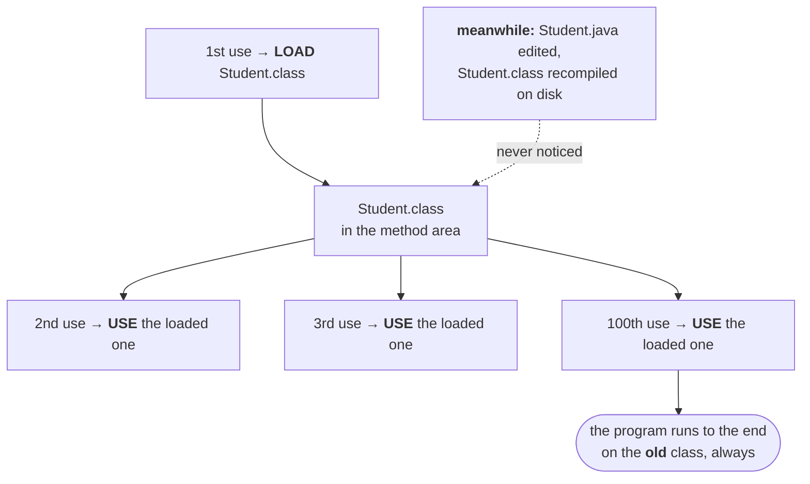

The delegation hierarchy describes what the **default** class loaders do. Everything so far has assumed that behaviour is what you want.

Sometimes it is not — and the reason why is best told as the production incident it caused.

---

# Why you would ever want a different class loader

## The behaviour that causes the trouble

Start from something already established. A program uses one class over and over:

```java
Student s1 = new Student();
Student s2 = new Student();
Student s3 = new Student();
//  … a hundred more
```

**How many times is `Student.class` loaded? Once.** Every use after the first finds it already in the method area and reuses it. First time **load**, second time onwards **use, use, use**.

That is the default class loading mechanism, and up to now it has looked like nothing but a virtue — it is why there is one `Class` object per class, and why repeated use costs nothing.

Now introduce one new fact: **what if the `.class` file changes on disk while the program is running?**



> **After loading a `.class` file, if it is modified outside, then the default class loader won't load the updated version of the class file on the fly. Because the `.class` file is already there in the method area.**

The JVM never re-checks. It asks one question — *is it already loaded?* — and if the answer is yes, that is the end of the enquiry. The updated file may as well not exist.

---

## The production story

This is not hypothetical. It cost a live application two days of downtime.

An application had been running on a WebLogic 7.1 server **since 2005**, serving clients happily. In 2014 an enhanced version was built to add new features. One fine day the old application was undeployed and the new one deployed in its place — an ordinary production move, the kind that ends with an email saying *production move successful* or *production move failed, reverting*.

Both versions contained a file called `test.jsp`.

Here is the part that matters. **A JSP is not compiled at deployment — it is translated into a `.class` file on the first request.** So:

| Year | What happened | Timestamp on the generated `.class` |
|---|---|---|
| 2005 | old app deployed, first request arrives, `test.jsp` translated | **2005** |
| 2014 | new app deployed, first request arrives, `test.jsp` translated again | **2014** |

The new application did not behave correctly, so the team did the standard thing: undeploy it, redeploy the old one, restore service, investigate at leisure.

And the old application started returning the **new** application's responses.


The server's rule for a JSP is: before translating, check whether a `.class` already exists and whether it is newer than the `.jsp`. If it is newer, translation is unnecessary — just use it. Undeploying the new application had removed the application but **left its generated `.class` files sitting in the server's cache**. So the 2005 JSP was compared against a 2014 class file, judged up to date, and never translated.

> [!important] **Every individual decision here is reasonable.** Don't recompile something that is already compiled and newer. Reuse a class that is already loaded. The failure comes from those sensible rules meeting a situation nobody modelled — a file going *backwards* in time.

> [!question]- **Deep dive — two objections that make the story sound impossible, and their answers.** Both are worth working through; the mechanism is not obvious.
> **Objection 1 — "undeploying clears memory, so how did anything survive?"**
>
> It did clear memory. The stale thing was never in memory — **it was a file on disk.**
>
> A JSP is not a Java file. The server has to translate it into a `.java`, compile that to a `.class`, and **write that `.class` into its own work directory**. That happens once, on the first request, and the output is an ordinary file that stays there:
>
> ```
> webapps/myapp/test.jsp        ← what you deployed
> work/myapp/test.class         ← what the SERVER GENERATED, on disk
> ```
>
> Undeploy touches one layer and not the other:
>
> | | Removed by undeploy? |
> |---|---|
> | the loaded class in the method area (RAM) | **yes** |
> | `webapps/myapp/` — the application you deployed | **yes** |
> | `work/myapp/test.class` — the server's generated file | **no** ← the bug |
>
> This is also why it was so hard to find. A restart empties the method area and fixes every *loaded-class* problem — so the team almost certainly tried one. It does not delete files. On the way back up the server re-read the same stale `.class` from disk and loaded it again, so the symptom survived restarts, which is exactly what makes you stop suspecting a cache.
>
> The tell is in the fix: **delete the files from the working directory.** Not restart, not redeploy. That only makes sense if the stale thing was on disk.
>
> **Objection 2 — "redeploying the old app in 2014 would give its files a 2014 timestamp, so how can the `.jsp` still read 2005?"**
>
> Because **deployment does not touch the timestamp — the archive carries it.** A zip/jar/war entry stores each file's last-modified time, and extraction restores it.
>
> Verified directly: a `test.jsp` given a 2005 timestamp, packaged into a war, then extracted today.
>
> ```
> in the source tree            2005-06-15 12:00
> recorded inside the war       Wed Jun 15 12:00:00 2005
> after extracting it today     2005-06-15 12:00     ← unchanged
> today's date                  2026-08-13 11:20
> ```
>
> So deploying the old application wrote a `test.jsp` onto disk whose timestamp read **2005** — the moment it was authored, years before that deployment. Which is what makes the comparison possible at all:
>
> ```
> work/test.class     2014     ← generated by the app that was just undeployed
> webapps/test.jsp    2005     ← original authoring time, carried in the war
>
> is the .class newer than the .jsp?    2014 > 2005  →  yes  →  don't translate
> ```
>
> **And this is why the bug can exist.** If deployment stamped every extracted file with *now*, the comparison would have been 2014 against 2014, the jsp would have won, translation would have re-run, and nothing would have gone wrong. Timestamp preservation is a *feature* — it is what makes archives reproducible and `make`-style freshness checks work at all — and here it is what keeps the stale class alive.
>
> **The failure needs all three at once:**
>
> 1. the generated `.class` lives on **disk**, and undeploy does not remove it
> 2. the deployed `.jsp` keeps its **original** timestamp, not the deploy time
> 3. the freshness rule assumes **time only moves forward**
>
> Break any one of them and there is no incident. That is why it took two days.

Two days to find it. The fix, once an expert was brought in, was to clear the cached `.class` files from the server's working directory and redeploy.

Worth pricing that out: imagine a **call-connecting application** down for two days. Every user trying to phone a friend gets *cannot connect, please try after some time*, for forty-eight hours. That is the business impact of a stale `.class` file.

---

## The behaviour you want instead

State the goal on its own, before any mechanism — because the mechanism turns out to be nothing like what most people first reach for.

| Situation | Default gives you | You want |
|---|---|---|
| 1st use | load the `.class` file | load the `.class` file |
| later use, file unchanged | use the loaded one | use the loaded one |
| later use, **file changed on disk** | use the loaded one anyway | **see the new version** |

One row differs. That is the entire requirement.

> **We can resolve this problem by defining our own customized class loader. The main advantage of a customized class loader is that we can control the class loading mechanism based on our requirement.**
>
> **For example, we can load the class file separately every time, so that the updated version is available to our program.**

> [!important] **Read the last line carefully: *load the class file separately every time*.** Not *"re-check the one already loaded"* — **separately**. That word is doing more work than it looks, and the difference between those two readings is what the rest of this note is about. Hold on to it.

---

# Defining your own class loader

The rule that makes it possible:

> **Every class loader in Java — whether default or customized — should be a child class of `java.lang.ClassLoader`, either directly or indirectly.**

Which answers a question that gets asked on its own:

> [!important] **"What is the purpose of the `java.lang.ClassLoader` class?"**
> **It acts as the base class for designing our own customized class loaders.** That is what it is *for*. You never instantiate it to do ordinary work — its role is to be extended.

So you extend it and override the method that finds a class:

```java
public class CustomClassLoader extends ClassLoader {

    @Override
    protected Class<?> findClass(String name) throws ClassNotFoundException {
        byte[] bytes = readClassFileFromDisk(name);              // your own logic
        return defineClass(name, bytes, 0, bytes.length);        // hand the bytes to the JVM
    }
}
```

Three things in that signature, because each is doing work:

| Piece | Why |
|---|---|
| `String name` | which class you are asking for |
| returns `Class<?>` | the same `Class` object from the loading note — the thing that represents a loaded class |
| `throws ClassNotFoundException` | if you ask for `Dog` and there is no `Dog.class` anywhere, there is nothing to return |

> [!important] **Override `findClass()`, not `loadClass()` — and the reason matters.** `loadClass` is where the **delegation hierarchy itself** is implemented. Replace it and you switch off parent-first delegation for your loader, and with it the protection that stops application code shadowing `java.lang` classes.
>
> `findClass` is the supported extension point: the inherited `loadClass` calls it **only after** every parent has failed. You get your custom behaviour and keep delegation intact.
>
> `defineClass` is the other half — it takes raw bytes and turns them into a real loaded class. That is the moment the method area entry and the `Class` object come into existence.

And using it:

```java
class CustomClassLoaderTest {
    public static void main(String[] args) throws Exception {
        Dog d = new Dog();                          // loaded by the DEFAULT class loader

        CustomClassLoader c = new CustomClassLoader();
        c.loadClass("Dog");                         // loaded by OUR class loader
    }
}
```

The first line is worth pausing on. `new Dog()` uses the **default** class loader — writing a custom loader does not change how ordinary code loads classes. You only get your loader's behaviour where you explicitly ask for it.

> **Usually we go for customized class loaders while developing web servers and application servers**, to customize the class loading mechanism.

That is the honest scope. As an application programmer you will almost certainly never write one. The people who do are building the thing that deploys and redeploys *your* code — which is exactly the WebLogic story, seen from the other side.

> [!info] **In practice you would not write either method.** `URLClassLoader` already does all of this — point it at a directory or a jar and it reads the bytes and calls `defineClass` for you. It is also `Closeable`, so a server can release the file handles on a discarded application's jars.

---

## The obvious solution, and why it fails

You now know the problem: the default loader never re-checks disk. So write a loader that does. Its `findClass` reads `Dog.class` off the disk **on every single call** — no caching of your own, nothing clever.

```java
CustomClassLoader c = new CustomClassLoader();
c.loadClass("Dog");        // VERSION 1 is on disk

// … you edit Dog.java and recompile. Dog.class on disk is now VERSION 2 …

c.loadClass("Dog");        // the same loader object, asked a second time
```

Does the second call give you VERSION 2?

**No.** Measured on JDK 25 — load a class, overwrite its `.class` file on disk with a different version, then ask again:

```
1st load                        : VERSION 1                     [loader 414493378]
after file changed, SAME loader : VERSION 1                     [loader 414493378]
after file changed, NEW loader  : VERSION 2 (updated on disk)   [loader 705927765]
```

Your re-reading logic is correct. **It simply never runs a second time.**

### Two things that look contradictory, and are not

**The running program *can* read the new file.** Reading bytes off disk is possible at any moment, and line 3 proves it — a *different* loader, in the *same* running JVM, reading the *same* disk, gets VERSION 2. So the obstacle is not "a running program cannot see disk changes."

**The obstacle is that a loader remembers.** `loadClass` consults the loader's own record of what it has already defined **before** it calls anything of yours:

```
loadClass("Dog")
  ├─ have I already defined "Dog"?  ──yes──▶ return that. STOP.
  │                                          findClass is never called
  ├─ no → ask my parent
  └─ parent failed → NOW call findClass("Dog")   ← your code, finally
```

A *new* loader has no record of `Dog`, falls all the way through, reaches your `findClass`, reads the disk, and gets VERSION 2. The same loader stops at line one.

And that lookup is `findLoadedClass` — it is `final`. There is no override. Which raises the real question.

### Why that memory cannot be switched off

The instinctive answer is performance. It is not — and the actual reason is worth working through, because everything else in this note follows from it.

Suppose a loader *could* forget a class and re-read it. Your program has been running for an hour, and there are **100 `Dog` objects on the heap**, all built from VERSION 1, whose only field was `String name`. VERSION 2 on disk drops `name` and adds `int age`.

```
on the heap, right now          Dog #1 … Dog #100     laid out as { String name }
on disk, if we redefine "Dog"                         laid out as { int age }
```

Those 100 objects do not vanish. But every compiled instruction that touches them reads `name` at a **fixed offset** — an offset that now holds an `int`, or nothing at all. Every one of those reads becomes garbage.

> [!important] **The type system would be lying.** "This object is a `Dog`" has to mean one fixed thing for as long as that object exists. Allow one loader to define two different `Dog`s and the sentence stops meaning anything — so the JVM refuses the ambiguity outright: **one loader, one class per name, permanently.**
>
> It is a correctness guarantee that happens to also be fast, not a cache that happens to be strict. Speed is a side effect.

Which forces the rule everything else in this note rests on:

> [!important] **A class is identified by *(name, defining loader)*, not by name alone.** Two loaders can each define a `Dog`, and those are genuinely **different types** — assign one to the other and you get a `ClassCastException` complaining that `Dog` cannot be cast to `Dog`, which reads as insanity until you know this.

---

## How hot deployment actually works

If a loader can never replace a class, and its classes are permanently tied to it, there is only one move left: **throw the loader away.**

That is what *"load the class file separately every time"* meant, back at the start of this note. Not one loader re-checking a file — **a fresh loader each time**, which is the only way to get a fresh class.

```
discard the ClassLoader object
    └─ its record of defined classes goes with it
        └─ the classes it defined become unreachable
            └─ the garbage collector takes the whole set
new ClassLoader object
    └─ empty record → reads disk → gets the new version
```

The loader, every class it defined, and all their static state form **one unit that lives and dies together**. You never clear the cache; you discard the object that owns it.

> [!warning] **That record lives in RAM, as part of the loader object.** It is not a file, and it is not related to the server work directory from the story above — that was an application server writing generated `.class` files to disk, its own invention, nothing to do with the JVM. Two different things that both get called a cache.

Which is exactly what a redeploy is:

| Action | What the server does |
|---|---|
| deploy | creates a class loader for the application, loads it through that loader |
| undeploy | **drops the reference** to that loader — the application's classes become garbage |
| redeploy | creates a **brand new** loader, reads from disk again, gets the new version |

And the identity rule is what makes it safe. The old application's `Dog` and the new one's `Dog` are different types even though both are named `Dog`, so a stray reference to the old application can never be silently mistaken for the new one.

> [!important] **When the old loader does not get collected, you have a class loader leak.** If *anything* still holds a reference to it — a thread that was never stopped, a shutdown hook, a cache in a shared library holding one of the old classes — the loader cannot be collected, and **the entire old application stays in memory**: every class, every static field, everything.
>
> Redeploy a few times and Metaspace fills up with the corpses: `OutOfMemoryError: Metaspace`. It is common enough to have a name, and it is a genuinely good thing to be able to explain — it shows you understand that a class loader owns its classes rather than merely finding them.

---

