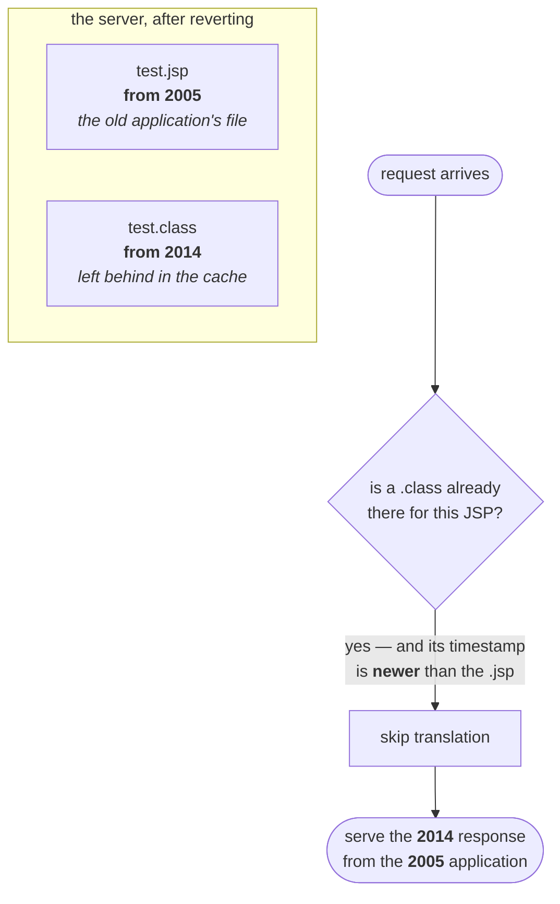
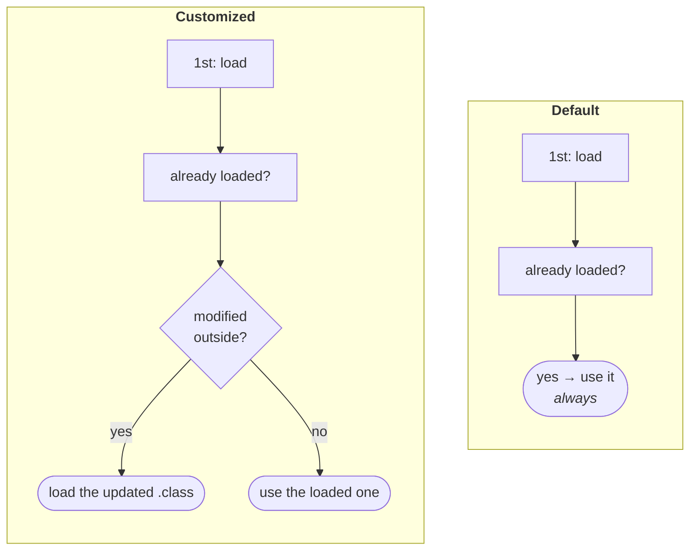
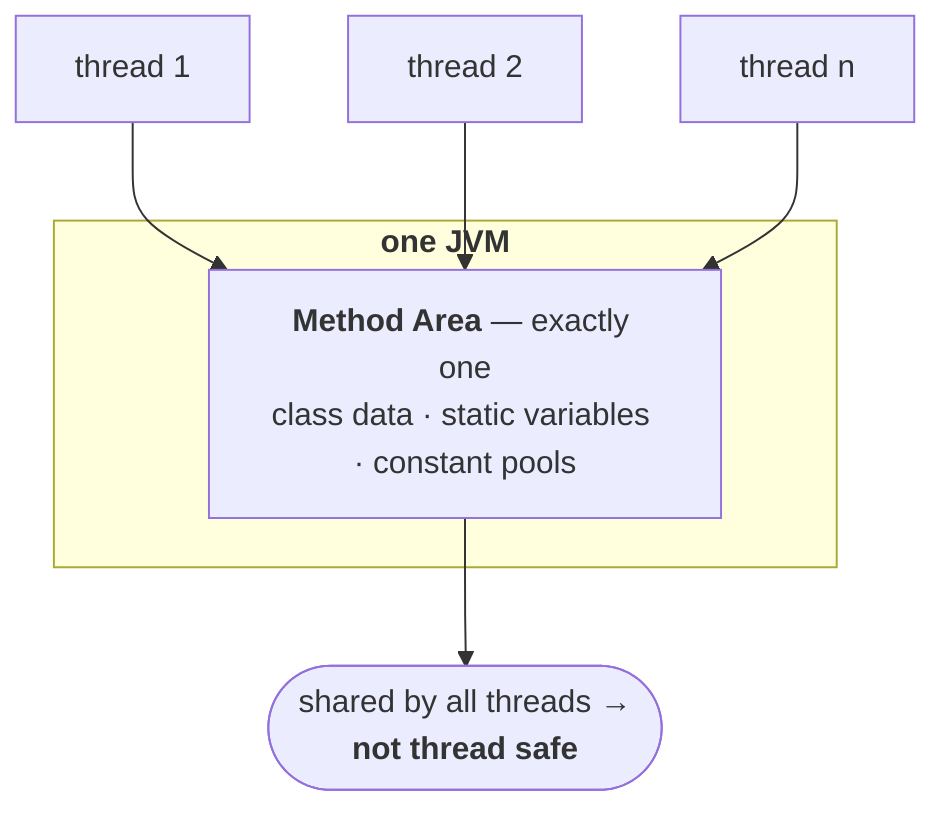

The delegation hierarchy describes what the **default** class loaders do. Everything so far has assumed that behaviour is what you want.

Sometimes it is not — and the reason why is best told as the production incident it caused.

---

# Why you would ever want a different class loader

## The behaviour that causes the trouble

Start from something already established. A program uses one class over and over:

```java
Student s1 = new Student();
Student s2 = new Student();
Student s3 = new Student();
//  … a hundred more
```

**How many times is `Student.class` loaded? Once.** Every use after the first finds it already in the method area and reuses it. First time **load**, second time onwards **use, use, use**.

That is the default class loading mechanism, and up to now it has looked like nothing but a virtue — it is why there is one `Class` object per class, and why repeated use costs nothing.

Now introduce one new fact: **what if the `.class` file changes on disk while the program is running?**


> **After loading a `.class` file, if it is modified outside, then the default class loader won't load the updated version of the class file on the fly. Because the `.class` file is already there in the method area.**

The JVM never re-checks. It asks one question — *is it already loaded?* — and if the answer is yes, that is the end of the enquiry. The updated file may as well not exist.

---

## The production story

This is not hypothetical. It cost a live application two days of downtime.

An application had been running on a WebLogic 7.1 server **since 2005**, serving clients happily. In 2014 an enhanced version was built to add new features. One fine day the old application was undeployed and the new one deployed in its place — an ordinary production move, the kind that ends with an email saying *production move successful* or *production move failed, reverting*.

Both versions contained a file called `test.jsp`.

Here is the part that matters. **A JSP is not compiled at deployment — it is translated into a `.class` file on the first request.** So:

| Year | What happened | Timestamp on the generated `.class` |
|---|---|---|
| 2005 | old app deployed, first request arrives, `test.jsp` translated | **2005** |
| 2014 | new app deployed, first request arrives, `test.jsp` translated again | **2014** |

The new application did not behave correctly, so the team did the standard thing: undeploy it, redeploy the old one, restore service, investigate at leisure.

And the old application started returning the **new** application's responses.



The server's rule for a JSP is: before translating, check whether a `.class` already exists and whether it is newer than the `.jsp`. If it is newer, translation is unnecessary — just use it. Undeploying the new application had removed the application but **left its generated `.class` files sitting in the server's cache**. So the 2005 JSP was compared against a 2014 class file, judged up to date, and never translated.

> [!important] **Every individual decision here is reasonable.** Don't recompile something that is already compiled and newer. Reuse a class that is already loaded. The failure comes from those sensible rules meeting a situation nobody modelled — a file going *backwards* in time.

Two days to find it. The fix, once an expert was brought in, was to clear the cached `.class` files from the server's working directory and redeploy. The client, in the lecture's phrasing, *"gave left and right"* — and reasonably so. He asks you to price it: imagine a **call-connecting application** down for two days. Every user who tries to phone a friend gets *cannot connect, please try after some time*, for forty-eight hours. That is the business impact of a stale `.class` file.

> [!info] **Later WebLogic versions fixed this** by removing an application's generated `.class` files when it is undeployed. The lecture notes 7.1 had the bug and 10 did not. The underlying class loading behaviour did not change — the server just stopped leaving the landmine lying around.

---

## The alternative behaviour you want

State the two mechanisms side by side and the difference is one extra question:

| | Default class loading | Customized class loading |
|---|---|---|
| 1st use | **load** the `.class` file | **load** the `.class` file |
| 2nd use onwards | is it already loaded? → **use** it | is it already loaded? **and has it been modified?** |
| if modified | *never asked* | **load the updated `.class` file** |
| if not modified | use the loaded one | use the loaded one |



> **We can resolve this problem by defining our own customized class loader. The main advantage of a customized class loader is that we can control the class loading mechanism based on our requirement.**
>
> **For example, we can load the class file separately every time, so that the updated version is available to our program.**

---

# Defining your own class loader

The rule that makes it possible:

> **Every class loader in Java — whether default or customized — should be a child class of `java.lang.ClassLoader`, either directly or indirectly.**

Which answers a question that gets asked on its own:

> [!important] **"What is the purpose of the `java.lang.ClassLoader` class?"**
> **It acts as the base class for designing our own customized class loaders.** That is what it is *for*. You never instantiate it to do ordinary work — its role is to be extended.

So you extend it and override the one method that does the loading:

```java
public class CustomClassLoader extends ClassLoader {

    public Class loadClass(String name) throws ClassNotFoundException {
        // check for updates
        // load the updated .class file
        // return the corresponding Class object
    }
}
```

Three things to note about that signature, because each is doing work:

| Piece | Why |
|---|---|
| `String name` | which class you are asking for |
| returns `Class` | the same `Class` object from the loading note — the thing that represents a loaded class |
| `throws ClassNotFoundException` | if you ask for `Dog` and there is no `Dog.class` anywhere, there is nothing to return |

And using it:

```java
class CustomClassLoaderTest {
    public static void main(String[] args) {
        Dog d = new Dog();                          // loaded by the DEFAULT class loader

        CustomClassLoader c = new CustomClassLoader();
        c.loadClass("Dog");                         // loaded by OUR class loader
        //  …
        c.loadClass("Dog");                         // checked for updates again
    }
}
```

The first line is worth pausing on. `new Dog()` uses the **default** class loader — writing a custom loader does not change how ordinary code loads classes. You only get your loader's behaviour where you explicitly ask for it.

> **Usually we go for customized class loaders while developing web servers and application servers**, to customize the class loading mechanism.

That is the honest scope. As an application programmer you will almost certainly never write one. The people who do are building the thing that deploys and redeploys *your* code — which is exactly the WebLogic story, seen from the other side.

---

## What has changed — and one thing the pseudo-code gets wrong

The problem is real and the diagnosis is exactly right. The technique has moved on, in two ways that matter.

> [!warning] **A class loader cannot reload a class. Ever. Not even a custom one.** This is the part the pseudo-code quietly glosses: calling `c.loadClass("Dog")` twice **on the same loader object** does not pick up an updated file, because a loader caches every class it has defined and returns the same one forever.
>
> Demonstrated on JDK 25 — load a class, overwrite the `.class` file on disk with a different version, then ask again:
>
> ```
> 1st load                        : VERSION 1                     [loader 414493378]
> after file changed, SAME loader : VERSION 1                     [loader 414493378]
> after file changed, NEW loader  : VERSION 2 (updated on disk)   [loader 705927765]
> ```
>
> The same loader is immovable. **A new loader instance gets the new version.** So the real mechanism behind hot deployment is not "a loader that reloads" — it is **throwing the whole loader away and creating another one**, which is why redeploying an application in any modern server discards its class loader entirely. Identity follows from this too: a class is identified by *(name, defining loader)*, so the two `Dog` classes above are genuinely different types that cannot be assigned to each other.

> [!warning] **Override `findClass()`, not `loadClass()`.** The lecture overrides `loadClass`, which was the shape of the API in 2016 and still compiles. But `loadClass` is where the **delegation hierarchy itself** is implemented — replace it and you switch off parent-first delegation for your loader, and with it the protection that stops application code shadowing `java.lang` classes.
>
> The supported extension point is `findClass(String name)`, which the inherited `loadClass` calls **only after** the parents have failed. Inside it you read the bytes yourself and hand them to `defineClass(name, bytes, 0, bytes.length)`. You get your custom behaviour and keep delegation intact.
>
> In practice you would not write either — `URLClassLoader` already does this, and is what the test above used.

> [!info] **Class loaders are closeable now.** `URLClassLoader` implements `Closeable` (Java 7+), so a server can release the file handles on a discarded application's jars. Before that, an undeployed application could keep its jars locked on Windows — another sharp edge of the same problem the story describes.

---

# The five memory areas

That completes module one — the class loader subsystem, end to end: three activities, three loaders, the delegation algorithm, and how to replace it. Module two is where the loaded data actually lives.

> **Whenever the JVM loads and runs a Java program, it needs memory to store several things like bytecode, objects, variables, etc.**
>
> **Total JVM memory is organized into the following 5 categories:**
> 1. **Method area**
> 2. **Heap area**
> 3. **Stack memory**
> 4. **PC registers**
> 5. **Native method stacks**

The motivation is plain if you take the JVM's two jobs literally: *load and run*. Loading needs somewhere to put class data. Running creates objects, which need somewhere to live; and calls methods, whose local variables need somewhere to live. Five areas, each answering one of those needs.

---

## Method area

The first, and the one everything so far has already been using.

> - **Method area will be created at the time of JVM start-up.**
> - **It will be shared by all threads (global memory).**
> - **This memory area need not be continuous.**
> - **Total class-level binary information, including static variables, is stored in the method area.**
> - **The runtime constant pool of a class lives here too.**

**One method area per JVM** — not per thread, not per class. It is created when the JVM starts and shared by everything running inside it.



Which leads directly to the consequence worth remembering:

> [!important] **Method area data is not thread safe, and that follows from it being shared.** Multiple threads can reach it simultaneously, and nothing about the area itself prevents them colliding. This is not a defect — it is the same trade the multithreading chapter describes, where shared state is what makes synchronization necessary. It is also the reason a `static` variable is the classic thing to get wrong in concurrent code: every thread in the JVM is looking at the same one.

> [!info] **"Need not be continuous" is easy to skip past.** The method area is not required to be one unbroken block of memory — it can be scattered, and grow in pieces. Nothing you write depends on this, but it is a stated property and it rules out reasoning about the method area as though it were an array.

> [!warning] **Method area is the specification's word; the implementation is Metaspace.** Same point as in the linking note, restated here because this is where the area is formally introduced: HotSpot implemented the method area as **PermGen** up to Java 7 and as **Metaspace** — native memory, growing on demand — from Java 8. `-XX:MaxPermSize` is a fatal startup error on JDK 25. And the *values* of static fields now sit in the `Class` object on the **heap**, even though the specification places static variables in the method area.

The heap area is next, and it is the one you actually feel.
