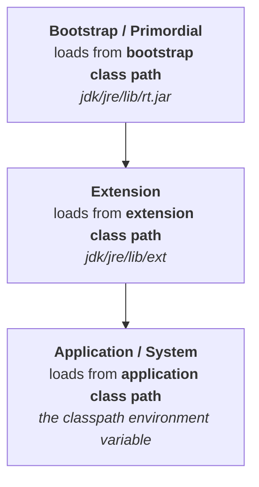

Everything so far has said "the class loader subsystem loads the class". There is no single loader doing that.

> **The class loader subsystem contains the following three types of class loaders:**
> 1. **Bootstrap class loader** (also called *primordial* class loader)
> 2. **Extension class loader**
> 3. **Application class loader** (also called *system* class loader)

They are arranged as a family, and each one has exactly one place it looks:



The arrows are inheritance: extension is the child of bootstrap, application is the child of extension. **Each loader has its own search location, and never looks anywhere else.**

---

## Bootstrap class loader

> **The bootstrap class loader is responsible for loading core Java API classes — that is, the classes present in `rt.jar`.**

`String`, `StringBuffer`, `Object`, every class you use without importing anything: all of them come out of one archive.

```
jdk / jre / lib / rt.jar        ← this whole location is the "bootstrap class path"
```

Two properties that get asked about:

> **The bootstrap class loader is available by default with every JVM.**
> **It is implemented in native languages like C/C++, and not implemented in Java.**

> [!important] **The second one is not trivia — it is a chicken-and-egg problem.** A class loader written in Java would itself be a class, which something would have to load. The chain has to terminate somewhere, and it terminates in the VM's own native code. That is also why, in Java, this loader has no object to show you: asking for it returns `null`.

---

## Extension class loader

> **The extension class loader is the child class of the bootstrap class loader. It is responsible for loading classes from the extension class path.**

```
jdk / jre / lib / ext           ← "lib" is library, "ext" is extension library
```

Anything dropped into that directory gets picked up by this loader. Unlike bootstrap, it *is* an ordinary Java class:

> **It is implemented in Java, and the corresponding class file is `sun.misc.Launcher$ExtClassLoader.class`.**

> [!info] **The `$` in that name means an inner class.** `Launcher` is the outer class, `ExtClassLoader` is nested inside it. A useful reflex generally: a `$` in a `.class` filename is always a nested or anonymous class.

---

## Application / system class loader

> **The application class loader is the child class of the extension class loader. It is responsible for loading classes from the application class path — internally it uses the `classpath` environment variable.**
>
> **It is implemented in Java, and the corresponding class file is `sun.misc.Launcher$AppClassLoader.class`.**

This is the one that loads *your* classes. When you compile `Test.java` and run `java Test`, the class that gets found on your classpath is found by this loader.

| Loader | Searches | Written in |
|---|---|---|
| Bootstrap | bootstrap class path — `jre/lib/rt.jar` | C / C++ |
| Extension | extension class path — `jre/lib/ext` | Java |
| Application | application class path — the `classpath` variable | Java |

---

## What has changed since this lecture — almost all of the above

The **structure** in this note is still exactly right: three loaders, a parent-child chain, one search location each, bootstrap native and unreachable from Java. Every **name and path** in it is obsolete. Java 9 (2017) reorganised the JDK around modules, and all of the following was verified on the JDK 25 installed on this machine.

> [!warning] **`rt.jar` no longer exists. Neither does the `jre` directory.**
>
> ```
> $JAVA_HOME/lib/rt.jar   → No such file or directory
> $JAVA_HOME/jre          → No such file or directory
> ```
>
> The core API now ships as a single modular image, `$JAVA_HOME/lib/modules` (135 MB here), and `String` reports itself as belonging to `module java.base`. There is no separate JRE to point at any more.

> [!warning] **The extension class loader is now the *platform* class loader, and the extension mechanism is gone entirely.**
>
> `jre/lib/ext` does not exist, and the `java.ext.dirs` system property reads `null`. Dropping a jar somewhere to have it silently loaded is no longer a thing the JDK does — it was removed precisely because it made deployments unpredictable. The loader that took its slot in the hierarchy is `getPlatformClassLoader()`, which serves the non-`java.base` platform modules.

> [!warning] **`sun.misc.Launcher` is gone — the class names you would quote in an interview are different.**
>
> ```
> Class.forName("sun.misc.Launcher")
> -> java.lang.ClassNotFoundException: sun.misc.Launcher
> ```
>
> | Lecture's name | JDK 9+ name |
> |---|---|
> | `sun.misc.Launcher$ExtClassLoader` | `jdk.internal.loader.ClassLoaders$PlatformClassLoader` |
> | `sun.misc.Launcher$AppClassLoader` | `jdk.internal.loader.ClassLoaders$AppClassLoader` |

### The hierarchy as it actually prints today

```java
ClassLoader cl = MyClass.class.getClassLoader();
while (cl != null) { System.out.println(cl + "  [" + cl.getName() + "]"); cl = cl.getParent(); }
```

Output on JDK 25:

```
jdk.internal.loader.ClassLoaders$AppClassLoader@7a8c5397        [app]
jdk.internal.loader.ClassLoaders$PlatformClassLoader@1dbd16a6   [platform]
null    ← bootstrap: implemented in the VM, so there is no Java object to print

String.class.getClassLoader()    = null          (loaded by bootstrap)
ClassLoader.getSystemClassLoader()   = ...$AppClassLoader
ClassLoader.getPlatformClassLoader() = ...$PlatformClassLoader
```

> [!important] **Read that output against the diagram at the top of this note and the shape is identical.** App → Platform → `null`. Three loaders, same order, same responsibilities; `null` for bootstrap is the direct consequence of it being native. **Learn the structure from the lecture and the names from here** — an interviewer asking "how many class loaders and what is the hierarchy" wants the structure, and quoting `PlatformClassLoader` instead of `ExtClassLoader` shows you have used a JDK built this decade.

---

Each loader knowing only its own location raises the obvious question: when your code needs `String`, which of the three actually goes and gets it — and what stops your own `java.lang.String` from being loaded instead? That is the **delegation hierarchy**, and it is next.
