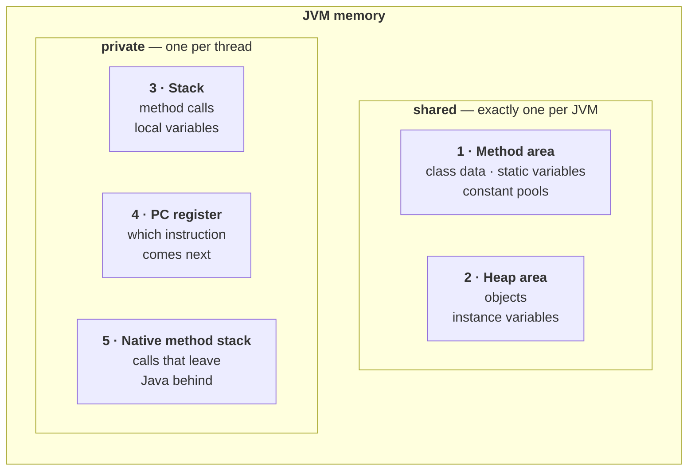
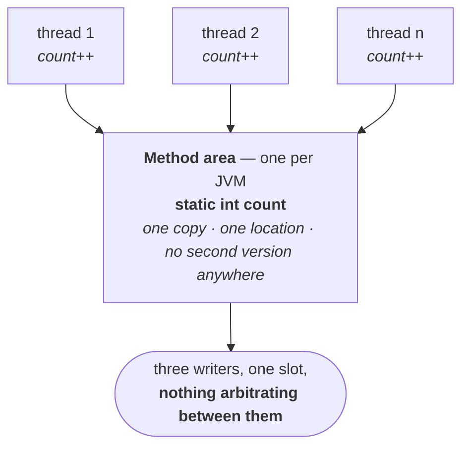
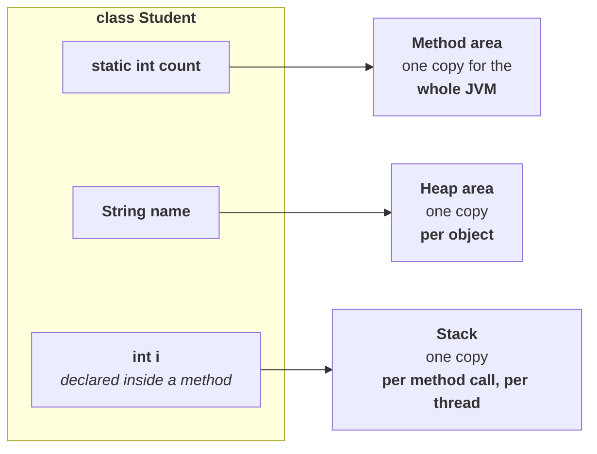
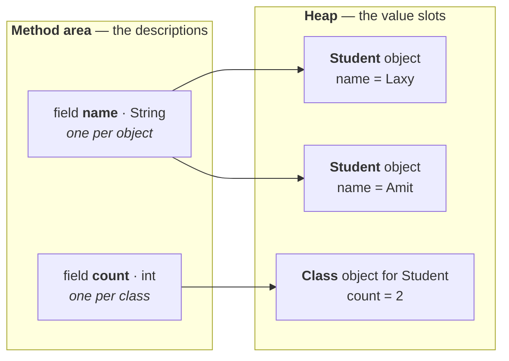
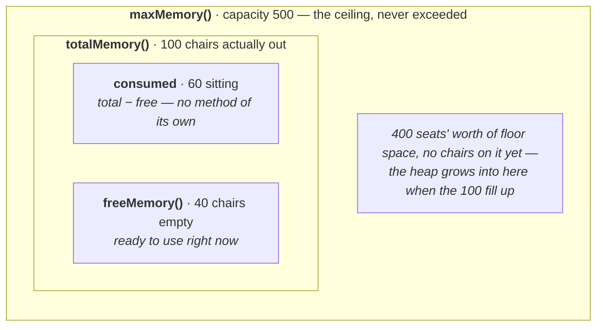
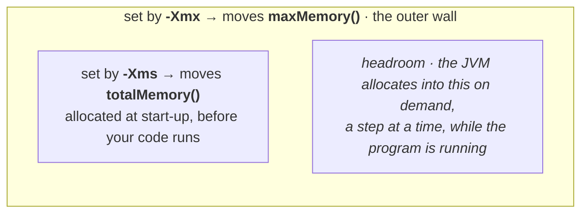

Whenever the JVM loads and runs a Java program, it needs memory to store several things like bytecode, objects, variables, etc. Total JVM memory is organized into the following categories:
 
> 1. **Method area**
> 2. **Heap area**
> 3. **Stack memory**
> 4. **PC registers**
> 5. **Native method stacks**

The motivation is plain if you take the JVM's two jobs literally: *load and run*. Loading needs somewhere to put class data. Running creates objects, which need somewhere to live; and calls methods, whose local variables need somewhere to live. Five areas, each answering one of those needs.

The five do not sit side by side as equals. They divide along one line — **how many of each exist** — and that line is the single most useful thing to hold in your head:



Everything in the top box is reachable by every thread at once, which is why nothing in it is thread safe. Everything in the bottom box is created when a thread starts and destroyed when it ends, so no other thread can even see it — thread safety is not a question there.

**This note covers the two shared areas.** The three private ones are the next note.

---

## Method area

The first, and the one everything so far has already been using.

> - Method area will be created **at the time of JVM start-up**.
> - It will be **shared by all threads** (global memory).
> - This memory area **need not be continuous**.
> - **Total class-level binary information**, including static variables, is stored in the method area.
> - The **runtime constant pool** of a class lives here too.

**One method area per JVM** — not per thread, not per class. It is created when the JVM starts and shared by everything running inside it.

Which matters because of what that sharing means in practice. Put a single `static int count` in a class and look at where it lands:



There is no per-thread copy to fall back on. Every thread in the JVM is incrementing the same number, and the memory area itself does nothing to keep them from overwriting each other.

> [!important] **Method area data is not thread safe, and that follows from it being shared.** Multiple threads can reach it simultaneously, and nothing about the area itself prevents them colliding. This is not a defect — it is the same trade the multithreading chapter describes, where shared state is what makes synchronization necessary. It is also the reason a `static` variable is the classic thing to get wrong in concurrent code: every thread in the JVM is looking at the same one.

> [!info] **"Need not be continuous" is easy to skip past.** The method area is not required to be one unbroken block of memory — it can be scattered, and grow in pieces. Nothing you write depends on this, but it is a stated property and it rules out reasoning about the method area as though it were an array.

> [!important] **"Method area" is the specification's word; a running JVM calls it Metaspace.** Restated here because this is where the area is formally introduced. Metaspace is **native memory**, outside the heap, and it grows on demand — `OutOfMemoryError: Metaspace` means *too many classes loaded*, and `-XX:MaxMetaspaceSize` caps it.
>
> One detail contradicts the diagram most people draw: the **values** of static fields sit in the `Class` object on the **heap**, even though the specification places static variables in the method area. That is not a contradiction of anything in this note — **the method area owns the description, the heap holds the value** — and it is worked through properly in **"The one row that trips everyone up"** below, once objects and the heap are on the table.

---


The method area holds class-level data. The second memory area holds the thing you actually spend your time thinking about — objects.

> [!info] **From a programmer's point of view, the heap is the important one.** The method area is mostly the JVM's business. The heap is where everything you create lives, where `OutOfMemoryError` comes from, and the only one of the five areas you can inspect and resize from your own code — which is the second half of this note.

---

# Heap area

The properties mirror the method area's almost exactly, which makes them easy to learn as a pair.

> - For every JVM, **one heap area** is available.
> - The heap area will be created **at the time of JVM start-up**.
> - **Objects and their corresponding instance variables** will be stored in the heap area.
> - The heap area can be accessed by all threads — it is global / shareable memory. Hence the data stored there is **not thread safe**.
> - Heap area **need not be continuous** memory.

| | Method area | Heap area |
|---|---|---|
| How many per JVM | one | one |
| Created | at JVM start-up | at JVM start-up |
| Holds | class-level binary data, static variables, constant pools | **objects and instance variables** |
| Shared by all threads | yes | yes |
| Thread safe | **no** | **no** |
| Continuous memory | need not be | need not be |

Row for row the same, with one line different — and that one line is the whole distinction. **Class-level data goes left, object-level data goes right.**

Two consequences worth pulling out of that list.

**Instance variables follow their object.** An instance variable is *part of* an object, so it has no separate home — wherever the object is, the instance variable is. Objects live on the heap, therefore instance variables live on the heap. That completes a three-way split you will be asked to recite:

| Variable kind | Lives in |
|---|---|
| **static** variables | method area |
| **instance** variables | **heap area** |
| **local** variables | stack area |

The table is the answer to give; the reason behind it is *how many copies there are*, and that is easier to see drawn. Take one small class with all three kinds of variable in it:



Read the right-hand column downwards and the rule states itself: the more specific the thing the variable belongs to, the more copies exist and the shorter each one lives. `count` belongs to the class, so there is one. `name` belongs to a `Student`, so there are as many as there are students. `i` belongs to a single call, so it appears when the call starts and is gone when it returns.

**Every array in Java is an object.** So arrays are stored on the heap too — including an array of primitives. `int[] a = new int[10]` puts an object on the heap, even though nothing about `int` is object-like.

> [!info] Coder Army — **methods are stored once, in the method area; an object holds only its instance variables**
> Whichever `Student` you call `markAttendance()` on, there is **one copy of that method**, sitting in the method area with the rest of the class data. Instance methods and `static` methods alike — a method is never copied into an object. The object carries its instance variables and nothing else.
>
> Which raises the obvious follow-up: if there is only one copy, what makes `s1.markAttendance()` print *Laxy* and `s2.markAttendance()` print *Amit*? The object is handed **into** the shared method, as slot 0 of its stack frame. That is what `this` is, and it is worked through in the local variable array section of the next note.

> [!important] **"Not thread safe" is a property of the memory, not a warning about your code.** Nothing stops two threads reaching the same object at the same time, because the heap is one shared region by design. That sharing is exactly what makes threads cheap and useful — and exactly what makes synchronization necessary. The JVM provides the shared space; keeping access to it correct is your job.

> [!info] Coder Army — **the string pool**, a region inside the heap that the five-area list never mentions
> A string literal does not live inside the object that refers to it. It lives in the **string pool**, a special region **inside the heap**, and the field holds a reference out to it.
>
> ```java
> class Student {
>     String name;
> }
> // somewhere: s1.name = "Laxy";
> ```
>
> The `Student` object is on the heap and its `name` field sits inside it — but the characters `Laxy` are in the pool, and `name` merely points at them. Write `"Laxy"` again anywhere else in the program and you get a reference to the **same** pooled object. That is the whole purpose of the pool: identical literals are stored once.
>
> `new String("Laxy")` deliberately opts out of it. `new` always means *make a fresh object on the heap*, so you get a second copy with the same characters and a different identity — which is why comparing strings with `==` behaves differently depending on how they were created.

> [!info] Coder Army — **what `new Student("Laxy", 28)` does, in order** — and the step almost everybody skips
> ```
> 1. the object is allocated on the HEAP
> 2. its instance variables get their DEFAULT values — name = null, age = 0
> 3. the constructor's FRAME is pushed onto the stack, with the new object in slot 0 as `this`
> 4. the constructor's assignments overwrite those defaults
> 5. the frame pops, and the reference is stored into the caller's slot — s1
> ```
>
> Step 2 is the one to hold on to. **The defaults are already in place before your constructor runs.** A constructor never builds an object out of nothing; it overwrites values that are sitting there already. That is exactly why a field you forget to assign reads `null` or `0` instead of whatever junk happened to be in that memory.

> [!info] Coder Army — **"eligible for collection" is not "collected"**, and why the heap is a graph rather than a list
> Writing `s1 = null` deletes nothing. It removes one reference, and the object becomes **eligible** — the collector takes it whenever it next runs, which might be much later, or never, if the program ends first.
>
> And you rarely write `null` to cause that. The usual route is quieter: when a method returns its frame pops, and **every reference that frame held disappears at once**.
>
> "Unreachable" also means more than *no variable points at it*. An object's instance field can hold a reference to another object, so the heap is a **graph**, and reachability is followed along chains:
>
> ```mermaid
> flowchart LR
>     ST["<b>stack</b><br/>s1"] --> A["<b>Order</b> object"]
>     A -->|"field: customer"| B["<b>Customer</b> object"]
>     B -->|"field: address"| C["<b>Address</b> object"]
>     D(["<b>Cart</b> object<br/><i>nothing points here —<br/>unreachable</i>"])
> ```
>
> Drop `s1` and all three objects on that chain become unreachable together. It is also why a single forgotten reference can pin a large amount of memory: you are keeping alive not just the object, but everything it points at.

---

# The one row that trips everyone up: `static`

The table above puts static variables in the **method area**. You will also read — including in this note — that static **values** sit on the **heap**. Those look like flat contradictions, and they are not. The way to stop them fighting is to notice that **a field is two separate things**.

Start with an ordinary instance field, where this is obvious and nobody objects:

```java
class Student {
    String name;
}
```

Create three `Student` objects and count what the JVM is actually storing:

| What is stored | How many | Where |
|---|---|---|
| the **description** — "`Student` has a field `name`, of type `String`" | **one**, for the whole class | method area |
| the **value slot** — the box holding `"Laxy"` | **one per object** | heap, inside the object |

The description lives in one place and the value lives in another — and that has never bothered anybody. It is just *"the class knows what fields exist; each object carries its own copies."*

Now do the same counting for a static field:

```java
class Student {
    static int count;
}
```

Run the program and create **zero** `Student` objects. `Student.count` still works, and still reads `0`. So there is exactly one value slot for it — and that slot **cannot** be inside a `Student` object, because there are none.

So which object holds it? There is only one candidate: the object that exists for *the class itself* — the **`Class` object**, created at load time and handed to you as `Student.class`. And the `Class` object is a normal object living on the **heap**.



Read it as one sentence: **every description is on the left, every value is on the right.** The static is not an exception to that — it follows the same rule as the instance field. The only thing that makes it look special is that its value slot lives in the `Class` object rather than in a `Student` object, because the class is what it belongs to.

> [!important] **When asked, say "method area".** That is what the specification says and what the question is testing. The heap detail is a follow-up you offer *after* the answer, not instead of it: *"the spec places static variables in the method area; in HotSpot the value slots are actually held inside the `Class` object on the heap, and have been since JDK 7."*

---

# Reading the heap from inside your program

You can ask the JVM how much memory it has. The route to it is one object.

> A Java application can **communicate with the JVM** by using the `Runtime` object.
>
> `Runtime` class is present in the `java.lang` package, and it is a **singleton class**

Being a singleton, you do not construct it — you ask for the one that exists:

```java
Runtime r = Runtime.getRuntime();
```

> [!info] **Spelling matters here: Runtime, one word, capital R, lowercase t.** Not `RunTime`. Verified on JDK 25 that it is still a singleton — `Runtime.getRuntime() == Runtime.getRuntime()` returns `true`.

Once you have it, three methods:

> 1. **`maxMemory()`** — returns the number of bytes of max memory allocated to the heap
> 2. **`totalMemory()`** — returns the number of bytes of total (initial) memory allocated to the heap
> 3. **`freeMemory()`** — returns the number of bytes of free memory present in the heap

## What the three numbers actually mean

The names are close enough to be confusing.

A room has **capacity for 500 people**. But you have only put out **100 chairs** so far — if those fill up, you will think about bringing more. Right now **60 people are sitting**, so **40 chairs are empty**.

The three numbers are not three separate quantities sitting in a row — each one is **inside** the one before it, and drawing them nested is what makes them stop blurring together:



Two things fall out of the picture that a list of definitions hides. `freeMemory()` is free space **inside** `totalMemory()`, not inside the ceiling — the empty floor of the room does not count as a free chair. And the gap between the outer box and the inner one is the heap's room to grow: as long as it exists, running out of free memory is not an error, just a signal to put out more chairs.

| Method | The room | The heap |
|---|---|---|
| `maxMemory()` | 500 — capacity of the room | the most the heap is ever allowed to grow to |
| `totalMemory()` | 100 — chairs currently out | how much has actually been allocated so far |
| `freeMemory()` | 40 — empty chairs | unused space **within** what is allocated |

And the fourth number, which has no method of its own because you compute it:

> **Consumed memory = `totalMemory()` − `freeMemory()`**

The 60 people sitting down. Note it is measured against **total**, not max — you cannot have consumed memory that was never allocated.

> [!important] **`totalMemory()` is not the total the heap can be.** It reads like it should be the maximum, and it is not — `maxMemory()` is. `totalMemory()` is what is allocated *at this moment*, and it grows towards `maxMemory()` as the program needs more. The concept is **initial memory**; the method is simply named `totalMemory`, and that mismatch is the whole trap.

## The program

```java
class HeapDemo {
    public static void main(String[] args) {
        long mb = 1024 * 1024;
        Runtime r = Runtime.getRuntime();

        System.out.println("Max Memory      : " + r.maxMemory() / mb);
        System.out.println("Total Memory    : " + r.totalMemory() / mb);
        System.out.println("Free Memory     : " + r.freeMemory() / mb);
        System.out.println("Consumed Memory : " + (r.totalMemory() -     r.freeMemory()) / mb);
    }
}
```

Without the division you get raw **bytes** — numbers in the hundreds of millions, which nobody can read. `1 MB = 1024 × 1024 bytes`, so dividing by that gives megabytes.

> [!info] **Use `double` rather than `long` for the divisor if you want the fractional part.** With `long` you get integer division and `0` for consumed memory; with `double` you see `0.36` and can tell the difference between "nothing" and "a little".

## Measured, on JDK 25

```
Max Memory      : 4096.0
Total Memory    : 258.0
Free Memory     : 254.95
Consumed Memory : 3.04
```

> [!important] **The default maximum heap is a fraction of the machine, not a fixed number.** A JVM takes roughly **1/4 of physical RAM** as its default `maxMemory()`. This machine has 16 GB, and a quarter of that is the 4096 MB above — which is why the figure will be different on yours.
>
> So do not memorise any of these numbers. They vary from system to system and run to run. What is stable is the **relationship** — `max ≥ total ≥ free` — and that is what a question is actually testing.

---

# Setting the heap size

> Heap memory is **finite** memory. Based on our requirement, we can **increase or decrease the heap size**. We can use the following flags with the Java command:

| Flag | Sets | The method it moves |
|---|---|---|
| **`-Xmx`** | **max**imum heap size | `maxMemory()` |
| **`-Xms`** | **s**tarting / minimum heap size | `totalMemory()` |

The mnemonic is in the letters: `mx` for **m**a**x**, `ms` for **m**inimum **s**tart.

Laid on top of the room from a moment ago, the two flags set the two boxes — one the outer wall, one the chairs you start with:



Which is also the answer to *why two flags and not one*: `-Xmx` decides how far the program is ever allowed to go, `-Xms` decides how much of that it is handed up front.

```
java -Xmx512m HeapDemo             sets maximum heap size to 512 MB
java -Xms64m  HeapDemo             sets minimum heap size to 64 MB
java -Xmx512m -Xms64m HeapDemo     both at once
```

Verified on JDK 25 — and each flag moves exactly the number it should, leaving the other alone:

| Command                          | Max Memory | Total Memory |
| -------------------------------- | ---------- | ------------ |
| `java HeapDemo`                  | 4096.0     | 258.0        |
| `java -Xmx512m HeapDemo`         | **512.0**  | 258.0        |
| `java -Xms64m HeapDemo`          | 4096.0     | **66.0**     |
| `java -Xmx512m -Xms64m HeapDemo` | **512.0**  | **66.0**     |

That table is the demonstration in one glance: `-Xmx` moves the max and nothing else; `-Xms` moves the total and nothing else; together they set both.

> [!info] **You asked for 64 and got 66 — that is normal.** The JVM rounds heap sizes to alignment boundaries and to whole numbers of regions in the garbage collector, so the figure you get back is near what you asked for rather than exactly it. Ask for `512m` for the *maximum* and you do tend to get 512 exactly, as above — it is the initial size that gets nudged.

> [!info] **`-X` means non-standard.** Every flag starting with `-X` is officially outside the Java specification and not guaranteed across JVM implementations. In practice `-Xmx` and `-Xms` are supported everywhere and are the two most-used flags in production Java — but that is convention, not a promise, and it is why they look different from ordinary options.

> [!question]- Why would you ever set the minimum heap size *up*?
> To stop the JVM growing the heap in steps while your application warms up. Each growth is work, and it happens under load at exactly the wrong moment. Setting `-Xms` equal to `-Xmx` is a common production pattern for long-running servers — the heap is allocated once at start-up, at full size, and never has to be resized again. That is the reason the flag is worth reaching for, beyond simply "increase or decrease the heap".

> [!info] Coder Army — **a memory leak in a garbage-collected language**, which sounds like it should be impossible
> The collector frees what is **unreachable**. So if you hold on to something forever, the collector is doing its job perfectly and the memory is still never freed:
>
> ```java
> class Demo {
>     static List<int[]> cache = new ArrayList<>();
>
>     public static void main(String[] args) {
>         while (true) {
>             cache.add(new int[250_000]);   // about 1 MB each
>         }
>     }
> }
> ```
>
> Nothing here is a mistake the compiler can see. `cache` is `static`, so it lives as long as the class does; every array added to it stays reachable through the list; the collector runs, finds nothing it is allowed to free, and the heap fills until you get **`OutOfMemoryError: Java heap space`**.
>
> The shape to recognise is **a long-lived container that only ever gets added to** — static collections, caches with no eviction, listener lists nobody unregisters from. The fix is always the same: drop the reference when you are done with it, so the object can actually become unreachable.

> [!example] Coder Army — **forcing `OutOfMemoryError` on purpose**, with a 4 MB heap
> Take the leak above, cap the heap with the two flags, and count the blocks as they go in:
>
> ```java
> int count = 0;
> while (true) {
>     cache.add(new int[250_000]);
>     count++;
>     System.out.println("Allocated block " + count);
> }
> ```
>
> ```
> java -Xms2m -Xmx4m Demo
>
> Allocated block 1
> Allocated block 2
> Allocated block 3
> Allocated block 4
> Allocated block 5
> Exception in thread "main" java.lang.OutOfMemoryError: Java heap space
> ```
>
> A 4 MB ceiling at roughly 1 MB a block should give four, and it gives **five**. `250_000 × 4 bytes = 1,000,000 bytes`, but a megabyte is `1024 × 1024 = 1,048,576` bytes — so each block is about 4.6% *smaller* than a megabyte, and five of them fit. It is the same 1000-versus-1024 gap that makes the program earlier in this note divide by `1024 * 1024` rather than by a million.

---

> [!info] Coder Army — **the order the areas actually come into existence**, from `java Demo` to the first instruction
> ```
> java Demo
>   │
>   ├─ 1. the JVM starts
>   ├─ 2. the class loader finds Demo.class and reads its bytecode
>   ├─ 3. an entry for Demo is created in the METHOD AREA
>   ├─ 4. the main THREAD is created
>   ├─ 5. that thread's STACK and PC REGISTER are created
>   ├─ 6. a frame for main() is pushed onto the stack
>   └─ 7. the first instruction executes
> ```
>
> Steps 3 and 5 landing in that order is the point. The class is fully in the method area **before any thread's stack exists** — which is what allows step 6 to happen in a single move. The size of `main`'s frame was worked out by the compiler, written into the class file, and is now sitting in the method area waiting to be read. The stack never discovers what `main` needs; it is told.
>
> The heap is present throughout — created at JVM start-up alongside the method area — and simply stays empty until the program creates its first object.

---

That is the heap: one per JVM, created at start-up, holding every object and every instance variable, shared by all threads and therefore not thread safe, resizable from the command line and inspectable from inside your own program.

