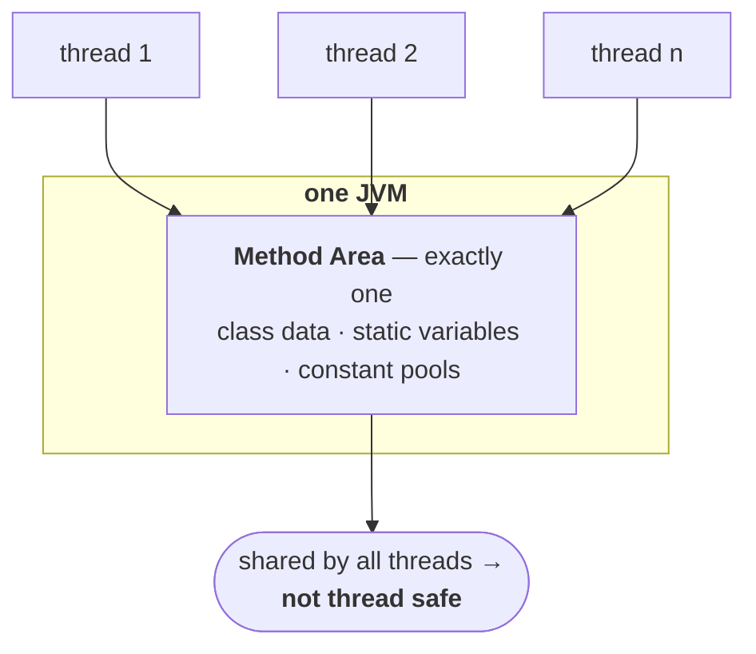
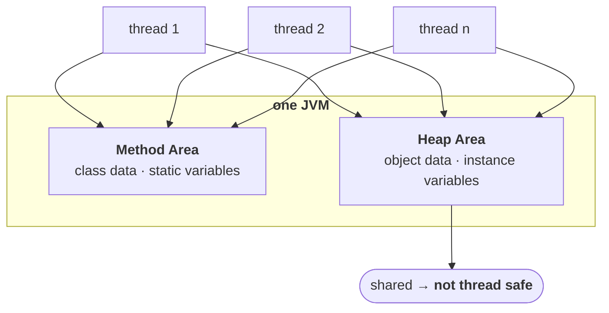
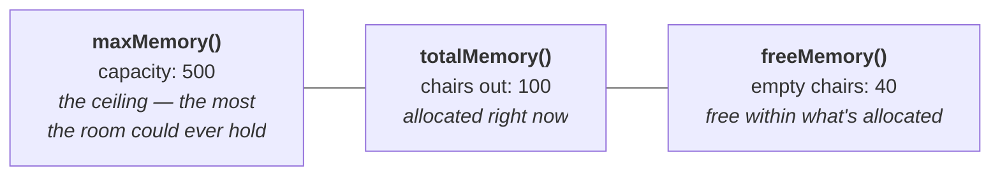

Whenever the JVM loads and runs a Java program, it needs memory to store several things like bytecode, objects, variables, etc. Total JVM memory is organized into the following categories:
 
> 1. **Method area**
> 2. **Heap area**
> 3. **Stack memory**
> 4. **PC registers**
> 5. **Native method stacks**

The motivation is plain if you take the JVM's two jobs literally: *load and run*. Loading needs somewhere to put class data. Running creates objects, which need somewhere to live; and calls methods, whose local variables need somewhere to live. Five areas, each answering one of those needs.

---

## Method area

The first, and the one everything so far has already been using.

> - **Method area will be created at the time of JVM start-up.**
> - **It will be shared by all threads (global memory).**
> - **This memory area need not be continuous.**
> - **Total class-level binary information, including static variables, is stored in the method area.**
> - **The runtime constant pool of a class lives here too.**

**One method area per JVM** — not per thread, not per class. It is created when the JVM starts and shared by everything running inside it.



Which leads directly to the consequence worth remembering:

> [!important] **Method area data is not thread safe, and that follows from it being shared.** Multiple threads can reach it simultaneously, and nothing about the area itself prevents them colliding. This is not a defect — it is the same trade the multithreading chapter describes, where shared state is what makes synchronization necessary. It is also the reason a `static` variable is the classic thing to get wrong in concurrent code: every thread in the JVM is looking at the same one.

> [!info] **"Need not be continuous" is easy to skip past.** The method area is not required to be one unbroken block of memory — it can be scattered, and grow in pieces. Nothing you write depends on this, but it is a stated property and it rules out reasoning about the method area as though it were an array.

> [!warning] **"Method area" is the specification's word; a running JVM calls it Metaspace.** Restated here because this is where the area is formally introduced. Metaspace is **native memory**, outside the heap, and it grows on demand — `OutOfMemoryError: Metaspace` means *too many classes loaded*, and `-XX:MaxMetaspaceSize` caps it.
>
> One detail that contradicts the diagram most people draw: the **values** of static fields sit in the `Class` object on the **heap**, even though the specification places static variables in the method area. Method area owns the declaration; the heap holds the value — the same split as note `01`.

---


The method area holds class-level data. The second memory area holds the thing you actually spend your time thinking about — objects.

> [!info] **From a programmer's point of view, the heap is the important one.** The method area is mostly the JVM's business. The heap is where everything you create lives, where `OutOfMemoryError` comes from, and the only one of the five areas you can inspect and resize from your own code — which is the second half of this note.

---

# Heap area

The properties mirror the method area's almost exactly, which makes them easy to learn as a pair.

> - **For every JVM, one heap area is available.**
> - **The heap area will be created at the time of JVM start-up.**
> - **Objects and their corresponding instance variables will be stored in the heap area.**
> - **The heap area can be accessed by all threads — it is global / shareable memory. Hence the data stored there is not thread safe.**
> - **Heap area need not be continuous memory.**

| | Method area | Heap area |
|---|---|---|
| How many per JVM | one | one |
| Created | at JVM start-up | at JVM start-up |
| Holds | class-level binary data, static variables, constant pools | **objects and instance variables** |
| Shared by all threads | yes | yes |
| Thread safe | **no** | **no** |
| Continuous memory | need not be | need not be |



Two consequences worth pulling out of that list.

**Instance variables follow their object.** An instance variable is *part of* an object, so it has no separate home — wherever the object is, the instance variable is. Objects live on the heap, therefore instance variables live on the heap. That completes a three-way split you will be asked to recite:

| Variable kind | Lives in |
|---|---|
| **static** variables | method area |
| **instance** variables | **heap area** |
| **local** variables | stack area |

**Every array in Java is an object.** So arrays are stored on the heap too — including an array of primitives. `int[] a = new int[10]` puts an object on the heap, even though nothing about `int` is object-like.

> [!important] **"Not thread safe" is a property of the memory, not a warning about your code.** Nothing stops two threads reaching the same object at the same time, because the heap is one shared region by design. That sharing is exactly what makes threads cheap and useful — and exactly what makes synchronization necessary. The JVM provides the shared space; keeping access to it correct is your job.

---

# Reading the heap from inside your program

You can ask the JVM how much memory it has. The route to it is one object.

> **A Java application can communicate with the JVM by using the `Runtime` object.**
>
> **`Runtime` class is present in the `java.lang` package, and it is a singleton class.**

Being a singleton, you do not construct it — you ask for the one that exists:

```java
Runtime r = Runtime.getRuntime();
```

> [!info] **Spelling matters here: `Runtime`, one word, capital `R`, lowercase `t`.** Not `RunTime`. Verified on JDK 25 that it is still a singleton — `Runtime.getRuntime() == Runtime.getRuntime()` returns `true`.

Once you have it, three methods:

> 1. **`maxMemory()`** — returns the number of bytes of max memory allocated to the heap
> 2. **`totalMemory()`** — returns the number of bytes of total (initial) memory allocated to the heap
> 3. **`freeMemory()`** — returns the number of bytes of free memory present in the heap

## What the three numbers actually mean

The names are close enough to be confusing. A classroom separates them cleanly.

A room has **capacity for 500 people**. But you have only put out **100 chairs** so far — if those fill up, you will think about bringing more. Right now **60 people are sitting**, so **40 chairs are empty**.



| Method | The room | The heap |
|---|---|---|
| `maxMemory()` | 500 — capacity of the room | the most the heap is ever allowed to grow to |
| `totalMemory()` | 100 — chairs currently out | how much has actually been allocated so far |
| `freeMemory()` | 40 — empty chairs | unused space **within** what is allocated |

And the fourth number, which has no method of its own because you compute it:

> **Consumed memory = `totalMemory()` − `freeMemory()`**

The 60 people sitting down. Note it is measured against **total**, not max — you cannot have consumed memory that was never allocated.

> [!important] **`totalMemory()` is not the total the heap can be.** It reads like it should be the maximum, and it is not — `maxMemory()` is. `totalMemory()` is what is allocated *at this moment*, and it grows towards `maxMemory()` as the program needs more. The concept is **initial memory**; the method is simply named `totalMemory`, and that mismatch is the whole trap.

## The program

```java
class HeapDemo {
    public static void main(String[] args) {
        long mb = 1024 * 1024;
        Runtime r = Runtime.getRuntime();

        System.out.println("Max Memory      : " + r.maxMemory() / mb);
        System.out.println("Total Memory    : " + r.totalMemory() / mb);
        System.out.println("Free Memory     : " + r.freeMemory() / mb);
        System.out.println("Consumed Memory : " + (r.totalMemory() - r.freeMemory()) / mb);
    }
}
```

Without the division you get raw **bytes** — numbers in the hundreds of millions, which nobody can read. `1 MB = 1024 × 1024 bytes`, so dividing by that gives megabytes.

> [!info] **Use `double` rather than `long` for the divisor if you want the fractional part.** With `long` you get integer division and `0` for consumed memory; with `double` you see `0.36` and can tell the difference between "nothing" and "a little".

## Measured, on JDK 25

```
Max Memory      : 4096.0
Total Memory    : 258.0
Free Memory     : 254.95
Consumed Memory : 3.04
```

> [!important] **The default maximum heap is a fraction of the machine, not a fixed number.** A JVM takes roughly **1/4 of physical RAM** as its default `maxMemory()`. This machine has 16 GB, and a quarter of that is the 4096 MB above — which is why the figure will be different on yours.
>
> So do not memorise any of these numbers. They vary from system to system and run to run. What is stable is the **relationship** — `max ≥ total ≥ free` — and that is what a question is actually testing.

---

# Setting the heap size

> **Heap memory is finite memory. Based on our requirement, we can increase or decrease the heap size. We can use the following flags with the Java command:**

| Flag | Sets | The method it moves |
|---|---|---|
| **`-Xmx`** | **max**imum heap size | `maxMemory()` |
| **`-Xms`** | **s**tarting / minimum heap size | `totalMemory()` |

The mnemonic is in the letters: `mx` for **m**a**x**, `ms` for **m**inimum **s**tart.

```
java -Xmx512m HeapDemo             sets maximum heap size to 512 MB
java -Xms64m  HeapDemo             sets minimum heap size to 64 MB
java -Xmx512m -Xms64m HeapDemo     both at once
```

Verified on JDK 25 — and each flag moves exactly the number it should, leaving the other alone:

| Command | Max Memory | Total Memory |
|---|---|---|
| `java HeapDemo` | 4096.0 | 258.0 |
| `java -Xmx512m HeapDemo` | **512.0** | 258.0 |
| `java -Xms64m HeapDemo` | 4096.0 | **66.0** |
| `java -Xmx512m -Xms64m HeapDemo` | **512.0** | **66.0** |

That table is the demonstration in one glance: `-Xmx` moves the max and nothing else; `-Xms` moves the total and nothing else; together they set both.

> [!info] **You asked for 64 and got 66 — that is normal.** The JVM rounds heap sizes to alignment boundaries and to whole numbers of regions in the garbage collector, so the figure you get back is near what you asked for rather than exactly it. Ask for `512m` for the *maximum* and you do tend to get 512 exactly, as above — it is the initial size that gets nudged.

> [!info] **`-X` means non-standard.** Every flag starting with `-X` is officially outside the Java specification and not guaranteed across JVM implementations. In practice `-Xmx` and `-Xms` are supported everywhere and are the two most-used flags in production Java — but that is convention, not a promise, and it is why they look different from ordinary options.

> [!question]- Why would you ever set the minimum heap size *up*?
> To stop the JVM growing the heap in steps while your application warms up. Each growth is work, and it happens under load at exactly the wrong moment. Setting `-Xms` equal to `-Xmx` is a common production pattern for long-running servers — the heap is allocated once at start-up, at full size, and never has to be resized again. That is the reason the flag is worth reaching for, beyond simply "increase or decrease the heap".

---

That is the heap: one per JVM, created at start-up, holding every object and every instance variable, shared by all threads and therefore not thread safe, resizable from the command line and inspectable from inside your own program.

The next memory area is the one that is **not** shared — every thread gets its own.
