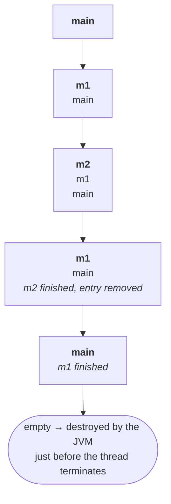
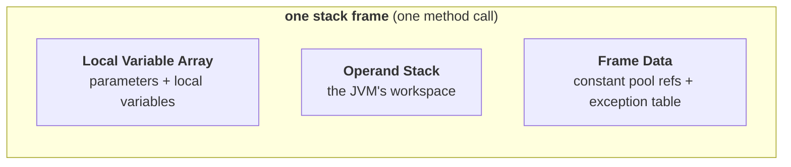
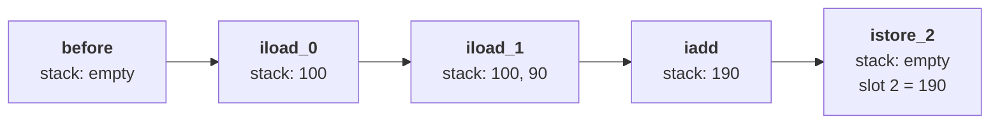
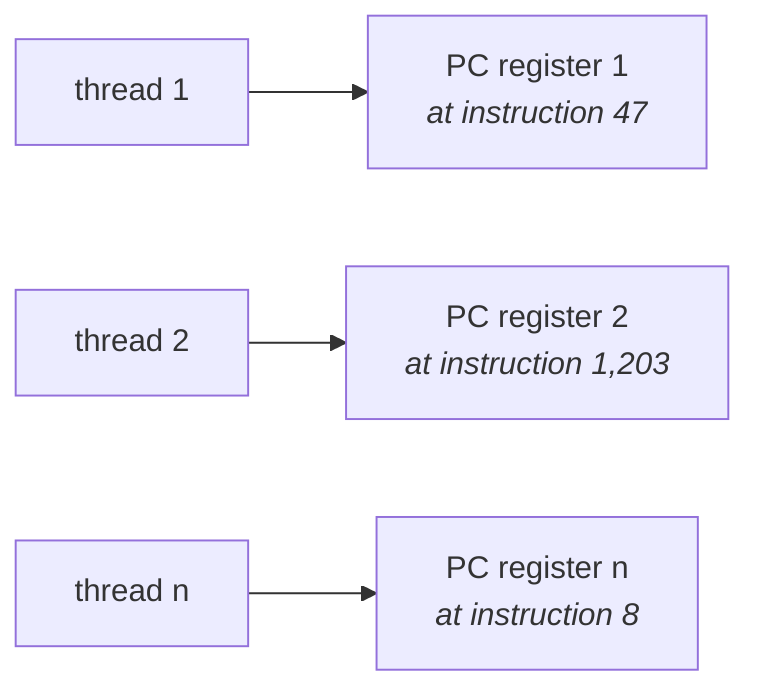

The method area and the heap are **per JVM** — one of each, shared by everything running inside. The remaining three memory areas break that pattern completely.

> **For every thread, the JVM will create a separate runtime stack.**

Per **thread**, not per JVM. That single change of unit is what this note is about, and it carries a consequence the first two areas could not offer.

---

# Stack memory

> - **For every thread, the JVM will create a separate runtime stack**, at the time of thread creation.
> - **All method calls and the corresponding local variables and intermediate results will be stored in the stack.**
> - **For every method call a separate entry is added to the stack**, and that entry is called a **stack frame** or **activation record**.
> - **After completing that method call, the corresponding entry is removed from the stack.**
> - **After completing all method calls, just before terminating the thread, the runtime stack is destroyed by the JVM.**

## Watching one build and unwind

Take three methods that call each other:

```java
class Test {
    public static void main(String[] args) {
        m1();
    }
    public static void m1() {
        m2();
    }
    public static void m2() {
        // …
    }
}
```

**How many threads are in this program? One — the main thread.** So there is exactly one runtime stack, and every call goes onto it.



The main thread calls `main`, so `main` goes on first. `main` calls `m1`, so `m1` goes on top. `m1` calls `m2`. Then it unwinds in exactly the reverse order: `m2` completes and its entry is removed, then `m1`, then `main`. The stack is empty, and the JVM destroys it immediately before the thread ends.

> [!info] **The lifetime of the stack is the lifetime of the thread**, exactly. Created at thread creation, destroyed just before thread termination. This is why the two other per-thread areas below follow the same rule — they are all born and die with their thread.

## The property the other areas do not have

> **The data stored in the stack can be accessed only by the corresponding thread, and it is not available to other threads. Hence this data is thread safe.**


> [!important] **This is the one memory area that is thread safe, and it is thread safe for a structural reason rather than a defensive one.** Nothing is locked, nothing is synchronized, nothing is copied. Each thread simply has its own stack that no other thread can reach — safety by *not sharing*, which is always cheaper than safety by coordination.
>
> Line the three up and the pattern is complete: method area shared → not thread safe; heap shared → not thread safe; **stack not shared → thread safe**. Which is also the practical reason local variables are the safest place to keep anything in concurrent code.

---

## Stack frame structure

Each entry on the stack — each frame — has three parts.

> **Each stack frame contains 3 parts:**
> 1. **Local variable array**
> 2. **Operand stack**
> 3. **Frame data**



---

### 1 · Local variable array

> **It contains all parameters and local variables of the method.**
> **Each slot in the array is of 4 bytes.**

The sizing rules are the examinable part:

| Type | Slots | Why |
|---|---|---|
| `int`, `float`, **reference** | **1** | 4 bytes each — a reference is an address, and an address is an int-sized value |
| `long`, `double` | **2 consecutive** | 8 bytes each, so they need two 4-byte slots |
| `byte`, `short`, `char` | **1** | **converted to `int` before storing**, then occupy one slot |
| `boolean` | **usually 1** | varies from JVM to JVM; most follow one slot |

The `byte`/`short`/`char` row is the one people get wrong. A `byte` is one byte and a `char` is two — but neither is *stored* at its natural size. Both are promoted to `int` first, and then take a full slot.

Take this method:

```java
public void m1(int i, double d, Object o, byte b, float f) { … }
```

Verified on JDK 25 with `javap -c -l`, adding a `long x` and an `int sum` inside the body:

```
LocalVariableTable:
   Slot  Name   Signature
      0  this   LFrame;
      1  i      I            ← int, 1 slot
      2  d      D            ← double, slots 2 AND 3
      4  o      LObject;     ← reference, 1 slot   (note: slot 3 was skipped)
      5  b      B            ← byte, 1 slot
      6  f      F            ← float, 1 slot
      7  x      J            ← long, slots 7 AND 8
      9  sum    I            ← int          (note: slot 8 was skipped)
```

Every rule is visible in the slot numbers. `d` is at slot 2 and the next variable is at **4**, not 3 — the double consumed both. `x` is at 7 and the next is at **9**. The `byte` gets one whole slot like everything else.

> [!info] **Slot 0 is `this`.** It is right there in the output and worth knowing: in an instance method, the reference to the current object occupies slot 0, and parameters start at 1. In a `static` method there is no `this`, and parameters start at slot 0.

> [!warning] **"Each slot is 4 bytes" is the specification's model, not the memory your machine uses.** The JVM specification defines slots as 32-bit units, which is what makes the *two consecutive slots for `long`/`double`* rule true, and that rule is what gets examined.
>
> Physically, a 64-bit JVM does not lay out a 4-byte reference. References are 8 bytes, unless **compressed oops** is on — which it is by default for heaps under 32 GB, and which stores them as 4-byte offsets. So the number happens to come out right much of the time, for a completely different reason than the one given. Learn the slot model for the exam; do not use it to reason about actual memory consumption.

---

### 2 · Operand stack

> **The JVM uses the operand stack as a workspace.**
> **Some instructions push values onto the operand stack, and some instructions pop values from it, perform the required operations, and store the result back onto the operand stack.**

The analogy is a competitive exam — I-SET, M-SET, the SCJP exam itself. The invigilator will not let you bring so much as a sheet of paper in. But you still need to do rough work, so the question paper reserves the last two or three pages as **space for rough work**, or the test centre hands you an erasable pad and a pen. You do your intermediate scribbling there, and when the exam ends it is wiped.

**The operand stack is that scratch pad.** A method needs somewhere to hold intermediate results while it computes, and this is it.

### Working through one calculation

The instruction sequence, which is close to real bytecode:

```
iload_0     ← push the value in slot 0
iload_1     ← push the value in slot 1
iadd        ← pop two, add them, push the result
istore_2    ← pop the result, store it into slot 2
```

Local variable array starts with `100` in slot 0 and `90` in slot 1. Operand stack starts empty.

| Step | Local variable array | Operand stack |
|---|---|---|
| **before starting** | `[100, 90, —]` | *empty* |
| after `iload_0` | `[100, 90, —]` | `100` |
| after `iload_1` | `[100, 90, —]` | `100, 90` |
| after `iadd` | `[100, 90, —]` | `190` |
| after `istore_2` | `[100, 90, **190**]` | *empty* |



Notice the shape: **the operand stack ends empty.** Values were pushed in, work was done, the result was moved back to the local variable array, and the scratch pad was wiped — exactly like the exam pad.

This is real, not a teaching invention. Compiling `int c = a + b; return c;` and disassembling on JDK 25:

```
public int add(int, int);
   0: iload_1
   1: iload_2
   2: iadd
   3: istore_3
   4: iload_3
   5: ireturn
```

The same four instructions in the same order, differing only in slot numbers because slot 0 is `this`.

> [!info] **This is why the JVM is called a *stack-based* virtual machine.** Most physical CPUs are register-based — instructions name the registers to operate on. JVM bytecode names almost nothing; it pushes operands onto a stack and applies operations to whatever is on top. That is what makes the bytecode portable: it does not have to know how many registers your processor has.

---

### 3 · Frame data

> **Frame data contains all symbolic references (constant pool) related to that method.**
> **It also contains a reference to the exception table, which provides the corresponding catch block information in the case of exceptions.**

Two things, and both connect back to earlier material:

- **The symbolic references** are the constant pool entries this method uses — the same symbolic references the resolution phase turns into direct references. Each frame carries the ones its own method needs.
- **The exception table** is how `catch` actually works. When an exception is thrown, the JVM consults this table to find which catch block, if any, covers the instruction that threw. `try`/`catch` is not a runtime search up the call stack for a matching type — it is a table lookup per frame, which is why an untaken `try` block costs essentially nothing.

Frame data is, in one phrase, *metadata* for the frame.

---

# PC registers

> - **For every thread, a separate PC register will be created at the time of thread creation.**
> - **PC registers contain the address of the current executing instruction.**
> - **Once instruction execution completes, automatically the PC register will be incremented to hold the address of the next instruction.**

PC is **program counter** — the same idea from computer organisation, and for the same reason.

The argument for one-per-thread is worth following, because it is the clearest justification of the whole per-thread grouping: **each thread is a separate flow of execution, so each thread is at a different instruction at any moment.** Ten threads means ten "next instructions" to keep track of, therefore ten PC registers.



> [!info] **You will never touch this one.** It is used entirely by the JVM internally. It appears in the list because "how many memory areas" expects five, and because it explains how a thread knows where it is.

---

# Native method stacks

> - **For every thread, the JVM will create a separate native method stack.**
> - **All native method calls invoked by the thread will be stored in the corresponding native method stack.**

Same story as the runtime stack, split by what kind of method is being called:

| Call | Goes on |
|---|---|
| ordinary Java method | the **runtime stack** |
| **native** method — implemented in non-Java code | the **native method stack** |

Every thread therefore has **two** stacks. `hashCode()` is the example given — a native method, so its call is recorded in the native method stack rather than the ordinary one.

Beyond which stack the entry lands on, there is no difference in behaviour.

---

# Pulling the five together

## Per JVM, or per thread?

This is the summary question, and the whole note has been building to it.

> **Method area and heap area are for the JVM. Stack area, PC registers area and native method stack area are for the thread.**

| | Count |
|---|---|
| **Method area** | one per **JVM** |
| **Heap area** | one per **JVM** |
| **Stack area** | one per **thread** |
| **PC register** | one per **thread** |
| **Native method stack** | one per **thread** |

Ten threads in one JVM → one method area, one heap, and **ten** of each of the other three.

> **Method area, heap area and stack area are considered the major memory areas with respect to the programmer's point of view.** The last two are used internally by the JVM and you can largely leave them alone.

## Where each kind of variable lives

> **Static variables are stored in the method area, instance variables are stored in the heap area, and local variables are stored in the stack area.**

| Variable | Memory area | Because |
|---|---|---|
| **static** | method area | part of the class data |
| **instance** | heap area | part of the object |
| **local** | stack area | part of the method call |

## The example that ties it together

```java
class Test {
    Student s1 = new Student();                  // instance variable
    static Student s2 = new Student();           // static variable

    public static void main(String[] args) {
        Test t = new Test();                     // local variable
        Student s3 = new Student();              // local variable
    }
}
```

Follow every name to its area:


Read it as one rule and the diagram writes itself: **every object is on the heap, without exception — the variables differ only in where the *reference* is kept.** `s2` is a static variable so the reference sits in the method area; `t` and `s3` are locals so their references sit in the stack; `s1` is an instance variable so it lives inside the `Test` object, on the heap. All four objects are on the heap regardless.

> [!info] **This is where most of the confusion in the topic lives, and it comes from conflating the variable with the object.** "Where is `s3` stored?" and "where is the `Student` stored?" have different answers — stack and heap respectively — for the same line of code.

---

## Two more things about the stack

The five-area model above is straight from the JVM specification. Two further facts that the model implies but does not spell out — and both of them you will actually meet.

> [!warning] **The stack has a size limit, and blowing it is a distinct error.** Infinite recursion pushes frames until the runtime stack cannot grow, and you get **`StackOverflowError`** — *not* `OutOfMemoryError`, which is the heap's failure. Knowing which error names which area is half of diagnosing it.
>
> The stack size is set with **`-Xss`**, completing the set alongside `-Xmx` and `-Xms` from the heap note. Measured on JDK 25, recursing until it breaks:
>
> ```
> default      : StackOverflowError at depth  44,550
> -Xss512k     : StackOverflowError at depth   4,210
> -Xss4m       : StackOverflowError at depth 162,189
> ```
>
> Roughly linear in the stack size, which is exactly what "one frame per call, stacked" predicts. Note also that the depth is in the tens of thousands by default — deep recursion is fine; *unbounded* recursion is not.

> [!info] **Virtual threads change what "one stack per thread" costs.** The rule still holds — every virtual thread has its own stack — but a virtual thread's stack lives on the **heap** as a resizable chunk rather than being a fixed operating-system thread stack. That is precisely what makes millions of them affordable, where millions of platform threads would not be. The model is intact; the implementation underneath it now has two very different shapes.
