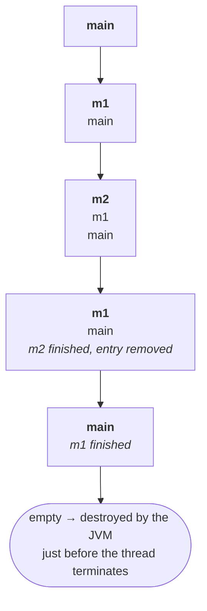
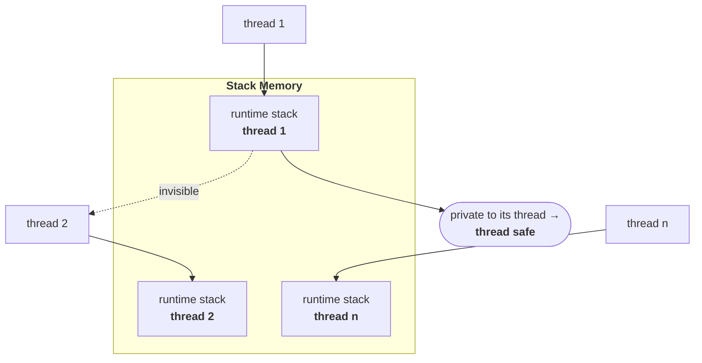
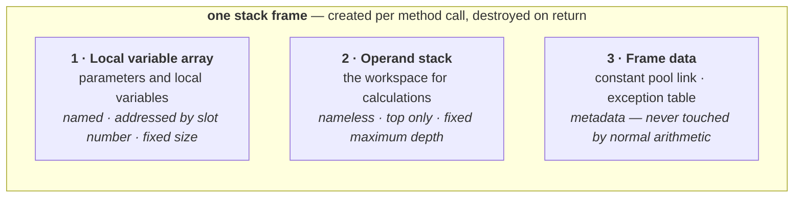
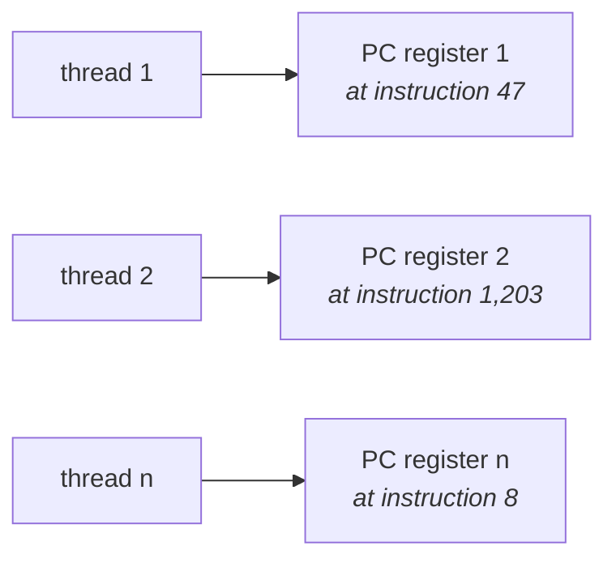
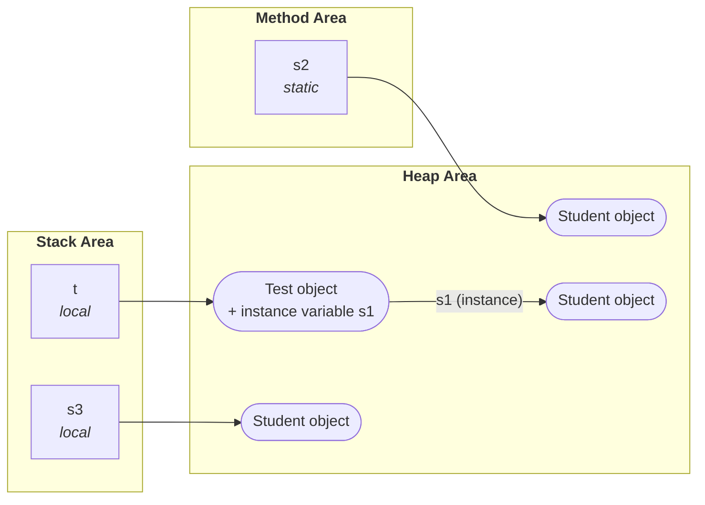

The method area and the heap are **per JVM** — one of each, shared by everything running inside. The remaining three memory areas break that pattern completely.

> For every thread, the JVM will create a **separate runtime stack**.

Per **thread**, not per JVM. That single change of unit is what this note is about, and it carries a consequence the first two areas could not offer.

---

# Stack memory

> - **For every thread, the JVM will create a separate runtime stack**, at the time of thread creation.
> - All **method calls** and the corresponding **local variables** and intermediate results will be stored in the stack.
> - **For every method call a separate entry is added to the stack**, and that entry is called a **stack frame** or **activation record**.
> - After completing that method call, the corresponding **entry is removed** from the stack.
> - After completing all method calls, just before terminating the thread, the **runtime stack is destroyed** by the JVM.

## Watching one build and unwind

Take three methods that call each other:

```java
class Test {
    public static void main(String[] args) {
        m1();
    }
    public static void m1() {
        m2();
    }
    public static void m2() {
        // …
    }
}
```

**How many threads are in this program? One — the main thread.** So there is exactly one runtime stack, and every call goes onto it.



The main thread calls `main`, so `main` goes on first. `main` calls `m1`, so `m1` goes on top. `m1` calls `m2`. Then it unwinds in exactly the reverse order: `m2` completes and its entry is removed, then `m1`, then `main`. The stack is empty, and the JVM destroys it immediately before the thread ends.

> [!info] **The lifetime of the stack is the lifetime of the thread**, exactly. Created at thread creation, destroyed just before thread termination. This is why the two other per-thread areas below follow the same rule — they are all born and die with their thread.

## The property the other areas do not have

> The data stored in the stack can be accessed **only by the corresponding thread**, and it is not available to other threads. Hence this data is **thread safe**.



> [!important] **This is the one memory area that is thread safe, and it is thread safe for a structural reason rather than a defensive one.** Nothing is locked, nothing is synchronized, nothing is copied. Each thread simply has its own stack that no other thread can reach — safety by *not sharing*, which is always cheaper than safety by coordination.
>
> Line the three up and the pattern is complete: method area shared → not thread safe; heap shared → not thread safe; **stack not shared → thread safe**. Which is also the practical reason local variables are the safest place to keep anything in concurrent code.

> [!info] Coder Army — **why local variables are not simply kept on the heap** like everything else
> Every object the program creates goes on the heap, so it is fair to ask why locals get an area of their own.
>
> Three reasons, and all of them are about cost. Calling methods is the **most frequent thing a program does**, and a stack gives you push and pop in constant time — no searching for free space, no bookkeeping. Locals are **short-lived by definition**; the instant the method returns every one of them is dead, so releasing them is nothing more than moving the top-of-stack pointer down. And because of that, the **garbage collector never has to look at them at all** — nothing to mark, nothing to trace, no pause.
>
> Put locals on the heap instead and you would pay allocation cost on every single call, and hand the collector one more object to chase for something that was guaranteed dead the moment the method returned.

---

## Stack frame structure

Each entry on the stack — each frame — has three parts.

> **Each stack frame contains 3 parts:**
> 1. **Local variable array**
> 2. **Operand stack**
> 3. **Frame data**



The first two hold **values**; the third holds **information about the method**. Both sizes on the first two are decided by the compiler before the program runs, which is what lets the JVM create a whole frame in one step.

---

### 1 · Local variable array

> It contains all **parameters and local variables** of the method.
> **Each slot in the array is of 4 bytes.**

Four facts cover this array. Everything else about it is detail you can derive.

#### 1 — Locals and parameters get slots. Fields do not.

This is the one that decides whether you have understood the area at all. Take a method that touches all four kinds of variable:

```java
class Frame {
    static int counter;          // static variable
    String name;                 // instance variable

    void m1(int i) {             // parameter
        int local = 5;           // local variable
        counter++;
        name = "x";
    }
}
```

`m1` uses all four, but only **two** of them get slots — `i` and `local`. `counter` and `name` are nowhere in the array, even though the method reads and writes both.

The reason is lifetime. The local variable array is **created fresh on every call and thrown away when the call returns**. A static variable belongs to the class and a `name` belongs to an object; both outlive the call, so neither can live in something that short-lived. They are reached where they actually are — the static through the class, the instance variable through the object.

| Variable | In the slot array? | Reached how |
|---|---|---|
| `counter` — static | **no** | through the class |
| `name` — instance | **no** | through the object |
| `i` — parameter | **yes** | slot 1 |
| `local` — local | **yes** | slot 2 |

> [!info] Coder Army — **"Java is pass-by-value" is just two slot arrays side by side**
> ```java
> public static void main(String[] args) {
>     int a = 10;
>     int result = add(a, 20);
> }
>
> static int add(int x, int y) {
>     return x + y;
> }
> ```
>
> While `add` is running there are two frames on the stack, each with an array of its own. Both methods are `static`, so neither has a `this` and both start at slot 0:
>
> | Frame | slot 0 | slot 1 | slot 2 |
> |---|---|---|---|
> | `add` | `x` = 10 | `y` = 20 | — |
> | `main` | `args` | `a` = 10 | `result` |
>
> `a` and `x` both hold `10`, and they are **different slots in different arrays**. The call copied the value across; after that nothing connects them. Assign to `x` inside `add` and `a` is untouched — not because a rule forbids it, but because there is no path from one slot to the other.
>
> The same happens when you pass an object: what gets copied into the callee's slot is the **reference**. Two slots then point at one heap object, so changes to that object's fields are visible through both — which is where the endless "Java is pass-by-reference" argument comes from. It is not. The reference itself was passed by value.

#### 2 — Slot 0 is `this`

In an instance method or a constructor, the reference to the current object occupies slot 0, and parameters start at 1. Here is the method from above, unchanged:

```java
class Frame {
    static int counter;
    String name;

    void m1(int i) {
        int local = 5;
        counter++;
        name = "x";
    }
}
```

```
   Slot  Name   Signature
      0  this   LFrame;      ← the object the method was called on
      1  i      I
      2  local  I
```

That slot-0 reference is also **how the method reaches its own instance variables**. You wrote `name = "x"`, but the compiler compiles `this.name = "x"` — and if two `Frame` objects exist, the `this` in slot 0 is what says which object's `name` to write into.

Now make the one-word change, `void` to `static void`:

```java
class Frame {
    static int counter;
    String name;

    static void m1(int i) {
        int local = 5;
        counter++;
        name = "x";
    }
}
```

Two things change, and the second is the interesting one.

**Everything shifts down by one.** A static method is called on the class — `Frame.m1(7)` — with no object involved, so nothing goes in slot 0 and the first parameter takes it:

```
   Slot  Name   Signature
      0  i      I           ← parameter now at 0, no `this`
      1  local  I
```

**And the class no longer compiles.** Measured on JDK 25:

```
Frame.java:8: error: non-static variable name cannot be referenced from a static context
        name = "x";
        ^
1 error
```

Which is the rule *"you cannot use an instance variable in a static method"* seen from the memory side. It is not an arbitrary restriction the compiler imposes — reaching `name` means going through an object, the object comes from slot 0, and in a static method **there is nothing in slot 0 to go through**. Note that `counter++` on the line above is untouched: a static variable belongs to the class, so no object is needed to reach it.

#### 3 — `long` and `double` take two slots, everything else takes one

| Type | Slots | Why |
|---|---|---|
| `int`, `float`, **reference** | **1** | 4 bytes each — a reference is an address, and an address is an int-sized value |
| `long`, `double` | **2 consecutive** | 8 bytes each, so they need two 4-byte slots |
| `byte`, `short`, `char` | **1** | **converted to `int` before storing**, then occupy one slot |
| `boolean` | **usually 1** | varies from JVM to JVM; most follow one slot |

The `byte`/`short`/`char` row is the one people get wrong. A `byte` is one byte and a `char` is two — but neither is *stored* at its natural size. Both are promoted to `int` first, and then take a full slot.

You can see all of it in the slot numbers. This method, verified on JDK 25, with a `long x` and an `int sum` added inside the body:

```java
public void m1(int i, double d, Object o, byte b, float f) { … }
```

```
   Slot  Name   Signature
      0  this   LFrame;
      1  i      I            ← int, 1 slot
      2  d      D            ← double, slots 2 AND 3
      4  o      LObject;     ← reference   (slot 3 was skipped)
      5  b      B            ← byte, 1 slot
      6  f      F            ← float, 1 slot
      7  x      J            ← long, slots 7 AND 8
      9  sum    I            ← int         (slot 8 was skipped)
```

`d` sits at slot 2 and the next variable is at **4**, not 3 — the double consumed both. `x` is at 7 and the next is at **9**. The `byte` gets one whole slot like everything else.

#### 4 — The size of the array is fixed at compile time

The compiler works out how many slots the method needs and writes that number into the `.class` file. At runtime the JVM reads it, allocates exactly that many, and starts executing — it never works out scopes, never checks whether a variable is still needed, never resizes.

The compiler also **reuses slots**, which is why the count is often lower than the number of variables you declared. Two methods, identical except for where the braces sit:

```java
class Scope {
    void disjoint() {
        { int a = 1; System.out.println(a); }
        { int b = 2; System.out.println(b); }
    }

    void nested() {
        int a = 1;
        { int b = 2; System.out.println(b); }
        System.out.println(a);
    }
}
```

In `disjoint()`, `a`'s block has ended before `b` is declared — no line of code can ever read `a` again, so its slot is free to reuse:

```
disjoint()                         locals = 2
   Slot  Name   Signature
      0  this   LScope;
      1  a      I           ← alive for bytecodes 2–8
      1  b      I           ← alive for bytecodes 11–17, SAME slot
```

In `nested()`, `a` is read again *after* the inner block, so it has to survive across `b`'s whole lifetime. The two overlap, and `b` is pushed to its own slot:

```
nested()                           locals = 3
   Slot  Name   Signature
      0  this   LScope;
      1  a      I           ← alive across the inner block
      2  b      I           ← forced into a new slot
```

Same two variables, same types, one more slot — decided entirely by whether their lifetimes overlap. Measured on JDK 25.

> [!important] **This is the answer to "how does the JVM know how big a stack frame needs to be, before it runs the method?"** It does not work it out. The compiler already computed it and stamped it into the class file, so creating a frame is just *allocate this many slots and go*. That is a large part of why method calls are cheap, and why the JVM can hand every thread its own stack without thinking about it.

---

### 2 · Operand stack

> The JVM uses the operand stack as a **workspace**.
> Some instructions **push** values onto the operand stack, and some instructions **pop** values from it, perform the required operations, and store the result back onto the operand stack.


The local variable array holds **declared** variables — one slot each, decided at compile time. But a calculation produces values that were never declared and have no name, and those have to live somewhere for the few instructions between being computed and being used.

**The operand stack is that scratch space.** It has only two rules:

- a value can be **pushed** on top
- an operation takes the **top one or two values off**, and puts its answer back on top

Nothing is addressed by position. There is no "slot 1" of the operand stack — every operation acts on whatever happens to be on top right now.

Both examples below come from this class, compiled and disassembled on JDK 25:

```java
class Calc {
    int add(int a, int b) {
        int c = a + b;
        return c;
    }

    int expr(int a, int b, int c, int d) {
        return (a + b) * (c - d);
    }
}
```

#### The simple case — depth 2

```
int add(int, int);
    stack=2, locals=4
       0: iload_1        push a
       1: iload_2        push b
       2: iadd           take the top two off, push a+b
       3: istore_3       take the top off, store it in slot 3 (c)
       4: iload_3        push c back on
       5: ireturn        return the top of the stack
```

With `a = 100` and `b = 90`, and remembering slot 0 is `this`:

| after | Local variable array | Operand stack | depth |
|---|---|---|---|
| **start** | `[this, 100, 90, —]` | *empty* | 0 |
| `iload_1` | `[this, 100, 90, —]` | `100` | 1 |
| `iload_2` | `[this, 100, 90, —]` | `100, 90` | **2 ← peak** |
| `iadd` | `[this, 100, 90, —]` | `190` | 1 |
| `istore_3` | `[this, 100, 90, **190**]` | *empty* | 0 |
| `iload_3` | `[this, 100, 90, 190]` | `190` | 1 |
| `ireturn` | — | *empty* | 0 |

The deepest it ever gets is **2**, when both operands are on the stack waiting for the `iadd` — which is exactly what `stack=2` says.

The `istore_3` exists **only because you declared `c`**. That is the moment a nameless intermediate becomes a named variable and moves from the scratch space into a slot.

#### The case that needs depth 3

```
int expr(int, int, int, int);
    stack=3, locals=5
       0: iload_1        push a
       1: iload_2        push b
       2: iadd
       3: iload_3        push c
       4: iload      4   push d
       6: isub
       7: imul
       8: ireturn
```

| after | Operand stack | depth |
|---|---|---|
| `iload_1` | `a` | 1 |
| `iload_2` | `a, b` | 2 |
| `iadd` | `x`  *(= a+b)* | 1 |
| `iload_3` | `x, c` | 2 |
| `iload 4` | **`x, c, d`** | **3 ← peak** |
| `isub` | `x, y`  *(= c−d)* | 2 |
| `imul` | `z` | 1 |
| `ireturn` | *empty* | 0 |

**The peak is `x, c, d`** — and that is the part worth slowing down on. `x` is finished but cannot leave, because the multiply still needs it; meanwhile `c` and `d` have to be pushed one at a time to feed the subtraction. Three values coexist.

Note what is *not* the peak: `x` and `y` and the result never exist together. `imul` removes both operands and replaces them with the answer, so depth goes 2 → 1 in a single step.

And notice `expr` has **no `istore` at all**. Nothing is ever written back to a slot — you declared no variable for the intermediates, so each value goes straight from one operation into the next, and the final result is handed to the caller.

> [!important] **Both numbers on the `stack=`/`locals=` line are computed by the compiler and written into the class file.** `locals=5` sizes the local variable array; `stack=3` sizes the operand stack. Neither is worked out at runtime.
>
> So when the JVM calls a method it allocates the **whole frame in one step** — *"5 slots and a 3-deep scratch area"* — and then never grows, resizes, or checks anything again. That is why calls are cheap, and it is also why `StackOverflowError` arrives at a repeatable depth: every frame for a given method is exactly the same size, so a fixed stack divided by a fixed frame size gives the same limit every run.

> [!info] **The operand stack always ends empty.** Values are pushed in, work is done, the result is either stored to a slot or returned to the caller, and the scratch space is left clean for whatever comes next.

> [!info] **This is why the JVM is called a *stack-based* virtual machine.** Most physical CPUs are register-based — instructions name the registers to operate on. JVM bytecode names almost nothing; it pushes operands onto a stack and applies operations to whatever is on top. That is what makes the bytecode portable: it does not have to know how many registers your processor has.

---

### 3 · Frame data

> Frame data contains all **symbolic references (constant pool)** related to that method.
> It also contains a reference to the **exception table**, which provides the corresponding catch block information in the case of exceptions.

Two things, and both connect back to earlier material.

**The symbolic references** are the constant pool entries this method uses — the same symbolic references the resolution phase turns into direct references. Each frame carries the ones its own method needs.

**The exception table** is how `catch` actually works, and it is worth seeing, because it is not what most people picture.

#### What `try` compiles to

Two methods doing the same division. One guards it, one does not:

```java
class Ex {
    int plain(int a, int b) {
        return a / b;
    }

    int guarded(int a, int b) {
        try {
            return a / b;
        } catch (ArithmeticException e) {
            return -1;
        }
    }
}
```

Compiled on JDK 25:

```
int plain(int, int);
   0: iload_1
   1: iload_2
   2: idiv
   3: ireturn
```

```
int guarded(int, int);
   0: iload_1        ┐
   1: iload_2        │  byte-for-byte identical to plain
   2: idiv           │
   3: ireturn        ┘
   4: astore_3       ← the catch block, appended after
   5: iconst_m1
   6: ireturn

Exception table:
   from    to  target   type
      0     3       4   Class java/lang/ArithmeticException
```

**Not one instruction was added inside the `try`.** The guarded division compiles to exactly the same four instructions as the unguarded one. The catch block is simply appended at offset 4, and normal execution runs straight past it to the `ireturn` at offset 3.

> [!info] **The numbers down the left are byte offsets, not line numbers** — the address of each instruction inside the method's code, counting from 0. Most instructions are one byte, so they usually run 0, 1, 2, 3; one that carries an operand takes more, which is why `expr` above jumps from `4: iload 4` to `6: isub`. Offset 5 is not skipped, it is the second byte of the `iload`. These are exactly the addresses the **PC register** holds, in the next section.

#### Reading the exception table

The whole mechanism is that one row, and it reads as a sentence:

> *"If an `ArithmeticException` is thrown by any instruction between offset **0** and **3**, jump to offset **4**."*

`from` and `to` bound the protected region — that is the `try` block. `target` is where the handler starts — that is the `catch` block. `type` is the exception class the row applies to. Several `catch` clauses on one `try` produce several rows, checked in order.

When an exception is actually thrown, the JVM scans this frame's table for a row matching both the offset and the type, and then does three things:

1. **clears the operand stack**
2. **pushes the exception object** onto it
3. **sets the PC to `target`**

Which explains the first instruction of the catch block, `astore_3` — *take the top of the stack and store it in slot 3*. And slot 3 is:

```
   Slot  Name   Signature
      0  this   LEx;
      1  a      I
      2  b      I
      3  e      Ljava/lang/ArithmeticException;    ← the catch parameter
```

So `astore_3` **is** the line `catch (ArithmeticException e)`, binding the thrown object to `e`. The catch parameter is an ordinary local variable in an ordinary slot, no different from any other.

> [!important] **An untaken `try` block costs nothing at runtime.** Zero extra instructions, zero checks — the identical four instructions run whether or not the code is wrapped in `try`. The table is data stored beside the code, consulted only *after* something has already gone wrong. This is why wrapping code in `try` is free and **throwing** is the expensive part, and it is the reason exceptions must never be used for ordinary control flow.

> [!info] Coder Army — **the third thing in frame data: the return address**
> The list above names two. There is a third, and it is the one that makes returning from a method work at all: the frame records **where to resume in the caller**.
>
> The instinct is that this must be unnecessary. The stack is last-in-first-out, so when `m1`'s frame pops, `main`'s frame is sitting right underneath it — surely that is already enough to know where to go back to?
>
> It tells you **which method**. It does not tell you **which line**:
>
> ```java
> public static void main(String[] args) {
>     m1();                            // line 2
>     System.out.println("hello");     // line 3
>     m1();                            // line 4
> }
> ```
>
> Both calls push a frame on top of the same `main` frame, and both pop back into the same `main` frame. But the first has to resume at line 3 and the second at line 5. The stack's shape is **identical** in the two cases, so the shape cannot possibly be what carries the answer — the frame has to have written the address down.
>
> So on the pop, that recorded address is loaded into the **PC register**, which is the next section. That is the link between the two: frame data stores where to come back to, and the PC register is what actually goes there.

Frame data is, in one phrase, *metadata* for the frame.


---

# PC registers

> - For every thread, a **separate PC register** will be created at the time of thread creation.
> - PC registers contain the **address of the current executing instruction**.
> - Once instruction execution completes, automatically the PC register will be **incremented to hold the address of the next instruction**.

PC is **program counter** — the same idea from computer organisation, and for the same reason.

The argument for one-per-thread is worth following, because it is the clearest justification of the whole per-thread grouping: **each thread is a separate flow of execution, so each thread is at a different instruction at any moment.** Ten threads means ten "next instructions" to keep track of, therefore ten PC registers.



> [!info] **You will never touch this one.** It is used entirely by the JVM internally. It appears in the list because "how many memory areas" expects five, and because it explains how a thread knows where it is.

---

# Native method stacks

> - For every thread, the JVM will create a **separate native method stack**.
> - All **native method calls** invoked by the thread will be stored in the corresponding native method stack.

Same story as the runtime stack, split by what kind of method is being called:

| Call | Goes on |
|---|---|
| ordinary Java method | the **runtime stack** |
| **native** method — implemented in non-Java code | the **native method stack** |

Every thread therefore has **two** stacks. `hashCode()` is the example given — a native method, so its call is recorded in the native method stack rather than the ordinary one.

Beyond which stack the entry lands on, there is no difference in behaviour.

---

# Pulling the five together

## Per JVM, or per thread?

This is the summary question, and the whole note has been building to it.

> Method area and heap area are **for the JVM**. Stack area, PC registers area and native method stack area are **for the thread**.

| | Count |
|---|---|
| **Method area** | one per **JVM** |
| **Heap area** | one per **JVM** |
| **Stack area** | one per **thread** |
| **PC register** | one per **thread** |
| **Native method stack** | one per **thread** |

Ten threads in one JVM → one method area, one heap, and **ten** of each of the other three.

> **Method area, heap area and stack area are considered the major memory areas with respect to the programmer's point of view.** The last two are used internally by the JVM and you can largely leave them alone.

## Where each kind of variable lives

> **Static** variables are stored in the method area, **instance** variables are stored in the heap area, and **local** variables are stored in the stack area.

| Variable | Memory area | Because |
|---|---|---|
| **static** | method area | part of the class data |
| **instance** | heap area | part of the object |
| **local** | stack area | part of the method call |

## The example that ties it together

```java
class Test {
    Student s1 = new Student();                  // instance variable
    static Student s2 = new Student();           // static variable

    public static void main(String[] args) {
        Test t = new Test();                     // local variable
        Student s3 = new Student();              // local variable
    }
}
```

Follow every name to its area:



Read it as one rule and the diagram writes itself: **every object is on the heap, without exception — the variables differ only in where the *reference* is kept.** `s2` is a static variable so the reference sits in the method area; `t` and `s3` are locals so their references sit in the stack; `s1` is an instance variable so it lives inside the `Test` object, on the heap. All four objects are on the heap regardless.

> [!info] **This is where most of the confusion in the topic lives, and it comes from conflating the variable with the object.** "Where is `s3` stored?" and "where is the `Student` stored?" have different answers — stack and heap respectively — for the same line of code.

---

## Two more things about the stack

The five-area model above is straight from the JVM specification. Two further facts that the model implies but does not spell out — and both of them you will actually meet.

> [!warning] **The stack has a size limit, and blowing it is a distinct error.** Infinite recursion pushes frames until the runtime stack cannot grow, and you get **`StackOverflowError`** — *not* `OutOfMemoryError`, which is the heap's failure. Knowing which error names which area is half of diagnosing it.
>
> The stack size is set with **`-Xss`**, completing the set alongside `-Xmx` and `-Xms` from the heap note. Measured on JDK 25, recursing until it breaks:
>
> ```
> default      : StackOverflowError at depth  44,550
> -Xss512k     : StackOverflowError at depth   4,210
> -Xss4m       : StackOverflowError at depth 162,189
> ```
>
> Roughly linear in the stack size, which is exactly what "one frame per call, stacked" predicts. Note also that the depth is in the tens of thousands by default — deep recursion is fine; *unbounded* recursion is not.

> [!info] **Virtual threads change what "one stack per thread" costs.** The rule still holds — every virtual thread has its own stack — but a virtual thread's stack lives on the **heap** as a resizable chunk rather than being a fixed operating-system thread stack. That is precisely what makes millions of them affordable, where millions of platform threads would not be. The model is intact; the implementation underneath it now has two very different shapes.
